<br />

<div align="center">
    <h1> Universidad Peruana de Ciencias Aplicadas </h1>

  

  <p align="center">
    Ingeniería de Software - 202402
    <br />
    SV54 - Desarrollo de Aplicaciones Open Source
    <br />
    Hugo Allan Mori Paiva
    <br />
    Informe de Trabajo Final
    <br />
    Startup: VillaSystem
    <br />
    Proyecto: GrapeFlow
  </p>

   <table border="1">
        <tr> 
            <th>Alumno</th>
            <th>Codigo</th>
        </tr>
        <tr> 
            <td>Armas Sánchez, Óscar Javier</td>
            <td>U20211G192</td>
        </tr>
        <tr> 
            <td>Curi Marcelo, Angelo Marcio</td>
            <td>U202022387</td>
        </tr>
        <tr> 
            <td>Huanca Navarro, Gustavo Esau</td>
            <td>U202215285</td>
        </tr>
        <tr> 
            <td>Huincho Lapa, Diego Arturo</td>
            <td>U201923466</td>
        </tr>
        <tr> 
            <td>Salhuana Lopez, Fernando Jose</td>
            <td>U201622757</td>
        </tr>
    </table>

  <p align="center">
    Agosto-2024
  </p>

</div>


# Registro de Versiones del Informe
| Versión | Fecha      | Autor | Descripción de modificación                    |
|---------|------------|-------|------------------------------------------------|
| V0.1    | 21/08/2024 | Diego | Creación del repositorio                       |
| V0.2    | 00/00/2024 |       | Capitulo 1 y Capitulo 2                        |
| V0.2.1  | 00/00/2024 |       | Capitulo 3                                     |
| V0.3    | 00/00/2024 |       | Capitulo 4                                     |
| V0.4    | 00/00/2024 |       | Capitulo 5 y ultimos ajuste                    |
| V1.0    | 00/00/2024 |       | Revision final y entrega TB1.                  |
| V1.1    | 00/00/2024 |       | Mejoras del Informe                            |
| V1.2    | 00/00/2024 |       | Creacion y desarrollo del Sprint 2             |
| V1.3    | 00/00/2024 |       | Implementacion de imagenes de evidendica       |
| V2.0    | 00/00/2024 |       | Finalización del Sprint 2                      |
| V2.1    | 00/00/2024 | Todos | Reunion en clases para reparticion de trabajo  |
| V2.2    | 00/00/2024 |       | Review del apartado FrontEnd                   |
| V2.2    | 00/00/2024 |       | Apartado BackEnd                               |
| V3.0    | 00/00/2024 |       | Finalizacion del Sprint 3                      |
| V3.1    | 00/00/2024 | Todos | Reunion en llamada para reparticion de trabajo |
| V3.2    | 00/00/2024 |       | Mejoras al FrontEnd y Deploy                   |
| V3.3    | 00/00/2024 |       | Completar Bounded Context y Deploy             |
| V4.0    | 00/00/2024 |       | Finalizacion del Sprint 4                      |


# Project Report Collaboration Insights
URL del repositorio para el reporte del proyecto: https://github.com/VillaSystem/grupo2-project-report

**TB1**
Para elaborar el informe correspondiente a la entrega TB1, se distribuyó la responsabilidad de redactar las distintas secciones de la siguiente manera entre cada miembro del equipo:

| Integrante        | Tareas Asignadas                                                                                                                                                                                                                                                                         |
|-------------------|------------------------------------------------------------------------------------------------------------------------------------------------------------------------------------------------------------------------------------------------------------------------------------------|
| Óscar Armas       |                                                                                                                                                                                                                                                                                          |
| Angelo Curi       |                                                                                                                                                                                                                                                                                          |
| Gustavo Huanca    |                                                                                                                                                                                                                                                                                          |
| Diego Huincho     | Landing Page Wireframe.Landing Page Mock-up.<br>Web Applications UX/UI Design.<br>Web Applications Wireframes.<br>Web Applications Wireflow Diagrams.<br>Web Applications Mock-ups.<br>Web Applications User Flow Diagrams.<br>Web Applications Prototyping.<br>Landing Page<br>Sprint 1 |
| Fernando Salhuana |                                                                                                                                                                                                                                                                                          |

La colaboración en la creación del informe se llevó a cabo a través de una serie de contribuciones constantes al repositorio de la organización VillaSystem.

## GitHub Insights
GitHub nos permite exponer una linea de tiempo de nuestras ramas principales y el proceso al que se han sometido. Tdodas las ramas creadas fue en base al diseño de GitFlow para una buena organización y control de versiones.

Los integrantes del equipo son:
* Angelo Curi (AngelC999)
* Gustavo Huanca (petitavo)
* Diego Huincho (DiegoHLZ)
* Óscar Armas (Racso24k)
* Fernando Salhuana (zxyfernando)

**Student Outcomes**

| Criterio específico                                                    | Acciones realizadas                                                                                                                                                                                                                                                                                                                                                                                                                                                                                                                 | Conclusiones                                                                                                                                                                                                                                                                                    |
|------------------------------------------------------------------------|-------------------------------------------------------------------------------------------------------------------------------------------------------------------------------------------------------------------------------------------------------------------------------------------------------------------------------------------------------------------------------------------------------------------------------------------------------------------------------------------------------------------------------------|-------------------------------------------------------------------------------------------------------------------------------------------------------------------------------------------------------------------------------------------------------------------------------------------------|
| Comunica oralmente con efectividad a diferentes rangos de audiencia.   | **Angelo Curi**<br>TB1:<br><br>**Gustavo Huanca**<br>TB1:<br><br>**Diego Huincho**<br>TB1:<br>Durante el proceso de desarrollo de prototipos para nuestros clientes, he reconocido la importancia fundamental de comprender sus necesidades y deseos. Esta comprensión se ha fortalecido a través de conversaciones significativas con mis compañeros, donde intercambiamos ideas y perspectivas para generar soluciones innovadoras y centradas en el cliente.<br>**Óscar Armas**<br>TB1:<br><br>**Fernando Salhuana**<br>TB1:<br> | La comunicación oral ha sido efectiva dentro del equipo, permitiendo un intercambio fluido de ideas y una comprensión compartida de los objetivos del proyecto. Se continuará fomentando esta comunicación para mantener la colaboración y el progreso del trabajo.                             |
| Comunica por escrito con efectividad a diferentes rangos de audiencia. | **Angelo Curi**<br>TB1:<br><br>**Gustavo Huanca**<br>TB1:<br><br>**Diego Huincho**<br>TB1:<br>Se realizó la separacion de trabajos de acuerdo a las competencias de cada integrante, se diseño la entrevista para nuestro publico objetivo, tambien la redaccion de los capitulos relacionados a la implementacion, valdacion. Se participo activamente del diseño de producto.<br>**Óscar Armas**<br>TB1:<br><br>**Fernando Salhuana**<br>TB1:<br>                                                                                 | La comunicación escrita ha sido crucial para documentar el progreso del proyecto y asegurar la comprensión de los entregables entre los miembros del equipo. Se seguirá manteniendo un enfoque claro y conciso en la comunicación escrita para garantizar la eficacia y la calidad del trabajo. |

- [Contenido](#contenido)

- [**Capítulo I: Introducción.**](#capítulo-i-introducción)
  - [**1.1  Startup Profile.**](#11--startup-profile)
    - [**1.1.1. Descripción del startup.**](#111-descripción-del-startup)
    - [**1.1.2.  Perfiles de los integrantes del equipo.**](#112--perfiles-de-los-integrantes-del-equipo)
  - [**1.2. Solution Profile.**](#12-solution-profile)
    - [**1.2.1. Antecedentes y Problemática.**](#121-antecedentes-y-problemática)
    - [**1.2.2. Lean UX Process.**](#122-lean-ux-process)
      - [**1.2.2.1. Lean UX Problem Statements.**](#1221-lean-ux-problem-statements)
      - [**1.2.2.2. Lean UX Assumptions.**](#1222-lean-ux-assumptions)
      - [**1.2.2.3. Lean UX Hypothesis Statements.**](#1223-lean-ux-hypothesis-statements)
      - [**1.2.2.4. Lean UX Canvas.**](#1224-lean-ux-canvas)
  - [**1.3. Segmentos objetivo.**](#13-segmentos-objetivo)
- [**Capítulo II: Requirements Elicitation \& Analysis**](#capítulo-ii-requirements-elicitation--analysis)
  - [**2.1. Competidores.**](#21-competidores)
    - [**2.1.1. Análisis competitivo.**](#211-análisis-competitivo)
    - [**2.1.2. Estrategias y tácticas frente a competidores.**](#212-estrategias-y-tácticas-frente-a-competidores)
  - [**2.2. Entrevistas.**](#22-entrevistas)
    - [**2.2.1. Diseño de entrevistas.**](#221-diseño-de-entrevistas)
    - [**2.2.2. Registro de entrevistas.**](#222-registro-de-entrevistas)
    - [**2.2.3. Análisis de entrevistas.**](#223-análisis-de-entrevistas)
  - [**2.3. Needfinding.**](#23-needfinding)
    - [**2.3.1. User Personas.**](#231-user-personas)
    - [**2.3.2. User Task Matrix.**](#232-user-task-matrix)
    - [**2.3.3. User Journey Mapping**](#233-user-journey-mapping)
    - [**2.3.4. Empathy Mapping**](#234-empathy-mapping)
    - [**2.3.5. As-is Scenario Mapping**](#235-as-is-scenario-mapping)
  - [**2.4. Ubiquitous Language**](#24-ubiquitous-language)
- [**Capítulo III: Requirements Specification.**](#capítulo-iii-requirements-specification)
  - [**3.1. To-Be Scenario Mapping.**](#31-to-be-scenario-mapping)
  - [**3.2.User Stories.**](#32user-stories)
  - [**3.3. Impact Mapping.**](#33-impact-mapping)
  - [**3.4. Product Backlog.**](#34-product-backlog)
- [**Capítulo IV: Product Design.**](#capítulo-iv-product-design)
  - [**4.1. Style Guidelines.**](#41-style-guidelines)
    - [**4.1.1. General Style Guidelines.**](#411-general-style-guidelines)
    - [**4.1.2. Web Style Guidelines.**](#412-web-style-guidelines)
  - [**4.2. Information Architecture.**](#42-information-architecture)
    - [**4.2.1. Organization Systems.**](#421-organization-systems)
    - [**4.2.2. Labeling Systems.**](#422-labeling-systems)
    - [**4.2.3. SEO Tags and Meta Tags.**](#423-seo-tags-and-meta-tags)
    - [**4.2.4. Searching Systems.**](#424-searching-systems)
    - [**4.2.5. Navigation Systems.**](#425-navigation-systems)
  - [**4.3. Landing Page UI Design**](#43-landing-page-ui-design)
    - [**4.3.1. Landing Page Wireframe.**](#431-landing-page-wireframe)
    - [**4.3.2. Landing Page Mock-up.**](#432-landing-page-mock-up)
  - [**4.4. Web Applications UX/UI Design.**](#44-web-applications-uxui-design)
    - [**4.4.1. Web Applications Wireframes.**](#441-web-applications-wireframes)
    - [**4.4.2. Web Applications Wireflow Diagrams.**](#442-web-applications-wireflow-diagrams)
    - [**4.4.3. Web Applications Mock-ups.**](#443-web-applications-mock-ups)
    - [**4.4.4. Web Applications User Flow Diagrams.**](#444-web-applications-user-flow-diagrams)
  - [**4.5. Web Applications Prototyping.**](#45-web-applications-prototyping)
  - [**4.6. Domain-Driven Software Architecture**](#46-domain-driven-software-architecture)
    - [**4.6.1. Software Architecture Context Diagram.**](#461-software-architecture-context-diagram)
    - [**4.6.2. Software Architecture Container Diagrams.**](#462-software-architecture-container-diagrams)
    - [**4.6.3. Software Architecture Components Diagrams.**](#463-software-architecture-components-diagrams)
  - [**4.7. Software Object-Oriented Design.**](#47-software-object-oriented-design)
    - [**4.7.1. Class Diagrams.**](#471-class-diagrams)
    - [**4.7.2. Class Dictionary.**](#472-class-dictionary)
  - [**4.8. Database Design.**](#48-database-design)
    - [**4.8.1. Database Diagram.**](#481-database-diagram)
- [**Capítulo V: Product Implementation, Validation \& Deployment.**](#capítulo-v-product-implementation-validation--deployment)
  - [**5.1. Software Configuration Management.**](#51-software-configuration-management)
    - [**5.1.1. Software Development Environment Configuration.**](#511-software-development-environment-configuration)
    - [**5.1.2. Source Code Management.**](#512-source-code-management)
    - [**5.1.3. Source Code Style Guide \& Conventions.**](#513-source-code-style-guide--conventions)
    - [**5.1.4. Software Deployment Configuration.**](#514-software-deployment-configuration)
  - [**5.2. Landing Page, Services \& Applications Implementation.**](#52-landing-page-services--applications-implementation)
    - [**5.2.1. Sprint 1.**](#521-sprint-1)
      - [**5.2.1.1. Sprint Planning 1.**](#5211-sprint-planning-1)
      - [**5.2.1.2. Sprint Backlog 1.**](#5212-sprint-backlog-1)
      - [**5.2.1.3. Development Evidence for Sprint Review.**](#5213-development-evidence-for-sprint-review)
      - [**5.2.1.4. Testing Suite Evidence for Sprint Review.**](#5214-testing-suite-evidence-for-sprint-review)
      - [**5.2.1.5. Execution Evidence for Sprint Review.**](#5215-execution-evidence-for-sprint-review)
      - [**5.2.1.6. Services Documentation Evidence for Sprint Review.**](#5216-services-documentation-evidence-for-sprint-review)
      - [**5.2.1.7. Software Deployment Evidence for Sprint Review.**](#5217-software-deployment-evidence-for-sprint-review)
      - [**5.2.1.8. Team Collaboration Insights during Sprint.**](#5218-team-collaboration-insights-during-sprint)
- [**Capítulo VI: Conclusion.**](#capítulo-vi-conclusion)
- [**Capítulo VII: Bibliografia.**](#capítulo-vii-bibliografia)
- [8. **Anexos.**](#anexos)


# [Capítulo I: Introducción.](#capítulo-i-introducción)
## [1.1 Startup Profile](#startup-profile)
En esta sección se presenta la descripción del startup y los perfiles de los miembros del equipo.

### [1.1.1 Descripción de la Startup](#descripción-de-la-startup)
Nuestro startup busca apoyar a los fabricantes de licores al proporcionarles componentes especializados que les permiten recopilar datos esenciales, como el pH, la temperatura y el tiempo de añejamiento de sus productos; además deberán introducir información adicional, como el tipo de uva utilizada en la cosecha y la procedencia de los ingredientes.
Estos datos recopilados se convierten en una valiosa fuente de información que posteriormente será utilizada en una aplicación que desarrollaremos para también ayudar a los fabricantes a vender sus productos y a los consumidores a comprar con información detallada sobre cada licor, lo que les permita tomar decisiones informadas y disfrutar de una experiencia de compra enriquecida.

**Misión**: Proporcionar a los productores y distribuidores de vinos y piscos una plataforma integral y eficiente que optimice todos los aspectos del proceso productivo, desde la gestión de inventarios hasta la entrega final, impulsando así la calidad, la eficiencia y el crecimiento sostenible en la industria.

**Visión**: Ser la solución líder y de referencia en la industria vitivinícola y de piscos, reconocida por nuestra innovación, confiabilidad y capacidad para transformar la gestión operativa de nuestros clientes en un proceso más eficiente, rentable y alineado con los más altos estándares de calidad.

**Logo de la Startup**:


**Logo del servicio**:

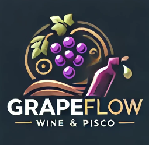


### [1.1.2 Perfiles de los integrantes del equipo](#perfiles-de-los-integrantes-del-equipo)
| Foto del Participante         | Nombres y Apellidos           | Código de Estudiante | Descripción de Carrera | Resumen de Conocimientos y Habilidades                                                                                                                                                                                                                                                                                                                                                                                                                                                                                             |
|-------------------------------|-------------------------------|----------------------|------------------------|------------------------------------------------------------------------------------------------------------------------------------------------------------------------------------------------------------------------------------------------------------------------------------------------------------------------------------------------------------------------------------------------------------------------------------------------------------------------------------------------------------------------------------|
|       | Huanca Navarro, Gustavo Esau  | U202215285           | Ingenieria de Software | Soy Gustavo Huanca, estudiante de Ingeniería de Software. Me considero puntual, responsable y disfruto resolviendo problemas tecnológicos. Tengo conocimientos en desarrollo de software, varios lenguajes de programación, estructuras de datos y algoritmos. Además. Mi objetivo es contribuir eficazmente al éxito del equipo con mis habilidades                                                                                                                                                                               |
|                         | Armas Sánchez Óscar Javier    | U20211G192           | Ingenieria de Software | Breve párrafo con los principales conocimientos técnicos y habilidades que el participante puede aportar al equipo.                                                                                                                                                                                                                                                                                                                                                                                                                |
|                      | Salhuana Lopez, Fernando Jose | U201622757           | Ingenieria de Software | Breve párrafo con los principales conocimientos técnicos y habilidades que el participante puede aportar al equipo.                                                                                                                                                                                                                                                                                                                                                                                                                |
|  | Huincho Lapa, Diego Arturo    | U201923466           | Ingenieria de Software | Mi nombre es Diego Arturo Huincho Lapa. Tengo 22 años y estoy estudiando la carrera de Ingeniería de Software. Considero que soy una persona que es capaz de trabajar bajo presión, además de ser detallista y responsable. En cuanto a cualidades para la realización del trabajo considero que soy bueno haciendo los mockups de la app y la parte del frontend, puesto que ya tengo experiencia haciendo trabajos con los frameworks vuejs y react. En mi ratos libres me gusta jugar videojuegos o mirar una serie o pelicula. |
|        | Curi Marcelo, Angelo Marcio   | U202022387           | Ingenieria de Software | Soy estudiante de la carrera de Ingeniería de Software en la Universidad Peruana de Ciencias Aplicadas (UPC). Me considero una persona responsable y comprometida con mis tareas. Siempre me esfuerzo por cumplir con los plazos y entregar trabajos de calidad. Además, me considero una persona creativa, tengo conocimientos tanto en programación y edición de videos. Considero que soy una persona que puede aportar de manera significativa a este equipo.                                                                  |

## [1.2 Solution Profile](#solution-profile)
### [1.2.1 Antecedentes y Problemática](#antecedentes-y-problemática)

**What (Qué)**

_¿Cuál es el problema?_

**Where (Dónde)**

_¿A dónde se dirige?_

**Why (Por Qué)**

_¿Cuál es la causa del problema?_

**When (Cuando)**

_¿Cuándo sucede el problema?_

**Who (Quién)**

_¿Quiénes están involucrados? ¿Quién lo utilizará?_

**How (Cómo)**

_¿Cómo se utilizará el producto?_

_¿Cómo lograremos desarrollar una gestión eficiente y optimizada del proceso productivo de vinos y piscos para productores y distribuidores?_

**How Much (Cuánto)**

_¿Cuál es la magnitud del problema?_

_¿Quienes seran los beneficiados por el servicio?_

### [1.2.2 Lean UX Process](#lean-ux-process)
#### [1.2.2.1 Lean UX Problem Statements](#lean-ux-problem-statements)

**Problem Statement**

#### [1.2.2.2 Lean UX Assumptions](#lean-ux-assumptions)

**Businnes Assumptions**

**User Assumptions**

_¿Quién es el usuario?_

* Fabricantes de licores, especialmente productores de vinos y piscos, que buscan mejorar la calidad y eficiencia de sus procesos productivos.
* Distribuidores que necesitan información detallada y precisa sobre los productos que comercializan.
* Consumidores interesados en conocer detalles específicos sobre los licores que compran para hacer elecciones más informadas.

_¿Qué problemas enfrenta nuestro producto? ¿Cómo los resolveremos?_

* _**Problema para Fabricantes:**_ Falta de herramientas para la recopilación y análisis de datos en tiempo real durante la producción.
* _**Solución:**_ Proporcionar componentes especializados que recopilen datos como pH, temperatura, y tiempo de añejamiento, así como permitir la introducción de información adicional.

* _**Problema para Consumidores:**_ Falta de acceso a información detallada sobre los licores, lo que dificulta tomar decisiones de compra informadas.
* _**Solución:**_ Crear una aplicación que muestre información detallada y verificada sobre cada licor, mejorando la experiencia de compra.
* 
_¿Qué características son importantes?_

_¿Dónde encaja nuestro producto en su trabajo o vida?_

_¿Cuándo y cómo se usa nuestro producto?_

_¿Cómo debe ser y comportarse nuestro producto?_

**Feature Assumptions:**

_**Creemos**_ que los fabricantes valorarán la capacidad de monitorear y ajustar variables críticas del proceso productivo en tiempo real a través de nuestros componentes especializados.
<br><br>
_**Creemos**_ que la integración de datos de producción con la gestión de inventarios y distribución ayudará a mejorar la eficiencia operativa y a reducir errores.
<br><br>
_**Creemos**_ que los consumidores apreciarán tener acceso a información detallada sobre los licores que compran, lo que mejorará su experiencia de compra y aumentará la lealtad a la marca.

#### [1.2.2.3 Lean UX Hypothesis Statements](#lean-ux-hypothesis-statements)

- **Hypothesis Statement 01:**
  <br><br>
_**Creemos**_ que los fabricantes de licores mejorarán la calidad y eficiencia de su producción si tienen acceso a componentes especializados que les permitan monitorear variables críticas como pH, temperatura, y tiempo de añejamiento en tiempo real.
_**Sabremos**_ que esta hipótesis es cierta _**cuando**_ observemos una reducción en los errores de producción, un incremento en la calidad del producto final, y un aumento en la satisfacción de los fabricantes con nuestra plataforma.
  <br><br>
- **Hypothesis Statement 02:**
  <br><br>
_**Creemos**_ que los consumidores estarán más dispuestos a comprar licores si tienen acceso a una aplicación móvil que les proporcione información detallada y confiable sobre cada producto, como el tipo de uva, el origen de los ingredientes, y las condiciones de añejamiento.
_**Sabremos**_ que esta hipótesis es _**cierta**_ cuando veamos un aumento en el uso de la aplicación, un incremento en las ventas de los productos destacados, y una mayor satisfacción de los usuarios en sus decisiones de compra.
  <br><br>

#### [1.2.2.4 Lean UX Canvas](#lean-ux-canvas)

URL del LeanUXCanvas: https://app.mural.co/t/teacsykawsai8308/m/teacsykawsai8308/1724358505056/ad90964d2d1b9220ae312f1ad046c17350430f32?sender=uc4019db9bc166bf541b07012

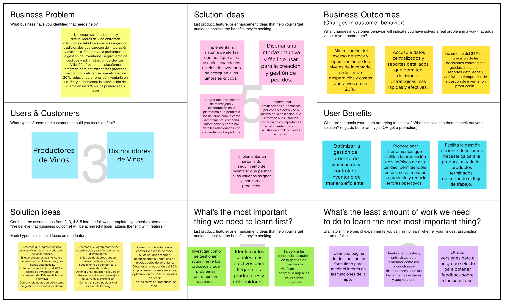

## [1.3. Segmentos objetivo](#segmentos-objetivo)
##### 1. Productores de Vinos:
Según Vertiz. F (2022), en el Perú tres empresas concentran más del 70 % del mercado del sector vitivinícola: Santiago Queirolo SA (41 %), Viña Tacama SA (28 %) y Bodegas y Viñedos Tabernero SA (13 %). Estas bodegas productoras, que representan el 80 % de la producción nacional, enfrentan desafíos en la gestión de inventario, vinificación y administración de clientes, lo que GrapeFlow puede resolver.

**Control de Inventario del Proceso Productivo:** Necesitan gestionar eficientemente el inventario de materias primas y productos terminados, evitando tanto la escasez como el exceso de stock.

**Proceso de Vinificación:** Requieren un control detallado y planificado de las etapas de producción del vino, desde la fermentación hasta el embotellado.

**Cosecha y Gestión del Viñedo:** Necesitan planificar y registrar actividades agrícolas y de cosecha para asegurar la calidad del vino.

**Planes de Servicio:** Pueden optar por planes básicos si son pequeños productores o planes avanzados si tienen un tamaño considerable y requieren un control integral.

##### 2. Distribuidores de Vinos:
Este segmento incluye a las empresas encargadas de la distribución de vinos. Ellos juegan un rol crucial en la comercialización de vinos y necesitan herramientas para mejorar la eficiencia en la distribución.

**Seguimiento de Pedidos:** Requieren un sistema que les permita gestionar y seguir los pedidos en tiempo real, asegurando una entrega eficiente y sin retrasos.

**Administración de la Cartera de Clientes:** Necesitan gestionar sus relaciones con clientes de manera efectiva para maximizar las ventas y mantener la lealtad del cliente, que en Perú es relativamente baja.

**Planes de Servicio:** Pueden beneficiarse de un plan avanzado que ofrezca funcionalidades completas de gestión de pedidos y tracking.

# [**Capítulo II: Requirements Elicitation \& Analysis**](#capítulo-ii-requirements-elicitation--analysis)
# [2.1 Competidores](#competidores)
### [2.1.1 Análisis competitivo](#análisis-competitivo)


<table border="1" cellpadding="10" cellspacing="0" style="margin-left: auto; margin-right: auto;">
  <tr>
    <th colspan="6">Competitive Analysis Landscape</th>
  </tr>
  <tr>
    <td colspan="2" rowspan="2">¿Por qué llevar a cabo este análisis?</td>
    <td colspan="4">Escriba en el recuadro la pregunta que busca responder o el objetivo de este análisis.</td>
  </tr>
  <tr>
    <td colspan="4">Texto</td>
  </tr>
  <tr>
   <td colspan="2">(En la cabecera colocar por cada competidor nombre y logo)</td>
    <td>GrapeFlow   </td>
    <td>ViWine  </td>
    <td>CellWine </td>
    <td>Cellar Tracker  </td> 
  </tr>
  <tr>
    <td rowspan="2">Perfil</td>
    <td>Overview</td>
    <td>GrapeFlow busca apoyar a los fabricantes de licores al proporcionarles componentes especializados que les permiten recopilar datos esenciales, como el pH, la temperatura y el tiempo de añejamiento de sus productos.</td>
    <td>Viwine ofrece a los consumidores información detallada sobre vinos, permitiéndoles conocer todos los datos relevantes antes de realizar una compra..</td>
    <td>Celwine proporciona a los fabricantes de vino herramientas para una gestión eficiente de sus bodegas, mejorando la organización y el control en la producción.</td>
    <td>CellarTracker permite a los consumidores consultar reseñas y opiniones de expertos sobre vinos, ayudándoles a tomar decisiones informadas basadas en comentarios especializados.</td>
  </tr>
  <tr>
    <td>Ventaja competitiva ¿Qué valor ofrece a los clientes?</td>
    <td>La ventaja competitiva de GrapeFlow es que los clientes tienen acceso la visualización de la elaboración en tiempo real y sus características del producto. .</td>
    <td>Ayuda a tener una información completa de los vinos .</td>
    <td>Ayuda a los 
fabricantes a 
tener una mejor 
gestión de sus 
bodegas.</td>
    <td>Brinda a los 
usuarios reseñas 
hechas por 
personas 
conocedoras de 
vino.</td>
  </tr>
  <tr>
    <td rowspan="2">Perfil de Marketing</td>
    <td>Mercado objetivo</td>
    <td>Personas 
aficionadas o 
amantes del vino..</td>
    <td>Consumidores que 
desean saber todos 
los datos de un 
vino.</td>
    <td>Fabricantes de 
vinos.</td>
    <td>Consumidores que 
deseen saber que 
comentarios 
tienen los vinos 
que van a 
consumir.</td>
  </tr>
  <tr>
    <td>Estrategias de marketing</td>
    <td>Publicidad por 
medios digitales.</td>
    <td>Publicidad 
genérica .</td>
    <td>Publicidad 
genérica .</td>
    <td>Publicidad 
genérica .</td>
  </tr>
  <tr>
    <td rowspan="3">Perfil de Producto</td>
    <td>Productos & Servicios</td>
    <td>Ofrece 
información sobre 
la composición 
del vino a los 
fabricantes y a los 
clientes les 
muestra 
información en 
tiempo real sobre 
la elaboración del
vino.</td>
    <td>Ofrece información 
del vino buscado 
como el país de 
origen, categoría 
(tinto, blanco, etc.), 
tipo de vino (seco, 
dulce), su sabor, su 
color, su aroma 
etc..</td>
    <td>Ofrece 
herramientas de 
gestión de 
bodegas y una 
sociedad del 
vino con 
calificación 
profesional y 
conocimiento 
del vino.</td>
    <td>Ofrece una 
colección de 
reseñas de vinos, 
notas de cata.</td>
  </tr>
  <tr>
    <td>Precios & Costos</td>
    <td>Gratuita para los 
consumidores y 
para los 
fabricadores un 
pago para la 
instalación del 
Arduino, 
posteriormente 
una comisión por 
cada vino 
vendido. </td>
    <td>Gratuito mediante 
la plataforma de 
descargas de cada 
smartphone .</td>
    <td>Gratuito 
mediante la 
plataforma de 
descargas de 
cada 
smartphone.</td>
    <td>Gratuito mediante 
la plataforma de 
descargas de cada 
smartphone.</td>
  </tr>
  <tr>
    <td>Canales de distribución (Web y/o Móvil)</td>
    <td>Mediante el 
programa y/o 
Arduino para el 
usuario de 
producción, y 
mediante la 
aplicación al 
usuario final</td>
    <td>Gratuito mediante 
la plataforma de 
descargas de cada 
smartphone.</td>
    <td>Gratuito 
mediante la 
plataforma de 
descargas de 
cada 
smartphone.</td>
    <td>Gratuito mediante 
la plataforma de 
descargas de cada 
smartphone .</td>
  </tr>
  <tr>
    <td rowspan="5">Analisis SWOT</td>
    <td colspan="5">Realice esto para su startup y sus competidores. Sus fortalezas deberían apoyar sus
    oportunidades y contribuir a lo que ustedes definen como su posible ventaja
    competitiva. </td>
  </tr>
 <tr>
    <td>Fortalezas</td>
    <td>Ofrecer 
información 
fidedigna y 
precisa.</td>
    <td>Por ser una APK de 
plataforma abierta.</td>
    <td>Por ser una APK de 
plataforma abierta.</td>
    <td>Por ser una APK de 
plataforma abierta.</td>
  </tr>
  <tr>
    <td>Debilidades</td>
    <td>Falta de 
inversión.</td>
    <td>No precisan los 
niveles de 
información dados.</td>
    <td>No precisa los 
tiempos de 
producción.</td>
    <td>No brinda 
información sobre 
la procedencia de 
los vinos .</td>
  </tr>
  <tr>
    <td>Oportunidades</td>
    <td>No tenemos un 
mercado 
competitivo.</td>
    <td>Presenta un 
pequeño campo 
competitivo.</td>
    <td>Está sometido a 
cambios .</td>
    <td>No presenta 
mercado 
competitivo.</td>
  </tr>
  <tr>
    <td>Amenazas</td>
    <td>Falta de 
colaboración con 
los productores.</td>
    <td>Crecer a gran 
escala, 
implementación de 
nuevas 
plataformas .</td>
    <td>Manejo de 
nuevas 
tecnologías en 
este campo .</td>
    <td>Mayor publicidad 
a campos de 
observación del 
publico.</td>
  </tr>
</table>

### [2.1.2 Estrategias y tácticas frente a competidores](#estrategias-y-tácticas-frente-a-competidores)

* **Fortalezas y Oportunidades**:

La capacidad de ofrecer información en tiempo real sobre la producción y las características del licor es un valor clave. Esta fortaleza se debe aprovechar para diferenciarse de competidores como ViWine y CellarTracker, que no brindan esta funcionalidad específica. Se puede enfatizar esta ventaja en la publicidad y en las demostraciones de producto.
Oportunidades: El mercado presenta una baja competencia, lo que permite a GrapeFlow posicionarse rápidamente. Esta oportunidad puede ser maximizada mediante una estrategia de crecimiento rápido, captando a los principales productores y distribuidores de vinos y piscos antes que los competidores reaccionen.

* **Aprovechamiento de Debilidades y Amenazas de los Competidores**:

ViWine y CellarTracker no proporcionan información sobre el proceso de producción ni sobre la procedencia de los ingredientes. GrapeFlow puede aprovechar esta debilidad promoviendo su capacidad de recopilar y mostrar estos datos, atrayendo a un público más informado y exigente.
Amenazas del Entorno Competitivo: La mayor amenaza identificada es la falta de colaboración con los productores. Para mitigar esto, GrapeFlow debe implementar una estrategia de alianzas estratégicas con los principales productores, asegurando que estos vean un valor claro en la integración de sus procesos con GrapeFlow.
* **Estrategias de Marketing**:

Utilizar una estrategia de publicidad digital dirigida específicamente a productores y distribuidores, destacando las características únicas de GrapeFlow en comparación con otras aplicaciones en el mercado. Además, la estrategia debe incluir testimonios de usuarios satisfechos y estudios de caso para construir credibilidad.
Mejorar continuamente la plataforma basada en retroalimentación directa de los usuarios, asegurando que GrapeFlow no solo iguale, sino que supere las expectativas del mercado. También, ofrecer una interfaz intuitiva que permita a los usuarios interactuar fácilmente con la información compleja que recopila la plataforma.
* **Costos y Precios**:

Asegurar que los precios para la instalación del sistema y las comisiones sean competitivos y accesibles, incentivando a más productores a adoptar la plataforma. A la vez, la estrategia de monetización debe incluir planes escalables para que los productores puedan crecer junto con GrapeFlow.
## [2.2 Entrevistas](#entrevistas)
### [2.2.1 Diseño de entrevistas](#diseño-de-entrevistas)
### [2.2.2 Registro de entrevistas](#registro-de-entrevistas)
### [2.2.3 Análisis de entrevistas](#análisis-de-entrevistas)

## [2.3 Needfinding](#needfinding)
### [2.3.1 User Personas](#user-personas)

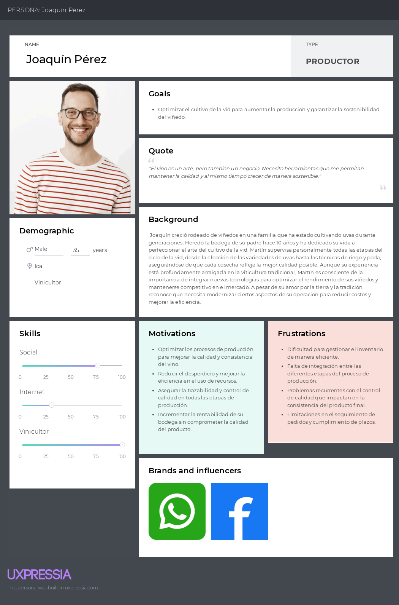 

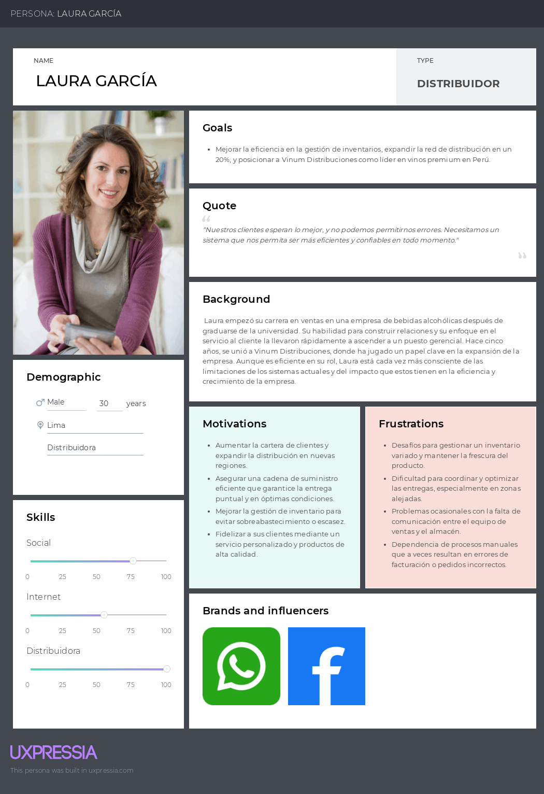 

### [2.3.2 User Task Matrix](#user-task-matrix)

El enfoque de la matriz de tareas del usuario es examinar las tareas que ambos segmentos llevan a cabo antes de recibir el producto, para identificar si alguna de estas tareas podría ser asistida por nuestro producto.

| **Task**                                                | **Productor**         | **Distribuidor**      |
|---------------------------------------------------------|-----------------------|-----------------------|
||Frecuencia/Importancia|Frecuencia/Importancia|
| Registrar entradas y salidas de inventario          | Media / Alta          | Alta / Alta           |
| Monitorear niveles de inventario                     | Alta / Alta           | Alta / Alta           |
| Generar informes de inventario                      | Media / Media         | Alta / Alta           |
| Generación de reportes de seguimiento               | -                     | Alta / Alta           |
| Realizar ajustes de inventario                       | Media / Media         | Alta / Alta           |
| Prever y planificar reabastecimientos                | -                     | Alta / Alta           |
| Actualizar y mantener la base de datos de productos  | -                     | Alta / Alta           |
| Preguntar al productor/distribuidor cuando sería la mejor fecha para negociar el producto | Media / Alta          | Media / Alta          |
| Integración con sistemas de seguimiento de proveedores | Media / Media         | Media / Media         |

### [2.3.3 User Journey Mapping](#user-journey-mapping)

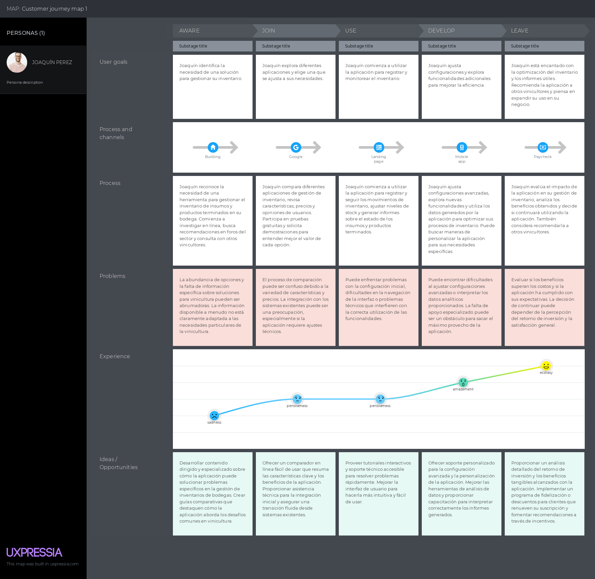 

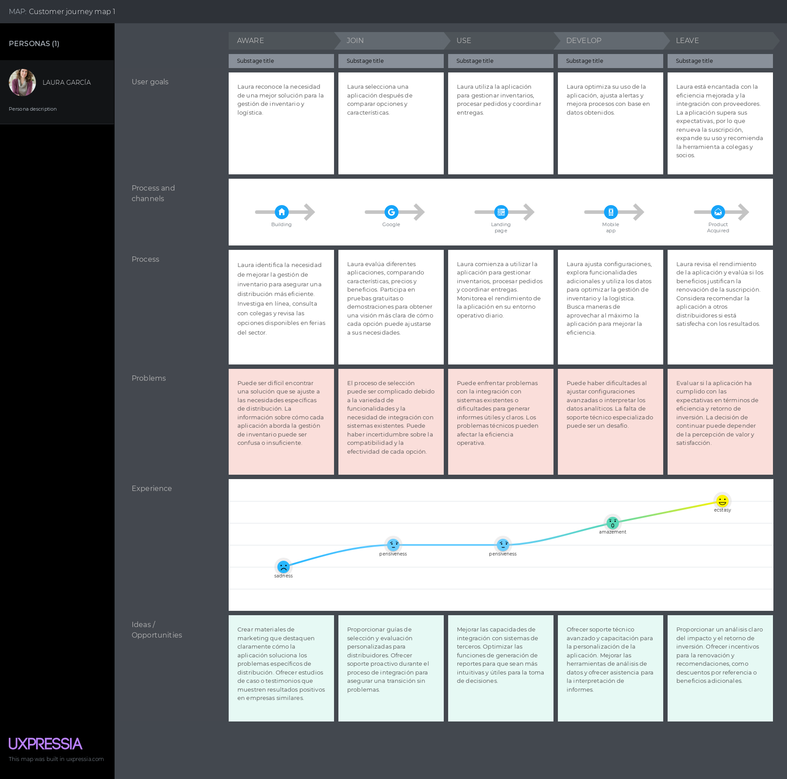 

## [2.4 Ubiquitous Language](#ubiquitous-language)

# [Capítulo III: Requirements Specification.](#capítulo-iii-requirements-specification)
## [3.1. To-Be Scenario Mapping.](#to-be-scenario-mapping)
## [3.2. User Stories.](#user-stories)

| Epic/Story ID | Titulo                                     | Descripción                                                                                                                              | Criterios de aceptación                                                                                                                                                                                                                                              | Relacionado con (Epic ID) |
|---------------|--------------------------------------------|------------------------------------------------------------------------------------------------------------------------------------------|----------------------------------------------------------------------------------------------------------------------------------------------------------------------------------------------------------------------------------------------------------------------|---------------------------|
| 1             | Registro de Datos del Producto.            | Como productor de licor, quiero registrar los datos esenciales del producto para que pueda tener un seguimiento detallado de cada lote.. | - Dado que el productor accede a la sección de registro, Cuando introduce los datos del pH, temperatura, tiempo de añejamiento y otra información relevante, Entonces el sistema debe almacenar esta información en la base de datos y permitir su consulta futura.. | -                         |
| 2             | Visualización de Información del Producto. | Como consumidor, quiero visualizar la información detallada de cada licor para tomar decisiones informadas al momento de comprar..       | - Dado que un consumidor selecciona un producto en la aplicación, Cuando visualiza la página de detalles del producto, Entonces debe ver la información del pH, temperatura, tiempo de añejamiento, tipo de uva y procedencia de los ingredientes..                  | -                         |
| 3             | Gestión de Inventarios.                    | Como distribuidor, quiero gestionar el inventario de productos para asegurarme de que no haya escasez ni exceso de stock..               | - Dado que el distribuidor accede a la sección de inventario, Cuando actualiza las cantidades de productos, Entonces el sistema debe reflejar los cambios en tiempo real y enviar notificaciones si los niveles de inventario están bajos..                          | -                         |


## [3.3. Impact Mapping.](#impact-mapping)
## [3.4. Product Backlog.](#product-backlog)

| Orden | User Story ID | Título                                     | Descripción                                                                                                                              | Story Points |
|-------|---------------|--------------------------------------------|------------------------------------------------------------------------------------------------------------------------------------------|--------------|
| 1     | 1             | 	Registro de Datos del Producto.           | Como productor de licor, quiero registrar los datos esenciales del producto para que pueda tener un seguimiento detallado de cada lote.. | 3            |
| 2     | 2             | Visualización de Información del Producto. | Como consumidor, quiero visualizar la información detallada de cada licor para tomar decisiones informadas al momento de comprar..       | 3            |
| 3     | 3             | Gestión de Inventarios.                    | Como distribuidor, quiero gestionar el inventario de productos para asegurarme de que no haya escasez ni exceso de stock..               | 5            |


Link de Pivot Tracker:
https://www.pivotaltracker.com/n/projects/2715642

# [Capítulo IV: Product Design.](#capítulo-iv-product-design)
## [4.1. Style Guidelines.](#style-guidelines)
### [4.1.1. General Style Guidelines.](#general-style-guidelines)
Un "style guideline" es un conjunto de reglas y directrices que definen cómo se debe redactar, diseñar o presentar documentos, contenido web, software u otros tipos de trabajos creativos. A continuación, se detallan los parámetros utilizados en la estructura del proyecto:

**Branding:**

_Brand Overview:_

La startup, presentada con el nombre de "VillaSystem" está diseñada para optimizar el flujo de trabajo en la industria vinícola, además a la producción de vino que es un proceso complejo que requiere la coordinación eficiente de múltiples etapas y actores. GrapeFlow busca simplificar esta coordinación mediante una solución tecnológica que permite a los productores de vino gestionar de manera integral y efectiva cada paso de la cadena de producción.

* **Misión:** Transformar la gestión de la producción vinícola mediante una plataforma que integre y optimice todos los aspectos del flujo de trabajo, desde la cosecha hasta la distribución, proporcionando herramientas que mejoren la eficiencia y la calidad.
  <br><br>
* **Visión:** Convertirnos en la plataforma líder en la digitalización y optimización de la industria vinícola, promoviendo prácticas más eficientes, sostenibles y colaborativas a nivel global.

**Logotipo de la startup**


**Logotipo del Servicio**


**Colores:**

En GrapeFlow, hemos seleccionado una paleta basada en la psicología del color. El morado, como tono predominante, representa creatividad y sofisticación, valores que deseamos transmitir. El naranja añade energía y dinamismo, mientras que el azul oscuro evoca confianza y profesionalismo. Como colores secundarios, utilizamos gris y blanco para aportar equilibrio, claridad y una apariencia moderna.

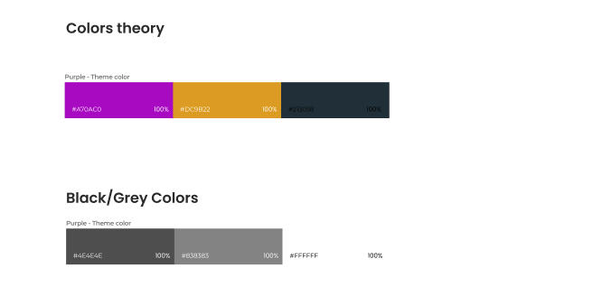

**Tipografía:**

La tipografía establece jerarquía entre los diversos grupos de contenido de la página. Asimismo, cumple un rol importante al momento de guiar al usuario a través de la interfaz.

* Heading 1: Tiene un tamaño de 136 px.
* Heading 2: Tiene un tamaño de 50 px.
* Heading 3: Tiene un tamaño de 40 px.
* Heading 4: Tiene un tamaño de 30 px.

* 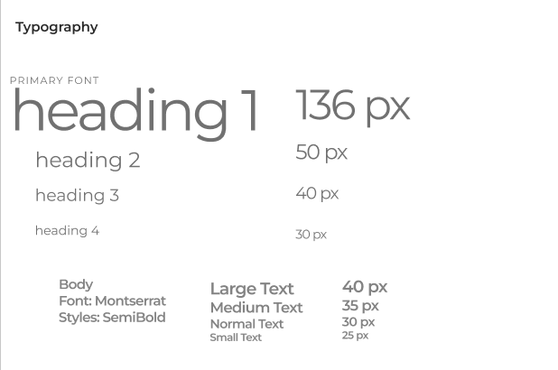
### [4.1.2. Web Style Guidelines.](#web-style-guidelines)
El enfoque de GrapeFlow para su plataforma web se centra en la claridad y la facilidad de uso, facilitando la gestión de las diferentes etapas del proceso de producción vinícola. Las funcionalidades clave y formularios se presentan en secciones bien definidas que ocupan un espacio destacado en la pantalla.

**Tarjetas:**

Se utiliza el componente "mat-card" de Angular Material para mostrar avisos y notificaciones relevantes. Estas tarjetas contienen información crucial para el usuario, como actualizaciones en el flujo de trabajo o recordatorios, acompañadas de texto representativo e imágenes relacionadas con las tareas o eventos importantes.

**Imágenes:**

El diseño web incluye imágenes descriptivas con un propósito específico, como las fotos de perfil de los usuarios o imágenes de los productos en las diferentes etapas de producción. Las imágenes de perfil de los usuarios están siempre visibles en la parte superior izquierda, mientras que otras imágenes clave se utilizan para guiar visualmente al usuario a través del flujo funcional de la plataforma.

**Botones:**

Los botones desempeñan un papel esencial en la experiencia de usuario de GrapeFlow, permitiendo acciones como iniciar una nueva etapa en el proceso de producción, confirmar operaciones o acceder a informes. Estos botones están diseñados para ser intuitivos y accesibles, asegurando que los usuarios puedan interactuar con la plataforma de manera eficiente y sin complicaciones.
## [4.2. Information Architecture.](#information-architecture)
### [4.2.1. Organization Systems.](#organization-systems)
La organización jerárquica en GrapeFlow se utiliza para resaltar la importancia de los elementos clave en pantalla, como los paneles de control de producción, inventarios y reportes. Esta estructura es evidente en las pantallas de inicio de sesión, gestión de procesos y monitoreo de etapas productivas, proporcionando una clara jerarquía de acciones y opciones.

Además, GrapeFlow emplea una organización secuencial para guiar a los usuarios a través de procesos complejos, como la creación de lotes de vino o la gestión de inventarios, asegurando que los usuarios sigan un flujo paso a paso sin perderse en la interfaz.
### [4.2.2. Labeling Systems.](#labeling-systems)
Los encabezados en GrapeFlow se utilizan en pantallas informativas y de configuración, resumiendo claramente el contenido y ayudando al usuario a orientarse dentro de la plataforma. Las etiquetas textuales acompañan a los iconos y botones en el panel de control, facilitando la navegación y el acceso a funciones específicas. Todas las tarjetas y secciones importantes están etiquetadas con títulos claros que explican su contenido y propósito.

En la barra de navegación, se emplean etiquetas textuales para las vistas principales, como el panel de control, gestión de lotes y análisis de calidad, permitiendo a los usuarios acceder fácilmente a las funcionalidades principales de la plataforma.
### [4.2.3. SEO Tags and Meta Tags.](#seo-tags-and-meta-tags)

Las etiquetas meta en GrapeFlow son fundamentales para mejorar la visibilidad y el posicionamiento de la plataforma en los motores de búsqueda. Aunque no son visibles para los usuarios, estas etiquetas ayudan a los navegadores y rastreadores web a entender el contenido y propósito del sitio, lo que es crucial para atraer tráfico relevante. Las etiquetas meta que utilizaremos incluyen:

**Titulo:**

```
<Title>Optimize your wine production with GrapeFlow</Title>
```

**Codificación de carácteres:**

```
<meta charset="utf-8">
```

**Descripción:**

```
<meta name="description" content="GrapeFlow is a comprehensive web application designed to streamline and optimize the wine production process, ensuring quality and efficiency at every stage."/>
```

**Palabras Claves:**

```
<meta name="keywords" content="wine production, vineyard management, quality control, efficiency, process optimization"/>
```

**Autor y Derechos de Autor:**

```
<meta name="author" content="GrapeFlow Team"/>
<meta name="copyright" content="Copyright GrapeFlow team"/>
```

### [4.2.4. Searching Systems.](#searching-systems)
En GrapeFlow, es crucial que los administradores puedan filtrar y gestionar eficientemente la información almacenada, como registros de producción y control de calidad. Los usuarios tendrán herramientas de búsqueda avanzadas para encontrar rápidamente lotes, etapas de producción o insumos específicos. Además, los usuarios podrán rastrear y acceder a informes históricos, optimizando así la gestión de la producción vinícola.

### [4.2.5. Navigation Systems.](#navigation-systems)
Los sistemas de navegación principales en GrapeFlow incluyen menús ubicados en la parte superior e inferior de la pantalla. Estos menús dirigen a los usuarios a secciones clave como el panel de control, la gestión de inventarios y la configuración de procesos. Si los usuarios no utilizan estos menús, pueden navegar por la página mediante un desplazamiento descendente que les permite explorar el contenido de manera fluida. En la aplicación, los usuarios podrán crear y gestionar procesos productivos, asignar recursos y monitorear el progreso a través de una interfaz intuitiva y accesible.

## [4.3. Landing Page UI Design](#landing-page-ui-design)
### [4.3.1. Landing Page Wireframe.](#landing-page-wireframe)
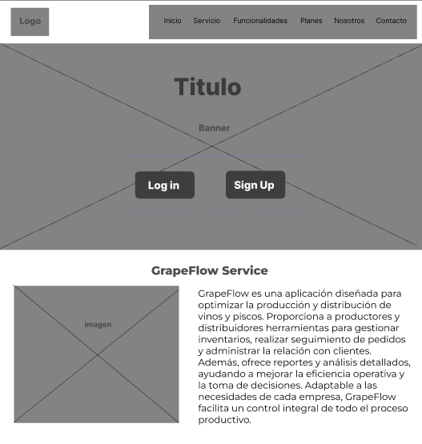
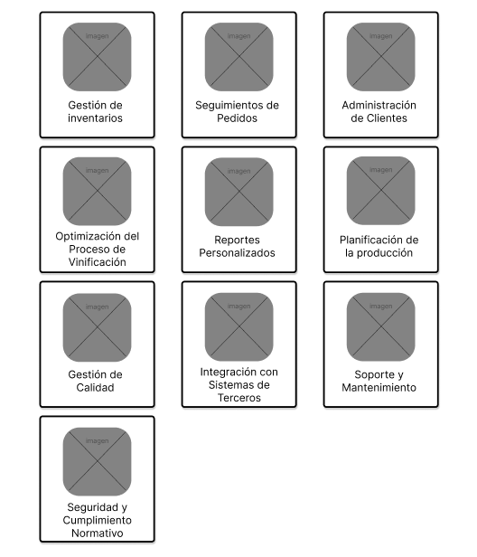
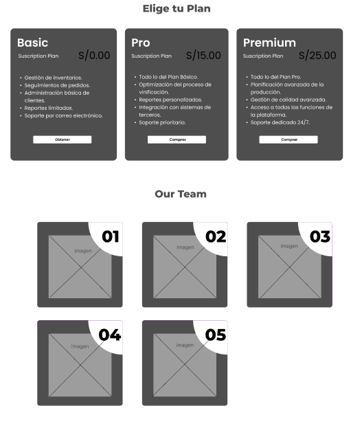
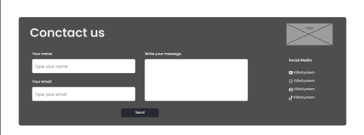
### [4.3.2. Landing Page Mock-up.](#landing-page-mock-up)

## [4.4. Web Applications UX/UI Design.](#web-applications-uxui-design)
### [4.4.1. Web Applications Wireframes.](#web-applications-wireframes)
### [4.4.2. Web Applications Wireflow Diagrams.](#web-applications-wireflow-diagrams)
### [4.4.3. Web Applications Mock-ups.](#web-applications-mock-ups)
### [4.4.4. Web Applications User Flow Diagrams.](#web-applications-user-flow-diagrams)

## [4.5. Web Applications Prototyping.](#web-applications-prototyping)

Para el desarrollo del prototipado y diseño en general se utilizo figma, ademas para el prototipado se cuido que la aplicacion cumple una serie de criterios para que la experiencia del usuario pueda ser la mas optima.

Prototipado Web:

Prototipado Mobile:

## [4.6. Domain-Driven Software Architecture.](#domain-driven-software-architecture)
### [4.6.1. Software Architecture Context Diagram.](#software-architecture-context-diagram)
