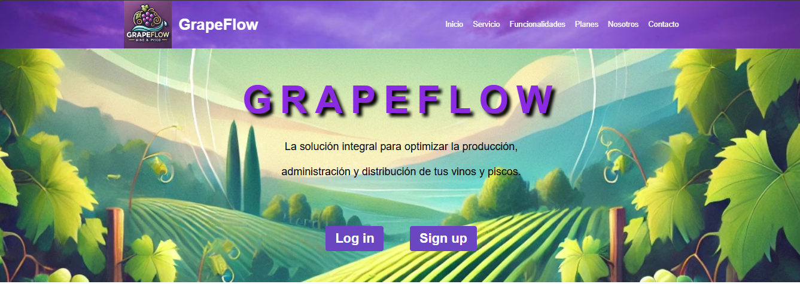
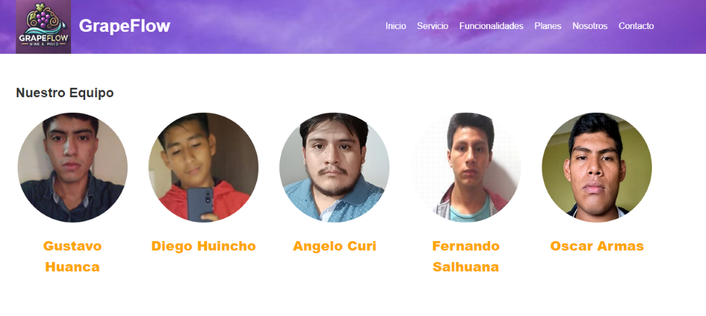
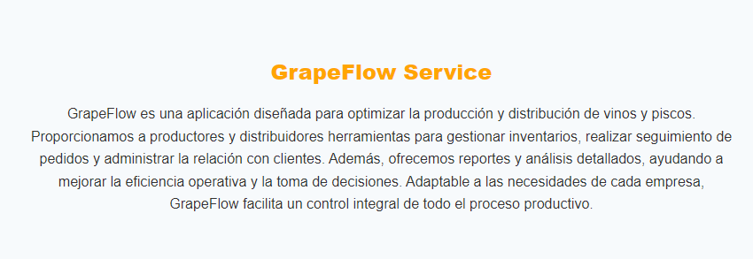
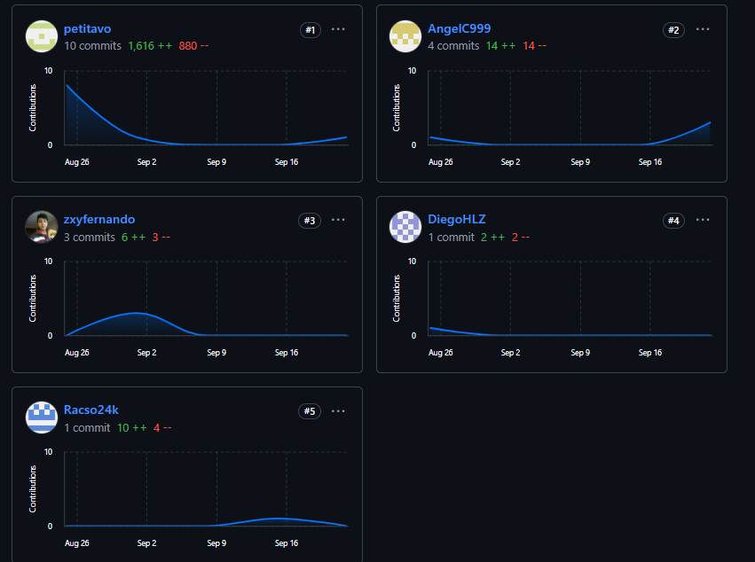

#   [Capítulo V: Product Implementation, Validation & Deployment](#capítulo-v-product-implementation-validation--deployment)

## [5.1.	Software Configuration Management.](#software-configuration-management)
En esta área se presentan las normas establecidas en conjunto, las cuales garantizan coherencia y claridad en el desarrollo de la solución.

### [5.1.1.	Software Development Environment Configuration.](#software-development-environment-configuration)

En la introducción, presentamos las aplicaciones y software empleados durante la ejecución del proyecto. A continuación, enumeramos estos elementos según sus categorías correspondientes.

* ####  Project Management

Esta metodología centrada en la estructuración de las actividades del proyecto busca incrementar la efectividad en uno o varios proyectos. Aunque inicialmente se utilizaron herramientas de chat para la asignación de tareas, todas estas asignaciones están documentadas en el software siguiente:

**○ Trello**: Esta plataforma nos brinda la capacidad de administrar el proyecto y su flujo de trabajo, además nos permite asignar y personalizar tareas de acuerdo con nuestras exigencias.

* #### Requirements Management

Esta metodología nos ayudó a comprender las necesidades y exigencias de nuestros usuarios al ponernos en su posición, aquellos que buscan una solución para el problema que intentamos abordar. Para realizar este procedimiento, empleamos:


**○ Pivotal Tracker**: Esta herramienta de gestión de proyectos resultó invaluable debido a su capacidad para manejar historias de usuario, agruparlas en epics y calificar su dificultad o tiempo con puntajes. Además, su función de visualización en tiempo real del proyecto fue otra razón fundamental para su utilización.


* #### Product UX/UI Design
La prioridad del diseño UX radica en satisfacer las necesidades de los usuarios durante su interacción con nuestro software. Mientras tanto, el diseño UI se focaliza en la creación de la interfaz que los usuarios utilizarán, especialmente en el contexto de la aplicación web que hemos desarrollado. Para esta etapa, utilizamos las siguientes herramientas:


**○ Uxpressia**: Para utilizar esta herramienta, inicialmente se recopiló información sobre los usuarios y sus requerimientos. Con este software, creamos los User Persona, Empathy Map, Journey Map e Impact Map.


**○ MIRO**: La función principal de esta herramienta fue facilitar la lluvia de ideas gracias a la flexibilidad de su pizarra colaborativa. Aquí se generaron ideas preliminares sobre los problemas y necesidades de los clientes, así como para identificar los Bounded Context de nuestro proyecto.


**○ Figma**: Este software de edición gráfica y generación de prototipos nos permitió desarrollar los elementos correspondientes al diseño UI, abarcando desde la creación de wireframes y maquetas hasta la presentación del prototipo final.


**○ LucidChart**: Utilizamos esta herramienta para desarrollar los diseños UML, siendo su principal ventaja la posibilidad de colaborar en tiempo real en la creación del diagrama.

* #### Software Development

Esta expresión abarca todas las acciones vinculadas con la concepción, elaboración e implementación del software. Para realizar estas acciones, empleamos lo siguiente:

* **GitHub**: Utilizamos esta plataforma para alojar el código que desarrollamos en equipo, con el fin de facilitar su posterior despliegue.


* **Webstorm**: Este entorno de desarrollo integrado (IDE) nos proporciona herramientas para trabajar con JavaScript y otras tecnologías relacionadas, como HTML y CSS.

**Software Testing:** En este primer hito, todos los integrantes del equipo llevaron a cabo pruebas del landing page antes de efectuar cualquier modificación en sus propias computadoras, utilizando sus respectivos entornos de desarrollo integrado (IDE) favoritos.

**Software Documentation:** Para la documentación del software, empleamos dos herramientas:
* **GitHub:** Utilizamos esta plataforma colaborativa para añadir toda la documentación relacionada en esta entrega en formato Markdown.

### [5.1.2. Source Code Management.](#source-code-management)
La metodología y el sistema de gestión utilizados para seguir los cambios durante la evolución de nuestro proyecto se pusieron en práctica en GitHub, empleando repositorios específicos para cada parte de la arquitectura de desarrollo. En esta fase inicial, hemos compartido el repositorio de nuestra Landing Page.
URL Repositorio Landing Page:
URL LANDING PAGE

Para los commits de nuestro repositorio se tomó en cuenta el modelo concebido en 2010, Git Flow:


El proyecto seguirá las convenciones de flujo de trabajo establecidas por el modelo GitFlow para el control de versiones,
utilizando GitHub como plataforma y sistema de control de versiones. A continuación, se detallará cómo se implementará
GitFlow como Workflow de control de versiones, además de proporcionar los URL de los repositorios de GitHub para cada
producto: Landing Page, Web Services y Frontend Web Applications.

Repositorio de GitHub: https://github.com/VillaSystem/grupo2-project-report

Enlace para acceder a la organización en GitHub: https://github.com/VillaSystem

Enlace para acceder al repositorio de la Landing Page: https://github.com/VillaSystem/GrapeFlow-LandingPage

Enlace para acceder al repositorio del Frontend Web Application: https://github.com/VillaSystem/FontEnd-VillaSystem


Flujo de trabajo GitFlow: El flujo de trabajo a utilizar para el desarrollo del proyecto fue el planteado por Vincent Driessen en
"A successful Git branching model"


La manera que se plantea usar git flow es seguir su concepto de crear ramas a parte de la principal (main branch). Las ramas que se planea crear:
* Main Branches:
  Master
  Develop
* Support Branches
  Feature
* Feature Branches


Cada feature debe tener su propia rama y deben tener una convención que se usarán en todas las branches. La convención a usar:

Feature/name:
Por ejemplo :
* feature/registro
* feature/studentClass
* feature/advisoryTransaction

Para el nombre de commit se usará “Conventional Commits”, este indica la estructura que deben tener los commit de  nuestras ramas.

<tipo>(Alcance opcional): <descripción del commit>

Para especificar el tipo se encuentran la siguientes definiciones:
* feat: cuando se añade un feature
* fix: cuando se soluciona un error.
* build: cuando se modifican las herramientas de compilación
* chore: modificaciones privadas
* refactor: cuando solo se modifica la documentación
* perf: cuando se mejora el rendimiento
* style: commits relacionados al estilo, no afectan la lógica
* test: commits para la creación de pruebas

El alcance proporciona contexto al commit para que los otros desarrolladores comprendan el entorno del mismo.

La descripción del commit es esencial y obligatoria, debe redactarse en imperativo y en minúsculas.

### [5.1.3.	Source Code Style Guide & Conventions](#source-code-style-guide--conventions)


En esta sección se detallan las convenciones para nombrar elementos y codificar en los lenguajes utilizados en esta fase inicial del proyecto.

HTML:
No omitir las etiquetas html y body, aunque no den error, la falta de body puede causar problemas en navegadores antiguos y la falta de la etiqueta html puede corromper a DOM y XML software.
```
<!DOCTYPE html>
<html>
<title>Page Title</title>
<body>

<h1>This is a heading</h1>
<p>This is a paragraph.</p>

</body>
</html>
```
Los nombres de los elementos deben in LowerCase, ejemplos:
```
<body>
<p>This is a paragraph.</p>
</body>
```
Ejemplo de cómo no se tiene que nombrar las etiquetas o elementos:
```
<BODY>
<P>This is a paragraph.</P>
</BODY>
```
Cerrar todos los elementos que utilicemos:
```
<p>This is a paragraph.</p>
```
Los atributos también tienen que ir en minúsculas, ejemplo:
```
<a href=”you.com”>This is a paragraph.</a>
```
Siempre poner entre comillas los atributos:
```
<table class=”welcome”>
```
Siempre especificar el texto alternativo de las imágenes, así como el ancho y altura de esta:
```

```
Añadir la etiqueta lan, para declarar el lenguaje de la página web y dar asistencia a los navegadores:
```
<!DOCTYPE html>
<html lang="en-us">
<head>
  <title>Page Title</title>
</head>
<body>

<h1>This is a heading</h1>
<p>This is a paragraph.</p>

</body>
</html>
```
**CSS:**

Utilizar nombres de clases que sean posiblemente cortas pero largas si es necesario, para la comprensión de los demás desarrolladores:
```
.nav {}
.author {}
```
Separar los nombres de las clases con guión:
```
.video-id {}
.error-status{}
```

El orden de declaración de los elementos dentro de una clase deben ir en orden alfabético:
```
background: fuchsia;
border: 1px solid;
-moz-border-radius: 4px;
-webkit-border-radius: 4px;
border-radius: 4px;
color: black;
text-align: center;
text-indent: 2em;
```
Aplica sangría en todos los atributos de una clase para representar la jerarquía y mejorar la comprensión:
```
@media pantalla , proyección {

html {
fondo : #fff;
color : #444; } }

Poner una línea en blanco entre las reglas:
html {
background: #fff;
}

body {
margin: auto;
width: 50%;
}
```
JavaScript:
Usar const and let, la mayoría de veces usar variables const a no ser que necesite ser reasignado su valor, evitar el uso de var.

Una variable por declaración:
No hacer let a = 1, b = 2

No usar el constructor Objeto, usar un constructor literal {name: ‘gio, …}

Utilizar CamelCase para nombres de variables y funciones:
```
const mySchedule = {};
func transferMoney(a,b) {}
```
Utilizar Pascal para nombres de clases y constructores:
```
MiClase{
MiClase(){}
}
```
Utilizar punto y coma al final de una sentencia, aunque javaScript permite omitir el uso de estas se considera buena práctica incluirlo para evitar posibles errores.

### [5.1.4.	Software Deployment Configuration.](#software-deployment-configuration)
**Landing page deployment:**

Para el despliegue de nuestra Landing Page, accedemos al repositorio donde tenemos nuestro proyecto:


Nos dirigimos a la sección Settings de nuestro repositorio, nos dirigimos al apartado de danger zone y hacemos nuestro repositorio publico:


Nos derigimos al apartado de Pages. Definimos la rama desde donde vamos despegar nuestro proyecto y guardamos. Con esto se genera el URL del despliegue de nuestra landing page.


**Front End Web Application deployment**

Para poder desplegar el Front End Web Application resulta necesario contar con una serie de requisitos, entre ellos, es necesario
contar con una cuenta personal, una organización y un repositorio al cual cargar los documentos. A partir de lo anterior, es
posible comenzar el despliegue de la landing page. A continuación se enuncian los pasos a seguir:
Ingresar a Netlify
Luego de registrarse con github nos dirigimos a la seccion de Add new site:


Elejimos hacer el deploy desde github:


Elejimos nuestra organizacion y repositorio:


Elejimos la rama de la cual queremos hacer el deploy:


Finalmente, se genera el URL de despliegue de nuestra web application:


## [5.2.	Landing Page, Services & Applications Implementation.](#landing-page-services--applications-implementation)
### [5.2.1.	Sprint 1](#521-sprint-1)
### [5.2.1.1.	Sprint Planning 1.](#5211-sprint-planning-1)


| Sprint #                        | Sprint 1                                                                                                                                                                                                               |
|---------------------------------|------------------------------------------------------------------------------------------------------------------------------------------------------------------------------------------------------------------------|
| Sprint Planning Background      |                                                                                                                                                                                                                        |
| Date                            | 25/08/2024                                                                                                                                                                                                             |
| Time                            | 10:00 PM                                                                                                                                                                                                               |
| Location                        | Servidor de Discord del Equipo                                                                                                                                                                                         |
| Prepared By                     | Gustavo Esau Huanca Navarro                                                                                                                                                                                            |
| Attendees (to planning meeting) | Diego Huincho/ Angelo/ Gustavo Huanca / Angelo Curi                                                                                                                                                                    |
| Sprint n Review Summary         | En esta entrega no hay un Sprint anterior, por lo tanto, no hay resumen de Sprint                                                                                                                                      |
| Sprint n Retrospective Summary  | En esta entrega no hay un Sprint anterior, por lo tanto, no hay resumen de Sprint                                                                                                                                      |
| Sprint Goal & User Stories      |
| Sprint 1 Goal                   | La meta de este Sprint es la investigación y desarrollo de nuestro proyecto. Asimismo, consiste en el funcionamiento de la Landing Page, tanto su visualización, el traslado y la visualización de todo lo estipulado. |
| Sprint 1 Velocity               | 10 Velocity                                                                                                                                                                                                            |
| Sum of Story Points             | 10 Story Points.                                                                                                                                                                                                       |

### 5.2.1.2.	Sprint Backlog 1.


El objetivo de este Sprint es completar la implementación de las funcionalidades clave en la Landing Page de GrapeFlow, incluyendo la visualización de información principal, descripciones detalladas del servicio, iconos representativos, menús de navegación, planes de servicio, y formularios de contacto. A continuación, se presenta el estado actual de las tareas asignadas.


URL:
https://www.pivotaltracker.com/n/projects/2716470

<table border="1">
  <tr>
    <th>Sprint 1</th>
    <th>Sprint 1</th>
  </tr>
  <tr>
    <th>User Story</th>
    <th>Work-Item/Task</th>
  </tr>
  <tr>
    <th>Id</th>
    <th>Title</th>
    <th>Id</th>
    <th>Title</th>
    <th>Description</th>
    <th>Estimación</th>
    <th>Assigned to</th>
    <th>Status</th>
  </tr>
  <tr>
    <td>US37</td>
    <td>Visualización del Título Principal</td>
    <td>1</td>
    <td>Mostrar Título y Subtítulo en la Parte Superior</td>
    <td>Como visitante de la Landing Page, deseo ver claramente el nombre y subtítulo de la plataforma en la parte superior de la página, para comprender la propuesta de valor de GrapeFlow.</td>
    <td>3 h</td>
    <td>Angelo</td>
    <td>Done</td>
  </tr>
  <tr>
    <td>US38</td>
    <td>Descripción de GrapeFlow Service</td>
    <td>2</td>
    <td>Mostrar Descripción Detallada del Servicio</td>
    <td>Como visitante de la Landing Page, deseo leer una explicación detallada de cómo GrapeFlow optimiza la producción y distribución de vinos y piscos, para evaluar si la plataforma es adecuada para mis necesidades.</td>
    <td>3 h</td>
    <td>Angelo</td>
    <td>Done</td>
  </tr>
  <tr>
    <td>US39</td>
    <td>Iconos Representativos de Funcionalidades Clave</td>
    <td>3</td>
    <td>Mostrar Iconos de Funcionalidades Clave</td>
    <td>Como visitante de la Landing Page, deseo ver iconos que representen las funcionalidades clave del servicio, para obtener una visión rápida de lo que ofrece GrapeFlow.</td>
    <td>2 h</td>
    <td>Diego</td>
    <td>Done</td>
  </tr>
  <tr>
    <td>US40</td>
    <td>Menú de Navegación Visible</td>
    <td>4</td>
    <td>Proporcionar Menú de Navegación en la Parte Superior</td>
    <td>Como visitante de la Landing Page, deseo acceder a un menú de navegación en la parte superior de la página, para explorar fácilmente otras secciones como "Log in", "Sign up", "Planes", y "Contacto".</td>
    <td>1 h</td>
    <td>Gustavo</td>
    <td>Done</td>
  </tr>
<tr>
    <td>US41</td>
    <td>Visualización de Planes Disponibles</td>
    <td>5</td>
    <td>Mostrar Planes y Precios Disponibles</td>
    <td>Como visitante de la Landing Page, deseo ver los diferentes planes de servicio con sus precios y características, para elegir el que mejor se adapte a mis necesidades.td>
    <td>2 h</td>
    <td>Diego</td>
    <td>Done</td>
  </tr>
<tr>
    <td>US42</td>
    <td>Selección de Plan desde la Landing Page</td>
    <td>6</td>
    <td>Facilitar Selección de Plan desde la Página de Inicio</td>
    <td>Como visitante de la Landing Page, deseo poder seleccionar y confirmar un plan desde la misma página, para simplificar el proceso de suscripción o registro.</td>
    <td>2 h</td>
    <td>Gustavo</td>
    <td>Done</td>
  </tr>
<tr>
    <td>US43</td>
    <td>Formulario de Contacto</td>
    <td>7</td>
    <td>Acceso a Formulario de Contacto</td>
    <td>Como visitante de la Landing Page, deseo acceder a un formulario de contacto donde pueda enviar mis consultas, para comunicarme fácilmente con el equipo de GrapeFlow.</td>
    <td>2 h</td>
    <td>Gustavo</td>
    <td>Done</td>
  </tr>
<tr>
    <td>US44</td>
    <td>Información de Contacto Visible/td>
    <td>8</td>
    <td>Mostrar Información de Contacto de GrapeFlow</td>
    <td>Como visitante de la Landing Page, deseo ver la información de contacto de GrapeFlow, como dirección, teléfono y correo electrónico, para comunicarme directamente si es necesario.</td>
    <td>2 h</td>
    <td>Gustavo</td>
    <td>Done</td>
  </tr>
<tr>
    <td>US45</td>
    <td>Visualización de Redes Sociales y Enlaces Adicionales</td>
    <td>9</td>
    <td>Incluir Enlaces a Redes Sociales y Políticas</td>
    <td>Como visitante de la Landing Page, deseo ver los enlaces a las redes sociales y políticas de la empresa en el pie de página, para seguirlos y entender mejor sus términos..td>
    <td>2 h</td>
    <td>Diego</td>
    <td>Done</td>
  </tr>
</table>


### [5.2.1.3.	Development Evidence for Sprint Review.](#5213-development-evidence-for-sprint-review)

En esta sección se presentan los avances de implementación con relación a los productos desarrollados en el presente Sprint. La implementación que se desarrolló fue la primera version del Landing Page, se implementaron las distintas secciones para conocer más sobre nuestra plataforma. Con ello completamos el primer sprint de implementación.


| Repository                         | Branch | Commit Id | Commit Message                                        | Commit message body | Committed on   |
|------------------------------------|--------|-----------|-------------------------------------------------------|---------------------|----------------|
| VillaSystem/GrapeFlow-LandingPage  | master | 8226699   | Update index.html                                     | -                   | Sep 5, 2024    |
| VillaSystem/GrapeFlow-LandingPage  | master | 27f7a38   | Add files via upload                                  | -                   | Sep 5, 2024    |
| VillaSystem/GrapeFlow-LandingPage  | master | 36f19e6   | Update index.html                                     | -                   | Sep 5, 2024    |
| VillaSystem/GrapeFlow-LandingPage  | master | ae9af5f   | feat(scroll-reveal): scroll reveal added.             | -                   | Sep 4, 2024    |
| VillaSystem/GrapeFlow-LandingPage  | master | ae5a64e   | add images                                            | -                   | Aug 30, 2024   |
| VillaSystem/GrapeFlow-LandingPage  | master | f740deb   | add photo Angelo                                      | -                   | Aug 29, 2024   |
| VillaSystem/GrapeFlow-LandingPage  | master | 84cf263   | feat(integrates): Angelo photo added.                 | -                   | Aug 29, 2024   |
| VillaSystem/GrapeFlow-LandingPage  | master | b2da8b9   | feat(docs): images added.                             | -                   | Aug 29, 2024   |
| VillaSystem/GrapeFlow-LandingPage  | master | b2b8811   | feat(docs): structure changed.                        | -                   | Aug 29, 2024   |
| VillaSystem/GrapeFlow-LandingPage  | master | 22484f8   | feat(landing-page): equipo code changed               | -                   | Aug 28, 2024   |
| VillaSystem/GrapeFlow-LandingPage  | master | 4d73556   | feat(landing-page): landing page changed styles.      | -                   | Aug 28, 2024   |
| VillaSystem/GrapeFlow-LandingPage  | master | 0c67d0d   | feat(landing-page): landing page changed styles.      | -                   | Aug 28, 2024   |
| VillaSystem/GrapeFlow-LandingPage  | master | af6d968   | feat(docs): .idea eliminated                          | -                   | Aug 28, 2024   |
| VillaSystem/GrapeFlow-LandingPage  | master | 4141e68   | Initial commit                                        | -                   | Aug 28, 2024   |


### [5.2.1.4.	Testing Suite Evidence for Sprint Review.](#5214-testing-suite-evidence-for-sprint-review)
No se desarrolló en este sprint, pues en esta parte se presentarán los Unit Tests, Integration Tests y Acceptance Tests automatizados, para Web Services.

### [5.2.1.5.	Execution Evidence for Sprint Review.](#5215-execution-evidence-for-sprint-review)

Después de completar el Sprint 1, logramos implementar todas las secciones de nuestra Landing Page para garantizar una visualización perfecta. Además, le dimos un formato atractivo que captura la atención del usuario hacia sus diferentes componentes. También agregamos métodos de navegación en la página, como botones ubicados al principio, que te permiten moverte fácilmente de una sección a otra. A continuación, te mostraremos los avances a través de imágenes del resultado obtenido.

Es importante destacar que el objetivo principal de la Landing Page es convertir a los visitantes en futuros clientes o usuarios habituales de nuestro servicio. Para lograrlo, utilizamos llamados a la acción (Call To Action) que los guían hacia la aplicación web.
A continuación, te presentamos capturas de pantalla del desarrollo de la Landing Page:

Encabezado y botones de desplazamiento:

Las vistas implementadas son el navbar con las secciones Inicio, Servicio, Funcionalidades, Planes, Nosotros y Contacto. Esa barra de navegación es fija y mientras el usuario se desplace se mueve junto con la pantalla.


Se presenta la sección de servicio que ofrecemos para nuestros segmentos objetivos. En esta sección, se describen los beneficios y características de GrapeFlow, lo que permite a los visitantes conocer más sobre el servicio.


En la sección de precios, se detallan los planes y precios de GrapeFlow. Esta información es esencial para que los visitantes conozcan las opciones disponibles y puedan elegir la que mejor se adapte a sus necesidades.


En esta seccion se muestra los integrantes del equipo, se presenta información sobre el equipo de desarrollo de GrapeFlow. Esto permite a los visitantes conocer a las personas detrás del servicio y generar confianza en la calidad y profesionalismo del equipo.

En la sección de contacto, se presenta un formulario que permite a los visitantes enviar consultas, comentarios o solicitudes de información sobre GrapeFlow. Esto facilita la comunicación con los usuarios y permite responder a sus necesidades de manera eficiente.

En el pie de página (Footer), se incluyen enlaces a las redes sociales de GrapeFlow, información de contacto y un botón para más opciones de la página. Esto permite a los visitantes acceder a más información y mantenerse conectados con el servicio.


### 5.2.1.6.	[Services Documentation Evidence for Sprint Review](#5216-services-documentation-evidence-for-sprint-review)

Este primer sprimt solo trata de la landing page, por lo que no se ha desarrollado servicios en este sprint.

### [5.2.1.7.	Software Deployment Evidence for Sprint Review.](#5217-software-deployment-evidence-for-sprint-review)

En el Sprint 1, hemos llevado a cabo una serie de actividades relacionadas con el Deployment de nuestros productos, que incluyen la Landing Page.A continuación, se detallan las acciones clave realizadas durante este Sprint en relación con el despliegue.
https://villasystem.github.io/GrapeFlow-LandingPage/index.html

Para el desarrollo del Landing Page de GrapeFlow se han utilizado las siguientes herramientas:

* html: Es el lenguaje de marcado que estructuró nuestro Landing Page.
  

* css: Es el lenguaje de estilos que le dio formato y diseño a nuestro Landing Page.
  

* JavaScript: Es el lenguaje de programación que le dio interactividad a nuestro Landing Page.
  


El despliegue del Landing Page de GrapeFlow se realizó gracias a:

• Git: Sistema de control de versiones que está pensado en la eficiencia y compatibilidad de versiones. El cual nos ayudó a trabajar en equipo durante el desarrollo del Landing Page.

• GitHub: Plataforma de desarrollo colaborativo.

• Git Flow: Nos permitió controlar el avance de cada uno de nuestros integrantes con respecto al desarrollo del Landing Page

• Git Hub Pages: Servicio de Github que nos permitió alojar nuestra lading page.

Los pasos que se realizaron fueron:

- Como utilizamos Github, nos dirigimos al repositorio donde se encuentra nuestra landing page. Luego a la sección “Settings”.


- Cuando nos encontramos en la configuración, tenemos que darle click a la sección pages.

]

- Luego, dentro de la sección “pages” tenemos que seleccionar la rama que se va a deployear, en nuestro caso
  es la rama “main”. Asimismo, tenemos que elegir una carpeta para
  localizar la publicación, que en nuestro caso será root. Finalmente
  tendremos el link en la parte superior.


Con esto ya tendremos nuestra landing page publicada y accesible para cualquier usuario.
Este es el enlace final: https://villasystem.github.io/GrapeFlow-LandingPage/


### [5.2.1.8.	Team Collaboration Insights during Sprint](#5218-team-collaboration-insights-during-sprint)

Creamos una organización en Github, donde tendremos todos nuestros repositorios de manera pública.

Link de la organización: https://github.com/VillaSystem

Integrantes:


Podemos visualizar todos los commits y probamos que todos participamos en la landing page:


## [5.2.2. Sprint 2](#522-Sprint-2)


### [5.2.2.1. Sprint Planning 2](#5221-Sprint-Planning-2)
El Sprint #2 tiene como fecha de inicio el 15/09/2024 y como meta plantea resolver errores de la landing page y realizar el front
end y fake API de la web application de manera que sea atractiva y funcional


| Sprint #                        | Sprint 2                                                                                                                   |
|---------------------------------|----------------------------------------------------------------------------------------------------------------------------|
| Sprint Planning Background      |                                                                                                                            |
| Date                            | 18/09/2024                                                                                                                 |
| Time                            | 10:00 PM                                                                                                                   |
| Location                        | Servidor de Discord del Equipo                                                                                             |
| Prepared By                     | Gustavo Esau Huanca Navarro                                                                                                |
| Attendees (to planning meeting) | Diego Huincho/ Angelo/ Gustavo Huanca / Angelo Curi                                                                        |
| Sprint Goal & User Stories      |                                                                                                                            |
| Sprint 2 Goal                   | Resolver errores de la landing page y realizar el front end de la web application de manera que sea atractiva y funcional. |
| Sprint 2 Velocity               | 52  Velocity                                                                                                               |
| Sum of Story Points             | 52 Story Points.                                                                                                           |

### [5.2.2.2.Sprint Backlog 2.](5222-Sprint-Backlog-2)

En el segundo sprint backlog, el equipo completó la landing page y el MVP del frontend de la aplicación web. La herramienta utilizada para organizar y gestionar a los miembros del equipo fue Pivotal Tracker. Esta herramienta permitió dividir todas las user stories en tareas manejables y asignarlas a los diferentes miembros según sus habilidades. El objetivo principal del sprint era corregir los errores de la landing page y construir en su totalidad la aplicación web con su respectiva API simulada, logrando que fuera atractiva y funcional.


Link del Pivotal: https://www.pivotaltracker.com/n/projects/2721206

| Sprint 1   | Sprint 2                                              |                |                                                       |                                                                                                                                                                            |                |                |                |
|------------|-------------------------------------------------------|----------------|-------------------------------------------------------|----------------------------------------------------------------------------------------------------------------------------------------------------------------------------|----------------|----------------|----------------|
| User Story | User Story                                            | Work-Item/Task | Work-Item/Task                                        | Work-Item/Task                                                                                                                                                             | Work-Item/Task | Work-Item/Task | Work-Item/Task |
| Id         | Title                                                 | Id             | Title                                                 | Description                                                                                                                                                                | Estimación     | Assigned to    | Status         |
| US39       | Iconos Representativos de Funcionalidades Clave       | 1              | Mostrar Iconos de Funcionalidades Clave               | Como visitante de la Landing Page, deseo ver iconos que representen las funcionalidades clave del servicio, para obtener una visión rápida de lo que ofrece GrapeFlow.     | 4 h            | Diego          | Done           |
| US45       | Visualización de Redes Sociales y Enlaces Adicionales | 2              | Incluir Enlaces a Redes Sociales y Políticas          | Como visitante de la Landing Page, deseo ver los enlaces a las redes sociales y políticas de la empresa en el pie de página, para seguirlos y entender mejor sus términos. | 4 h            | Diego          | Done           |
| US42       | Selección de Plan desde la Landing Page               | 3              | Facilitar Selección de Plan desde la Página de Inicio | Como visitante de la Landing Page, deseo poder seleccionar y confirmar un plan desde la misma página, para simplificar el proceso de suscripción o registro.               | 4 h            | Gustavo        | Done           |
| US04       | Visualizar Información del Producto                   | 4              | Mostrar Detalles del Producto                         | Como consumidor, quiero visualizar la información detallada de un producto para tomar decisiones informadas.                                                               | 5 h            | Diego          | Done           |
| US53       | Ver Detalle de Cliente                                | 5              | Mostrar Detalle de Información de Clientes            | Como usuario, quiero ver los detalles completos de un cliente para tener toda la información relevante.                                                                    | 5 h            | Angelo         | Done           |
| US51       | Editar Cliente                                        | 6              | Permitir Modificación de Datos de Clientes            | Como usuario, quiero poder editar la información de un cliente para mantener los datos actualizados.                                                                       | 4 h            | Diego          | Done           |
| US52       | Agregar Cliente                                       | 7              | Agregar Nuevos Clientes                               | Como usuario, quiero poder agregar nuevos clientes al sistema para expandir la base de datos de clientes.                                                                  | 4 h            | Angelo         | Done           |
| US50       | Eliminar Cliente                                      | 8              | Eliminar Registro de Cliente                          | Como usuario, quiero poder eliminar un cliente del sistema cuando sea necesario.                                                                                           | 4 h            | Gustavo        | Done           |
| US01       | Registrar Datos del Lote                              | 9              | Permitir Registro de Lotes de Producción              | Como productor, quiero registrar los datos esenciales de mi lote para un seguimiento detallado.                                                                            | 4 h            | Gustavo        | Done           |
| US10       | Monitorear Parámetros de Producción                   | 10             | Implementar Sistema de Monitoreo                      | Como productor, quiero monitorear parámetros críticos para asegurar la calidad del producto.                                                                               | 5 h            | Angelo         | Done           |
| US07       | Registrar Inventario de Productos                     | 11             | Crear Formulario de Registro de Inventario            | Como productor, quiero registrar el inventario de mis productos para un control eficiente.                                                                                 | 4 h            | Diego          | Done           |
| US22       | Ver Detalle del Pedido                                | 12             | Diseñar Página de Detalle de Pedido                   | Como consumidor, quiero ver el detalle de mi pedido para asegurarme de que toda la información es correcta antes de confirmar la compra.                                   | 5 h            | Fernando       | Done           |
| US05       | Buscar Producto por Filtros                           | 13             | Implementar Sistema de Filtros                        | Como consumidor, quiero buscar productos utilizando filtros para encontrar opciones específicas.                                                                           | 4 h            | Angelo         | Done           |
| US19       | Buscar Productos                                      | 14             | Crear Barra de Búsqueda                               | Como consumidor, quiero buscar productos en la plataforma para encontrar rápidamente los vinos que me interesan.                                                           | 4 h            | Diego          | Done           |
| US04       | Visualizar Información del Producto                   | 15             | Diseñar Página de Producto                            | Como consumidor, quiero visualizar la información detallada de un producto para tomar decisiones informadas.                                                               | 5 h            | Gustavo        | Done           |
| US54       | Consultar Pedidos                                     | 16             | Crear Lista de Pedidos                                | Como usuario, quiero poder consultar todos los pedidos realizados para tener un seguimiento de las ventas.                                                                 | 5 h            | Angelo         | Done           |
| US01       | Registrar Datos del Lote                              | 17             | Implementar Formulario de Registro de Lote            | Como productor, quiero registrar los datos esenciales de mi lote para un seguimiento detallado.                                                                            | 6 h            | Diego          | Done           |
| US03       | Eliminar Producto                                     | 18             | Agregar Función de Eliminación de Producto            | Como productor, quiero eliminar un producto para gestionar el inventario correctamente.                                                                                    | 4 h            | Gustavo        | Done           |
| US09       | Consultar Inventario                                  | 19             | Crear Página de Consulta de Inventario                | Como productor, quiero consultar el inventario de mis productos para tomar decisiones de producción.                                                                       | 5 h            | Angelo         | Done           |
| US18       | Consultar Historial de Pedidos                        | 20             | Implementar Historial de Pedidos                      | Como consumidor, quiero consultar mi historial de pedidos para revisar mis compras pasadas.                                                                                | 5 h            | Diego          | Done           |
| US20       | Visualizar Información Detallada del Vino             | 21             | Diseñar Página de Detalle de Vino                     | Como consumidor, quiero ver la información detallada de cada vino para tomar decisiones informadas sobre mis compras.                                                      | 5 h            | Gustavo        | Done           |
| US23       | Crear Cuenta de productor                             | 25             | Desarrollar Formulario de Registro de Productor       | Como productor, quiero crear una cuenta para poder tener acceso a las funcionalidades de la plataforma.                                                                    | 5 h            | Angelo         | Done           |


### [5.2.2.3. Development Evidence for Sprint Review.](#5221-Sprint-Planning-2)


Como parte de las evidencias del sprint review, se demuestran mediante una tabla los commits realizados a lo largo de este
segundo sprint. Como se establecio trabajar los arreglos finales de la landing page y el frontend de la web application, se
muestran commits de diferentes repositorios donde se trabajo.

| Repository                        | Branch  | Commit Id | Commit Message                                              | Commit message body                                                                                                                                                                    | Committed on |
|-----------------------------------|---------|-----------|-------------------------------------------------------------|----------------------------------------------------------------------------------------------------------------------------------------------------------------------------------------|--------------|
| VillaSystem/GrapeFlow-LandingPage | master  | 2625f87   | feat: added social network and terms of service             | -                                                                                                                                                                                      | 2024-09-24   |
| VillaSystem/GrapeFlow-LandingPage | master  | 9e23a3e   | feat: added images services                                 | -                                                                                                                                                                                      | 2024-09-24   |
| VillaSystem/GrapeFlow-LandingPage | master  | 9685793   | feat: added images services                                 | -                                                                                                                                                                                      | 2024-09-24   |
| VillaSystem/GrapeFlow-LandingPage | master  | fecdde0   | feat(services): services images added.                      | -                                                                                                                                                                                      | 2024-09-24   |
| VillaSystem/GrapeFlow-LandingPage | master  | 69e23fb   | Update index.html                                           | -                                                                                                                                                                                      | 2024-09-19   |----------------------------|---------|-----------|-------------------------------------------------------------|----------------------------------------------------------------------------------------------------------------------------------------------------------------------------------------|--------------|
| VillaSystem/FontEnd-VillaSystem   | develop | 1fbf933   | app consumer-order css                                      | -                                                                                                                                                                                      | 2024-09-24   |
| VillaSystem/FontEnd-VillaSystem   | develop | abb8814   | app-sidenav-consumer-order                                  | -                                                                                                                                                                                      | 2024-09-24   |
| VillaSystem/FontEnd-VillaSystem   | develop | 394f068   | Merge branch 'fernando' into develop                        | # Conflicts:\\n#       server/db.json                                                                                                                                                  | 2024-09-24   |
| VillaSystem/FontEnd-VillaSystem   | develop | e7c227c   | app-sidenav-consumer-order                                  | -                                                                                                                                                                                      | 2024-09-24   |
| VillaSystem/FontEnd-VillaSystem   | develop | 8968511   | app-sidenav-consumer-order                                  | -                                                                                                                                                                                      | 2024-09-24   |
| VillaSystem/FontEnd-VillaSystem   | develop | 8d914cd   | app-sidenav-consumer-order                                  | -                                                                                                                                                                                      | 2024-09-24   |
| VillaSystem/FontEnd-VillaSystem   | develop | cd542c5   | feat(footer): language switched.                            | -                                                                                                                                                                                      | 2024-09-24   |
| VillaSystem/FontEnd-VillaSystem   | develop | 99f62ec   | feat(footer): footer component added.                       | -                                                                                                                                                                                      | 2024-09-24   |
| VillaSystem/FontEnd-VillaSystem   | develop | 0670c8e   | feat(language): language changed.                           | -                                                                                                                                                                                      | 2024-09-24   |
| VillaSystem/FontEnd-VillaSystem   | develop | c755e14   | feat(inventory): inventory css changed.                     | -                                                                                                                                                                                      | 2024-09-24   |
| VillaSystem/FontEnd-VillaSystem   | develop | 0df098c   | feat(inventory): inventory component fixed                  | -                                                                                                                                                                                      | 2024-09-24   |
| VillaSystem/FontEnd-VillaSystem   | develop | 4b83285   | Merge remote-tracking branch 'origin/angel' into develop    | -                                                                                                                                                                                      | 2024-09-24   |
| VillaSystem/FontEnd-VillaSystem   | develop | d308166   | feat: added styles                                          | -                                                                                                                                                                                      | 2024-09-24   |
| VillaSystem/FontEnd-VillaSystem   | develop | 2a3acea   | feat(inventory): inventory component added.                 | -                                                                                                                                                                                      | 2024-09-24   |
| VillaSystem/FontEnd-VillaSystem   | develop | c106410   | Merge remote-tracking branch 'origin/fernando' into develop | -                                                                                                                                                                                      | 2024-09-24   |
| VillaSystem/FontEnd-VillaSystem   | develop | 70f08ec   | feat(orders) orders details added ss                        | -                                                                                                                                                                                      | 2024-09-24   |
| VillaSystem/FontEnd-VillaSystem   | develop | d7b50c6   | Merge remote-tracking branch 'origin/angel' into develop    | -                                                                                                                                                                                      | 2024-09-24   |
| VillaSystem/FontEnd-VillaSystem   | develop | 393ffd0   | feat: update fix details.client, added images user          | -                                                                                                                                                                                      | 2024-09-24   |
| VillaSystem/FontEnd-VillaSystem   | develop | 8e36752   | feat(orders) orders details added                           | -                                                                                                                                                                                      | 2024-09-24   |
| VillaSystem/FontEnd-VillaSystem   | develop | 686502f   | feat(orders) orders details added                           | -                                                                                                                                                                                      | 2024-09-24   |
| VillaSystem/FontEnd-VillaSystem   | develop | 015a1e4   | Merge remote-tracking branch 'origin/develop' into fernando | # Conflicts:\\n#       src/app/app.component.ts                                                                                                                                        | 2024-09-24   |
| VillaSystem/FontEnd-VillaSystem   | develop | 2e25181   | feat(json): routes.json added.                              | -                                                                                                                                                                                      | 2024-09-23   |
| VillaSystem/FontEnd-VillaSystem   | develop | a354833   | feat(sidenav): consumer sidenav added.                      | -                                                                                                                                                                                      | 2024-09-23   |
| VillaSystem/FontEnd-VillaSystem   | develop | 33c71c0   | feat(wine): wine api added.                                 | -                                                                                                                                                                                      | 2024-09-23   |
| VillaSystem/FontEnd-VillaSystem   | develop | 3a41510   | feat(lote): lote add fixed.                                 | -                                                                                                                                                                                      | 2024-09-23   |
| VillaSystem/FontEnd-VillaSystem   | develop | 4d0577d   | feat: added orders component, order entity, order service   | -                                                                                                                                                                                      | 2024-09-23   |
| VillaSystem/FontEnd-VillaSystem   | develop | 22edb14   | feat: add inventory-edit component                          | -                                                                                                                                                                                      | 2024-09-23   |
| VillaSystem/FontEnd-VillaSystem   | develop | 4fd4e28   | feat(inventory): inventory fixed.                           | -                                                                                                                                                                                      | 2024-09-23   |
| VillaSystem/FontEnd-VillaSystem   | develop | 787ea32   | feat(inventory): inventory component added.                 | -                                                                                                                                                                                      | 2024-09-23   |
| VillaSystem/FontEnd-VillaSystem   | develop | 2be5311   | Merge remote-tracking branch 'origin/develop' into gustavo  | -                                                                                                                                                                                      | 2024-09-23   |
| VillaSystem/FontEnd-VillaSystem   | develop | 556ce3c   | feat(inventory): inventory component added.                 | -                                                                                                                                                                                      | 2024-09-23   |
| VillaSystem/FontEnd-VillaSystem   | develop | 1d2548c   | feat(inventory): inventory component added.                 | -                                                                                                                                                                                      | 2024-09-23   |
| VillaSystem/FontEnd-VillaSystem   | develop | b015a9a   | feat(inventory): inventory component added.                 | -                                                                                                                                                                                      | 2024-09-23   |
| VillaSystem/FontEnd-VillaSystem   | develop | 38b42e0   | update: change status, add lote                             | -                                                                                                                                                                                      | 2024-09-23   |
| VillaSystem/FontEnd-VillaSystem   | develop | 272eba6   | feat: added lote-add component                              | -                                                                                                                                                                                      | 2024-09-22   |
| VillaSystem/FontEnd-VillaSystem   | develop | 93449af   | feat(inventory): inventory component added.                 | -                                                                                                                                                                                      | 2024-09-22   |
| VillaSystem/FontEnd-VillaSystem   | develop | 3f36727   | Merge remote-tracking branch 'origin/gustavo' into develop  | # Conflicts:\\n#       src/app/app.routes.ts                                                                                                                                           | 2024-09-22   |
| VillaSystem/FontEnd-VillaSystem   | develop | f4ec207   | update: recent version                                      | -                                                                                                                                                                                      | 2024-09-22   |
| VillaSystem/FontEnd-VillaSystem   | develop | a7f6c7f   | update: recent version                                      | -                                                                                                                                                                                      | 2024-09-22   |
| VillaSystem/FontEnd-VillaSystem   | develop | 4c39aaf   | feat: added styles                                          | -                                                                                                                                                                                      | 2024-09-22   |
| VillaSystem/FontEnd-VillaSystem   | develop | deec884   | feat: added add-client                                      | -                                                                                                                                                                                      | 2024-09-22   |
| VillaSystem/FontEnd-VillaSystem   | develop | 573b7a8   | feat: added edit-clients                                    | -                                                                                                                                                                                      | 2024-09-22   |
| VillaSystem/FontEnd-VillaSystem   | develop | e691de3   | feat: details clients component added                       | -                                                                                                                                                                                      | 2024-09-22   |
| VillaSystem/FontEnd-VillaSystem   | develop | 5780139   | feat(lote): lote route added.                               | -                                                                                                                                                                                      | 2024-09-22   |
| VillaSystem/FontEnd-VillaSystem   | develop | 19627cd   | feat(lote): lote route added.                               | -                                                                                                                                                                                      | 2024-09-22   |
| VillaSystem/FontEnd-VillaSystem   | develop | 1095be7   | feat(lote): lote api added.                                 | -                                                                                                                                                                                      | 2024-09-22   |
| VillaSystem/FontEnd-VillaSystem   | develop | 7d5b1fd   | feat(lote): lote component configured.                      | -                                                                                                                                                                                      | 2024-09-22   |
| VillaSystem/FontEnd-VillaSystem   | develop | 7bddc48   | feat(lote): lote service configured.                        | -                                                                                                                                                                                      | 2024-09-22   |
| VillaSystem/FontEnd-VillaSystem   | develop | d1a216a   | feat(lote): route lote added.                               | -                                                                                                                                                                                      | 2024-09-22   |
| VillaSystem/FontEnd-VillaSystem   | develop | d457aef   | feat(lote): entity added.                                   | -                                                                                                                                                                                      | 2024-09-22   |
| VillaSystem/FontEnd-VillaSystem   | develop | 93b718a   | feat(lote): lote details component added.                   | -                                                                                                                                                                                      | 2024-09-22   |
| VillaSystem/FontEnd-VillaSystem   | develop | 946d30f   | feat(lote): lote component added.                           | -                                                                                                                                                                                      | 2024-09-22   |
| VillaSystem/FontEnd-VillaSystem   | develop | ada2946   | feat(lote): lote entity added.                              | -                                                                                                                                                                                      | 2024-09-22   |
| VillaSystem/FontEnd-VillaSystem   | develop | 8f54c35   | feat(lote): lote service added.                             | -                                                                                                                                                                                      | 2024-09-22   |
| VillaSystem/FontEnd-VillaSystem   | develop | a2035d1   | feat(json): lote added.                                     | -                                                                                                                                                                                      | 2024-09-22   |
| VillaSystem/FontEnd-VillaSystem   | develop | 0674db2   | add into db.json order                                      | -                                                                                                                                                                                      | 2024-09-22   |
| VillaSystem/FontEnd-VillaSystem   | develop | 9bc4c69   | add into db.json order                                      | -                                                                                                                                                                                      | 2024-09-22   |
| VillaSystem/FontEnd-VillaSystem   | develop | 0d53faf   | add into db.json order                                      | -                                                                                                                                                                                      | 2024-09-22   |
| VillaSystem/FontEnd-VillaSystem   | develop | 11eba41   | Merge remote-tracking branch 'origin/develop' into fernando | -                                                                                                                                                                                      | 2024-09-22   |
| VillaSystem/FontEnd-VillaSystem   | develop | 6c31604   | feat: edit client component added                           | -                                                                                                                                                                                      | 2024-09-21   |
| VillaSystem/FontEnd-VillaSystem   | develop | 4b48b46   | feat(inventory): inventory component added.                 | -                                                                                                                                                                                      | 2024-09-21   |
| VillaSystem/FontEnd-VillaSystem   | develop | 15ca5d3   | feat(inventory): inventory entity added.                    | -                                                                                                                                                                                      | 2024-09-21   |
| VillaSystem/FontEnd-VillaSystem   | develop | 87f89cf   | feat(inventory): inventory service added.                   | -                                                                                                                                                                                      | 2024-09-21   |
| VillaSystem/FontEnd-VillaSystem   | develop | f6fc80e   | feat(sidenav): inventory button added.                      | -                                                                                                                                                                                      | 2024-09-21   |
| VillaSystem/FontEnd-VillaSystem   | develop | fcaaac4   | feat(inventory): inventory route added.                     | -                                                                                                                                                                                      | 2024-09-21   |
| VillaSystem/FontEnd-VillaSystem   | develop | c9e3121   | feat(db): inventory items added.                            | -                                                                                                                                                                                      | 2024-09-21   |
| VillaSystem/FontEnd-VillaSystem   | develop | 021b6b3   | feat(db): inventory items added.                            | -                                                                                                                                                                                      | 2024-09-21   |
| VillaSystem/FontEnd-VillaSystem   | develop | a7b5786   | Merge remote-tracking branch 'origin/gustavo' into develop  | # Conflicts:\\n#       src/app/GrapeFlow/producer/components/clients/clients.component.spec.ts\\n#       src/app/app.routes.ts\\n#       src/app/public/sidenav/sidenav.component.html | 2024-09-21   |
| VillaSystem/FontEnd-VillaSystem   | develop | 9f9163c   | feat(db): delete client added.                              | -                                                                                                                                                                                      | 2024-09-21   |
| VillaSystem/FontEnd-VillaSystem   | develop | 098782a   | feat(db): inventory items added.                            | -                                                                                                                                                                                      | 2024-09-21   |
| VillaSystem/FontEnd-VillaSystem   | develop | 935b376   | feat(app): http client added.                               | -                                                                                                                                                                                      | 2024-09-20   |
| VillaSystem/FontEnd-VillaSystem   | develop | bf6127d   | feat(app): http client added.                               | -                                                                                                                                                                                      | 2024-09-20   |
| VillaSystem/FontEnd-VillaSystem   | develop | 9a98940   | feat(base): base service added.                             | -                                                                                                                                                                                      | 2024-09-20   |
| VillaSystem/FontEnd-VillaSystem   | develop | 13ace2c   | feat(clients): clients component added.                     | -                                                                                                                                                                                      | 2024-09-20   |
| VillaSystem/FontEnd-VillaSystem   | develop | 062ee1b   | feat(json): db.json added.                                  | -                                                                                                                                                                                      | 2024-09-20   |
| VillaSystem/FontEnd-VillaSystem   | develop | 871efe8   | feat(environment): environment.ts adde                      | -                                                                                                                                                                                      | 2024-09-20   |
| VillaSystem/FontEnd-VillaSystem   | develop | 64b36a8   | feat(json): package.json added.                             | -                                                                                                                                                                                      | 2024-09-20   |
| VillaSystem/FontEnd-VillaSystem   | develop | 64df00c   | feat(client): client service added.                         | -                                                                                                                                                                                      | 2024-09-20   |
| VillaSystem/FontEnd-VillaSystem   | develop | 238e960   | feat(client): client entity added.                          | -                                                                                                                                                                                      | 2024-09-20   |
| VillaSystem/FontEnd-VillaSystem   | develop | cbdff87   | feat(base-form): base form component added.                 | -                                                                                                                                                                                      | 2024-09-20   |
| VillaSystem/FontEnd-VillaSystem   | develop | 0861ccb   | feat(json): db json added.                                  | -                                                                                                                                                                                      | 2024-09-20   |
| VillaSystem/FontEnd-VillaSystem   | develop | d7518d7   | feat(producer):  clients added.                             | -                                                                                                                                                                                      | 2024-09-19   |
| VillaSystem/FontEnd-VillaSystem   | develop | 9533fd8   | feat(order): order details producer added.                  | -                                                                                                                                                                                      | 2024-09-19   |
| VillaSystem/FontEnd-VillaSystem   | develop | 196a98e   | feat(order): order details producer added.                  | -                                                                                                                                                                                      | 2024-09-19   |
| VillaSystem/FontEnd-VillaSystem   | develop | 67592cb   | feat(order): order details producer added.                  | -                                                                                                                                                                                      | 2024-09-19   |
| VillaSystem/FontEnd-VillaSystem   | develop | 9ec3844   | feat(order): order details producer added.                  | -                                                                                                                                                                                      | 2024-09-19   |
| VillaSystem/FontEnd-VillaSystem   | develop | 7727d42   | feat(clients): clients component added.                     | -                                                                                                                                                                                      | 2024-09-19   |
| VillaSystem/FontEnd-VillaSystem   | develop | f7b8825   | inventory deleted                                           | -                                                                                                                                                                                      | 2024-09-19   |
| VillaSystem/FontEnd-VillaSystem   | develop | 7c96636   | feat(client): clients component added.                      | -                                                                                                                                                                                      | 2024-09-19   |
| VillaSystem/FontEnd-VillaSystem   | develop | e7c459f   | feat(inventory): tutor inventory added.                     | -                                                                                                                                                                                      | 2024-09-19   |
| VillaSystem/FontEnd-VillaSystem   | develop | ba2e002   | initial_commit                                              | -                                                                                                                                                                                      | 2024-09-19   |


### [5.2.2.4. Testing Suite Evidence for Sprint Review.](#5221-Sprint-Planning-2)


En esta sección se explica y presenta el conjunto de Unit Tests, Integration Tests y Acceptance Tests automatizados, para Web Services relacionados con los User Stories especificados en el Sprint. En el caso de los tests de BDD, se elaboran los archivos `.feature` utilizando el lenguaje Gherkin y los archivos Steps en el lenguaje de programación correspondiente.

A continuación, se incluye la relación de tests diseñados:

- **Unit Tests**: Se especifican las clases y comportamientos con los que se relacionan.
- **Integration Tests** y **Acceptance Tests** (enfoque BDD): Se muestra el código de los archivos `.feature` y su relación con las User Stories correspondientes.

Además, se incluye la ruta del repositorio de control de versiones para los proyectos de Testing, junto con los ID de commits relacionados con los avances en Testing para este Sprint.


| Repository                         | Branch    | Commit Id | Commit Message         | Commit Message Body                                   | Committed on (Date) |
|------------------------------------|-----------|-----------|------------------------|-------------------------------------------------------|---------------------|
| `VillaSystem/FontEnd-VillaSystem ` | `develop` | abc123    | Add unit tests         | Implemented unit tests for service A                  | 2024-09-25          |
| `VillaSystem/FontEnd-VillaSystem ` | `develop` | def456    | Add BDD feature file   | Added .feature file for US001 and implemented steps   | 2024-09-25          |
| `VillaSystem/FontEnd-VillaSystem ` | `develop` | ghi789    | Integration test setup | Initial setup for integration tests for Web Service B | 2024-09-24          |


### [5.2.2.5. Execution Evidence for Sprint Review.](#5221-Sprint-Planning-2)

En el sprint 2 se alcanzo un desarrollo completo en la implementación del despliegue del landing page. La cual muestra
diferentes secciones donde el usuario puede encontrar información relevante acerca del producto y del start up
, asi como su version responsive. Por otro lado, se realizo un desarrollo parcial de la aplciación web, la cual
permite al usuario navegar por ciertas funcionalidades. A continuación se muestran algunas evidencias:

- **US37**
  

- **US38**


- **US39**


- **US40**


- **US41**


- **US43**


- **US44**


- **US45**
  
  
  

- **US53**


- **US51**


- **US50**


- **US52**


- **US01**


- **US07**


- **US22**
  


### [5.2.2.6. Services Documentation Evidence for Sprint Review.](#5221-Sprint-Planning-2)

Para el sprint 2 únicamente se planificó que el sprint abarcaría únicamente la landing page y el front-end y para no vernos
limitados a probar las funcionalidades al no contar con un back-end, se utilizó un fake-api. Inicialmente se trabajó con una json
server de forma local y luego se pasó a realizar la implementación con My Json Server el cuál se utiliza en la Front End Web
Application desplegada. Enlace para acceder al [My Json Server:https:  //my-json-server.typicode.com/Villasystem/Grapeflow ](https://my-json-server.typicode.com/Villasystem/Grapeflow).


| Endpoint   | Details                                                                                                                                                                                                        |
|------------|----------------------------------------------------------------------------------------------------------------------------------------------------------------------------------------------------------------|
| /clients   | Se implementaron las operaciones CRUD desde `base.service.ts` de las cuales se logró el funcionamiento del create de manera local y el getAll desde Json Placeholder para la tabla de la fase stock            |
| /inventory | Se implementaron las operaciones CRUD desde `base.service.ts` de las cuales se logró el funcionamiento del create de manera local y el getAll desde Json Placeholder para la tabla de la fase preparation area |
| /lotes     | Se implementaron las operaciones CRUD desde `base.service.ts` de las cuales se logró el funcionamiento del create de manera local y el getAll desde Json Placeholder para la tabla de la fase bunker           |
| /orders    | Se implementaron las operaciones CRUD desde `base.service.ts` de las cuales se logró el funcionamiento del create de manera local y el getAll desde Json Placeholder para la tabla de la fase tunnel           |
| /vinos     | Se implementaron las operaciones CRUD desde `base.service.ts` de las cuales se logró el funcionamiento del create de manera local y el getAll desde Json Placeholder para la tabla de la fase grow room record |


| Repository               | Branch | Commit Id | Commit Message             | Commit Message Body | Committed on (Date) |
|--------------------------|--------|-----------|----------------------------|---------------------|---------------------|
| `VillaSystem/GrapeFlow ` | `main` | 9651b18   | feat(json): db.json added. |                     | 2024-09-25          |
| `VillaSystem/GrapeFlow ` | `main` | 6f40a9f   | add new clients            |                     | 2024-09-25          |    


### [5.2.2.7. Software Deployment Evidence for Sprint Review.](#5221-Sprint-Planning-2)

Para la entrega del segundo sprint, se desplego el landing page completamente funcional. Cumpliendo los user stories
correspondientes al entregable. De la misma forma se desplego la web application parcialmente completa, pues presenta ciertos
bugs que será solucionados en el siguiente sprint.

**Despliege de la Landing Page**

LandingPage: https://villasystem.github.io/GrapeFlow-LandingPage/


Se implemento el call to action en la landing page, el cual redirige a la web application.


**Despliege de la web application**


WebAplication: https://grapeflowweb.netlify.app


**/login:**


**/producer/inventory:**


**/producer/lote:**


**/producer/clients:**

****

/producer/orders:

****

**/consumer/product:**

****

**/consumer/orders:**


### [5.2.2.8. Team Collaboration Insights during Sprint.](#5221-Sprint-Planning-2)

Creamos una organización en Github, donde tendremos todos nuestros repositorios de manera pública.

Link de la organización: https://github.com/VillaSystem

| **Alumno**                            | **Actividad**                                                                                           |
|---------------------------------------|---------------------------------------------------------------------------------------------------------|
| Armas Sánchez, Oscar Javier           | Reestructuración de la landing page. Elaborar componente header y componente popups de la web application para datos de la tabla. |
| Curi Marcelo, Angelo Marcio           | Elaborar componente stepper, componente primary-button, routing entre pages.                             |
| Huanca Navarro, Gustavo Esau          | Elaboración del json-server, componente profile. Despliegue de la aplicación. Conectar landing page con aplicación. |
| Huincho Lapa, Diego Arturo            | Elaborar componente table, db.json, conectar componente dialog con botones. Elaboración del json-server. |
| Salhuana Lopez, Fernando Jose         | Elaborar componente dialog para confirmar operación.                                                     |


#### Repositorio Landing





#### Repositorio Web Application


## [5.2.3. Sprint 3](#523-sprint-3)

### [5.2.3.1. Sprint Planning 3](#5231-sprint-planning-3)


### [5.2.3.2. Sprint Backlog 3](#5232-sprint-backlog-3)


### [5.2.3.3. Development Evidence for Sprint Review](#5233-development-evidence-for-sprint-review)

#### Front End

En el frontend del proyecto VillaSystem/FontEnd-VillaSystem, se han realizado importantes mejoras. Se añadió un botón de "comprar" en los componentes de cliente y un diálogo para la compra de vinos, facilitando las transacciones. También se implementaron traducciones en todas las páginas para mejorar la accesibilidad.

En cuanto a correcciones, se ajustaron los estilos de los componentes como wines, wine-edit y wine-detail, y se solucionaron errores en el servicio al cliente y las rutas de navegación. Estas implementaciones y correcciones optimizan la experiencia del usuario y la estabilidad de la aplicación.

| Repository                      | Branch  | Commit Id | Commit Message                                              | Commit message body                                                                                                                                                                                                                                                                                                             | Committed on              |
|---------------------------------|---------|-----------|-------------------------------------------------------------|---------------------------------------------------------------------------------------------------------------------------------------------------------------------------------------------------------------------------------------------------------------------------------------------------------------------------------|---------------------------|
| VillaSystem/FontEnd-VillaSystem | develop | 38a6d02   | feat(lot): some lot added to wines.                         |                                                                                                                                                                                                                                                                                                                                 | 2024-10-20 08:17:53 -0500 |
| VillaSystem/FontEnd-VillaSystem | develop | 1e843f0   | feat(client): buy button added.                             |                                                                                                                                                                                                                                                                                                                                 | 2024-10-20 02:30:30 -0500 |
| VillaSystem/FontEnd-VillaSystem | develop | 2a2aa34   | feat(client): clients components ts fixed                   |                                                                                                                                                                                                                                                                                                                                 | 2024-10-20 02:30:15 -0500 |
| VillaSystem/FontEnd-VillaSystem | develop | e71ad77   | feat(client): client service fixed.                         |                                                                                                                                                                                                                                                                                                                                 | 2024-10-20 02:30:01 -0500 |
| VillaSystem/FontEnd-VillaSystem | develop | f4c185b   | feat(client): client entity fixed.                          |                                                                                                                                                                                                                                                                                                                                 | 2024-10-20 02:29:50 -0500 |
| VillaSystem/FontEnd-VillaSystem | develop | 57b81eb   | feat(wine): buy wine dialog added.                          |                                                                                                                                                                                                                                                                                                                                 | 2024-10-20 02:29:26 -0500 |
| VillaSystem/FontEnd-VillaSystem | develop | 6f7858f   | feat(winemaking): fixed.                                    |                                                                                                                                                                                                                                                                                                                                 | 2024-10-20 01:46:14 -0500 |
| VillaSystem/FontEnd-VillaSystem | develop | d39c5e6   | feat(winemaking): fixed.                                    |                                                                                                                                                                                                                                                                                                                                 | 2024-10-20 00:39:21 -0500 |
| VillaSystem/FontEnd-VillaSystem | develop | b4b1916   | feat(winemaking): styles changed.                           |                                                                                                                                                                                                                                                                                                                                 | 2024-10-18 20:24:08 -0500 |
| VillaSystem/FontEnd-VillaSystem | develop | f55889e   | feat(winemaking): styles changed.                           |                                                                                                                                                                                                                                                                                                                                 | 2024-10-18 17:33:49 -0500 |
| VillaSystem/FontEnd-VillaSystem | develop | 2589bb2   | Merge remote-tracking branch 'origin/gustavo' into Diego    | # Conflicts: <br> server/db.json <br> src/app/GrapeFlow/producer/pages/wines/wines/wines.component.css <br> src/app/GrapeFlow/producer/pages/wines/wines/wines.component.html <br> src/app/GrapeFlow/producer/pages/wines/wines/wines.component.ts <br> src/app/app.routes.ts <br> src/app/shared/services/base.service.spec.ts | 2024-10-18 17:30:23 -0500 |
| VillaSystem/FontEnd-VillaSystem | develop | 69394df   | link buttons "view more" and "go to order" to orders screen |                                                                                                                                                                                                                                                                                                                                 | 2024-10-18 17:21:24 -0500 |
| VillaSystem/FontEnd-VillaSystem | develop | 5a7e5fd   | add traduction in all pages                                 |                                                                                                                                                                                                                                                                                                                                 | 2024-10-18 16:58:35 -0500 |
| VillaSystem/FontEnd-VillaSystem | develop | 7d0a1b3   | feat(winemaking): styles changed.                           |                                                                                                                                                                                                                                                                                                                                 | 2024-10-18 09:48:38 -0500 |
| VillaSystem/FontEnd-VillaSystem | develop | b365307   | Merge remote-tracking branch 'origin/develop' into gustavo  | # Conflicts: <br> src/app/GrapeFlow/producer/pages/wines/wines/wines.component.css <br> src/app/public/login/login.component.html                                                                                                                                                                                               | 2024-10-18 09:42:21 -0500 |
| VillaSystem/FontEnd-VillaSystem | develop | 50087d5   | style(wines): improved styles                               |                                                                                                                                                                                                                                                                                                                                 | 2024-10-17 21:01:14 -0500 |
| VillaSystem/FontEnd-VillaSystem | develop | 72d1d11   | style(wine-edit): improved styles                           |                                                                                                                                                                                                                                                                                                                                 | 2024-10-17 21:00:58 -0500 |
| VillaSystem/FontEnd-VillaSystem | develop | 82cfb53   | style(wine-detail): improved styles                         |                                                                                                                                                                                                                                                                                                                                 | 2024-10-17 20:54:46 -0500 |
| VillaSystem/FontEnd-VillaSystem | develop | a75bb10   | style(wine-add): improved styles                            |                                                                                                                                                                                                                                                                                                                                 | 2024-10-17 20:54:26 -0500 |
| VillaSystem/FontEnd-VillaSystem | develop | 34b2e0f   | style(orders-details): improved styles                      |                                                                                                                                                                                                                                                                                                                                 | 2024-10-17 20:53:53 -0500 |
| VillaSystem/FontEnd-VillaSystem | develop | 7e4515e   | style(orders): improved styles                              |                                                                                                                                                                                                                                                                                                                                 | 2024-10-17 20:53:33 -0500 |
| VillaSystem/FontEnd-VillaSystem | develop | 9007e57   | style(lote-details): improved styles                        |                                                                                                                                                                                                                                                                                                                                 | 2024-10-17 20:52:54 -0500 |
| VillaSystem/FontEnd-VillaSystem | develop | 2fc3ebb   | style(lote): improved styles                                |                                                                                                                                                                                                                                                                                                                                 | 2024-10-17 20:51:26 -0500 |
| VillaSystem/FontEnd-VillaSystem | develop | c6361f7   | style(inventory): improved styles                           |                                                                                                                                                                                                                                                                                                                                 | 2024-10-17 20:51:08 -0500 |
| VillaSystem/FontEnd-VillaSystem | develop | 22f422f   | style(consumer-order): improved styles                      |                                                                                                                                                                                                                                                                                                                                 | 2024-10-17 20:50:37 -0500 |
| VillaSystem/FontEnd-VillaSystem | develop | c683118   | style(login): improve layout and styling                    |                                                                                                                                                                                                                                                                                                                                 | 2024-10-17 17:02:39 -0500 |
| VillaSystem/FontEnd-VillaSystem | develop | 69ef26e   | add public/icon-grapeflow.png                               |                                                                                                                                                                                                                                                                                                                                 | 2024-10-17 16:57:56 -0500 |
| VillaSystem/FontEnd-VillaSystem | develop | 805f7d0   | add public/icon-grapeflow.png                               |                                                                                                                                                                                                                                                                                                                                 | 2024-10-17 16:52:44 -0500 |
| VillaSystem/FontEnd-VillaSystem | develop | 84099d5   | add order-details-dialog css and internacionalizacion       |                                                                                                                                                                                                                                                                                                                                 | 2024-10-17 16:43:49 -0500 |
| VillaSystem/FontEnd-VillaSystem | develop | 34bc97c   | clients fixed.                                              |                                                                                                                                                                                                                                                                                                                                 | 2024-10-17 07:00:03 -0500 |
| VillaSystem/FontEnd-VillaSystem | develop | 592c8c6   | filter wines and buy wines                                  |                                                                                                                                                                                                                                                                                                                                 | 2024-10-17 01:34:26 -0500 |
| VillaSystem/FontEnd-VillaSystem | develop | f5245e2   | Merge remote-tracking branch 'origin/Diego' into gustavo    |                                                                                                                                                                                                                                                                                                                                 | 2024-10-16 20:20:01 -0500 |
| VillaSystem/FontEnd-VillaSystem | develop | 23b38f9   | add wines details                                           |                                                                                                                                                                                                                                                                                                                                 | 2024-10-16 20:04:05 -0500 |
| VillaSystem/FontEnd-VillaSystem | develop | c7b9028   | arreglo del route                                           |                                                                                                                                                                                                                                                                                                                                 | 2024-10-14 18:02:13 -0500 |
| VillaSystem/FontEnd-VillaSystem | develop | 50be9a8   | add homes screen                                            |                                                                                                                                                                                                                                                                                                                                 | 2024-10-14 17:43:49 -0500 |
| VillaSystem/FontEnd-VillaSystem | develop | f66be27   | clients fixed.                                              |                                                                                                                                                                                                                                                                                                                                 | 2024-10-13 23:43:09 -0500 |
| VillaSystem/FontEnd-VillaSystem | develop | 000eb5b   | wine added fixed.                                           |                                                                                                                                                                                                                                                                                                                                 | 2024-10-13 23:34:33 -0500 |
| VillaSystem/FontEnd-VillaSystem | develop | 5f775c7   | boton cerrar sesion                                         |                                                                                                                                                                                                                                                                                                                                 | 2024-10-13 20:43:05 -0500 |
| VillaSystem/FontEnd-VillaSystem | develop | db35c40   | wine added.                                                 |                                                                                                                                                                                                                                                                                                                                 | 2024-10-06 22:09:40 -0500 |
| VillaSystem/FontEnd-VillaSystem | develop | 48ff5e5   | improved load images                                        |                                                                                                                                                                                                                                                                                                                                 | 2024-10-06 19:49:02 -0500 |
| VillaSystem/FontEnd-VillaSystem | develop | d930913   | fixing bug                                                  |                                                                                                                                                                                                                                                                                                                                 | 2024-10-06 18:23:58 -0500 |

#### Back End

En el backend del proyecto VillaSystem/backend, se crearon durante este sprint las funcionalidades para la gestión de clientes e inventarios. Se desarrollaron controladores y servicios para manejar operaciones CRUD, incluyendo consultas específicas por rol de cliente y productor de inventario. Además, se añadió la documentación de Swagger para facilitar la interacción con la API.

| Repository          | Branch | Commit Id | Commit Message                                                      | Commit message body | Committed on              |
|---------------------|--------|-----------|---------------------------------------------------------------------|---------------------|---------------------------|
| VillaSystem/backend | master | 122a58d   | Merge remote-tracking branch 'origin/inventory'                     |                     | 2024-10-24 19:18:53 -0500 |
| VillaSystem/backend | master | eb63437   | Merge remote-tracking branch 'origin/client'                        |                     | 2024-10-24 19:18:16 -0500 |
| VillaSystem/backend | master | d043e15   | feat(client-management): controller fixed.                          |                     | 2024-10-24 19:14:53 -0500 |
| VillaSystem/backend | master | e7f48e2   | feat(client-management): controller fixed.                          |                     | 2024-10-24 19:11:22 -0500 |
| VillaSystem/backend | master | 9e4ccab   | feat(client-management): swagger documentation added.               |                     | 2024-10-24 17:08:14 -0500 |
| VillaSystem/backend | master | 8aed4f7   | feat(inventory-management): name of the bounded context fixed.      |                     | 2024-10-22 17:07:51 -0500 |
| VillaSystem/backend | master | 5d6a2d3   | feat(client-management): name of the bounded context fixed.         |                     | 2024-10-22 17:07:12 -0500 |
| VillaSystem/backend | master | 722039d   | feat(client-management): fin by role added on client repository.    |                     | 2024-10-22 17:06:14 -0500 |
| VillaSystem/backend | master | ba44b49   | feat(client-management): get clients by role implemented.           |                     | 2024-10-22 17:05:49 -0500 |
| VillaSystem/backend | master | 92a4fe7   | feat(client-management): List of get clients by role query added.   |                     | 2024-10-22 17:05:15 -0500 |
| VillaSystem/backend | master | 4a03b2b   | feat(client-management): get mapping of get clients by role added.  |                     | 2024-10-21 22:18:50 -0500 |
| VillaSystem/backend | master | 8a1f3e0   | feat(client-management): imports added.                             |                     | 2024-10-21 22:18:01 -0500 |
| VillaSystem/backend | master | 10f857d   | Merge remote-tracking branch 'origin/inventory'                     |                     | 2024-10-21 19:30:31 -0500 |
| VillaSystem/backend | master | ecdee9c   | feat(inventory-management): route fixed                             |                     | 2024-10-21 19:29:47 -0500 |
| VillaSystem/backend | master | 2fab191   | feat: added configuration for GetInventoriesProducerId              |                     | 2024-10-21 16:39:26 -0500 |
| VillaSystem/backend | master | cc93525   | feat: create GetInventoriesByProducerIdQuery                        |                     | 2024-10-21 16:38:39 -0500 |
| VillaSystem/backend | master | 491978a   | Merge remote-tracking branch 'origin/inventory'                     |                     | 2024-10-20 17:19:01 -0500 |
| VillaSystem/backend | master | 069142b   | feat: create InventoryCommandService,Controller,QueryService        |                     | 2024-10-20 16:47:15 -0500 |
| VillaSystem/backend | master | 3b52117   | feat: create record GetInventoriesByIdQuery                         |                     | 2024-10-20 16:46:51 -0500 |
| VillaSystem/backend | master | fbca6ef   | feat: create class InventoryResourceFromEntity                      |                     | 2024-10-20 16:46:27 -0500 |
| VillaSystem/backend | master | e120cb3   | feat: create class CreateInventoryCommand and Resource              |                     | 2024-10-20 16:46:07 -0500 |
| VillaSystem/backend | master | 65a9e0c   | feat: create Interface inventoryCommandService                      |                     | 2024-10-20 16:45:40 -0500 |
| VillaSystem/backend | master | 0edc5e5   | feat: create class Inventories                                      |                     | 2024-10-20 16:45:21 -0500 |
| VillaSystem/backend | master | 4712219   | feat: create interface InventoryQueryService                        |                     | 2024-10-20 16:45:04 -0500 |
| VillaSystem/backend | master | 60d7f32   | feat: create interface InventoryRepository                          |                     | 2024-10-20 16:44:46 -0500 |
| VillaSystem/backend | master | 83d63bf   | feat(clients): attribute role fixed.                                |                     | 2024-10-18 13:02:07 -0500 |
| VillaSystem/backend | master | ce33a5f   | feat(OpenApi): Description added.                                   |                     | 2024-10-18 12:37:15 -0500 |
| VillaSystem/backend | master | d33bd56   | feat(snake-case): SnakeCasePhysicalNamingStrategy added.            |                     | 2024-10-18 12:23:33 -0500 |
| VillaSystem/backend | master | 2a62497   | feat(pom): github encryptorcode dependency added.                   |                     | 2024-10-18 12:23:05 -0500 |
| VillaSystem/backend | master | 8f4ac4f   | feat(clients): structure fixed                                      |                     | 2024-10-18 12:22:20 -0500 |
| VillaSystem/backend | master | 3720687   | feat(clients): get all clients added.                               |                     | 2024-10-18 12:21:59 -0500 |
| VillaSystem/backend | master | e4464c0   | feat(clients): get all clients added.                               |                     | 2024-10-18 12:21:53 -0500 |
| VillaSystem/backend | master | 4b0f207   | feat(clients): client controller fixed.                             |                     | 2024-10-18 12:21:36 -0500 |
| VillaSystem/backend | master | b81c6fe   | feat(API): Open Api Config Added.                                   |                     | 2024-10-17 18:31:24 -0500 |
| VillaSystem/backend | master | 82e8950   | feat(clients): Dependecies added.                                   |                     | 2024-10-17 18:30:21 -0500 |
| VillaSystem/backend | master | f67b11e   | feat(clients): Create Client Resource added.                        |                     | 2024-10-17 18:30:07 -0500 |
| VillaSystem/backend | master | b6f12c4   | feat(clients): Create Client Command From Resource Assembler added. |                     | 2024-10-17 18:29:54 -0500 |
| VillaSystem/backend | master | 067cebb   | feat(clients): Create Client Command added.                         |                     | 2024-10-17 18:29:37 -0500 |
| VillaSystem/backend | master | bdab45f   | feat(clients): Clients entity added.                                |                     | 2024-10-17 18:29:18 -0500 |
| VillaSystem/backend | master | 40e044c   | feat(clients): Client Resource From Entity Assembler added.         |                     | 2024-10-17 18:29:03 -0500 |
| VillaSystem/backend | master | 6d80a26   | feat(clients): Client Resource added.                               |                     | 2024-10-17 18:28:46 -0500 |
| VillaSystem/backend | master | 9383bb7   | feat(clients): Client Repository added.                             |                     | 2024-10-17 18:28:32 -0500 |
| VillaSystem/backend | master | 1599ede   | feat(clients): Client Query service implementation added.           |                     | 2024-10-17 18:26:32 -0500 |
| VillaSystem/backend | master | 234b0fa   | feat(clients): Client Query service added.                          |                     | 2024-10-17 18:26:03 -0500 |
| VillaSystem/backend | master | db645bb   | feat(clients): Client Controller added.                             |                     | 2024-10-17 18:25:50 -0500 |
| VillaSystem/backend | master | b9fe22f   | feat(clients): Client Command Service Implementation added.         |                     | 2024-10-17 18:25:34 -0500 |
| VillaSystem/backend | master | 90fb7be   | feat(clients): Client Command Service added.                        |                     | 2024-10-17 18:25:06 -0500 |
| VillaSystem/backend | master | 2a8d4d0   | feat(properties): aplicattion properties added.                     |                     | 2024-10-17 18:24:35 -0500 |
| VillaSystem/backend | master | 6e2c5ac   | Initial commit                                                      |                     | 2024-10-17 18:17:39 -0500 |
| VillaSystem/backend | master | 4b0f207 | feat(clients): client controller fixed.                          |                     | 2024-10-18 12:21:36 -0500 |
| VillaSystem/backend | master | e4464c0  | feat(clients): get all clients added.                            |                     | 2024-10-18 12:21:53 -0500 |
| VillaSystem/backend | master | 3720687  | feat(clients): get all clients added.                            |                     | 2024-10-18 12:21:59 -0500 |
| VillaSystem/backend | master | 8f4ac4f  | feat(clients): structure fixed                                    |                     | 2024-10-18 12:22:20 -0500 |
| VillaSystem/backend | master | d33bd56  | feat(snake-case): SnakeCasePhysicalNamingStrategy added.        |                     | 2024-10-18 12:23:33 -0500 |
| VillaSystem/backend | master | ce33a5f  | feat(OpenApi): Description added.                                 |                     | 2024-10-18 12:37:15 -0500 |
| VillaSystem/backend | master | 83d63bf  | feat(clients): attribute role fixed.                             |                     | 2024-10-18 13:02:07 -0500 |
| VillaSystem/backend | master | 60d7f32  | feat: create interface InventoryRepository                        |                     | 2024-10-20 16:44:46 -0500 |
| VillaSystem/backend | master | 4712219  | feat: create interface InventoryQueryService                     |                     | 2024-10-20 16:45:04 -0500 |
| VillaSystem/backend | master | 0edc5e5  | feat: create class Inventories                                    |                     | 2024-10-20 16:45:21 -0500 |
| VillaSystem/backend | master | 65a9e0c  | feat: create Interface inventoryCommandService                   |                     | 2024-10-20 16:45:40 -0500 |
| VillaSystem/backend | master | fbca6ef  | feat: create class InventoryResourceFromEntity                   |                     | 2024-10-20 16:46:27 -0500 |
| VillaSystem/backend | master | e120cb3  | feat: create class CreateInventoryCommand and Resource           |                     | 2024-10-20 16:46:07 -0500 |
| VillaSystem/backend | master | 3b52117  | feat: create record GetInventoriesByIdQuery                      |                     | 2024-10-20 16:46:51 -0500 |
| VillaSystem/backend | master | 069142b  | feat: create InventoryCommandService,Controller,QueryService     |                     | 2024-10-20 16:47:15 -0500 |
| VillaSystem/backend | master | 491978a  | feat: added configuration for GetInventoriesProducerId           |                     | 2024-10-21 16:39:26 -0500 |
| VillaSystem/backend | master | ecdee9c  | feat(inventory-management): route fixed                           |                     | 2024-10-21 19:29:47 -0500 |
| VillaSystem/backend | master | 10f857d  | Merge remote-tracking branch 'origin/inventory'                  |                     | 2024-10-21 19:30:31 -0500 |
| VillaSystem/backend | master | 8a1f3e0  | feat(client-management): imports added.                           |                     | 2024-10-21 22:18:01 -0500 |
| VillaSystem/backend | master | 4a03b2b  | feat(client-management): get mapping of get clients by role added.|                     | 2024-10-21 22:18:50 -0500 |
| VillaSystem/backend | master | 173847e  | add orders service                                               |                     | 2024-10-21 22:38:01 -0500 |
| VillaSystem/backend | master | 92a4fe7  | feat(client-management): List of get clients by role query added.|                     | 2024-10-22 17:05:15 -0500 |
| VillaSystem/backend | master | ba44b49  | feat(client-management): get clients by role implemented.        |                     | 2024-10-22 17:05:49 -0500 |
| VillaSystem/backend | master | 722039d  | feat(client-management): fin by role added on client repository.  |                     | 2024-10-22 17:06:14 -0500 |
| VillaSystem/backend | master | 5d6a2d3  | feat(client-management): name of the bounded context fixed.      |                     | 2024-10-22 17:07:12 -0500 |
| VillaSystem/backend | master | 8aed4f7  | feat(inventory-management): name of the bounded context fixed.   |                     | 2024-10-22 17:07:51 -0500 |
| VillaSystem/backend | master | dff675b  | update order and add Dtos order                                  |                     | 2024-10-25 16:20:05 -0500 |
| VillaSystem/backend | master | ed5f566  | feat(client-management): controller fixed.                       |                     | 2024-10-25 17:00:47 -0500 |
| VillaSystem/backend | master | b08e4ef  | fix createOrderCommand and orderCommandServiceImpl files        |                     | 2024-10-27 20:42:11 -0500 |
| VillaSystem/backend | master | 1ef982d  | feat(Batch): Batch aggregate added.                              |                     | 2024-10-28 18:24:10 -0500 |
| VillaSystem/backend | master | 8a11f09  | feat(Batch): BatchCommandService aggregate added.                |                     | 2024-10-28 18:24:50 -0500 |
| VillaSystem/backend | master | 6fbe3ed  | feat(Batch): BatchCommandServiceImpl aggregate added.            |                     | 2024-10-28 18:25:32 -0500 |
| VillaSystem/backend | master | ab35baf  | feat(Batch): BatchQueryService aggregate added.                  |                     | 2024-10-28 18:26:07 -0500 |
| VillaSystem/backend | master | fc19f93  | feat(Batch): BatchQueryServiceImpl added.                        |                     | 2024-10-28 18:26:29 -0500 |
| VillaSystem/backend | master | 4b85609  | feat(Batch): Batch Repository added.                             |                     | 2024-10-28 18:26:59 -0500 |
| VillaSystem/backend | master | 0a786a7  | feat(Batch): Batch Resource added.                               |                     | 2024-10-28 18:27:18 -0500 |
| VillaSystem/backend | master | 2b4a45a  | feat(Batch): Batch Resource From Entity Assembler added.        |                     | 2024-10-28 18:27:48 -0500 |
| VillaSystem/backend | master | 8e46dd2  | feat(Batch): Create Batch Command added.                        |                     | 2024-10-28 18:28:16 -0500 |
| VillaSystem/backend | master | c904d23  | feat(Batch): Create Batch Command From Resource Assembler added. |                     | 2024-10-28 18:28:55 -0500 |
| VillaSystem/backend | master | caf7971  | feat(Batch): Create Batch Resource added.                       |                     | 2024-10-28 18:29:15 -0500 |
| VillaSystem/backend | master | 11996b2  | feat(Batch): Get Batches By Id Query added.                    |                     | 2024-10-28 18:29:51 -0500 |
| VillaSystem/backend | master | 3e000a2  | feat(Batch): Endpoints added.                                   |                     | 2024-10-28 18:30:36 -0500 |
| VillaSystem/backend | master | 72c9d72  | feat(Batch): Batch Query Service update.                        |                     | 2024-10-28 20:31:37 -0500 |
| VillaSystem/backend | master | cec3987  | feat(Batch): Batch Query Service Impl update.                  |                     | 2024-10-28 20:32:10 -0500 |
| VillaSystem/backend | master | 7ab18b4  | feat(Batch): Batch Repository update.                           |                     | 2024-10-28 20:32:56 -0500 |
| VillaSystem/backend | master | 5669e80  | Merge remote-tracking branch 'origin/lotes'                     |                     | 2024-10-28 20:35:17 -0500 |
| VillaSystem/backend | master | 3ca5b74  | update order                                                  |                     | 2024-10-28 20:01:25 -0500 |
| VillaSystem/backend | master | 2103594  | Merge remote-tracking branch 'origin/orders'                   |                     | 2024-10-30 00:32:03 -0500 |
| VillaSystem/backend | master | 4ca1e82  | Merge remote-tracking branch 'origin/wines'                    |                     | 2024-10-30 00:35:14 -0500 |
| VillaSystem/backend | master | ca2ac00  | feat(orders): command fixed.                                   |                     | 2024-10-30 00:45:10 -0500 |


### [5.2.3.4. Testing Suite Evidence for Sprint Review](#5234-testing-suite-evidence-for-sprint-review)


### [5.2.3.5. Execution Evidence for Sprint Review](#5235-execution-evidence-for-sprint-review)


### [5.2.3.6. Services Documentation Evidence for Sprint Review](#5236-services-documentation-evidence-for-sprint-review)


### [5.2.3.7. Software Deployment Evidence for Sprint Review](#5237-software-deployment-evidence-for-sprint-review)


### [5.2.3.8. Team Collaboration Insights during Sprint](#5238-team-collaboration-insights-during-sprint)


## [5.3. Validation Interviews](#53-validation-interviews)

### [5.3.1. Diseño de Entrevistas](#531-diseño-de-entrevistas)


### [5.3.2. Registro de Entrevistas](#532-registro-de-entrevistas)


### [5.3.3. Evaluaciones según heurísticas](#533-evaluaciones-según-heurísticas)


## [5.4. Video About-the-Product](#54-video-about-the-product)


# Concluciones

- La plataforma GRAPEFLOW ha avanzado significativamente en su desarrollo, centrándose en la implementación del backend para mejorar la gestión de inventarios y pedidos en la industria vitivinícola. Estas mejoras están diseñadas para optimizar la operativa diaria de los productores, aunque el frontend aún no está conectado al backend.

- El desarrollo del backend ha sido fundamental para proporcionar una base sólida para futuras integraciones con el frontend. Las nuevas funcionalidades y la estructura del backend permitirán una gestión más eficiente de los procesos, una vez que se establezca la conexión entre ambos.

- La planificación de sprints ha facilitado un avance organizado y metódico en el desarrollo del backend. Al establecer límites en los user story points, el equipo ha podido concentrarse en tareas específicas sin sobrecargas, asegurando una implementación fluida y efectiva.

- La implementación de una API robusta ha permitido preparar la interacción entre el frontend y el backend, facilitando la gestión de datos en tiempo real en el futuro. Esto no solo mejorará la experiencia del usuario, sino que también sentará las bases para futuras integraciones con otras plataformas y servicios.

- Durante el desarrollo del backend, se ha priorizado la accesibilidad de la plataforma, asegurando que todos los usuarios, independientemente de sus habilidades técnicas, puedan interactuar con ella de manera intuitiva. Esta atención a la accesibilidad es clave para aumentar la adopción del sistema en la industria vitivinícola y garantizar que todos los productores puedan beneficiarse de las mejoras.

- El enfoque en pruebas exhaustivas del backend ha sido esencial para garantizar la calidad y estabilidad del sistema. La implementación de una suite de pruebas rigurosa ha permitido identificar y resolver problemas antes de la implementación, asegurando un lanzamiento más fluido y una reducción en el tiempo de inactividad de la plataforma.

# Bibliografía

- PymeTV(2024). "CONCURSO NACIONAL DE VINO PERUANO: PRODUCE REAFIRMA SU COMPROMISO EL SECTOR VITIVINÍCOLA". PymeTV. https://pymetv.pe/concurso-nacional-de-vino-peruano-produce-reafirma-su-compromiso-el-sector-vitivinicola#:~:text=Adem%C3%A1s%2C%20se%C3%B1al%C3%B3%20que%20la%20industria,el%20motor%20de%20la%20industria [Consulta: 10 de octubre]
- Ana Gutiérrez Chisvert(2023). "El mercado de vino en Perú". ICEX España Exportación e Inversiones, E.P.E. https://www.icex.es/content/dam/es/icex/oficinas/065/documentos/2023/11/anexos/RE_El%20mercado%20del%20vino%20en%20Peru_2023.pdf [Consulta: 22 de setiembre]
- Shwaber, K., & Sutherland, J. The Scrum Guide. https://scrumguides.org/docs/scrumguide/v2020/2020-Scrum-Guide-US.pdf#zoom=100 [Consulta: 15 de septiembre]
- Conventional commits. (s. f.). Conventional Commits. https://www.conventionalcommits.org/en/v1.0.0/ [Consulta: 6 de septiembre].


# Anexos

## Videos de Exposiciones

### Exposición del (TP1)
**Título del Proyecto**: Grapeflow

**Participantes**: Diego Huincho, Angelo Curi, Gustavo Huanca,Oscar Armas,Fernando Salhuana

[**Link a la Exposición en Microsoft Stream:**](https://1drv.ms/v/c/cab22ef84dc9095b/EeCxgVGovAdApEIfrwFcbGABQAaK_N1rVCTqXEAAw8Mddg?e=xdXUHR)

**Descripción**: El video muestra la presentación completa del proyecto Grapeflow, donde se exponen los cinco capítulos requeridos, incluyendo todos los artefactos y el trabajo completo solicitado.

### Exposición del (TP)
**Título del Proyecto**: Grapeflow

**Participantes**: Diego Huincho, Angelo Curi, Gustavo Huanca,Oscar Armas,Fernando Salhuana

**Link a la Exposición en Microsoft Stream**: https://upcedupe-my.sharepoint.com/:v:/g/personal/u202022387_upc_edu_pe/EU1TFQDpDDdFk_2HcwRmcj8BBE6g-AAJECtNz8sADVZNLg?e=M8rj2v 

**Descripción**: El video muestra la presentación completa del proyecto Grapeflow, donde se expone el Sprint 2 incluyendo todos los artefactos y el trabajo completo solicitado.


