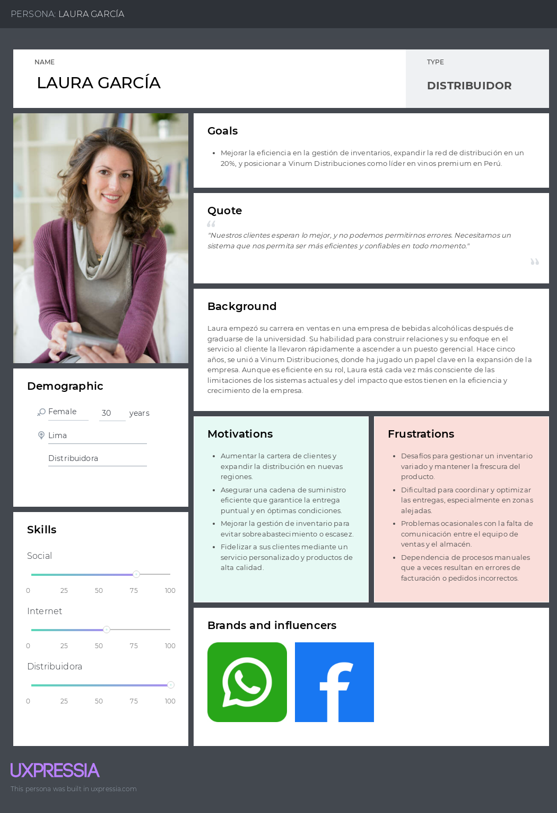
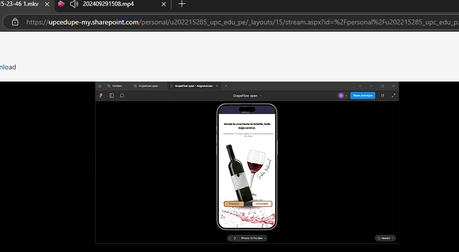
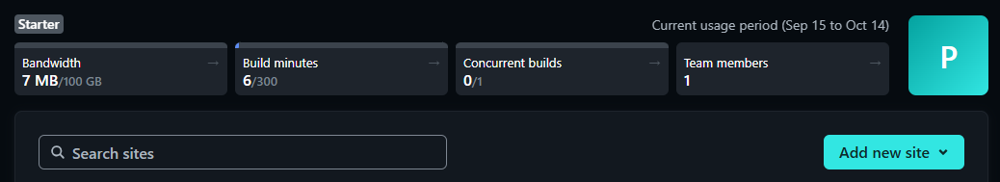
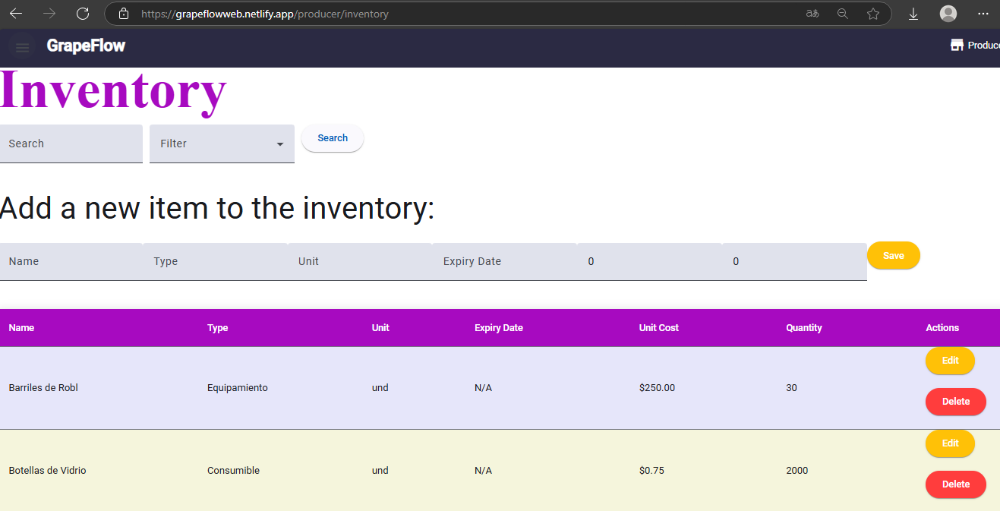
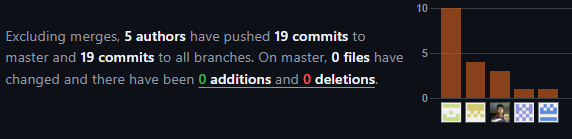
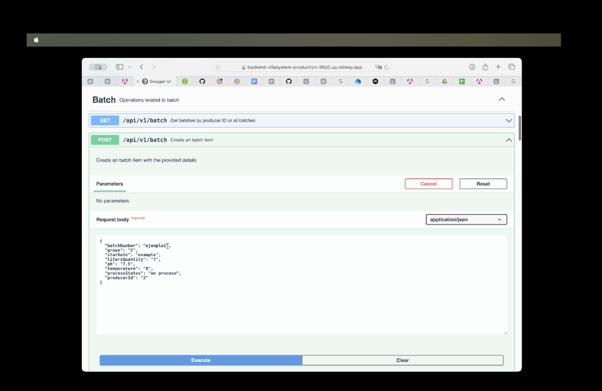
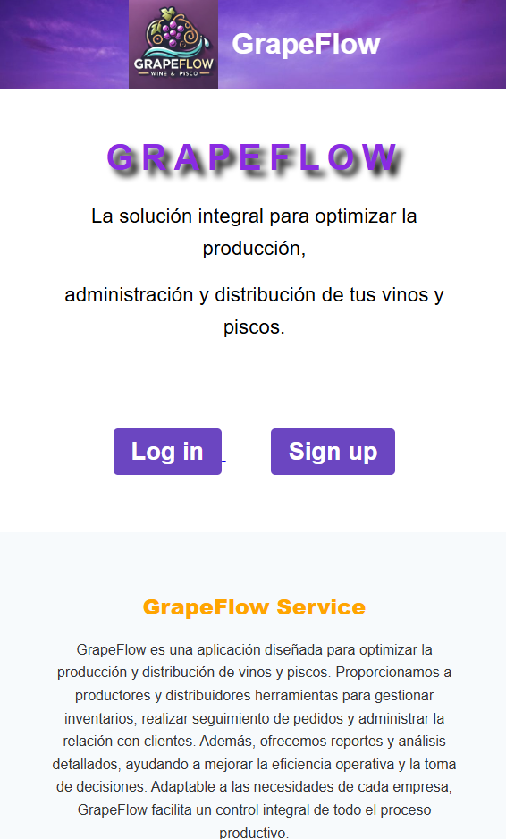

<br />

<div align="center">
    <h1> Universidad Peruana de Ciencias Aplicadas </h1>


  <p align="center">
    Ingeniería de Software - 202402
    <br />
    SV54 - Desarrollo de Aplicaciones Open Source
    <br />
    Hugo Allan Mori Paiva
    <br />
    Informe de Trabajo Final
    <br />
    Startup: VillaSystem
    <br />
    Proyecto: GrapeFlow
  </p>

   <table border="1">
        <tr> 
            <th>Alumno</th>
            <th>Codigo</th>
        </tr>
        <tr> 
            <td>Armas Sánchez, Oscar Javier</td>
            <td>U20211G192</td>
        </tr>
        <tr> 
            <td>Curi Marcelo, Angelo Marcio</td>
            <td>U202022387</td>
        </tr>
        <tr> 
            <td>Huanca Navarro, Gustavo Esau</td>
            <td>U202215285</td>
        </tr>
        <tr> 
            <td>Huincho Lapa, Diego Arturo</td>
            <td>U201923466</td>
        </tr>
        <tr> 
            <td>Salhuana Lopez, Fernando Jose</td>
            <td>U201622757</td>
        </tr>
    </table>

  <p align="center">
    Agosto-2024
  </p>

</div>


# Registro de Versiones del Informe
| Versión | Fecha      | Autor           | Descripción de modificación                                                                                                               |
|---------|------------|-----------------|-------------------------------------------------------------------------------------------------------------------------------------------|
| V0.1    | 21/08/2024 | Diego           | Creación del repositorio                                                                                                                  |
| V0.2    | 22/09/2024 | Todos           | Capítulo 1 y Capítulo 2                                                                                                                   |
| V0.2.1  | 24/09/2024 | Gustavo y Oscar | Capítulo 3 y Capítulo 4                                                                                                                   |
| V0.3    | 25/09/2024 | Diego y Angelo  | Revisión del Capítulo 4                                                                                                                   |
| V0.4    | 26/09/2024 | Gustavo         | Capítulo 5 y últimos ajustes                                                                                                              |
| V1.0    | 01/10/2024 | Gustavo         | Revisión final y entrega TB1.                                                                                                             |
| V1.1    | 22/10/2024 | Oscar           | Adición de gráficos y visualizaciones en el Capítulo 2.                                                                                   |
| V1.2    | 24/10/2024 | Diego           | Actualización del Capítulo 3 con nuevas referencias.                                                                                      |
| V1.3    | 01/11/2024 | Gustavo         | Mejora de la redacción en el Capítulo 4.                                                                                                  |
| V1.4    | 01/11/2024 | Angelo          | Incorporación de feedback de revisores en el Capítulo 5.                                                                                  |
| V1.5    | 01/11/2024 | Diego y Oscar   | Revisión de contenido y correcciones en la sección de conclusiones.                                                                       |
| V2.1    | 22/09/2023 | Diego           | Redacción de Collaboration Insights                                                                                                       |
| V2.2    | 24/09/2023 | Oscar           | Corrección de user stories, descripción y acceptance criteria. Repriorización del backlog y repuntaje del sprint                          |
| V2.3    | 25/09/2023 | Oscar           | Corrección del índice. Redacción del capítulo 5.2.2.1                                                                                     |
| V2.4    | 26/09/2023 | Diego           | Mejora continua, agregadas descripciones a wireframes, mock-ups, wireflows y user flows.                                                  |
| V2.5    | 26/09/2023 | Oscar           | Corrección de análisis de entrevistas.                                                                                                    |
| V2.6    | 26/09/2023 | Diego           | Mejora continua, corrección del diagrama de base de datos.                                                                                |
| V2.7    | 26/09/2023 | Angelo          | Avance de conclusiones                                                                                                                    |
| V3.1    | 20/10/2023 | Oscar           | Elaboración de entrevistas de validación                                                                                                  |
| V3.2    | 20/10/2023 | Angelo          | Elaboración de análisis según heurísticas                                                                                                 |
| V3.3    | 01/11/2023 | Diego           | Elaboración de video sobre el equipo y el producto                                                                                        |
| V3.4    | 01/11/2023 | Oscar           | Análisis de entrevistas de validación                                                                                                     |
| V3.5    | 01/11/2023 | Todos           | Evaluación según heurísticas                                                                                                              |
| V3.6    | 01/11/2023 | Todos           | Sprint Planning 3, Development Evidence for Sprint Review, Testing Suite Evidence for Sprint Review, Execution Evidence for Sprint Review |
| V3.7    | 01/11/2023 | Angelo          | Avanze de conclusiones                                                                                                                    | 


# Project Report Collaboration Insights
URL del repositorio para el reporte del proyecto: https://github.com/VillaSystem/grupo2-project-report

**TB1**
Para elaborar el informe correspondiente a la entrega TB1, se distribuyó la responsabilidad de redactar las distintas secciones de la siguiente manera entre cada miembro del equipo:

| Integrante        | Tareas Asignadas                                                                                                                                                                                                                                                                         |
|-------------------|------------------------------------------------------------------------------------------------------------------------------------------------------------------------------------------------------------------------------------------------------------------------------------------|
| Oscar Armas       | Diseño de entrevistas. Diagrama de clases. Diagrama de contexto, componentes y contenedores. User Personas. Information Architecture. User Stories. Diagrama de base de datos.       |
| Angelo Curi       |     Diseño de mockups y wireframes. Descripción de user flows. Capítulo V, Software Development Environment Configuration, Source Code Management, Style Guide & Conventions. User Stories. Product Backlog     |
| Gustavo Huanca    | Impact Mapping, registro y análisis de entrevistas. User Task Matrix. As-Is To-be Scenarios. Empathy Mapping. Technical User Stories. User Stories. Product Backlog. Bibliografía.     |
| Diego Huincho     | Antecedentes y problemática 5W y 2H. Lean UX Process, Problem Statement, Assumptions e Hypothesis statements. Lean UX Canvas. Segmentos Objetivos. Análisis de competidores. Diseño de entrevistas. Conclusiones y recomendaciones |
| Fernando Salhuana | General Style Guidelines. Landing Page, Services & Applications implementation. Software Deployment configuration.  |

**TP**
Para elaborar el informe correspondiente a la entrega TP, se distribuyó la responsabilidad de redactar las distintas secciones de la siguiente manera entre cada miembro del equipo:


| Integrante        | Tareas Asignadas                                                                                                                                                                                                                                                                         |
|-------------------|------------------------------------------------------------------------------------------------------------------------------------------------------------------------------------------------------------------------------------------------------------------------------------------|
| Oscar Armas       | Mejora del diagrama de clases. Avance de conclusiones                                   |
| Angelo Curi       |     Corrección del modelo de base de datos. Completar explicaciones de flows. Sprint Backlog 2.        |
| Gustavo Huanca    | Corrección de impact map. Documentation Evidence for Sprint Review      |
| Diego Huincho     | Correcciones en Lean UX, completar explicación de collaboration |
| Fernando Salhuana |Sprint Planning 2, Development Evidence for Sprint Review, Testing Suite Evidence for Sprint Review, Execution Evidence for Sprint Review     |


**TB2**

| Integrante     | Tareas Asignadas                                                                                                                                                                                                                         |
|----------------|------------------------------------------------------------------------------------------------------------------------------------------------------------------------------------------------------------------------------------------|
| Oscar Armas    | PPT, Tecnical stories, product backlog, entrevista, testing, desarrollo del bounded context lote,Tecnical stories.                                                                                                                       |
| Angelo Curi    | Corrección del diagrama de base de datos. Corrección de diagramas C4. Elaboración de video about the product. Elaboración de entrevistas de validación, PPT,Tecnical stories.                                                            |
| Fernando       | Spring Backlog 3, desarrollo del bounded context orders,Tecnical stories                                                                                                                                                                 |
| Diego Huincho  | Evaluación según heurísticas, análisis de entrevistas de validación ,Tecnical stories.                                                                                                                                                   |
| Gustavo Huanca | Sprint Planning 3, Development Evidence for Sprint Review, Testing Suite Evidence for Sprint Review, Execution Evidence for Sprint Review, correcion de Software Deployment Configuration, Web applications prototyping,Tecnical stories |


La colaboración en la creación del informe se llevó a cabo a través de una serie de contribuciones constantes al repositorio de la organización VillaSystem.

## GitHub Insights
GitHub nos permite exponer una linea de tiempo de nuestras ramas principales y el proceso al que se han sometido. Tdodas las ramas creadas fue en base al diseño de GitFlow para una buena organización y control de versiones.

Los integrantes del equipo son:
* Angelo Curi (AngelC999)
* Gustavo Huanca (petitavo)
* Diego Huincho (DiegoHLZ)
* Óscar Armas (Racso24k)
* Fernando Salhuana (zxyfernando)

### TB2


## Student Outcomes

| Criterio específico                                                    | Acciones realizadas                                                                                                                                                                                                                                                                                                                                                                                                                                                                                                                                                                                                                                                                                                                                                                                                                                                                                                                                                                                                                                                                                                                                                                                                                                                                                                                                                                                                                                                                                                                                                                                                                                                                                                                                                                                                                                                                                                                                                                                                                                                                                                                                                                                                                                                                                                                                                                                                                                                                                                             | Conclusiones                                                                                                                                                                                                                                                        |
|------------------------------------------------------------------------|---------------------------------------------------------------------------------------------------------------------------------------------------------------------------------------------------------------------------------------------------------------------------------------------------------------------------------------------------------------------------------------------------------------------------------------------------------------------------------------------------------------------------------------------------------------------------------------------------------------------------------------------------------------------------------------------------------------------------------------------------------------------------------------------------------------------------------------------------------------------------------------------------------------------------------------------------------------------------------------------------------------------------------------------------------------------------------------------------------------------------------------------------------------------------------------------------------------------------------------------------------------------------------------------------------------------------------------------------------------------------------------------------------------------------------------------------------------------------------------------------------------------------------------------------------------------------------------------------------------------------------------------------------------------------------------------------------------------------------------------------------------------------------------------------------------------------------------------------------------------------------------------------------------------------------------------------------------------------------------------------------------------------------------------------------------------------------------------------------------------------------------------------------------------------------------------------------------------------------------------------------------------------------------------------------------------------------------------------------------------------------------------------------------------------------------------------------------------------------------------------------------------------------|---------------------------------------------------------------------------------------------------------------------------------------------------------------------------------------------------------------------------------------------------------------------|
| Comunica oralmente con efectividad a diferentes rangos de audiencia.   | **Angelo**<br>TB1:<br>He colaborado de manera proactiva en la resolución de desafíos durante la finalización del informe. Al ofrecer soluciones efectivas y facilitar el progreso del proyecto, he asegurado que todos los aspectos importantes se aborden de manera oportuna, lo que ha mejorado la cohesión del equipo.<br>TP:<br>He avanzado en los elementos asignados mediante la coordinación de reuniones grupales diarias y semanales, logrando cumplir con las tareas asignadas y manteniendo al equipo alineado en nuestras metas.<br>TB2:<br>He mantenido comunicación constante con el equipo, participando en reuniones donde aplicamos buenas prácticas de DDD, fortaleciendo el entendimiento mutuo de los objetivos del proyecto.<br>**Oscar**<br>TB1:<br>He participado activamente en discusiones clave, aportando ideas sobre problemáticas del proyecto, especialmente en Lean UX Problem Statements, asegurando la alineación del equipo.<br>TP:<br>Utilicé ejemplos claros en presentaciones para facilitar la comprensión de los objetivos del proyecto.<br>TB2:<br>Fomenté un ambiente de diálogo abierto, mejorando las technical stories y el desarrollo del backend.<br>**Gustavo**<br>TB1:<br>Coordiné la creación de los repositorios, organizando reuniones sobre el flujo de trabajo de Git y estableciendo ramas para cada repositorio, mejorando el control del proyecto.<br>TP:<br>Logré coordinar la entrega asignando tareas para el avance del sprint, manteniendo el enfoque y cumpliendo los plazos.<br>TB2:<br>Contribuí en la creación del backend, asegurando prácticas de programación y cumplimiento de requisitos del proyecto.<br>**Fernando**<br>TB1:<br>Cumplí con las asignaciones siendo enfático y minucioso en las investigaciones para redactar enunciados que reflejan el progreso del proyecto.<br>TP:<br>Mis intervenciones en reuniones han sido claras y precisas, facilitando la comunicación.<br>TB2:<br>He participado en el intercambio de ideas, optimizando la colaboración.<br>**Diego**<br>TB1:<br>He participado en el desarrollo de prototipos y he mantenido una comunicación efectiva con los clientes, adaptando el enfoque y desarrollando soluciones relevantes.<br>TP:<br>Contribuí en el diseño de entrevistas para recopilar información valiosa, mejorando la comprensión de las expectativas del cliente.<br>TB2:<br>Mis aportes en reuniones ayudaron a identificar oportunidades de mejora en el prototipo, fomentando una colaboración eficaz. | La comunicación oral ha sido efectiva dentro del equipo, permitiendo un intercambio fluido de ideas y una comprensión compartida de los objetivos del proyecto. Se continuará fomentando esta comunicación para mantener la colaboración y el progreso del trabajo. |
| Comunica por escrito con efectividad a diferentes rangos de audiencia. | **Angelo**<br>TB1:<br>Realicé la parte asignada del proyecto de manera satisfactoria, cumpliendo con plazos y estándares esperados. Mis informes han sido claros y concisos, facilitando la comprensión del contenido.<br>TP:<br>La claridad y precisión en mi redacción facilitaron la comprensión de los documentos.<br>TB2:<br>Mis informes reflejaron un enfoque sistemático que contribuyó al progreso del proyecto.<br>**Oscar**<br>TB1:<br>Redacté documentos clave relacionados con problemáticas y el uso de Lenguaje Ubicuo, estructurando la información de manera clara y precisa.<br>TP:<br>El uso de lenguaje técnico adecuado facilitó la toma de decisiones del equipo.<br>TB2:<br>Mis documentos han servido de referencia, fortaleciendo la cohesión del proyecto.<br>**Gustavo**<br>TB1:<br>Redacté informes técnicos y documentación del proyecto, garantizando claridad para diferentes audiencias y facilitando la coordinación.<br>TP:<br>La estructura lógica de mis documentos permitió una mejor comprensión del proyecto.<br>TB2:<br>Proporcioné retroalimentación escrita que mejoró la calidad del trabajo.<br>**Fernando**<br>TB1:<br>Trabajé en la organización de tareas, mejorando la redacción de capítulos asignados.<br>TP:<br>La planificación previa de mis escritos aseguró la cohesión de los entregables.<br>TB2:<br>Mis contribuciones escritas consolidaron la documentación del proyecto, facilitando el acceso a información clave.<br>**Diego**<br>TB1:<br>Colaboré en la redacción de capítulos sobre implementación, asegurando claridad en la comunicación de decisiones.<br>TP:<br>La organización de capítulos facilitó la lectura y comprensión del progreso.<br>TB2:<br>Mis aportes escritos clarificaron roles y responsabilidades, contribuyendo a la organización del trabajo.                                                                                                                                                                                                                                                                                                                                                                                                                                                                                                                                                                                                                                                                                          | La comunicación escrita fue efectiva, proporcionando claridad y cohesión en los documentos, lo que facilitó la alineación y coordinación del equipo en el proyecto. Se mantendrán estos enfoques para garantizar la claridad en futuras comunicaciones.             |

- [Contenido](#contenido)

- [**Capítulo I: Introducción.**](#capítulo-i-introducción)
  - [**1.1  Startup Profile.**](#11--startup-profile)
    - [**1.1.1. Descripción del startup.**](#111-descripción-del-startup)
    - [**1.1.2.  Perfiles de los integrantes del equipo.**](#112--perfiles-de-los-integrantes-del-equipo)
  - [**1.2. Solution Profile.**](#12-solution-profile)
    - [**1.2.1. Antecedentes y Problemática.**](#121-antecedentes-y-problemática)
    - [**1.2.2. Lean UX Process.**](#122-lean-ux-process)
      - [**1.2.2.1. Lean UX Problem Statements.**](#1221-lean-ux-problem-statements)
      - [**1.2.2.2. Lean UX Assumptions.**](#1222-lean-ux-assumptions)
      - [**1.2.2.3. Lean UX Hypothesis Statements.**](#1223-lean-ux-hypothesis-statements)
      - [**1.2.2.4. Lean UX Canvas.**](#1224-lean-ux-canvas)
  - [**1.3. Segmentos objetivo.**](#13-segmentos-objetivo)
- [**Capítulo II: Requirements Elicitation \& Analysis**](#capítulo-ii-requirements-elicitation--analysis)
  - [**2.1. Competidores.**](#21-competidores)
    - [**2.1.1. Análisis competitivo.**](#211-análisis-competitivo)
    - [**2.1.2. Estrategias y tácticas frente a competidores.**](#212-estrategias-y-tácticas-frente-a-competidores)
  - [**2.2. Entrevistas.**](#22-entrevistas)
    - [**2.2.1. Diseño de entrevistas.**](#221-diseño-de-entrevistas)
    - [**2.2.2. Registro de entrevistas.**](#222-registro-de-entrevistas)
    - [**2.2.3. Análisis de entrevistas.**](#223-análisis-de-entrevistas)
  - [**2.3. Needfinding.**](#23-needfinding)
    - [**2.3.1. User Personas.**](#231-user-personas)
    - [**2.3.2. User Task Matrix.**](#232-user-task-matrix)
    - [**2.3.3. User Journey Mapping**](#233-user-journey-mapping)
    - [**2.3.4. Empathy Mapping**](#234-empathy-mapping)
    - [**2.3.5. As-is Scenario Mapping**](#235-as-is-scenario-mapping)
  - [**2.4. Ubiquitous Language**](#24-ubiquitous-language)
- [**Capítulo III: Requirements Specification.**](#capítulo-iii-requirements-specification)
  - [**3.1. To-Be Scenario Mapping.**](#31-to-be-scenario-mapping)
  - [**3.2.User Stories.**](#32user-stories)
  - [**3.3. Impact Mapping.**](#33-impact-mapping)
  - [**3.4. Product Backlog.**](#34-product-backlog)
- [**Capítulo IV: Product Design.**](#capítulo-iv-product-design)
  - [**4.1. Style Guidelines.**](#41-style-guidelines)
    - [**4.1.1. General Style Guidelines.**](#411-general-style-guidelines)
    - [**4.1.2. Web Style Guidelines.**](#412-web-style-guidelines)
  - [**4.2. Information Architecture.**](#42-information-architecture)
    - [**4.2.1. Organization Systems.**](#421-organization-systems)
    - [**4.2.2. Labeling Systems.**](#422-labeling-systems)
    - [**4.2.3. SEO Tags and Meta Tags.**](#423-seo-tags-and-meta-tags)
    - [**4.2.4. Searching Systems.**](#424-searching-systems)
    - [**4.2.5. Navigation Systems.**](#425-navigation-systems)
  - [**4.3. Landing Page UI Design**](#43-landing-page-ui-design)
    - [**4.3.1. Landing Page Wireframe.**](#431-landing-page-wireframe)
    - [**4.3.2. Landing Page Mock-up.**](#432-landing-page-mock-up)
  - [**4.4. Web Applications UX/UI Design.**](#44-web-applications-uxui-design)
    - [**4.4.1. Web Applications Wireframes.**](#441-web-applications-wireframes)
    - [**4.4.2. Web Applications Wireflow Diagrams.**](#442-web-applications-wireflow-diagrams)
    - [**4.4.3. Web Applications Mock-ups.**](#443-web-applications-mock-ups)
    - [**4.4.4. Web Applications User Flow Diagrams.**](#444-web-applications-user-flow-diagrams)
  - [**4.5. Web Applications Prototyping.**](#45-web-applications-prototyping)
  - [**4.6. Domain-Driven Software Architecture**](#46-domain-driven-software-architecture)
    - [**4.6.1. Software Architecture Context Diagram.**](#461-software-architecture-context-diagram)
    - [**4.6.2. Software Architecture Container Diagrams.**](#462-software-architecture-container-diagrams)
    - [**4.6.3. Software Architecture Components Diagrams.**](#463-software-architecture-components-diagrams)
  - [**4.7. Software Object-Oriented Design.**](#47-software-object-oriented-design)
    - [**4.7.1. Class Diagrams.**](#471-class-diagrams)
    - [**4.7.2. Class Dictionary.**](#472-class-dictionary)
  - [**4.8. Database Design.**](#48-database-design)
    - [**4.8.1. Database Diagram.**](#481-database-diagram)
- [**Capítulo V: Product Implementation, Validation \& Deployment.**](#capítulo-v-product-implementation-validation--deployment)
  - [**5.1. Software Configuration Management.**](#51-software-configuration-management)
    - [**5.1.1. Software Development Environment Configuration.**](#511-software-development-environment-configuration)
    - [**5.1.2. Source Code Management.**](#512-source-code-management)
    - [**5.1.3. Source Code Style Guide \& Conventions.**](#513-source-code-style-guide--conventions)
    - [**5.1.4. Software Deployment Configuration.**](#514-software-deployment-configuration)
  - [**5.2. Landing Page, Services \& Applications Implementation.**](#52-landing-page-services--applications-implementation)
    - [**5.2.1. Sprint 1.**](#521-sprint-1)
      - [**5.2.1.1. Sprint Planning 1.**](#5211-sprint-planning-1)
      - [**5.2.1.2. Sprint Backlog 1.**](#5212-sprint-backlog-1)
      - [**5.2.1.3. Development Evidence for Sprint Review.**](#5213-development-evidence-for-sprint-review)
      - [**5.2.1.4. Testing Suite Evidence for Sprint Review.**](#5214-testing-suite-evidence-for-sprint-review)
      - [**5.2.1.5. Execution Evidence for Sprint Review.**](#5215-execution-evidence-for-sprint-review)
      - [**5.2.1.6. Services Documentation Evidence for Sprint Review.**](#5216-services-documentation-evidence-for-sprint-review)
      - [**5.2.1.7. Software Deployment Evidence for Sprint Review.**](#5217-software-deployment-evidence-for-sprint-review)
      - [**5.2.1.8. Team Collaboration Insights during Sprint.**](#5218-team-collaboration-insights-during-sprint)
      - [**5.2.2. Sprint 2.**](#522-Sprint-2)
      - [**5.2.2.1 Sprint Planning 2.**](#5221-sprint-planning-2)
      - [**5.2.2.2.Sprint Backlog 2.**](#5222-sprint-backlog-2)
      - [**5.2.2.3.Development Evidence for Sprint Review.**](#5223-development-evidence-for-sprint-review)
      - [**5.2.2.4.Testing Suite Evidence for Sprint Review.**](#5224-testing-suite-evidence-for-sprint-review)
      - [**5.2.2.5.Execution Evidence for Sprint Review.**](#5225-execution-evidence-for-sprint-review)
      - [**5.2.2.6.Services Documentation Evidence for Sprint Review.**](#5226-services-documentation-evidence-for-sprint-review)
      - [**5.2.2.7.Software Deployment Evidence for Sprint Review.**](#5227-software-deployment-evidence-for-sprint-review)
      - [**5.2.2.8.Team Collaboration Insights during Sprint.**](#5228-team-collaboration-insights-during-sprint)
      - [**5.2.3. Sprint 3.**](#523-sprint-3)
      - [**5.2.3.1.Sprint Planning 3.**](#5231-sprint-planning-3)
      - [**5.2.3.2.Sprint Backlog 3.**](#5232-sprint-backlog-3)
      - [**5.2.3.3.Development Evidence for Sprint Review.**](#5233-development-evidence-for-sprint-review)
      - [**5.2.3.4.Testing Suite Evidence for Sprint Review.**](#5234-testing-suite-evidence-for-sprint-review)
      - [**5.2.3.5.Execution Evidence for Sprint Review.**](#5235-execution-evidence-for-sprint-review)
      - [**5.2.3.6.Services Documentation Evidence for Sprint Review.**](#5236-services-documentation-evidence-for-sprint-review)
      - [**5.2.3.7.Software Deployment Evidence for Sprint Review.**](#5237-software-deployment-evidence-for-sprint-review)
      - [**5.2.3.8.Team Collaboration Insights during Sprint.**](#5238-team-collaboration-insights-during-sprint)
      -  [**5.2.4. Sprint 4.**](#524-sprint-4)
      - [**5.2.4.1 Sprint Planning 4.**](#5241-sprint-planning-4)
      - [**5.2.4.2 Sprint Backlog 4.**](#5242-sprint-backlog-4)
      - [**5.2.4.3 Development Evidence for Sprint Review.**](#5243-development-evidence-for-sprint-review)
      - [**5.2.4.4 Testing Suite Evidence for Sprint Review.**](#5244-testing-suite-evidence-for-sprint-review)
      - [**5.2.4.5 Excution Evidence for Sprint Review.**](#5245-excution-evidence-for-sprint-review)
      - [**5.2.4.6 Services Documentation Evidence for Sprint Review.**](#5246-services-documentation-evidence-for-sprint-review)
      - [**5.2.4.7 Software Deployment Evidence for Sprint Review.**](#5247-software-deployment-evidence-for-sprint-review)
      - [**5.2.4.8 Team Collaboration Insights during Sprint.**](#5248-team-collaboration-insights-during-sprint)
      - [**5.3. Validation Interviews.**](#53-validation-interviews)
        - [**5.3.1. Diseño de Entrevistas.**](#531-diseño-de-entrevistas)
        - [**5.3.2. Registro de Entrevistas.**](#532-registro-de-entrevistas)
        - [**5.3.3. Evaluaciones según heurísticas**](#533-evaluaciones-según-heurísticas)
        - [**5.4. Video About-the-Product.**](#54-video-about-the-product)
- [**Capítulo VI: Conclusion.**](#capítulo-vi-conclusion)
- [**Capítulo VII: Bibliografia.**](#capítulo-vii-bibliografia)
- [8. **Anexos.**](#anexos)


# [Capítulo I: Introducción.](#capítulo-i-introducción)
## [1.1 Startup Profile](#startup-profile)
En esta sección se presenta la descripción del startup y los perfiles de los miembros del equipo.

### [1.1.1 Descripción de la Startup](#descripción-de-la-startup)
Nuestro startup busca apoyar a los fabricantes de licores al proporcionarles componentes especializados que les permiten recopilar datos esenciales, como el pH, la temperatura y el tiempo de añejamiento de sus productos; además deberán introducir información adicional, como el tipo de uva utilizada en la cosecha y la procedencia de los ingredientes.
Estos datos recopilados se convierten en una valiosa fuente de información que posteriormente será utilizada en una aplicación que desarrollaremos para también ayudar a los fabricantes a vender sus productos y a los consumidores a comprar con información detallada sobre cada licor, lo que les permita tomar decisiones informadas y disfrutar de una experiencia de compra enriquecida.

**Misión**: Proporcionar a los productores y consumidores de vinos y piscos una plataforma integral y eficiente que optimice todos los aspectos del proceso productivo, desde la gestión de inventarios hasta la entrega final, impulsando así la calidad, la eficiencia y el crecimiento sostenible en la industria.

**Visión**: Ser la solución líder y de referencia en la industria vitivinícola y de piscos, reconocida por nuestra innovación, confiabilidad y capacidad para transformar la gestión operativa de nuestros clientes en un proceso más eficiente, rentable y alineado con los más altos estándares de calidad.

**Logo de la Startup**:


**Logo del servicio**:


### [1.1.2 Perfiles de los integrantes del equipo](#perfiles-de-los-integrantes-del-equipo)
| Foto del Participante         | Nombres y Apellidos           | Código de Estudiante | Descripción de Carrera | Resumen de Conocimientos y Habilidades                                                                                                                                                                                                                                                                                                                                                                                                                                                                                             |
|-------------------------------|-------------------------------|----------------------|------------------------|------------------------------------------------------------------------------------------------------------------------------------------------------------------------------------------------------------------------------------------------------------------------------------------------------------------------------------------------------------------------------------------------------------------------------------------------------------------------------------------------------------------------------------|
|       | Huanca Navarro, Gustavo Esau  | U202215285           | Ingenieria de Software | Soy Gustavo Huanca, estudiante de Ingeniería de Software. Me considero puntual, responsable y disfruto resolviendo problemas tecnológicos. Tengo conocimientos en desarrollo de software, varios lenguajes de programación, estructuras de datos y algoritmos. Además. Mi objetivo es contribuir eficazmente al éxito del equipo con mis habilidades                                                                                                                                                                               |
|                         | Armas Sánchez Oscar Javier    | U20211G192           | Ingenieria de Software | Soy estudiante de Ingeniería de Software, con habilidades de comunicación que me permiten transmitir ideas de manera clara y efectiva. Me considero persistente, puntual y comprometido en cada proyecto en el que participo. Además, tengo experiencia en C++, Java, SQL, y conocimientos en programación web, lo que me permite enfrentar y resolver problemas técnicos con eficiencia y creatividad.                                                                                                                                                                                                                                                                                                                                                                                                                |
|      | Salhuana Lopez, Fernando Jose | U201622757           | Ingenieria de Software | Soy estudiante de la carrera de Ingeniería de Software, tengo habilidades blandas para que mis compañeros puedan confiar en mí. Soy participativo, resuelvo problemas complicados con facilidad y creativo en todo aspecto. En formación poseo experiencia en C++, Java, SQL y ciertos conocimientos en programación web.                                                                                                                                                                                                          |                                                                                                                                                                       
|  | Huincho Lapa, Diego Arturo    | U201923466           | Ingenieria de Software | Mi nombre es Diego Arturo Huincho Lapa. Tengo 22 años y estoy estudiando la carrera de Ingeniería de Software. Considero que soy una persona que es capaz de trabajar bajo presión, además de ser detallista y responsable. En cuanto a cualidades para la realización del trabajo considero que soy bueno haciendo los mockups de la app y la parte del frontend, puesto que ya tengo experiencia haciendo trabajos con los frameworks vuejs y react. En mi ratos libres me gusta jugar videojuegos o mirar una serie o pelicula. |
|        | Curi Marcelo, Angelo Marcio   | U202022387           | Ingenieria de Software | Soy estudiante de la carrera de Ingeniería de Software en la Universidad Peruana de Ciencias Aplicadas (UPC). Me considero una persona responsable y comprometida con mis tareas. Siempre me esfuerzo por cumplir con los plazos y entregar trabajos de calidad. Además, me considero una persona creativa, tengo conocimientos tanto en programación y edición de videos. Considero que soy una persona que puede aportar de manera significativa a este equipo.                                                                  |

## [1.2 Solution Profile](#solution-profile)
### [1.2.1 Antecedentes y Problemática](#antecedentes-y-problemática)

### Antecedentes

El estado actual de **la gestión del proceso productivo en la industria vitivinícola y de pisco** se ha centrado principalmente en **soluciones fragmentadas y sistemas manuales que no ofrecen una integración completa entre la vinificación, el control de inventarios y la administración de pedidos**.

Lo que los productos/servicios existentes no logran abordar es **una plataforma integral que centralice todas estas funciones en un único sistema, permitiendo una coordinación efectiva y una visibilidad en tiempo real de todos los aspectos del proceso productivo y de distribución**.

Nuestro producto/servicio abordará esta brecha mediante **el desarrollo e implementación de GRAPEFLOW, un software integral que unifica la gestión del proceso productivo, el control de inventarios y el seguimiento de pedidos en una sola plataforma. La solución estará diseñada para adaptarse a diferentes tamaños de operación y necesidades específicas de los usuarios, ofreciendo herramientas avanzadas y una interfaz intuitiva**.

Nuestro enfoque inicial será **el mercado de productores y consumidores de vinos y pisco en América Latina, donde la necesidad de una solución centralizada y eficiente es particularmente evidente**.

Sabremos que tenemos éxito cuando veamos **una mejora significativa en la eficiencia operativa de nuestros clientes, una reducción en el desperdicio de recursos, y un aumento en la satisfacción del cliente, evidenciado por la adopción generalizada de la plataforma y el cumplimiento de nuestras metas de suscripción y retención de clientes en el primer año de lanzamiento**.

### Problemáticas

#### Técnica de las 5 ‘W’s y 2 ‘H’s


#### What?

- **¿Cuál es el problema?**

El problema central radica en la gestión fragmentada e ineficiente de los procesos productivos y logísticos en la industria vitivinícola y de pisco. Los métodos tradicionales, que a menudo son manuales y poco integrados, generan múltiples desafíos, como inconsistencias en la calidad del producto, desajustes en los inventarios, dificultades en la administración de la cartera de clientes, y falta de visibilidad en tiempo real sobre las operaciones. Estos problemas no solo afectan la productividad y la eficiencia operativa, sino que también impactan negativamente en la capacidad de respuesta ante la demanda del mercado, limitando el potencial de crecimiento y la competitividad de los productores y consumidores.

- **¿Cuál es la relación con la persona en cuestión?**
 
Este problema afecta directamente a los productores, quienes necesitan optimizar sus procesos productivos para garantizar la calidad y consistencia de sus vinos y piscos, así como a los consumidores, que dependen de una logística eficiente para gestionar inventarios, cumplir con los pedidos a tiempo, y mantener una comunicación fluida con los productores. En última instancia, los clientes finales también se ven perjudicados, ya que la falta de eficiencia en la cadena de producción y distribución puede llevar a una menor disponibilidad de productos de calidad en el mercado.

#### When?

- **¿Cuándo sucede el problema?**
 
El problema se manifiesta en diferentes etapas del ciclo de producción y distribución. Desde la fermentación y embotellado en la fase de producción, hasta la gestión de inventarios y la entrega final en la fase de distribución, cada etapa es susceptible a errores y retrasos si no se cuenta con un sistema eficiente y centralizado. Estos problemas pueden surgir en cualquier momento, especialmente en periodos de alta demanda o durante la transición entre distintas etapas del proceso.

- **¿Cuándo utiliza el cliente el producto?**

Los clientes, tanto productores como consumidores, utilizan el producto en distintos momentos críticos de sus operaciones diarias. Durante la producción, el software se emplea para gestionar y monitorear el proceso de vinificación, control de calidad y almacenamiento. En la fase de distribución, se utiliza para coordinar la logística, gestionar inventarios, y realizar el seguimiento de pedidos en tiempo real.

#### Where?

- **¿Dónde está el cliente cuando usa el producto?**

Los clientes utilizan el producto en diversos entornos relacionados con la producción y distribución de vino y pisco. Los productores lo emplean en sus bodegas, viñedos y almacenes para gestionar y monitorear cada fase del proceso productivo. Los consumidores, por su parte, lo utilizan en sus centros de distribución y oficinas administrativas para coordinar la logística, gestionar inventarios y mantener la comunicación con los productores.

- **¿A dónde se dirige?**

El cliente se dirige hacia la optimización de sus operaciones, buscando mejorar la eficiencia, reducir el desperdicio y maximizar la rentabilidad. Con GRAPEFLOW, los productores y consumidores buscan centralizar la gestión de sus procesos, logrando una mayor visibilidad y control sobre cada aspecto de su negocio.

- **¿Dónde surge el problema?**

El problema surge en varios puntos clave de la cadena de valor. En la fase de producción, los desafíos incluyen la coordinación entre los diferentes procesos (fermentación, embotellado, almacenamiento) y el control de calidad. En la distribución, los problemas se centran en la gestión de inventarios, la logística de entregas, y la comunicación con los clientes y productores. La falta de integración entre estos procesos exacerba los problemas, creando ineficiencias y errores que impactan en toda la operación.

#### Who?

- **¿Quiénes están involucrados?**
 
Los principales involucrados son los productores de vino y pisco, que necesitan gestionar sus procesos productivos de manera eficiente; los consumidores, que se encargan de llevar los productos al mercado; y los clientes finales, quienes dependen de la calidad y disponibilidad del producto. También se incluyen otros actores como proveedores de insumos, transportistas y minoristas, quienes interactúan con los productores y consumidores y cuyas operaciones también pueden verse afectadas por la ineficiencia en la gestión de la cadena de suministro.

#### Why?

- **¿Cuál es la causa del problema?**

La causa principal del problema es la falta de un sistema centralizado y eficiente para coordinar y gestionar los diversos aspectos del proceso productivo y de distribución. La dependencia de sistemas manuales o soluciones tecnológicas desintegradas provoca errores humanos, falta de coordinación entre diferentes etapas del proceso, y una baja visibilidad en tiempo real de la operación. Además, la comunicación ineficiente entre productores y consumidores contribuye a la desorganización en la administración de la cartera de clientes y a problemas en la satisfacción de la demanda.

#### How?

- **¿En qué condiciones los clientes usan nuestros productos?**
 
Los clientes usan el producto en condiciones donde se requiere un alto grado de coordinación y eficiencia. En la producción, el producto se utiliza en entornos que demandan un control riguroso sobre la calidad y el tiempo, como bodegas y viñedos. En la distribución, se utiliza en contextos donde la precisión en la gestión de inventarios y la rapidez en el cumplimiento de pedidos son críticos, como almacenes y centros de distribución.

- **¿Cómo prefieren los clientes acceder a nuestro producto?**

Los clientes prefieren acceder a un sistema intuitivo, accesible desde múltiples dispositivos, que ofrezca una solución centralizada para todas sus necesidades operativas. Valoran la capacidad de integrar el software con sus sistemas existentes, la facilidad de uso, y la disponibilidad de soporte técnico para asegurar una transición sin problemas y un uso eficiente del producto.

- **¿Qué llevó al cliente a llegar a esta situación?**
 
La situación actual de los clientes se debe a la falta de soluciones tecnológicas que respondan a la complejidad y las necesidades específicas de la industria del vino y pisco. La evolución de la industria ha llevado a un aumento en la demanda de productos de calidad, lo que a su vez ha puesto presión sobre los productores y consumidores para mejorar sus operaciones. Sin embargo, muchos de ellos aún dependen de métodos tradicionales que no están equipados para manejar la escala y la complejidad del mercado actual, lo que crea una necesidad urgente de modernización.

#### How much?

- **¿Cuántos problemas se dan en un día? ¿En una semana? ¿En un mes? ¿Cuánto dinero están implicando?**

La frecuencia y el impacto de los problemas pueden variar según la escala de las operaciones y la época del año. Sin embargo, se estima que los problemas relacionados con la gestión ineficiente pueden ocurrir a diario, generando pérdidas significativas en calidad del producto, exceso o escasez de inventario, y oportunidades de venta perdidas. En términos financieros, estos problemas pueden resultar en pérdidas de miles de dólares mensuales para los productores y consumidores, afectando gravemente su rentabilidad y capacidad para competir en el mercado.
### [1.2.2 Lean UX Process](#lean-ux-process)

En esta sección, iniciamos el proceso de Lean UX, que nos permitirá definir y refinar la visión del modelo de negocio que será soportado por nuestro producto de software. La metodología Lean UX nos ayuda a enfocar el diseño de nuestra solución en torno a la resolución de problemas y la creación de valor real para nuestros usuarios.

#### [1.2.2.1 Lean UX Problem Statements](#lean-ux-problem-statements)

A continuación, utilizamos la plantilla de Business Opportunity Statements (Gothelf, 2022) para enfocar nuestro equipo en la creación de una solución que responda eficazmente a las necesidades de los clientes, sin limitaciones que puedan afectar la creatividad y agilidad del desarrollo.

- La plantilla de Business Opportunity Statement:

El estado actual de **[domain]** se ha centrado principalmente en **[segments, pain points, etc.]**

Lo que los productos/servicios existentes no logran abordar es **[this gap]**.

Nuestro producto/servicio abordará esta brecha mediante **[vision / strategy]**.

Nuestro enfoque inicial será **[this segment]**.

Sabremos que tenemos éxito cuando veamos **[these behaviors in our target audience]**.

- ReStyle Lean UX Problem Statements:

El estado actual de **la gestión del proceso productivo en la industria vitivinícola y de pisco** se ha centrado principalmente en **soluciones fragmentadas y sistemas manuales que no ofrecen una integración completa entre la vinificación, el control de inventarios y la administración de pedidos**.

Lo que los productos/servicios existentes no logran abordar es **una plataforma integral que centralice todas estas funciones en un único sistema, permitiendo una coordinación efectiva y una visibilidad en tiempo real de todos los aspectos del proceso productivo y de distribución**.

Nuestro producto/servicio abordará esta brecha mediante **el desarrollo e implementación de GRAPEFLOW, un software integral que unifica la gestión del proceso productivo, el control de inventarios y el seguimiento de pedidos en una sola plataforma. La solución estará diseñada para adaptarse a diferentes tamaños de operación y necesidades específicas de los usuarios, ofreciendo herramientas avanzadas y una interfaz intuitiva**.

Nuestro enfoque inicial será **el mercado de productores y consumidores de vinos y pisco en América Latina, donde la necesidad de una solución centralizada y eficiente es particularmente evidente**.

Sabremos que tenemos éxito cuando veamos **una mejora significativa en la eficiencia operativa de nuestros clientes, una reducción en el desperdicio de recursos, y un aumento en la satisfacción del cliente, evidenciado por la adopción generalizada de la plataforma y el cumplimiento de nuestras metas de suscripción y retención de clientes en el primer año de lanzamiento**.

#### [1.2.2.2 Lean UX Assumptions](#lean-ux-assumptions)

**Businnes Assumptions**

**User Assumptions**

_¿Quién es el usuario?_

* Fabricantes de licores, especialmente productores de vinos y piscos, que buscan mejorar la calidad y eficiencia de sus procesos productivos.

* Consumidores interesados en conocer detalles específicos sobre los licores que compran para hacer elecciones más informadas.

_¿Qué problemas enfrenta nuestro producto? ¿Cómo los resolveremos?_

* _**Problema para Fabricantes:**_ Falta de herramientas para la recopilación y análisis de datos en tiempo real durante la producción.
* _**Solución:**_ Proporcionar componentes especializados que recopilen datos como pH, temperatura, y tiempo de añejamiento, así como permitir la introducción de información adicional.

* _**Problema para Consumidores:**_ Falta de acceso a información detallada sobre los licores, lo que dificulta tomar decisiones de compra informadas.
* _**Solución:**_ Crear una aplicación que muestre información detallada y verificada sobre cada licor, mejorando la experiencia de compra.

_¿Qué características son importantes?_

* Componentes que recopilen y analicen datos en tiempo real sobre el proceso de producción de licores.
* Una plataforma que integre los datos de producción con la gestión de inventarios y distribución.
* Una aplicación móvil que proporcione a los consumidores información detallada y fácilmente accesible sobre los licores.

_¿Dónde encaja nuestro producto en su trabajo o vida?_

* _**Fabricantes:**_ En el proceso productivo diario, ayudando a optimizar y controlar la calidad de los licores en tiempo real.
* _**Consumidores:**_ En el proceso de compra, proporcionando una experiencia más informada y satisfactoria.

_¿Cuándo y cómo se usa nuestro producto?_

* _**Fabricantes:**_ Durante todo el ciclo de producción, desde la cosecha hasta el añejamiento y embotellado, utilizando los componentes para monitorear y ajustar variables críticas.
* _**Consumidores:**_ En el punto de compra, utilizando la aplicación móvil para obtener detalles sobre el origen, características y calidad de los licores.

_¿Cómo debe ser y comportarse nuestro producto?_

* Debe ser intuitivo y fácil de integrar en los procesos existentes de producción y distribución.
* Debe proporcionar datos precisos y en tiempo real, con una interfaz de usuario clara y accesible.
* La aplicación móvil debe ser atractiva, fácil de usar y proporcionar información detallada de manera rápida y sencilla.

**Feature Assumptions:**

_**Creemos**_ que los fabricantes valorarán la capacidad de monitorear y ajustar variables críticas del proceso productivo en tiempo real a través de nuestros componentes especializados.
<br><br>
_**Creemos**_ que la integración de datos de producción con la gestión de inventarios y distribución ayudará a mejorar la eficiencia operativa y a reducir errores.
<br><br>
_**Creemos**_ que los consumidores apreciarán tener acceso a información detallada sobre los licores que compran, lo que mejorará su experiencia de compra y aumentará la lealtad a la marca.

#### [1.2.2.3 Lean UX Hypothesis Statements](#lean-ux-hypothesis-statements)

- **Hypothesis Statement 01:**
  <br><br>
  _**Creemos**_ que los fabricantes de licores mejorarán la calidad y eficiencia de su producción si tienen acceso a componentes especializados que les permitan monitorear variables críticas como pH, temperatura, y tiempo de añejamiento en tiempo real.
  _**Sabremos**_ que esta hipótesis es cierta _**cuando**_ observemos una reducción en los errores de producción, un incremento en la calidad del producto final, y un aumento en la satisfacción de los fabricantes con nuestra plataforma.
  <br><br>
- **Hypothesis Statement 02:**
  <br><br>
  _**Creemos**_ que los consumidores estarán más dispuestos a comprar licores si tienen acceso a una aplicación que les proporcione información detallada y confiable sobre cada producto, como el tipo de uva, el origen de los ingredientes, y las condiciones de añejamiento.
  _**Sabremos**_ que esta hipótesis es _**cierta**_ cuando veamos un aumento en el uso de la aplicación, un incremento en las ventas de los productos destacados, y una mayor satisfacción de los usuarios en sus decisiones de compra.
  <br><br>

#### [1.2.2.4 Lean UX Canvas](#lean-ux-canvas)

URL del LeanUXCanvas: https://app.mural.co/t/teacsykawsai8308/m/teacsykawsai8308/1724358505056/ad90964d2d1b9220ae312f1ad046c17350430f32?sender=uc4019db9bc166bf541b07012


## [1.3. Segmentos objetivo](#segmentos-objetivo)
### **1. Consumidores de Licores:**

Este segmento incluye a personas interesadas en explorar y comprar vinos, piscos y otros licores, tanto para ocasiones especiales como para su disfrute personal. Estos consumidores están cada vez más atentos a la calidad y las características de los productos que adquieren.

- **Información Detallada del Producto:** Los consumidores necesitan acceder a información completa y precisa sobre cada licor, como el pH, la temperatura, el tiempo de añejamiento, el tipo de uva utilizada y la procedencia de los ingredientes. Esta información les permite tomar decisiones más informadas al momento de la compra.

- **Experiencia de Compra Enriquecida:** Una experiencia de compra que sea fácil de navegar y rica en contenido es esencial. Los consumidores buscan plataformas que no solo les ofrezcan productos, sino que también les proporcionen conocimientos y detalles que mejoren su apreciación de los licores que eligen.

- **Planes de Servicio:** Aunque los consumidores no requieren planes de servicio específicos, la plataforma debe ser intuitiva, atractiva y ofrecer un proceso de compra fluido para mantener su interés y fomentar la lealtad.

### **2. Consumidorres de Licores:**

Este segmento se enfoca en las empresas que gestionan la distribución de licores, asegurando que los productos lleguen a los puntos de venta o directamente a los consumidores finales. Los consumidores desempeñan un rol fundamental en la cadena de suministro y requieren herramientas que optimicen sus operaciones.

- **Seguimiento de Pedidos:** Es crucial que los consumidores cuenten con un sistema eficiente que les permita gestionar y monitorizar los pedidos en tiempo real. Esto garantiza una entrega puntual y sin errores, mejorando la satisfacción del cliente y reduciendo los costos operativos.

- **Administración de la Cartera de Clientes:** La gestión efectiva de las relaciones con los clientes es esencial para maximizar las ventas y fidelizar a los compradores. Los consumidores necesitan soluciones que les permitan segmentar, analizar y mejorar las interacciones con sus clientes, fortaleciendo así sus vínculos comerciales.

- **Planes de Servicio:** Los consumidores pueden beneficiarse de un plan avanzado que ofrezca herramientas completas para la gestión de pedidos, el seguimiento en tiempo real y la administración de la cartera de clientes. Estas funcionalidades son clave para mejorar la eficiencia y competitividad en el mercado.

# [**Capítulo II: Requirements Elicitation \& Analysis**](#capítulo-ii-requirements-elicitation--analysis)
# [2.1 Competidores](#competidores)
### [2.1.1 Análisis competitivo](#análisis-competitivo)


<table border="1" cellpadding="10" cellspacing="0" style="margin-left: auto; margin-right: auto;">
  <tr>
    <th colspan="6">Competitive Analysis Landscape</th>
  </tr>
  <tr>
    <td colspan="2" rowspan="2">¿Por qué llevar a cabo este análisis?</td>
    <td colspan="4">Escriba en el recuadro la pregunta que busca responder o el objetivo de este análisis.</td>
  </tr>
  <tr>
    <td colspan="4">Texto</td>
  </tr>
  <tr>
   <td colspan="2">(En la cabecera colocar por cada competidor nombre y logo)</td>
    <td>GrapeFlow   </td>
    <td>ViWine  </td>
    <td>CellWine </td>
    <td>Cellar Tracker  </td> 
  </tr>
  <tr>
    <td rowspan="2">Perfil</td>
    <td>Overview</td>
    <td>GrapeFlow busca apoyar a los fabricantes de licores al proporcionarles componentes especializados que les permiten recopilar datos esenciales, como el pH, la temperatura y el tiempo de añejamiento de sus productos.</td>
    <td>Viwine ofrece a los consumidores información detallada sobre vinos, permitiéndoles conocer todos los datos relevantes antes de realizar una compra..</td>
    <td>Celwine proporciona a los fabricantes de vino herramientas para una gestión eficiente de sus bodegas, mejorando la organización y el control en la producción.</td>
    <td>CellarTracker permite a los consumidores consultar reseñas y opiniones de expertos sobre vinos, ayudándoles a tomar decisiones informadas basadas en comentarios especializados.</td>
  </tr>
  <tr>
    <td>Ventaja competitiva ¿Qué valor ofrece a los clientes?</td>
    <td>La ventaja competitiva de GrapeFlow es que los clientes tienen acceso la visualización de la elaboración en tiempo real y sus características del producto. .</td>
    <td>Ayuda a tener una información completa de los vinos .</td>
    <td>Ayuda a los 
fabricantes a 
tener una mejor 
gestión de sus 
bodegas.</td>
    <td>Brinda a los 
usuarios reseñas 
hechas por 
personas 
conocedoras de 
vino.</td>
  </tr>
  <tr>
    <td rowspan="2">Perfil de Marketing</td>
    <td>Mercado objetivo</td>
    <td>Personas 
aficionadas o 
amantes del vino..</td>
    <td>Consumidores que 
desean saber todos 
los datos de un 
vino.</td>
    <td>Fabricantes de 
vinos.</td>
    <td>Consumidores que 
deseen saber que 
comentarios 
tienen los vinos 
que van a 
consumir.</td>
  </tr>
  <tr>
    <td>Estrategias de marketing</td>
    <td>Publicidad por 
medios digitales.</td>
    <td>Publicidad 
genérica .</td>
    <td>Publicidad 
genérica .</td>
    <td>Publicidad 
genérica .</td>
  </tr>
  <tr>
    <td rowspan="3">Perfil de Producto</td>
    <td>Productos & Servicios</td>
    <td>Ofrece 
información sobre 
la composición 
del vino a los 
fabricantes y a los 
clientes les 
muestra 
información en 
tiempo real sobre 
la elaboración del
vino.</td>
    <td>Ofrece información 
del vino buscado 
como el país de 
origen, categoría 
(tinto, blanco, etc.), 
tipo de vino (seco, 
dulce), su sabor, su 
color, su aroma 
etc..</td>
    <td>Ofrece 
herramientas de 
gestión de 
bodegas y una 
sociedad del 
vino con 
calificación 
profesional y 
conocimiento 
del vino.</td>
    <td>Ofrece una 
colección de 
reseñas de vinos, 
notas de cata.</td>
  </tr>
  <tr>
    <td>Precios & Costos</td>
    <td>Gratuita para los 
consumidores y 
para los 
fabricadores un 
pago para la 
instalación del 
Arduino, 
posteriormente 
una comisión por 
cada vino 
vendido. </td>
    <td>Gratuito mediante 
la plataforma de 
descargas de cada 
smartphone .</td>
    <td>Gratuito 
mediante la 
plataforma de 
descargas de 
cada 
smartphone.</td>
    <td>Gratuito mediante 
la plataforma de 
descargas de cada 
smartphone.</td>
  </tr>
  <tr>
    <td>Canales de distribución (Web y/o Móvil)</td>
    <td>Mediante el 
programa y/o 
Arduino para el 
usuario de 
producción, y 
mediante la 
aplicación al 
usuario final</td>
    <td>Gratuito mediante 
la plataforma de 
descargas de cada 
smartphone.</td>
    <td>Gratuito 
mediante la 
plataforma de 
descargas de 
cada 
smartphone.</td>
    <td>Gratuito mediante 
la plataforma de 
descargas de cada 
smartphone .</td>
  </tr>
  <tr>
    <td rowspan="5">Analisis SWOT</td>
    <td colspan="5">Realice esto para su startup y sus competidores. Sus fortalezas deberían apoyar sus
    oportunidades y contribuir a lo que ustedes definen como su posible ventaja
    competitiva. </td>
  </tr>
 <tr>
    <td>Fortalezas</td>
    <td>Ofrecer 
información 
fidedigna y 
precisa.</td>
    <td>Por ser una APK de 
plataforma abierta.</td>
    <td>Por ser una APK de 
plataforma abierta.</td>
    <td>Por ser una APK de 
plataforma abierta.</td>
  </tr>
  <tr>
    <td>Debilidades</td>
    <td>Falta de 
inversión.</td>
    <td>No precisan los 
niveles de 
información dados.</td>
    <td>No precisa los 
tiempos de 
producción.</td>
    <td>No brinda 
información sobre 
la procedencia de 
los vinos .</td>
  </tr>
  <tr>
    <td>Oportunidades</td>
    <td>No tenemos un 
mercado 
competitivo.</td>
    <td>Presenta un 
pequeño campo 
competitivo.</td>
    <td>Está sometido a 
cambios .</td>
    <td>No presenta 
mercado 
competitivo.</td>
  </tr>
  <tr>
    <td>Amenazas</td>
    <td>Falta de 
colaboración con 
los productores.</td>
    <td>Crecer a gran 
escala, 
implementación de 
nuevas 
plataformas .</td>
    <td>Manejo de 
nuevas 
tecnologías en 
este campo .</td>
    <td>Mayor publicidad 
a campos de 
observación del 
publico.</td>
  </tr>
</table>

### [2.1.2 Estrategias y tácticas frente a competidores](#estrategias-y-tácticas-frente-a-competidores)

* **Fortalezas y Oportunidades**:

La capacidad de ofrecer información en tiempo real sobre la producción y las características del licor es un valor clave. Esta fortaleza se debe aprovechar para diferenciarse de competidores como ViWine y CellarTracker, que no brindan esta funcionalidad específica. Se puede enfatizar esta ventaja en la publicidad y en las demostraciones de producto. Oportunidades: El mercado presenta una baja competencia, lo que permite a GrapeFlow posicionarse rápidamente. Esta oportunidad puede ser maximizada mediante una estrategia de crecimiento rápido, captando a los principales productores y consumidores de vinos y piscos antes que los competidores reaccionen.

* **Aprovechamiento de Debilidades y Amenazas de los Competidores**:

ViWine y CellarTracker no proporcionan información sobre el proceso de producción ni sobre la procedencia de los ingredientes. GrapeFlow puede aprovechar esta debilidad promoviendo su capacidad de recopilar y mostrar estos datos, atrayendo a un público más informado y exigente. Amenazas del Entorno Competitivo: La mayor amenaza identificada es la falta de colaboración con los productores. Para mitigar esto, GrapeFlow debe implementar una estrategia de alianzas estratégicas con los principales productores, asegurando que estos vean un valor claro en la integración de sus procesos con GrapeFlow.
* **Estrategias de Marketing**:

Utilizar una estrategia de publicidad digital dirigida específicamente a productores y consumidores, destacando las características únicas de GrapeFlow en comparación con otras aplicaciones en el mercado. La estrategia debe incluir testimonios de usuarios satisfechos y estudios de caso para construir credibilidad. Mejorar continuamente la plataforma basada en retroalimentación directa de los usuarios, asegurando que GrapeFlow no solo iguale, sino que supere las expectativas del mercado. También, ofrecer una interfaz intuitiva que permita a los usuarios interactuar fácilmente con la información compleja que recopila la plataforma.
* **Costos y Precios**:
Asegurar que los precios para la instalación del sistema y las comisiones sean competitivos y accesibles, incentivando a más productores a adoptar la plataforma. A la vez, la estrategia de monetización debe incluir planes escalables para que los productores puedan crecer junto con GrapeFlow. Para los consumidores, ofrecer una estructura de precios clara para el acceso a características premium, con opciones que se adapten a diferentes necesidades y presupuestos, asegurando una experiencia de usuario de alto valor a un costo razonable.


## [2.2 Entrevistas](#entrevistas)
### [2.2.1 Diseño de entrevistas](#diseño-de-entrevistas)

#### Segmento Objetivo: Productores de Licores
**Preguntas Personales:**

- ¿Cuál es su edad?
- ¿Dónde reside actualmente ?
- ¿Cuál es tu estado civil?
- ¿Cuál es su rol en la empresa ? 
- ¿Cuál es su experiencia en la industria de licores?


**Preguntas Complementarias:**

- ¿Cuál es el principal desafío que enfrenta en su rol actual?
- ¿Qué tipo de tecnología o software utiliza en su trabajo diario?
- ¿Cómo maneja la gestión de información y datos de productos?
- ¿Qué tipo de información le gustaría obtener de un sistema que registre y analice datos de productos?
- ¿Qué dispositivos utilizas principalmente para realizar tu trabajo (ordenador, tablet, móvil)?
- ¿Qué navegador web usas?

**Preguntas Específicas:**

- ¿Cómo asegura la calidad y trazabilidad de sus productos?
- ¿Qué características considera más importantes para un sistema de registro de datos de productos?
- ¿Cómo afecta la visibilidad y la información detallada en la toma de decisiones sobre productos?
- ¿Qué mejoras le gustaría ver en la manera en que se recopilan y presentan los datos de sus productos?

#### Segmento Objetivo Consumidores de Licores:
**Preguntas Personales:**

- ¿Cuál es su edad?
- ¿Dónde reside actualmente ?
- ¿Cuál es tu nivel educativo y experiencia profesional?

**Preguntas Complementarias:**

- ¿Qué factores considera al elegir una marca de licor?
- ¿Cuál es su forma preferida de adquirir licores (tienda física, en línea, etc.)?
- ¿Qué redes sociales o canales digitales utiliza más frecuentemente?
- ¿Qué tipo de información le resulta más útil al momento de elegir un producto?
**Preguntas Específicas:**

- ¿Cómo prefiere recibir información sobre nuevos productos y ofertas?
- ¿Qué características valora en las etiquetas de los productos?
- ¿Qué tipo de detalles le gustaría ver en la información de un producto antes de comprarlo?
- ¿Cómo influye la transparencia de la información en su decisión de compra?

### [2.2.2 Registro de entrevistas](#registro-de-entrevistas)


##### Segmento 1: Productores
*Inicio de las entrevistas :* 00:00

*Duración de las entrevistas :* 10:46

[Link de las entrevistas: https://upcedupe-my.sharepoint.com/:v:/g/personal/u202215285_upc_edu_pe/EZgaRdxilTFItaOvcLJ9H04BQfd9yFvxIKFR280blGHy4Q?nav=eyJyZWZlcnJhbEluZm8iOnsicmVmZXJyYWxBcHAiOiJTdHJlYW1XZWJBcHAiLCJyZWZlcnJhbFZpZXciOiJTaGFyZURpYWxvZy1MaW5rIiwicmVmZXJyYWxBcHBQbGF0Zm9ybSI6IldlYiIsInJlZmVycmFsTW9kZSI6InZpZXcifX0%3D&e=CuTCG8](https://upcedupe-my.sharepoint.com/:v:/g/personal/u202215285_upc_edu_pe/EZgaRdxilTFItaOvcLJ9H04BQfd9yFvxIKFR280blGHy4Q?nav=eyJyZWZlcnJhbEluZm8iOnsicmVmZXJyYWxBcHAiOiJTdHJlYW1XZWJBcHAiLCJyZWZlcnJhbFZpZXciOiJTaGFyZURpYWxvZy1MaW5rIiwicmVmZXJyYWxBcHBQbGF0Zm9ybSI6IldlYiIsInJlZmVycmFsTW9kZSI6InZpZXcifX0%3D&e=CuTCG8)


### *Entrevista 01*

*Nombres:* Esau Juan 

*Apellidos:* Huanca Cabrera

*Edad:* 45

*Distrito:* Arequipa

*Segmento objetivo:* Productores


*Minuto de inicio de la entrevista:* 2:48

*Minuto de fin de la entrevista:* 6:47

*Duración de la entrevista:* 03:59

[Link de la entrevista: https://upcedupe-my.sharepoint.com/:v:/g/personal/u202215285_upc_edu_pe/EZgaRdxilTFItaOvcLJ9H04BQfd9yFvxIKFR280blGHy4Q?nav=eyJyZWZlcnJhbEluZm8iOnsicmVmZXJyYWxBcHAiOiJTdHJlYW1XZWJBcHAiLCJyZWZlcnJhbFZpZXciOiJTaGFyZURpYWxvZy1MaW5rIiwicmVmZXJyYWxBcHBQbGF0Zm9ybSI6IldlYiIsInJlZmVycmFsTW9kZSI6InZpZXcifX0%3D&e=CuTCG8](https://upcedupe-my.sharepoint.com/:v:/g/personal/u202215285_upc_edu_pe/EZgaRdxilTFItaOvcLJ9H04BQfd9yFvxIKFR280blGHy4Q?nav=eyJyZWZlcnJhbEluZm8iOnsicmVmZXJyYWxBcHAiOiJTdHJlYW1XZWJBcHAiLCJyZWZlcnJhbFZpZXciOiJTaGFyZURpYWxvZy1MaW5rIiwicmVmZXJyYWxBcHBQbGF0Zm9ybSI6IldlYiIsInJlZmVycmFsTW9kZSI6InZpZXcifX0%3D&e=CuTCG8)

#### Resumen de la entrevista:
Esau Huanca, dueño de una destilería artesanal en Arequipa, compartió que su principal desafío es mantener la calidad constante de sus productos mientras crece la demanda. Con más de 20 años en la industria, produce principalmente pisco y otros licores artesanales. Actualmente utiliza hojas de cálculo y un software básico de contabilidad para gestionar sus registros, pero reconoce que este proceso es lento y propenso a errores. Le gustaría implementar un sistema que automatice la recopilación de datos desde las etapas de producción y que le permita obtener informes detallados sobre la trazabilidad, la calidad de los lotes y las tendencias de ventas. Juan Carlos considera crucial que el sistema sea fácil de usar y que integre información de múltiples etapas del proceso de producción. Prefiere utilizar su ordenador de escritorio para trabajar, y accede a la web principalmente a través de Google Chrome. La entrevista duró 4 minutos y 33 segundos, y reveló su interés en digitalizar su gestión para mejorar la eficiencia y asegurar la calidad de sus productos.

### *Entrevista 02*

*Nombres:* Santos 

*Apellidos:* Aquino Lopez

*Edad:* 32

*Distrito:* Lunahuaná

*Segmento objetivo:* Productores


*Minuto de inicio de la entrevista:* 0:01

*Minuto de fin de la entrevista:* 4:51

*Duración de la entrevista:* 4:51

[Link de la entrevista: https://upcedupe-my.sharepoint.com/:v:/g/personal/u201622757_upc_edu_pe/Ef5ukSmGd8dEp-tjRD-Z7PEBBKpyX0CNvqCPRQ0KcYireg?e=TZ8T9z&nav=eyJyZWZlcnJhbEluZm8iOnsicmVmZXJyYWxBcHAiOiJTdHJlYW1XZWJBcHAiLCJyZWZlcnJhbFZpZXciOiJTaGFyZURpYWxvZy1MaW5rIiwicmVmZXJyYWxBcHBQbGF0Zm9ybSI6IldlYiIsInJlZmVycmFsTW9kZSI6InZpZXcifX0%3D](https://upcedupe-my.sharepoint.com/:v:/g/personal/u201622757_upc_edu_pe/Ef5ukSmGd8dEp-tjRD-Z7PEBBKpyX0CNvqCPRQ0KcYireg?e=TZ8T9z&nav=eyJyZWZlcnJhbEluZm8iOnsicmVmZXJyYWxBcHAiOiJTdHJlYW1XZWJBcHAiLCJyZWZlcnJhbFZpZXciOiJTaGFyZURpYWxvZy1MaW5rIiwicmVmZXJyYWxBcHBQbGF0Zm9ybSI6IldlYiIsInJlZmVycmFsTW9kZSI6InZpZXcifX0%3D)

#### Resumen de la entrevista:
En la entrevista, Santos Aquino, un almacenero y acatador de vinos de 32 años residente en Lunahuaná, Cañete, comparte su experiencia en la industria de vinos y licores. Él trabaja en una empresa de producción de vino y derivados con el objetivo de ser el mejor viñedo y exportador de la región. Utiliza tecnología como un sistema de control de stock, Excel y bases de datos para gestionar el inventario, asegurando precisión en la cantidad, calidad y ubicación de los productos. Santos destaca la importancia de un sistema eficiente que le permita visualizar la información de inventario en tiempo real, solicitando funciones avanzadas como reportes detallados de ventas y productos más vendidos. Aunque la empresa utiliza dispositivos como laptops, celulares y tablets, enfrenta limitaciones en la obtención de datos, lo que hace que se dependa de ordenadores para imprimir documentos para su comparación. En cuanto a mejoras, Santos sugiere que sería útil un software que muestre gráficos y comparativas de ventas con la competencia para analizar el rendimiento en el mercado. También menciona la importancia de asegurar la calidad de los vinos mediante pruebas constantes durante el proceso de fermentación y el uso de una base de datos en la nube que facilita el acceso a la información desde cualquier dispositivo.

#### Segmento 2: Comsumidores

**Inicio de las entrevistas :** 00:00

**Duración de las entrevistas :** 9:06

**Link de las entrevistas:**

### *Entrevista 02*

**Nombres:** Joaquín Enrique 

**Apellidos:** Carranza Tesén

**Edad:** 24  años

**Distrito:**  Chorrillos

*Segmento objetivo:* Productores


*Minuto de inicio de la entrevista:* 00:05

*Minuto de fin de la entrevista:* 5:30

*Duración de la entrevista:* 5:33

[Link de la entrevista: https://1drv.ms/v/c/cab22ef84dc9095b/EQp2TBCX79VDga6Km9K3UAYBBW1aJqQYN0D_hkD2fA9U1g?e=u5XONF](https://1drv.ms/v/c/cab22ef84dc9095b/EQp2TBCX79VDga6Km9K3UAYBBW1aJqQYN0D_hkD2fA9U1g?e=u5XONF)

#### Resumen de la entrevista:
El entrevistado, asistente en una bodega vitivinícola en Lunahuaná, explicó que su principal responsabilidad es la gestión del inventario. Actualmente, utiliza Excel para registrar los datos de su almacén, complementándolo con un cuaderno físico para notas que considera menos relevantes. Durante la entrevista, nos expresó su interés en una solución que le permita gestionar sus registros de manera más eficiente, con un control automatizado del inventario y mejor acceso a la información almacenada. Aunque su actual sistema manual le ha funcionado hasta ahora, reconoce que es propenso a errores y consume tiempo. Le gustaría implementar un programa que no solo facilite el almacenamiento de sus datos, sino que también le ofrezca reportes detallados y una visión más clara del estado de su inventario. La entrevista duró aproximadamente 5 minutos y reflejó su disposición a adoptar nuevas tecnologías para optimizar su trabajo.


##### Segmento 2: Consumidores

### *Entrevista 01*

**Nombres:** Maria

**Apellidos:** Fernandez

**Edad:** 30 años

**Distrito:** Chorrillos

**Segmento objetivo:** Consumidores


**Minuto de inicio de la entrevista:** 6:47

**Minuto de fin de la entrevista:** 10:46

**Duración de la entrevista:** 3:59

[Link de la entrevista:https://upcedupe-my.sharepoint.com/:v:/g/personal/u202215285_upc_edu_pe/EZgaRdxilTFItaOvcLJ9H04BQfd9yFvxIKFR280blGHy4Q?nav=eyJyZWZlcnJhbEluZm8iOnsicmVmZXJyYWxBcHAiOiJTdHJlYW1XZWJBcHAiLCJyZWZlcnJhbFZpZXciOiJTaGFyZURpYWxvZy1MaW5rIiwicmVmZXJyYWxBcHBQbGF0Zm9ybSI6IldlYiIsInJlZmVycmFsTW9kZSI6InZpZXcifX0%3D&e=CNjd5h](https://upcedupe-my.sharepoint.com/:v:/g/personal/u202215285_upc_edu_pe/EZgaRdxilTFItaOvcLJ9H04BQfd9yFvxIKFR280blGHy4Q?nav=eyJyZWZlcnJhbEluZm8iOnsicmVmZXJyYWxBcHAiOiJTdHJlYW1XZWJBcHAiLCJyZWZlcnJhbFZpZXciOiJTaGFyZURpYWxvZy1MaW5rIiwicmVmZXJyYWxBcHBQbGF0Zm9ybSI6IldlYiIsInJlZmVycmFsTW9kZSI6InZpZXcifX0%3D&e=CNjd5h)

### *Entrevista 02*

**Nombres:** Eder

**Apellidos:** Rosales

**Edad:** 22 años

**Distrito:** Jesús María

*Segmento objetivo:* Consumidores


*Minuto de inicio de la entrevista:* 00:00

*Minuto de fin de la entrevista:* 2:46

*Duración de la entrevista:* 2:46

[Link de la entrevista:https://upcedupe-my.sharepoint.com/:v:/g/personal/u202215285_upc_edu_pe/EZgaRdxilTFItaOvcLJ9H04BQfd9yFvxIKFR280blGHy4Q?nav=eyJyZWZlcnJhbEluZm8iOnsicmVmZXJyYWxBcHAiOiJTdHJlYW1XZWJBcHAiLCJyZWZlcnJhbFZpZXciOiJTaGFyZURpYWxvZy1MaW5rIiwicmVmZXJyYWxBcHBQbGF0Zm9ybSI6IldlYiIsInJlZmVycmFsTW9kZSI6InZpZXcifX0%3D&e=CNjd5h](https://upcedupe-my.sharepoint.com/:v:/g/personal/u202215285_upc_edu_pe/EZgaRdxilTFItaOvcLJ9H04BQfd9yFvxIKFR280blGHy4Q?nav=eyJyZWZlcnJhbEluZm8iOnsicmVmZXJyYWxBcHAiOiJTdHJlYW1XZWJBcHAiLCJyZWZlcnJhbFZpZXciOiJTaGFyZURpYWxvZy1MaW5rIiwicmVmZXJyYWxBcHBQbGF0Zm9ybSI6IldlYiIsInJlZmVycmFsTW9kZSI6InZpZXcifX0%3D&e=CNjd5h)

#### Resumen de la entrevista:
Rosales, de 22 años y residente de Jesús María, Lima, es estudiante de arquitectura sin experiencia profesional en la industria de licores. Al elegir una marca de licor, menciona que valora mucho el reconocimiento de la marca, las recomendaciones de amigos y la información disponible en internet. Aunque prefiere adquirir licores en tiendas físicas, utiliza con frecuencia Instagram y TikTok para informarse sobre productos y tendencias.

Respecto a la información que considera útil al momento de elegir un licor, destaca las recomendaciones de personas cercanas y el reconocimiento de la marca. Además, prefiere recibir información sobre nuevos productos y ofertas a través de redes sociales, ya que no utiliza mucho el correo electrónico.

En cuanto a las etiquetas de los productos, Rosales valora el diseño y que sean específicas sobre el tipo de licor y sus características. Antes de comprar un producto, le gustaría conocer detalles como el porcentaje de alcohol, el tipo de alcohol, los ingredientes, y el origen del producto. Finalmente, enfatiza que la transparencia en la información es un factor clave en su decisión de compra, ya que le genera confianza saber que el producto se corresponde con lo que se describe en la etiqueta.

### *Entrevista 03*

**Nombres:** Jazzy Adolfo 

**Apellidos:** Benites Morales

**Edad:** 26 años

**Distrito:**  San Juan de Miraflores

*Segmento objetivo:* Consumidores


*Minuto de inicio de la entrevista:* 00:05

*Minuto de fin de la entrevista:* 3:50

*Duración de la entrevista:* 3:58

[Link de la entrevista:https://1drv.ms/v/c/cab22ef84dc9095b/EQp2TBCX79VDga6Km9K3UAYBBW1aJqQYN0D_hkD2fA9U1g?e=Mbbugo](https://1drv.ms/v/c/cab22ef84dc9095b/EQp2TBCX79VDga6Km9K3UAYBBW1aJqQYN0D_hkD2fA9U1g?e=Mbbugo)
#### Resumen de la entrevista:
En la entrevista, el entrevistado nos comentó que se desempeña como Consumidor de vinos y piscos. Su labor principal consiste en gestionar la distribución de estos productos a diferentes puntos de venta y clientes. Para ello, utiliza herramientas como programas para llevar un control de los pedidos y la distribución de su inventario. Sin embargo, mencionó que le gustaría contar con un sistema más automatizado que le permitiera gestionar de manera más eficiente sus productos, realizar un seguimiento de las entregas, y mejorar la planificación de sus rutas de distribución.


### [2.2.3 Análisis de entrevistas](#análisis-de-entrevistas)

**Productores:** Los productores entrevistados enfrentan desafíos comunes relacionados con la calidad, eficiencia y la necesidad de modernizar sus herramientas de gestión. Esau Huanca, un destilador artesanal de Arequipa, y Santos Aquino, un almacenero en Cañete, destacan la importancia de implementar tecnologías que les permitan automatizar el control de inventarios y mejorar la trazabilidad de sus productos. Ambos utilizan sistemas básicos como Excel y bases de datos, pero reconocen la necesidad de herramientas más avanzadas que les proporcionen informes detallados en tiempo real y gráficos comparativos de ventas. También coinciden en la necesidad de mejorar la eficiencia de sus procesos para poder mantenerse competitivos, optimizar la toma de decisiones y asegurar la calidad de sus productos. En términos de tecnología, prefieren utilizar dispositivos como ordenadores, laptops y tablets, y recurren a navegadores como Google Chrome para acceder a la información.

**Consumidores:** Los consumidores entrevistados expresaron un fuerte interés en la eficiencia y transparencia de la información sobre los productos. El asistente de bodega y Jazzi Benites, quienes trabajan en la gestión de inventarios y distribución, señalaron la necesidad de sistemas automatizados que faciliten el seguimiento y la planificación de las operaciones. Aunque actualmente utilizan Excel y programas manuales para el control de sus productos, buscan soluciones que optimicen su flujo de trabajo. Por otro lado, los consumidores finales, como Rosales, valoran la accesibilidad de información sobre los productos a través de redes sociales y la transparencia en las etiquetas, lo que influye directamente en sus decisiones de compra. Consideran esenciales detalles como el origen del producto, el porcentaje de alcohol y los ingredientes.

**Análisis General:** Tanto los productores como los consumidores coinciden en la necesidad de modernizar los sistemas de gestión y acceso a la información en la industria de licores. Los productores buscan automatizar procesos que aseguren la calidad y la trazabilidad de sus productos, mientras que los consumidores valoran la transparencia, accesibilidad y eficiencia en la presentación de información. Hay una clara demanda por herramientas tecnológicas avanzadas que faciliten tanto la gestión interna en la producción y distribución, como el acceso a información detallada para los clientes, lo que podría generar una mejor toma de decisiones en ambos extremos de la cadena. La implementación de sistemas automatizados y accesibles en la nube que ofrezcan reportes en tiempo real y gráficos de ventas, además de mayor precisión y rapidez en los inventarios, es un paso clave para mejorar la competitividad y la confianza en el mercado de licores.

## [2.3 Needfinding](#needfinding)


### [2.3.1 User Personas](#user-personas)


 

### [2.3.2 User Task Matrix](#user-task-matrix)

El enfoque de la matriz de tareas del usuario es examinar las tareas que ambos segmentos llevan a cabo antes de recibir el producto, para identificar si alguna de estas tareas podría ser asistida por nuestro producto.

| **Task**                                                                                  | **Productor**          | **consumidor**       |
|-------------------------------------------------------------------------------------------|------------------------|------------------------|
|                                                                                           | Frecuencia/Importancia | Frecuencia/Importancia |
| Registrar entradas y salidas de inventario                                                | Media / Alta           | Alta / Alta            |
| Monitorear niveles de inventario                                                          | Alta / Alta            | Alta / Alta            |
| Generar informes de inventario                                                            | Media / Media          | Alta / Alta            |
| Generación de reportes de seguimiento                                                     | -                      | Alta / Alta            |
| Realizar ajustes de inventario                                                            | Media / Media          | Alta / Alta            |
| Prever y planificar reabastecimientos                                                     | -                      | Alta / Alta            |
| Actualizar y mantener la base de datos de productos                                       | -                      | Alta / Alta            |
| Preguntar al productor/consumidor cuando sería la mejor fecha para negociar el producto | Media / Alta           | Media / Alta           |
| Integración con sistemas de seguimiento de proveedores                                    | Media / Media          | Media / Media          |

### [2.3.3 User Journey Mapping](#user-journey-mapping)


 

### 2.3.4. Empathy Mapping.

**Joaquín Perez**


**Laura García**


### 2.3.5. As-is Scenario Mapping.

**Joaquín Perez**


**Laura García**


## [2.4 Ubiquitous Language](#ubiquitous-language)

El **Ubiquitous Language** es esencial en el desarrollo de software para garantizar una comunicación clara entre todos los miembros del equipo y los stakeholders. Este glosario de términos específicos del dominio asegura que todos estén alineados y evita malentendidos, facilitando una colaboración efectiva y el cumplimiento de las necesidades del negocio.

Glosario:

- **Inventory Management (Gestión de Inventario):** Supervisión y control de niveles de inventario para asegurar disponibilidad oportuna de productos y materiales, incluyendo recepción, almacenamiento y despacho.

- **Wine Quality Control (Control de Calidad del Vino):** Procedimientos y estándares para asegurar que el vino cumpla con los requisitos de calidad, garantizando consistencia y excelencia en cada lote.

- **Customer Satisfaction (Satisfacción del Cliente):** Medida en la que se cumplen las expectativas del cliente con los productos y servicios ofrecidos, implicando evaluación y mejora continua de la experiencia del cliente.

- **Distribution Efficiency (Eficiencia de Distribución):** Optimización del proceso de distribución para reducir tiempos de entrega y costos, mejorando la satisfacción del cliente con entregas puntuales y efectivas.

- **Market Expansion (Expansión de Mercado):** Estrategia para aumentar la base de clientes mediante la entrada en nuevos mercados o la diversificación de productos.

- **Cost Analysis (Análisis de Costos):** Evaluación detallada de costos asociados con la producción y distribución para identificar oportunidades de reducción y mejorar la rentabilidad.

- **Customer Portfolio Management (Gestión de la Cartera de Clientes):** Optimización de las relaciones con clientes actuales para maximizar su valor y fortalecer las relaciones comerciales.

- **Order Tracking (Seguimiento de Pedidos):** Sistema para monitorear y gestionar el estado de los pedidos desde la creación hasta la entrega final, garantizando transparencia y comunicación continua.

- **Technology Implementation (Implementación de Nuevas Tecnologías):** Integración de nuevas herramientas tecnológicas en las operaciones diarias para mejorar eficiencia, calidad y competitividad.

- **Production Planning (Planificación de Producción):** Organización y programación de actividades de producción para asegurar fabricación en las cantidades correctas, a tiempo y con los recursos disponibles.

# [Capítulo III: Requirements Specification.](#capítulo-iii-requirements-specification)
## [3.1. To-Be Scenario Mapping.](#to-be-scenario-mapping)

**Joaquín Perez**


**Laura García**


## [3.2. User Stories.](#user-stories)
| EPIC ID | Título                                                | Descripción                                                                                                                                                                                                                                       |

| ID   | Título                               | Descripción                                                                                                                                                                                                                                       |
|------|--------------------------------------|---------------------------------------------------------------------------------------------------------------------------------------------------------------------------------------------------------------------------------------------------|
| EP01 | Gestión de Productos                 | Como productor, quiero ingresar y gestionar los datos esenciales de mis productos en el sistema para un seguimiento detallado y organizado.                                                                                                       |
| EP02 | Acceso a Información de Productos    | Como consumidor, quiero acceder a la información detallada de los productos en el sistema para tomar decisiones informadas sobre mi compra.                                                                                                       |
| EP03 | Control de Inventarios               | Como productor o consumidor, quiero gestionar el inventario de productos en el sistema para asegurar una administración eficiente del stock.                                                                                                      |
| EP04 | Monitoreo de Calidad                 | Como productor, quiero monitorear parámetros clave como pH y temperatura en el sistema para asegurar que el proceso de producción se mantenga dentro de los estándares de calidad.                                                                |
| EP05 | Automatización de Producción         | Como productor, quiero automatizar ciertos procesos de producción en el sistema para mejorar la eficiencia y reducir errores manuales.                                                                                                            |
| EP06 | Configuración de Alertas             | Como productor, quiero configurar alertas en el sistema para ser notificado sobre eventos importantes durante el proceso de producción.                                                                                                           |
| EP07 | Gestión de Equipamiento              | Como productor, quiero ingresar y gestionar la información del equipamiento utilizado en la producción en el sistema para llevar un control adecuado.                                                                                             |
| EP08 | Reportes de Producción               | Como productor, quiero generar reportes personalizados en el sistema sobre la producción y distribución para analizar el desempeño y tomar decisiones basadas en datos.                                                                           |
| EP09 | Gestión de Usuarios                  | Como administrador, quiero gestionar los perfiles de los usuarios en el sistema para asegurar que cada uno tenga acceso a las funcionalidades adecuadas.                                                                                          |
| EP10 | Alertas por Vencimiento              | Como productor, quiero configurar alertas en el sistema para recibir notificaciones sobre productos que están próximos a vencer para gestionar el inventario a tiempo.                                                                            |
| EP11 | Gestión de Recursos                  | Como productor, quiero registrar y gestionar los ambientes y recursos asociados a la producción en el sistema para un control efectivo de los recursos.                                                                                           |
| EP12 | Optimización de Recursos             | Como productor, quiero optimizar el uso de recursos en el sistema durante el proceso productivo para reducir costos y mejorar la eficiencia.                                                                                                      |
| EP13 | Presentación de GrapeFlow            | Como visitante de la Landing Page, quiero ver una presentación clara de GrapeFlow, incluyendo el título principal, una descripción detallada del servicio y los iconos de funcionalidades clave para entender rápidamente qué ofrece la solución. |
| EP14 | Navegación en la Landing Page        | Como visitante de la Landing Page, quiero que el menú de navegación sea fácil de encontrar y que los planes disponibles estén claramente visibles, para que pueda seleccionar el plan que mejor se ajuste a mis necesidades.                      |
| EP15 | Soporte al Cliente                   | Como visitante de la Landing Page, quiero poder contactar a GrapeFlow fácilmente a través de un formulario de contacto y acceder a la información de contacto y enlaces adicionales para resolver dudas o interactuar con la empresa.             |
| EP16 | Gestión de Clientes para Productores | Como productor, quiero gestionar la información de mis clientes para poder ver detalles, listar y eliminar consumidores de manera eficiente.                                                                                                      |

### User Stories

| ID   | Título                                                | Descripción                                                                                                                                                                                                        | Criterios de Aceptación                                                                                                                                                                                                                                                                                                                                                                                                                                                       | Epic ID |
|------|-------------------------------------------------------|--------------------------------------------------------------------------------------------------------------------------------------------------------------------------------------------------------------------|-------------------------------------------------------------------------------------------------------------------------------------------------------------------------------------------------------------------------------------------------------------------------------------------------------------------------------------------------------------------------------------------------------------------------------------------------------------------------------|---------|
| US01 | Registrar Datos del Lote                              | Como productor, quiero registrar los datos esenciales de mi lote para un seguimiento detallado.                                                                                                                    | Dado que el productor está en la página de registro de lotes, cuando completa el formulario con los datos del lote y hace clic en "Guardar", entonces el sistema almacena los datos.                                                                                                                                                                                                                                                                                          | EP01    |
| US02 | Editar Datos del Producto                             | Como productor, quiero editar los datos del producto registrado para mantener la información actualizada.                                                                                                          | Dado que el productor está en la página de edición de productos, cuando modifica los datos y hace clic en "Actualizar", entonces el sistema guarda los cambios.                                                                                                                                                                                                                                                                                                               | EP01    |
| US03 | Eliminar Producto                                     | Como productor, quiero eliminar  un producto para gestionar el inventario correctamente.                                                                                                                           | Dado que el productor está en la página de gestión de productos, cuando selecciona un producto y hace clic en "Eliminar", entonces el sistema el producto.                                                                                                                                                                                                                                                                                                                    | EP01    |
| US04 | Visualizar Información del Producto                   | Como consumidor, quiero visualizar la información detallada de un producto para tomar decisiones informadas.                                                                                                       | Dado que el consumidor está en la página del producto, cuando hace clic en un producto, entonces el sistema muestra la información detallada del producto.                                                                                                                                                                                                                                                                                                                    | EP02    |
| US05 | Buscar Producto por Filtros                           | Como consumidor, quiero buscar productos utilizando filtros para encontrar opciones específicas.                                                                                                                   | Dado que el consumidor está en la página de búsqueda, cuando aplica filtros específicos y hace clic en "Buscar", entonces el sistema muestra los productos que coinciden con los filtros.                                                                                                                                                                                                                                                                                     | EP02    |
| US06 | Comparar Información de Productos                     | Como consumidor, quiero comparar la información de varios productos para elegir el mejor.                                                                                                                          | Dado que el consumidor está en la página de comparación, cuando selecciona varios productos y hace clic en "Comparar", entonces el sistema muestra la comparación detallada.                                                                                                                                                                                                                                                                                                  | EP02    |
| US07 | Registrar Inventario de Productos                     | Como productor, quiero registrar el inventario de mis productos para un control eficiente.                                                                                                                         | Dado que el productor está en la página de inventario, cuando ingresa los detalles de los productos y hace clic en "Guardar", entonces el sistema almacena el inventario.                                                                                                                                                                                                                                                                                                     | EP03    |
| US08 | Actualizar Inventario de Productos                    | Como productor, quiero actualizar el inventario para mantener la información correcta.                                                                                                                             | Dado que el productor está en la página de inventario, cuando modifica los detalles y hace clic en "Actualizar", entonces el sistema guarda los cambios.                                                                                                                                                                                                                                                                                                                      | EP03    |
| US09 | Consultar Inventario                                  | Como productor, quiero consultar el inventario de mis productos para tomar decisiones de producción.                                                                                                               | Dado que el productor está en la página de inventario, cuando selecciona una categoría y hace clic en "Consultar", entonces el sistema muestra el inventario actualizado.                                                                                                                                                                                                                                                                                                     | EP03    |
| US10 | Monitorear Parámetros de Producción                   | Como productor, quiero monitorear parámetros críticos para asegurar la calidad del producto.                                                                                                                       | Dado que el productor está en la página de monitoreo, cuando selecciona un producto y hace clic en "Monitorear", entonces el sistema muestra los parámetros en tiempo real.                                                                                                                                                                                                                                                                                                   | EP04    |
| US11 | Configurar Alertas de Parámetros Críticos             | Como productor, quiero configurar alertas para los parámetros críticos durante la producción.                                                                                                                      | Dado que el productor está en la página de alertas, cuando ingresa los parámetros y hace clic en "Configurar", entonces el sistema guarda y activa las alertas.                                                                                                                                                                                                                                                                                                               | EP04    |
| US12 | Recibir Alertas de Parámetros Anormales               | Como productor, quiero recibir alertas cuando los parámetros críticos exceden los límites establecidos.                                                                                                            | Dado que el productor está monitoreando la producción, cuando un parámetro excede el límite, entonces el sistema envía una alerta inmediata al productor.                                                                                                                                                                                                                                                                                                                     | EP04    |
| US13 | Automatizar Control de Producción                     | Como productor, quiero automatizar el control de ciertos procesos de producción para mejorar la eficiencia.                                                                                                        | Dado que el productor está en la página de automatización, cuando selecciona los procesos y hace clic en "Automatizar", entonces el sistema automatiza los procesos seleccionados.                                                                                                                                                                                                                                                                                            | EP05    |
| US14 | Verificar Automatización de Producción                | Como productor, quiero verificar el estado de la automatización para asegurarme de que los procesos funcionen correctamente.                                                                                       | Dado que el productor está en la página de control de automatización, cuando revisa los estados, entonces el sistema muestra el estado actualizado de la automatización.                                                                                                                                                                                                                                                                                                      | EP05    |
| US15 | Ajustar Configuraciones de Automatización             | Como productor, quiero ajustar las configuraciones de automatización para optimizar los procesos.                                                                                                                  | Dado que el productor está en la página de configuración de automatización, cuando modifica las configuraciones y hace clic en "Actualizar", entonces el sistema guarda los ajustes.                                                                                                                                                                                                                                                                                          | EP05    |
| US16 | Crear Cuenta de Consumidor                            | Como consumidor, quiero crear una cuenta para poder realizar pedidos y recibir actualizaciones sobre productos.                                                                                                    | Dado que el consumidor está en la página de registro, cuando ingrese sus datos (nombre, correo electrónico, contraseña), entonces el sistema debe permitirle crear una cuenta exitosamente. <br> Dado que el consumidor ha creado una cuenta, cuando confirme su correo electrónico, entonces el sistema debe activar la cuenta y permitirle iniciar sesión.                                                                                                                  | EP06    |
| US17 | Editar Perfil de Usuario                              | Como consumidor, quiero editar mi perfil para mantener mi información de contacto y preferencias actualizadas.                                                                                                     | Dado que el consumidor está autenticado, cuando navegue a la sección de "Perfil", entonces podrá ver su información actual y editar su nombre, correo y contraseña. <br> Dado que el consumidor ha hecho cambios en su perfil, cuando haga clic en "Guardar Cambios", entonces el sistema debe actualizar su información y mostrar una confirmación.                                                                                                                          | EP06    |
| US18 | Consultar Historial de Pedidos                        | Como consumidor, quiero consultar mi historial de pedidos para revisar mis compras pasadas.                                                                                                                        | Dado que el consumidor está autenticado, cuando acceda a la sección de "Historial de Pedidos", entonces el sistema debe mostrar una lista de todos los pedidos realizados con fechas y detalles. <br> Dado que el consumidor desea ver más detalles de un pedido, cuando haga clic en un pedido específico, entonces el sistema debe mostrar la información detallada del mismo, incluyendo productos y cantidades.                                                           | EP06    |
| US19 | Buscar Productos                                      | Como consumidor, quiero buscar productos en la plataforma para encontrar rápidamente los vinos que me interesan.                                                                                                   | Dado que el consumidor está en la página de productos, cuando ingrese un término de búsqueda (nombre del vino, marca, etc.), entonces el sistema debe mostrar una lista de productos relevantes que coincidan con el término ingresado. <br> Dado que el consumidor ha realizado una búsqueda, cuando no se encuentren coincidencias, entonces el sistema debe mostrar un mensaje indicando que no se encontraron resultados.                                                 | EP07    |
| US20 | Visualizar Información Detallada del Vino             | Como consumidor, quiero ver la información detallada de cada vino para tomar decisiones informadas sobre mis compras.                                                                                              | Dado que el consumidor está en la página de listado de productos, cuando haga clic en un vino, entonces el sistema debe mostrar una página con los detalles del producto, incluyendo descripción, origen, añada, tipo de uva, y precio. <br> Dado que el consumidor está viendo la información detallada de un vino, cuando la página cargue completamente, entonces el sistema debe mostrar también las valoraciones de otros usuarios y recomendaciones de vinos similares. | EP07    |
| US21 | Comparar Vinos                                        | Como consumidor, quiero comparar varios vinos para elegir el que mejor se ajuste a mis gustos y presupuesto.                                                                                                       | Dado que el consumidor está viendo la lista de productos, cuando seleccione varios vinos y haga clic en "Comparar", entonces el sistema debe mostrar una tabla comparativa con las características (precio, añada, tipo de uva, origen) de los vinos seleccionados. <br> Dado que el consumidor está en la página de comparación, cuando decida eliminar un vino de la comparación, entonces el sistema debe actualizar la tabla y eliminar ese vino sin recargar la página.  | EP07    |
| US22 | Ver Detalle del Pedido                                | Como consumidor, quiero ver el detalle de mi pedido para asegurarme de que toda la información es correcta antes de confirmar la compra.                                                                           | Dado que el consumidor está en el proceso de compra, cuando haga clic en "Ver Detalles del Pedido", entonces el sistema debe mostrar un resumen del pedido, incluyendo productos seleccionados, cantidades, precios unitarios y precio total. <br> Dado que el consumidor está viendo el detalle del pedido, cuando decida modificar cantidades o eliminar productos, entonces el sistema debe permitirle hacer estos cambios y recalcular automáticamente el precio total.   | EP07    |                                                                                                                                                                  
| US23 | Crear Cuenta de productor                             | Como productor, quiero crear una cuenta para poder tener acceso a las funcionalidades de la plataforma                                                                                                             | Dado que el productor está en la página de registro, cuando ingrese sus datos (nombre, correo electrónico, contraseña), entonces el sistema debe permitirle crear una cuenta exitosamente. <br> Dado que el producto ha creado una cuenta, cuando confirme su correo electrónico, entonces el sistema debe activar la cuenta y permitirle iniciar sesión.                                                                                                                     | EP07    |
| US24 | Programar la Generación Automática de Reportes        | Como productor, quiero programar la generación automática de reportes para recibir informes periódicos.                                                                                                            | Dado que el productor está en la página de programación de reportes, cuando ingresa la frecuencia y hace clic en "Programar", entonces el sistema configura la generación automática.                                                                                                                                                                                                                                                                                         | EP08    |
| US25 | Crear Perfiles de Usuario                             | Como administrador, quiero crear perfiles de usuario para que cada productor pueda acceder al sistema con su cuenta.                                                                                               | Dado que el administrador está en la página de gestión de usuarios, cuando ingresa los detalles del nuevo usuario y hace clic en "Crear", entonces el sistema guarda el perfil de usuario.                                                                                                                                                                                                                                                                                    | EP09    |
| US26 | Modificar Perfiles de Usuario                         | Como administrador, quiero modificar los perfiles de usuario para actualizar la información de los productores.                                                                                                    | Dado que el administrador está en la página de gestión de usuarios, cuando selecciona un perfil y hace clic en "Modificar", entonces el sistema guarda los cambios realizados.                                                                                                                                                                                                                                                                                                | EP09    |
| US27 | Eliminar Perfiles de Usuario                          | Como administrador, quiero eliminar perfiles de usuario para mantener el sistema actualizado.                                                                                                                      | Dado que el administrador está en la página de gestión de usuarios, cuando selecciona un perfil y hace clic en "Eliminar", entonces el sistema elimina el perfil seleccionado.                                                                                                                                                                                                                                                                                                | EP09    |
| US28 | Configurar Alertas de Vencimiento de Productos        | Como productor, quiero configurar alertas para productos próximos a vencer para gestionar mejor el inventario.                                                                                                     | Dado que el productor está en la página de alertas de vencimiento, cuando ingresa los detalles y hace clic en "Configurar", entonces el sistema activa las alertas configuradas.                                                                                                                                                                                                                                                                                              | EP10    |
| US29 | Recibir Notificaciones de Vencimiento                 | Como productor, quiero recibir notificaciones cuando un producto está próximo a vencer para tomar medidas.                                                                                                         | Dado que el productor está en la página de producción, cuando un producto se acerca a la fecha de vencimiento, entonces el sistema envía una notificación al productor.                                                                                                                                                                                                                                                                                                       | EP10    |
| US30 | Modificar Alertas de Vencimiento de Productos         | Como productor, quiero modificar las alertas de vencimiento para ajustar las notificaciones según sea necesario.                                                                                                   | Dado que el productor está en la página de alertas de vencimiento, cuando modifica los detalles y hace clic en "Actualizar", entonces el sistema guarda los cambios.                                                                                                                                                                                                                                                                                                          | EP10    |
| US31 | Registrar Ambientes de Producción                     | Como productor, quiero registrar los ambientes utilizados en la producción para un mejor control de recursos.                                                                                                      | Dado que el productor está en la página de registro de ambientes, cuando ingresa los detalles y hace clic en "Guardar", entonces el sistema almacena la información del ambiente.                                                                                                                                                                                                                                                                                             | EP11    |
| US32 | Gestionar Recursos de Producción                      | Como productor, quiero gestionar los recursos asociados a cada ambiente de producción para optimizar su uso.                                                                                                       | Dado que el productor está en la página de gestión de recursos, cuando selecciona un ambiente y hace clic en "Gestionar", entonces el sistema muestra y permite modificar los recursos.                                                                                                                                                                                                                                                                                       | EP11    |
| US33 | Consultar Información de Ambientes                    | Como productor, quiero consultar la información registrada sobre los ambientes de producción para optimizar el uso de recursos.                                                                                    | Dado que el productor está en la página de consulta de ambientes, cuando selecciona un ambiente y hace clic en "Consultar", entonces el sistema muestra la información registrada.                                                                                                                                                                                                                                                                                            | EP11    |
| US34 | Optimizar Uso de Recursos de Producción               | Como productor, quiero optimizar el uso de recursos en el proceso productivo para reducir costos.                                                                                                                  | Dado que el productor está en la página de optimización de recursos, cuando selecciona un ambiente y hace clic en "Optimizar", entonces el sistema ajusta los recursos para su mejor uso.                                                                                                                                                                                                                                                                                     | EP12    |
| US35 | Monitorizar Uso de Recursos                           | Como productor, quiero monitorizar el uso de recursos en tiempo real para hacer ajustes sobre la marcha.                                                                                                           | Dado que el productor está en la página de monitorización de recursos, cuando selecciona un ambiente y hace clic en "Monitorizar", entonces el sistema muestra los datos en tiempo real.                                                                                                                                                                                                                                                                                      | EP12    |
| US36 | Ajustar Configuraciones de Recursos                   | Como productor, quiero ajustar las configuraciones de recursos para optimizar su uso.                                                                                                                              | Dado que el productor está en la página de ajustes de recursos, cuando modifica las configuraciones y hace clic en "Guardar", entonces el sistema almacena los ajustes realizados.                                                                                                                                                                                                                                                                                            | EP12    |
| US37 | Visualización del Título Principal                    | Como visitante de la Landing Page, quiero ver claramente el nombre y subtítulo de la plataforma en la parte superior de la página, para comprender rápidamente la propuesta de valor de GrapeFlow.                 | Dado que el visitante se encuentra en la Landing Page, Cuando visualiza la sección superior, Entonces el sistema muestra el título "GRAPEFLOW" con el subtítulo "La solución integral para optimizar la producción, administración y distribución de tus vinos y piscos".                                                                                                                                                                                                     | EP13    |
| US38 | Descripción de GrapeFlow Service                      | Como visitante de la Landing Page, quiero leer una explicación detallada de cómo GrapeFlow ayuda a optimizar la producción y distribución de vinos y piscos, para evaluar si es adecuado para mis necesidades.     | Dado que el visitante se encuentra en la Landing Page, Cuando desplaza hacia la sección "GrapeFlow Service", Entonces el sistema muestra la descripción completa de cómo GrapeFlow optimiza la producción y distribución de vinos y piscos.                                                                                                                                                                                                                                   | EP13    |
| US39 | Iconos Representativos de Funcionalidades Clave       | Como visitante de la Landing Page, quiero ver iconos que representen las funcionalidades clave del servicio, para tener una visión rápida de lo que ofrece GrapeFlow.                                              | Dado que el visitante se encuentra en la Landing Page, Cuando observa la sección de "GrapeFlow Service", Entonces el sistema muestra los iconos correspondientes a las funcionalidades clave como "Gestión de Inventarios", "Optimización del Proceso de Vinificación", y "Gestión de Calidad".                                                                                                                                                                               | EP13    |
| US40 | Menú de Navegación Visible                            | Como visitante de la Landing Page, quiero tener acceso a un menú de navegación en la parte superior de la página, para poder explorar fácilmente otras secciones como "Log in", "Sign up", "Planes", y "Contacto". | Dado que el visitante se encuentra en la Landing Page, Cuando visualiza la parte superior de la página, Entonces el sistema muestra un menú de navegación que incluye "Log in", "Sign up", "Planes", "Nosotros", y "Contacto".                                                                                                                                                                                                                                                | EP14    |
| US41 | Visualización de Planes Disponibles                   | Como visitante de la Landing Page, quiero ver los diferentes planes de servicio con sus precios y características, para poder elegir el que mejor se adapte a mis necesidades.                                     | Dado que el visitante se encuentra en la Landing Page, Cuando desplaza hacia la sección de "Nuestros Planes", Entonces el sistema muestra los planes "Basic", "Pro" y "Premium" con sus respectivos precios y características.                                                                                                                                                                                                                                                | EP14    |
| US42 | Selección de Plan desde la Landing Page               | Como visitante de la Landing Page, quiero poder seleccionar y confirmar un plan desde la misma página, para simplificar el proceso de suscripción o registro.                                                      | Dado que el visitante se encuentra en la Landing Page, Cuando hace clic en "Elegir Plan" en la sección de planes, Entonces el sistema redirige al proceso de registro o login según sea necesario, y muestra una confirmación de selección de plan.                                                                                                                                                                                                                           | EP14    |
| US43 | Formulario de Contacto                                | Como visitante de la Landing Page, quiero acceder a un formulario de contacto donde pueda enviar mis consultas, para comunicarme fácilmente con el equipo de GrapeFlow.                                            | Dado que el visitante se encuentra en la Landing Page, Cuando desplaza hacia la sección "Contacto", Entonces el sistema muestra un formulario para ingresar "Nombre", "Correo Electrónico", y "Mensaje", y un botón "Enviar".                                                                                                                                                                                                                                                 | EP15    |
| US44 | Información de Contacto Visible                       | Como visitante de la Landing Page, quiero ver la información de contacto de GrapeFlow, como dirección, teléfono y correo electrónico, para poder comunicarme directamente si es necesario.                         | Dado que el visitante se encuentra en la Landing Page, Cuando desplaza hacia la sección "Información de Contacto", Entonces el sistema muestra la dirección, teléfono, y correo electrónico de GrapeFlow.                                                                                                                                                                                                                                                                     | EP15    |
| US45 | Visualización de Redes Sociales y Enlaces Adicionales | Como visitante de la Landing Page, quiero ver los enlaces a las redes sociales y políticas de la empresa en el pie de página, para seguirlos en sus plataformas y entender mejor sus términos.                     | Dado que el visitante se encuentra en la Landing Page, Cuando llega al pie de página, Entonces el sistema muestra enlaces adicionales como "Políticas de Privacidad", "Términos de Servicio", y enlaces a las redes sociales de GrapeFlow.                                                                                                                                                                                                                                    | EP15    |
| US46 | Visualización de la Lista de Clientes                 | Como productor, quiero ver la lista de clientes registrados en la plataforma para tener una visión general de mi cartera de clientes.                                                                              | Dado que el productor está en la página de gestión de clientes, Cuando accede a la sección de "Clientes", Entonces el sistema muestra una lista con los nombres y correos electrónicos de los clientes registrados.                                                                                                                                                                                                                                                           | EP16    |
| US47 | Ver Detalles de un Cliente                            | Como productor, quiero ver los detalles de un cliente específico para conocer su historial y preferencias.                                                                                                         | Dado que el productor está en la página de gestión de clientes, Cuando selecciona un cliente y hace clic en "Ver Detalles", Entonces el sistema muestra la información detallada del cliente, incluyendo historial de compras, preferencias y datos de contacto.                                                                                                                                                                                                              | EP16    |
| US48 | Eliminar Cliente                                      | Como productor, quiero eliminar un cliente de la lista para mantener actualizada mi cartera de clientes.                                                                                                           | Dado que el productor está en la página de gestión de clientes, Cuando selecciona un cliente y hace clic en "Eliminar", Entonces el sistema elimina al cliente de la lista.                                                                                                                                                                                                                                                                                                   | EP16    |
 

### Technical Stories

| ID    | Título                                                        | Historia de Usuario                                                                                                                                                                                                                                                                                               | Criterios de Aceptación                                                                                                                                                                                                                                                                                                                                                                                                                                                                                                                                                                                                                                                                                                                                                                                                                                                                                                                                                                                                                                                                                                                                                                                                                                                                                                                                                                                                                                                        |
|-------|---------------------------------------------------------------|-------------------------------------------------------------------------------------------------------------------------------------------------------------------------------------------------------------------------------------------------------------------------------------------------------------------|--------------------------------------------------------------------------------------------------------------------------------------------------------------------------------------------------------------------------------------------------------------------------------------------------------------------------------------------------------------------------------------------------------------------------------------------------------------------------------------------------------------------------------------------------------------------------------------------------------------------------------------------------------------------------------------------------------------------------------------------------------------------------------------------------------------------------------------------------------------------------------------------------------------------------------------------------------------------------------------------------------------------------------------------------------------------------------------------------------------------------------------------------------------------------------------------------------------------------------------------------------------------------------------------------------------------------------------------------------------------------------------------------------------------------------------------------------------------------------|
| TS01  | Añadir un cliente a través de un API                          | Como desarrollador, quiero implementar la característica de agregar nuevos clientes (productores y consumidores) a través del API RESTful, asegurando que cada cliente se registre con un DNI y un email únicos para mantener la autenticidad y evitar duplicados.                                                | Scenario 1: Añadir cliente con DNI y email únicos<br> Given: El endpoint "/api/v1/clients" está disponible.<br> When: Se envía un POST request con los valores de nombre, apellido, telefono, direccion, pais, ciudad, dni, correo, password, y role.<br> Then: Se recibe un response con un status 201.<br> And: El recurso del cliente es incluido en el body del response con un nuevo id y los valores registrados.<br><br> Scenario 2: Añadir cliente con DNI o email repetido<br> Given: El endpoint "/api/v1/clients" está disponible.<br> When: Se envía un POST request con los valores de nombre, apellido, telefono, direccion, pais, ciudad, dni, correo, password, y role.<br> And: Un recurso de cliente tiene el mismo valor de dni o correo que el que viene en el request.<br> Then: Se recibe un response con un status 400.<br> And: Un mensaje en el body del response dice: "Ya existe un cliente registrado con el mismo DNI o correo."                                                                                                                                                                                                                                                                                                                                                                                                                                                                                                                  | 
| TS02  | Listar Clientes a través de un RESTful API                    | Como desarrollador, quiero implementar la funcionalidad para que los productores puedan listar a sus clientes a través del API RESTful, para facilitar la visualización de los detalles de los consumidores asociados.                                                                                            | Scenario 1: Listar clientes de producer<br> Given: El endpoint "/api/v1/clients" está disponible.<br> When: Se envía un GET request autenticado con el rol producer.<br> Then: Se recibe un response con un status 200.<br> And: El body del response incluye una lista de clientes asociados, con los campos id, nombre, apellido, telefono, correo, pais, ciudad, y role.<br><br> Scenario 2: Acceso denegado para roles incorrectos<br> Given: El endpoint "/api/v1/clients" está disponible.<br> When: Se envía un GET request autenticado con el rol consumer.<br> Then: Se recibe un response con un status 403.<br> And: Un mensaje en el body del response dice: "No tienes permisos para acceder a esta lista de clientes."                                                                                                                                                                                                                                                                                                                                                                                                                                                                                                                                                                                                                                                                                                                                           |
| TS03  | Ver detalles de un cliente a través de un API                 | Como desarrollador, quiero implementar la característica de acceder a los detalles completos de un cliente a través del API RESTful, lo que permitirá a los productores obtener información relevante y tomar decisiones informadas sobre sus consumidores                                                        | Scenario 1: Ver detalles de un cliente con éxito<br> Given: El endpoint "/api/v1/clients/{id}" está disponible.<br> When: Se envía un GET request autenticado con el rol producer, con el id de un cliente válido.<br> Then: Se recibe un response con un status 200.<br> And: El body del response contiene los detalles completos del cliente, como nombre, apellido, telefono, direccion, correo, pais, ciudad, y role.<br><br> Scenario 2: Acceso denegado para roles no autorizados<br> Given: El endpoint "/api/v1/clients/{id}" está disponible.<br> When: Se envía un GET request autenticado con el rol consumer intentando acceder a los detalles de otro cliente.<br> Then: Se recibe un response con un status 403.<br> And: Un mensaje en el body del response dice: "No tienes permisos para acceder a los detalles de este cliente."                                                                                                                                                                                                                                                                                                                                                                                                                                                                                                                                                                                                                            | 
| TS04  | Editar un cliente a través de un RESTful API                  | Como desarrollador, quiero implementar la característica de editar la información de los clientes a través de una API RESTful, para que los productores puedan actualizar los datos de sus consumidores de manera eficiente.                                                                                      | Scenario 1: Editar cliente con éxito<br> Given: El endpoint "/api/v1/clients/{id}" está disponible.<br> When: Se envía un PUT request autenticado con el rol producer, con los nuevos valores de nombre, apellido, telefono, direccion, pais, ciudad, y correo.<br> Then: Se recibe un response con un status 200.<br> And: El body del response contiene el recurso del cliente actualizado con los nuevos valores.<br><br> Scenario 2: Intento de editar con datos repetidos<br> Given: El endpoint "/api/v1/clients/{id}" está disponible.<br> When: Se envía un PUT request con un valor de correo o dni que ya existe en la base de datos.<br> Then: Se recibe un response con un status 400.<br> And: Un mensaje en el body del response dice: "El correo o DNI ya están en uso por otro cliente."                                                                                                                                                                                                                                                                                                                                                                                                                                                                                                                                                                                                                                                                       | 
| TS05  | Eliminar cliente a través de un API                           | Como desarrollador, quiero implementar la característica de eliminar un cliente de la plataforma a través de una API RESTful, para que los productores puedan gestionar la eliminación de cuentas que ya no están activas.                                                                                        | Scenario 1: Eliminar cliente con éxito<br> Given: El endpoint "/api/v1/clients/{id}" está disponible.<br> When: Se envía un DELETE request autenticado con el rol producer, con el id de un cliente válido.<br> Then: Se recibe un response con un status 204.<br> And: El cliente es eliminado y no se encuentra en la lista al listar clientes.<br><br> Scenario 2: Intento de eliminar un cliente no existente<br> Given: El endpoint "/api/v1/clients/{id}" está disponible.<br> When: Se envía un DELETE request con un id de cliente que no existe.<br> Then: Se recibe un response con un status 404.<br> And: Un mensaje en el body del response dice: "Cliente no encontrado."                                                                                                                                                                                                                                                                                                                                                                                                                                                                                                                                                                                                                                                                                                                                                                                        | 
| TS06  | Listar Inventario de un Productor a través de un RESTful API  | Como desarrollador, quiero implementar la funcionalidad para que los productores puedan listar su inventario a través del API RESTful, para facilitar la visualización de los detalles de los productos asociados.                                                                                                | Scenario 1: Listar inventario de un productor<br> Given: El endpoint "/api/v1/inventory" está disponible.<br> When: Se envía un GET request autenticado con el rol producer.<br> Then: Se recibe un response con un status 200.<br> And: El body del response incluye una lista de productos asociados, con los campos id, nombre, tipo, unidad, caducidad, proveedor, costoU, ultimaActualizacion, cantidad, y producer_id.<br><br> Scenario 2: Acceso denegado para roles incorrectos<br> Given: El endpoint "/api/v1/inventory" está disponible.<br> When: Se envía un GET request autenticado con el rol consumer.<br> Then: Se recibe un response con un status 403.<br> And: Un mensaje en el body del response dice: "No tienes permisos para acceder a este inventario."                                                                                                                                                                                                                                                                                                                                                                                                                                                                                                                                                                                                                                                                                               | 
| TS07  | Añadir un Producto al inventario a través de un API           | Como desarrollador, quiero implementar la característica de agregar nuevos productos al inventario a través del API RESTful, asegurando que cada producto se registre con un id único para mantener la autenticidad y evitar duplicados.                                                                          | Scenario 1: Añadir producto con id único<br> Given: El endpoint "/api/v1/inventory" está disponible.<br> When: Se envía un POST request con los valores de nombre, tipo, unidad, caducidad, proveedor, costoU, ultimaActualizacion, cantidad, y producer_id.<br> Then: Se recibe un response con un status 201.<br> And: El recurso del producto es incluido en el body del response con un nuevo id y los valores registrados.<br><br> Scenario 2: Añadir producto con id repetido<br> Given: El endpoint "/api/v1/inventory" está disponible.<br> When: Se envía un POST request con los valores de nombre, tipo, unidad, caducidad, proveedor, costoU, ultimaActualizacion, cantidad, y producer_id.<br> And: Un recurso de producto tiene el mismo id que el que viene en el request.<br> Then: Se recibe un response con un status 400.<br> And: Un mensaje en el body del response dice: "Ya existe un producto registrado con el mismo ID."                                                                                                                                                                                                                                                                                                                                                                                                                                                                                                                             | 
| TS08  | Editar un Producto del inventario a través de un RESTful API  | Como desarrollador, quiero implementar la característica de editar la información de los productos en el inventario a través de una API RESTful, para que los productores puedan actualizar los datos de sus productos de manera eficiente.                                                                       | Scenario 1: Editar producto con éxito<br> Given: El endpoint "/api/v1/inventory/{id}" está disponible.<br> When: Se envía un PUT request autenticado con el rol producer, con los nuevos valores de nombre, tipo, unidad, caducidad, proveedor, costoU, ultimaActualizacion, y cantidad.<br> Then: Se recibe un response con un status 200.<br> And: El body del response contiene el recurso del producto actualizado con los nuevos valores.<br><br> Scenario 2: Intento de editar con id repetido<br> Given: El endpoint "/api/v1/inventory/{id}" está disponible.<br> When: Se envía un PUT request con un valor de id que ya existe en la base de datos.<br> Then: Se recibe un response con un status 400.<br> And: Un mensaje en el body del response dice: "El ID ya está en uso por otro producto."                                                                                                                                                                                                                                                                                                                                                                                                                                                                                                                                                                                                                                                                   | 
| TS09  | Eliminar un Producto del inventario a través de un API        | Como desarrollador, quiero implementar la característica de eliminar un producto del inventario a través de una API RESTful, para que los productores puedan gestionar la eliminación de productos que ya no están activos.                                                                                       | Scenario 1: Eliminar producto con éxito<br> Given: El endpoint "/api/v1/inventory/{id}" está disponible.<br> When: Se envía un DELETE request autenticado con el rol producer, con el id de un producto válido.<br> Then: Se recibe un response con un status 204.<br> And: El producto es eliminado y no se encuentra en la lista al listar el inventario.<br><br> Scenario 2: Intento de eliminar un producto no existente<br> Given: El endpoint "/api/v1/inventory/{id}" está disponible.<br> When: Se envía un DELETE request con un id de producto que no existe.<br> Then: Se recibe un response con un status 404.<br> And: Un mensaje en el body del response dice: "Producto no encontrado."                                                                                                                                                                                                                                                                                                                                                                                                                                                                                                                                                                                                                                                                                                                                                                         | 
| TS010 | Listar Productos por Producer ID a través de un RESTful API   | Como desarrollador, quiero implementar la característica de listar los productos en el inventario a través de un API RESTful, para que los productores puedan visualizar todos los productos asociados al producerId                                                                                              | Scenario 1: Listar productos con éxito<br> Given: El endpoint "/api/v1/inventory/producer/{producer_id}" está disponible.<br> When: Se envía un GET request autenticado con el rol producer, usando un producer_id válido.<br> Then: Se recibe un response con un status 200.<br> And: El body del response incluye una lista de productos asociados al producer_id, con los campos id, nombre, tipo, unidad, caducidad, proveedor, costoU, ultimaActualizacion, y cantidad.<br><br> Scenario 2: No se encuentran productos para el producer_id<br> Given: El endpoint "/api/v1/inventory/producer/{producer_id}" está disponible.<br> When: Se envía un GET request autenticado con el rol producer, usando un producer_id que no tiene productos asociados.<br> Then: Se recibe un response con un status 404.<br> And: Un mensaje en el body del response dice: "No se encontraron productos para este productor."                                                                                                                                                                                                                                                                                                                                                                                                                                                                                                                                                          | 
| TS011 | Mostrar Información según Rol                                 | Como desarrollador, quiero implementar la funcionalidad para que los clientes (producers o consumers) puedan acceder a información personalizada y funciones específicas dependiendo de su rol autenticado. Esto asegura que cada cliente vea solo la información y las funcionalidades relevantes para su rol.   | Scenario 1: Mostrar información y funcionalidades para el rol producer <br> Given: El cliente autenticado tiene el rol producer. <br> When: El cliente accede a su panel personalizado. <br> Then: Se muestra la siguiente información y funcionalidades: <br> Sección de Lotes: Acceso a la gestión de lotes de productos. <br> Sección de Vinos: Información sobre los vinos que produce. <br> Sección de Órdenes: Visualización de órdenes recibidas. <br> Sección de Mis Clientes: Acceso a la lista de clientes asociados. <br> Sección de Mi Inventario: Información sobre el inventario disponible. <br><br> Scenario 2: Mostrar información y funcionalidades para el rol consumer <br> Given: El cliente autenticado tiene el rol consumer. <br> When: El cliente accede a su panel personalizado. <br> Then: Se muestra la siguiente información y funcionalidades: <br> Sección de Vinos: Acceso al catálogo de vinos disponibles. <br> Sección de Órdenes: Visualización de las órdenes realizadas por el cliente. <br><br> Scenario 3: Acceso denegado a funcionalidades avanzadas para roles no autenticados <br> Given: El cliente no está autenticado. <br> When: Intenta acceder a funcionalidades avanzadas como la gestión de productos. <br> Then: Se recibe un mensaje de error y el acceso es denegado con un status 401, indicando que la autenticación es requerida para acceder a estas funciones.                                                    |
| TS012 | Listar Lotes a través de un RESTful API                       | Como desarrollador, quiero implementar la funcionalidad para que los productores puedan listar sus lotes a través del API RESTful, para facilitar la visualización de los detalles de los lotes asociados.                                                                                                        | Scenario 1: Listar lotes de producer <br> Given: El endpoint /api/v1/lots está disponible. <br> When: Se envía un GET request autenticado con el rol producer. <br> Then: Se recibe un response con un status 200. <br> And: El body del response incluye una lista de lotes asociados, con los campos: batchNumber, grape, startDate, litersQuantity, ph, temperature, processStatus, producerId. <br><br> Scenario 2: Acceso denegado para roles incorrectos <br> Given: El endpoint /api/v1/lots está disponible. <br> When: Se envía un GET request autenticado con el rol consumer. <br> Then: Se recibe un response con un status 403. <br> And: Un mensaje en el body del response dice: "No tienes permisos para acceder a esta lista de lotes."                                                                                                                                                                                                                                                                                                                                                                                                                                                                                                                                                                                                                                                                                                                       |
| TS013 | Añadir un Lote a través de un API                             | Como desarrollador, quiero implementar la característica de agregar nuevos lotes a través del API RESTful, asegurando que cada lote se registre con un batchNumber y una grape únicos para mantener la autenticidad y evitar duplicados.                                                                          | Scenario 1: Añadir lote con batchNumber y grape únicos <br> Given: El endpoint /api/v1/lots está disponible. <br> When: Se envía un POST request con los valores de batchNumber, grape, startDate, litersQuantity, ph, temperature, processStatus, y producerId. <br> Then: Se recibe un response con un status 201. <br> And: El recurso del lote es incluido en el body del response con un nuevo id y los valores registrados. <br><br> Scenario 2: Añadir lote con batchNumber o grape repetido <br> Given: El endpoint /api/v1/lots está disponible. <br> When: Se envía un POST request con los valores de batchNumber, grape, startDate, litersQuantity, ph, temperature, processStatus, y producerId. <br> And: Un recurso de lote tiene el mismo valor de batchNumber o grape que el que viene en el request. <br> Then: Se recibe un response con un status 400. <br> And: Un mensaje en el body del response dice: "Ya existe un lote registrado con el mismo batchNumber o grape."                                                                                                                                                                                                                                                                                                                                                                                                                                                                                 |
| TS014 | Ver detalles de un lote a través de un API                    | Como desarrollador, quiero implementar la característica de acceder a los detalles completos de un lote a través del API RESTful, lo que permitirá a los productores obtener información relevante y tomar decisiones informadas sobre sus lotes.                                                                 | Scenario 1: Ver detalles de un lote con éxito <br> Given: El endpoint /api/v1/lots/{id} está disponible. <br> When: Se envía un GET request autenticado con el rol producer, con el id de un lote válido. <br> Then: Se recibe un response con un status 200. <br> And: El body del response contiene los detalles completos del lote, como batchNumber, grape, startDate, litersQuantity, ph, temperature, processStatus, y producerId. <br><br> Scenario 2: Acceso denegado para roles no autorizados <br> Given: El endpoint /api/v1/lots/{id} está disponible. <br> When: Se envía un GET request autenticado con el rol consumer intentando acceder a los detalles de otro lote. <br> Then: Se recibe un response con un status 403. <br> And: Un mensaje en el body del response dice: "No tienes permisos para acceder a los detalles de este lote."                                                                                                                                                                                                                                                                                                                                                                                                                                                                                                                                                                                                                    |
| TS015 | Editar un lote a través de un RESTful API                     | Como desarrollador, quiero implementar la característica de editar la información de los lotes a través de una API RESTful, para que los productores puedan actualizar los datos de sus lotes de manera eficiente.                                                                                                | Scenario 1: Editar lote con éxito <br> Given: El endpoint /api/v1/lots/{id} está disponible. <br> When: Se envía un PUT request autenticado con el rol producer, con los nuevos valores de batchNumber, grape, startDate, litersQuantity, ph, temperature, processStatus, y producerId. <br> Then: Se recibe un response con un status 200. <br> And: El body del response contiene el recurso del lote actualizado con los nuevos valores. <br><br> Scenario 2: Intento de editar con datos repetidos <br> Given: El endpoint /api/v1/lots/{id} está disponible. <br> When: Se envía un PUT request con un valor de batchNumber o grape que ya existe en la base de datos. <br> Then: Se recibe un response con un status 400. <br> And: Un mensaje en el body del response dice: "El batchNumber o grape ya están en uso por otro lote."                                                                                                                                                                                                                                                                                                                                                                                                                                                                                                                                                                                                                                     |
| TS016 | Eliminar un lote a través de un API                           | Como desarrollador, quiero implementar la característica de eliminar un lote de la plataforma a través de una API RESTful, para que los productores puedan gestionar la eliminación de lotes que ya no están activos.                                                                                             | Scenario 1: Eliminar lote con éxito <br> Given: El endpoint "/api/v1/lots/{id}" está disponible. <br> When: Se envía un DELETE request autenticado con el rol producer, con el id de un lote válido. <br> Then: Se recibe un response con un status 204. <br> And: El lote es eliminado y no se encuentra en la lista al listar lotes. <br><br> Scenario 2: Intento de eliminar un lote no existente <br> Given: El endpoint "/api/v1/lots/{id}" está disponible. <br> When: Se envía un DELETE request con un id de lote que no existe. <br> Then: Se recibe un response con un status 404. <br> And: Un mensaje en el body del response dice: "Lote no encontrado."                                                                                                                                                                                                                                                                                                                                                                                                                                                                                                                                                                                                                                                                                                                                                                                                          |
| TS017 | Listar Lotes por Producer ID a través de un RESTful API       | Como desarrollador, quiero implementar la característica de listar los lotes a través de un API RESTful, para que los productores puedan visualizar todos los lotes asociados al producerId.                                                                                                                      | Scenario 1: Listar lotes con éxito <br> Given: El endpoint "/api/v1/batches/producer/{producer_id}" está disponible. <br> When: Se envía un GET request autenticado con el rol producer, usando un producer_id válido. <br> Then: Se recibe un response con un status 200. <br> And: El body del response incluye una lista de lotes asociados al producer_id, con los campos id, batchNumber, grape, startDate, litersQuantity, ph, temperature, processStatus, y producerId. <br><br> Scenario 2: No se encuentran lotes para el producer_id <br> Given: El endpoint "/api/v1/batches/producer/{producer_id}" está disponible. <br> When: Se envía un GET request autenticado con el rol producer, usando un producer_id que no tiene lotes asociados. <br> Then: Se recibe un response con un status 404. <br> And: Un mensaje en el body del response dice: "No se encontraron lotes para este productor."                                                                                                                                                                                                                                                                                                                                                                                                                                                                                                                                                                 |
| TS018 | Filtrar Vinos por Tipo a través de un API RESTful             | Como desarrollador, quiero implementar la funcionalidad de filtrar los vinos disponibles por tipo (tinto, blanco, rosado) a través de una API RESTful para que los productores puedan filtrar los vinos por tipo.                                                                                                 | Scenario 1: Autenticación exitosa. <br> Given: El endpoint "/api/v1/auth/login" está disponible. <br> When: Se envía un POST request con un correo y contraseña válidos. <br> Then: Se recibe un response con un status 200. <br> And: El body del response contiene un token JWT válido. <br><br> Scenario 2: No se encuentran vinos para el tipo especificado <br> Given: El endpoint "/api/v1/auth/login" está disponible. <br> When: Se envía un GET request con un tipo sin vinos asociados. <br> Then: Se recibe un response con un status 401. <br> And: El body del response dice "No se encontraron vinos para este tipo."                                                                                                                                                                                                                                                                                                                                                                                                                                                                                                                                                                                                                                                                                                                                                                                                                                            |
| TS019 | Ver Detalles de un Vino a través de un API RESTful            | Como desarrollador, quiero implementar la visualización de información detallada de un vino para que los productores puedan acceder a los detalles de los vinos.                                                                                                                                                  | Scenario 1: Ver detalles de un vino exitosamente <br> Given: El endpoint "/api/v1/wines/{id}" está disponible. <br> When: Se envía un GET request con el id del vino. <br> Then: Se recibe un response con un status 200. <br> And: El body del response contiene los detalles del vino. <br><br> Scenario 2: Error al ver detalles de un vino inexistente <br> Given: El endpoint "/api/v1/wines/{id}" está disponible. <br> When: Se envía un GET request con un id de vino inexistente. <br> Then: Se recibe un response con un status 404. <br> And: El body del response dice "El vino no existe."                                                                                                                                                                                                                                                                                                                                                                                                                                                                                                                                                                                                                                                                                                                                                                                                                                                                        |
| TS020 | Listar Órdenes a través de una RESTful API                    | Como desarrollador, quiero implementar la funcionalidad para que los productores puedan listar sus órdenes a través de la API RESTful, para facilitar la visualización de los detalles de las órdenes realizadas.                                                                                                 | Scenario 1: Listar órdenes de un productor. <br> Given: El endpoint "/api/v1/orders" está disponible. <br> When: Se envía un GET request autenticando con el rol producer. <br> Then: Se recibe un response con un status 200. <br> And: El body del response incluye una lista de órdenes asociadas, con los campos id, producto, cantidad, precio, estado, fecha, y comprador_id. <br><br> Scenario 2: Acceso denegado por roles incorrectos. <br> Given: El endpoint "/api/v1/orders" está disponible. <br> When: Se envía un GET request autenticado con el rol consumer. <br> Then: Se recibe un response con un status 403. <br> And: Un mensaje en el body del response “No tienes permisos para acceder a esta lista de órdenes.”                                                                                                                                                                                                                                                                                                                                                                                                                                                                                                                                                                                                                                                                                                                                      |
| TS021 | Crear Orden a través de una RESTful API                       | Como consumidor, quiero poder realizar una orden para un producto a través de la API RESTful, especificando los detalles del producto y la cantidad deseada.                                                                                                                                                      | Scenario 1: Crear orden exitosamente. <br> Given: El endpoint "/api/v1/orders" está disponible. <br> When: Se envía un POST request autenticado con el rol consumer con los detalles producto_id, cantidad, precio. <br> Then: Se recibe un response con un status 201. <br> And: El body del response incluye el id de la orden creada y los detalles de la orden (id, producto_id, cantidad, precio, estado, fecha). <br><br> Scenario 2: Fallo al crear orden sin autenticación <br> Given: El endpoint "/api/v1/orders" está disponible. <br> When: Se envía un POST request sin autenticación. <br> Then: Se recibe un response con un status 401. <br> And: El body del response dice: “Autenticación requerida para crear una orden.”                                                                                                                                                                                                                                                                                                                                                                                                                                                                                                                                                                                                                                                                                                                                   |
| TS022 | Actualizar estado de orden                                    | Como productor, quiero poder actualizar el estado de un orden para reflejar su progreso (en proceso, enviado, entregado).                                                                                                                                                                                         | Scenario 1: Actualizar estado exitosamente <br> Given: El endpoint "/api/v1/orders/{order_id}" está disponible. <br> When: Se envía un PATCH request autenticado con el rol producer, actualizando el campo estado a “enviado”. <br> Then: Se recibe un response con un status 200. <br> And: El body del response incluye el id de la orden y el nuevo estado de la orden. <br><br> Scenario 2: Acceso denegado para actualizar orden. <br> Given: El endpoint "/api/v1/orders/{order_id}" está disponible. <br> When: Se envía un PATCH request autenticado con el rol consumer. <br> Then: Se recibe un response con un status 403. <br> And: Un mensaje en el body del response “No tienes permisos para actualizar esta orden.”                                                                                                                                                                                                                                                                                                                                                                                                                                                                                                                                                                                                                                                                                                                                           |
| TS023 | Eliminar orden                                                | Como consumidor, quiero poder eliminar una orden que aún no ha sido procesada para cancelar la compra si es necesario.                                                                                                                                                                                            | Scenario 1: Eliminar orden exitosamente. <br> Given: El endpoint "/api/v1/orders/{order_id}" está disponible. <br> When: Se envía un DELETE request autenticado con el rol consumer para una orden en estado “pendiente”. <br> Then: Se recibe un response con un status 204. <br><br> Scenario 2: Fallo al eliminar una orden procesada. <br> Given: El endpoint "/api/v1/orders/{order_id}" está disponible. <br> When: Se envía un DELETE request autenticado con el rol consumer para una orden en estado “enviado”. <br> Then: Se recibe un response con un status 400. <br> And: Un mensaje en el body del response “No se puede eliminar una orden que ya está en proceso.”                                                                                                                                                                                                                                                                                                                                                                                                                                                                                                                                                                                                                                                                                                                                                                                             |
| TS024 | Ver detalle de orden                                          | Como consumidor, quiero poder ver los detalles de una orden específica para saber su estado actual y los detalles del producto.                                                                                                                                                                                   | Scenario 1: Ver detalles exitosamente. <br> Given: El endpoint "/api/v1/orders/{order_id}" está disponible. <br> When: Se envía un GET request autenticado con el rol consumer. <br> Then: Se recibe un response con un status 200. <br> And: El body del response                                                                                                                                                                                                                                                                                                                                                                                                                                                                                                                                                                                                                                                                                                                                                                                                                                                                                                                                                                                                                                                                                                                                                                                                             |


## [3.3. Impact Mapping.](#impact-mapping)

## [3.4. Product Backlog.](#product-backlog)
### Product Backlog


| Orden | User Story Id  | Título                                                        | Descripción                                                                                                                                                                                                                                                                                                      | Story Points |
|-------|----------------|---------------------------------------------------------------|------------------------------------------------------------------------------------------------------------------------------------------------------------------------------------------------------------------------------------------------------------------------------------------------------------------|--------------|
| 1     | US01           | Registrar Datos del Lote                                      | Como productor, quiero registrar los datos esenciales de mi lote para un seguimiento detallado.                                                                                                                                                                                                                  | 3            |
| 2     | US02           | Editar Datos del Producto                                     | Como productor, quiero editar los datos del producto registrado para mantener la información actualizada.                                                                                                                                                                                                        | 3            |
| 3     | US03           | Eliminar Producto                                             | Como productor, quiero eliminar un producto para gestionar el inventario correctamente.                                                                                                                                                                                                                          | 3            |
| 4     | US04           | Visualizar Información del Producto                           | Como consumidor, quiero visualizar la información detallada de un producto para tomar decisiones informadas.                                                                                                                                                                                                     | 5            |
| 5     | US05           | Buscar Producto por Filtros                                   | Como consumidor, quiero buscar productos utilizando filtros para encontrar opciones específicas.                                                                                                                                                                                                                 | 5            |
| 6     | US06           | Comparar Información de Productos                             | Como consumidor, quiero comparar la información de varios productos para elegir el mejor.                                                                                                                                                                                                                        | 5            |
| 7     | US07           | Registrar Inventario de Productos                             | Como productor, quiero registrar el inventario de mis productos para un control eficiente.                                                                                                                                                                                                                       | 5            |
| 8     | US08           | Actualizar Inventario de Productos                            | Como productor, quiero actualizar el inventario para mantener la información correcta.                                                                                                                                                                                                                           | 3            |
| 9     | US09           | Consultar Inventario                                          | Como productor, quiero consultar el inventario de mis productos para tomar decisiones de producción.                                                                                                                                                                                                             | 3            |
| 10    | US10           | Monitorear Parámetros de Producción                           | Como productor, quiero monitorear parámetros críticos para asegurar la calidad del producto.                                                                                                                                                                                                                     | 5            |
| 11    | US11           | Configurar Alertas de Parámetros Críticos                     | Como productor, quiero configurar alertas para los parámetros críticos durante la producción.                                                                                                                                                                                                                    | 5            |
| 12    | US12           | Recibir Alertas de Parámetros Anormales                       | Como productor, quiero recibir alertas cuando los parámetros críticos exceden los límites establecidos.                                                                                                                                                                                                          | 5            |
| 13    | US13           | Automatizar Control de Producción                             | Como productor, quiero automatizar el control de ciertos procesos de producción para mejorar la eficiencia.                                                                                                                                                                                                      | 8            |
| 14    | US14           | Verificar Automatización de Producción                        | Como productor, quiero verificar el estado de la automatización para asegurarme de que los procesos funcionen correctamente.                                                                                                                                                                                     | 5            |
| 15    | US15           | Ajustar Configuraciones de Automatización                     | Como productor, quiero ajustar las configuraciones de automatización para optimizar los procesos.                                                                                                                                                                                                                | 5            |
| 16    | US16           | Crear Cuenta de Consumidor                                    | Como consumidor, quiero crear una cuenta para poder realizar pedidos y recibir actualizaciones sobre productos.                                                                                                                                                                                                  | 3            |
| 17    | US17           | Editar Perfil de Usuario                                      | Como consumidor, quiero editar mi perfil para mantener mi información de contacto y preferencias actualizadas.                                                                                                                                                                                                   | 3            |
| 18    | US18           | Consultar Historial de Pedidos                                | Como consumidor, quiero consultar mi historial de pedidos para revisar mis compras pasadas.                                                                                                                                                                                                                      | 3            |
| 19    | US19           | Buscar Productos                                              | Como consumidor, quiero buscar productos en la plataforma para encontrar rápidamente los vinos que me interesan.                                                                                                                                                                                                 | 5            |
| 20    | US20           | Visualizar Información Detallada del Vino                     | Como consumidor, quiero ver la información detallada de cada vino para tomar decisiones informadas sobre mis compras.                                                                                                                                                                                            | 5            |
| 21    | US21           | Comparar Vinos                                                | Como consumidor, quiero comparar varios vinos para elegir el que mejor se ajuste a mis gustos y presupuesto.                                                                                                                                                                                                     | 5            |
| 22    | US22           | Ver Detalle del Pedido                                        | Como consumidor, quiero ver el detalle de mi pedido para asegurarme de que toda la información es correcta antes de confirmar la compra.                                                                                                                                                                         | 3            |
| 23    | US23           | Crear Cuenta de Productor                                     | Como productor, quiero crear una cuenta para poder tener acceso a las funcionalidades de la plataforma.                                                                                                                                                                                                          | 3            |
| 24    | US24           | Monitorizar Calidad en Tiempo Real                            | Como productor, deseo monitorizar la calidad del producto en tiempo real para tomar decisiones rápidas sobre la producción.                                                                                                                                                                                      | 8            |
| 25    | US25           | Gestionar Recursos Humanos                                    | Como productor, deseo gestionar la información de los empleados relacionados con la producción para optimizar el uso de recursos humanos.                                                                                                                                                                        | 5            |
| 26    | US26           | Revisar Registro de Producción                                | Como productor, deseo revisar el registro de producción para identificar problemas o áreas que necesitan atención.                                                                                                                                                                                               | 5            |
| 27    | US27           | Alertas de Seguridad                                          | Como productor, deseo configurar alertas de seguridad para prevenir accidentes y mantener la integridad del proceso productivo.                                                                                                                                                                                  | 5            |
| 28    | US28           | Generar Reportes de Inventarios                               | Como productor, deseo generar reportes sobre el estado del inventario para tomar decisiones informadas sobre reposición.                                                                                                                                                                                         | 5            |
| 29    | US29           | Integrar Datos de Producción                                  | Como productor, deseo integrar los datos de producción con otros sistemas para obtener una visión más completa del proceso.                                                                                                                                                                                      | 8            |
| 30    | US30           | Ver Reportes de Inventarios                                   | Como productor, deseo ver reportes sobre los inventarios para gestionar el stock de manera más eficiente.                                                                                                                                                                                                        | 3            |
| 31    | US31           | Configurar Notificaciones de Producción                       | Como productor, deseo configurar notificaciones para recibir alertas sobre eventos importantes en el proceso de producción.                                                                                                                                                                                      | 5            |
| 32    | US32           | Acceder a Reportes en Móviles                                 | Como productor, deseo acceder a los reportes desde dispositivos móviles para estar al tanto de la producción en cualquier lugar.                                                                                                                                                                                 | 8            |
| 33    | US33           | Revisar Información de Equipamiento                           | Como productor, deseo revisar la información sobre el equipamiento de producción para asegurar que esté en buen estado.                                                                                                                                                                                          | 3            |
| 34    | US34           | Registrar Información de Distribución                         | Como productor, deseo registrar la información de distribución de los productos para rastrear el flujo desde la producción hasta el cliente.                                                                                                                                                                     | 5            |
| 35    | US35           | Monitorear Datos de Envío                                     | Como productor, deseo monitorear los datos de envío para asegurarme de que los productos lleguen a tiempo y en buen estado.                                                                                                                                                                                      | 5            |
| 36    | US36           | Revisar Datos de Cosecha                                      | Como productor, deseo revisar los datos de cosecha para evaluar la calidad y el impacto en la producción.                                                                                                                                                                                                        | 5            |
| 37    | US37           | Visualización del Título Principal                            | Como visitante de la Landing Page, deseo ver claramente el nombre y subtítulo de la plataforma en la parte superior de la página, para comprender la propuesta de valor de GrapeFlow.                                                                                                                            | 3            |
| 38    | US38           | Descripción de GrapeFlow Service                              | Como visitante de la Landing Page, deseo leer una explicación detallada de cómo GrapeFlow optimiza la producción y distribución de vinos y piscos, para evaluar si la plataforma es adecuada para mis necesidades.                                                                                               | 5            |
| 39    | US39           | Iconos Representativos de Funcionalidades Clave               | Como visitante de la Landing Page, deseo ver iconos que representen las funcionalidades clave del servicio, para obtener una visión rápida de lo que ofrece GrapeFlow.                                                                                                                                           | 3            |
| 40    | US40           | Menú de Navegación Visible                                    | Como visitante de la Landing Page, deseo acceder a un menú de navegación en la parte superior de la página, para explorar fácilmente otras secciones como "Log in", "Sign up", "Planes", y "Contacto".                                                                                                           | 5            |
| 41    | US41           | Visualización de Planes Disponibles                           | Como visitante de la Landing Page, deseo ver los diferentes planes de servicio con sus precios y características, para elegir el que mejor se adapte a mis necesidades.                                                                                                                                          | 8            |
| 42    | US42           | Selección de Plan desde la Landing Page                       | Como visitante de la Landing Page, deseo poder seleccionar y confirmar un plan desde la misma página, para simplificar el proceso de suscripción o registro.                                                                                                                                                     | 8            |
| 43    | US43           | Formulario de Contacto                                        | Como visitante de la Landing Page, deseo acceder a un formulario de contacto donde pueda enviar mis consultas, para comunicarme fácilmente con el equipo de GrapeFlow.                                                                                                                                           | 5            |
| 44    | US44           | Información de Contacto Visible                               | Como visitante de la Landing Page, deseo ver la información de contacto de GrapeFlow, como dirección, teléfono y correo electrónico, para comunicarme directamente si es necesario.                                                                                                                              | 3            |
| 45    | US45           | Visualización de Redes Sociales y Enlaces Adicionales         | Como visitante de la Landing Page, deseo ver los enlaces a las redes sociales y políticas de la empresa en el pie de página, para seguirlos y entender mejor sus términos.                                                                                                                                       | 3            |
| 46    | US46           | Visualización de la Lista de Clientes                         | Como productor, deseo ver la lista de clientes registrados en la plataforma para tener una visión general de mi cartera de clientes.                                                                                                                                                                             | 3            |
| 47    | US47           | Ver Detalles de un Cliente                                    | Como productor, deseo ver los detalles de un cliente específico para conocer su historial y preferencias.                                                                                                                                                                                                        | 3            |
| 48    | US48           | Eliminar Cliente                                              | Como productor, deseo eliminar un cliente de la lista para mantener actualizada mi cartera de clientes.                                                                                                                                                                                                          | 3            |
| 49    | TS01           | Añadir un cliente a través de un API                          | Como desarrollador, quiero implementar la característica de agregar nuevos clientes (productores y consumidores) a través del API RESTful, asegurando que cada cliente se registre con un DNI y un email únicos para mantener la autenticidad y evitar duplicados.                                               | 5            |
| 50    | TS02           | Listar Clientes a través de un RESTful API                    | Como desarrollador, quiero implementar la funcionalidad para que los productores puedan listar a sus clientes a través del API RESTful, para facilitar la visualización de los detalles de los consumidores asociados.                                                                                           | 3            |
| 51    | TS03           | Ver detalles de un cliente a través de un API                 | Como desarrollador, quiero implementar la característica de acceder a los detalles completos de un cliente a través del API RESTful, lo que permitirá a los productores obtener información relevante y tomar decisiones informadas sobre sus consumidores.                                                      | 3            |
| 52    | TS04           | Editar un cliente a través de un RESTful API                  | Como desarrollador, quiero implementar la característica de editar la información de los clientes a través de una API RESTful, para que los productores puedan actualizar los datos de sus consumidores de manera eficiente.                                                                                     | 5            |
| 53    | TS05           | Eliminar cliente a través de un API                           | Como desarrollador, quiero implementar la característica de eliminar un cliente de la plataforma a través de una API RESTful, para que los productores puedan gestionar la eliminación de cuentas que ya no están activas.                                                                                       | 3            |
| 54    | TS06           | Listar Inventario de un Productor a través de un RESTful API  | Como desarrollador, quiero implementar la funcionalidad para que los productores puedan listar su inventario a través del API RESTful, para facilitar la visualización de los detalles de los productos asociados.                                                                                               | 3            |
| 55    | TS07           | Añadir un Producto al inventario a través de un API           | Como desarrollador, quiero implementar la característica de agregar nuevos productos al inventario a través del API RESTful, asegurando que cada producto se registre con un id único para mantener la autenticidad y evitar duplicados.                                                                         | 5            |
| 56    | TS08           | Editar un Producto del inventario a través de un RESTful API  | Como desarrollador, quiero implementar la característica de editar la información de los productos en el inventario a través de una API RESTful, para que los productores puedan actualizar los datos de sus productos de manera eficiente.                                                                      | 5            |
| 57    | TS09           | Eliminar un Producto del inventario a través de un API        | Como desarrollador, quiero implementar la característica de eliminar un producto del inventario a través de una API RESTful, para que los productores puedan gestionar la eliminación de productos que ya no están activos.                                                                                      | 3            |
| 58    | TS010          | Listar Productos por Producer ID a través de un RESTful API   | Como desarrollador, quiero implementar la característica de listar los productos en el inventario a través de un API RESTful, para que los productores puedan visualizar todos los productos asociados al producerId.                                                                                            | 3            |
| 59    | TS011          | Mostrar Información según Rol                                 | Como desarrollador, quiero implementar la funcionalidad para que los clientes (producers o consumers) puedan acceder a información personalizada y funciones específicas dependiendo de su rol autenticado. Esto asegura que cada cliente vea solo la información y las funcionalidades relevantes para su rol.  | 5            |
| 60    | TS012          | Listar Lotes a través de un RESTful API                       | Como desarrollador, quiero implementar la funcionalidad para que los productores puedan listar sus lotes a través del API RESTful, para facilitar la visualización de los detalles de los lotes asociados.                                                                                                       | 3            |
| 61    | TS013          | Añadir un Lote a través de un API                             | Como desarrollador, quiero implementar la característica de agregar nuevos lotes a través del API RESTful, asegurando que cada lote se registre con un batchNumber y una grape únicos para mantener la autenticidad y evitar duplicados.                                                                         | 5            |
| 62    | TS014          | Ver detalles de un lote a través de un API                    | Como desarrollador, quiero implementar la característica de acceder a los detalles completos de un lote a través del API RESTful, lo que permitirá a los productores obtener información relevante y tomar decisiones informadas sobre sus lotes.                                                                | 3            |
| 63    | TS015          | Editar un lote a través de un RESTful API                     | Como desarrollador, quiero implementar la característica de editar la información de los lotes a través de una API RESTful, para que los productores puedan actualizar los datos de sus lotes de manera eficiente.                                                                                               | 3            |
| 64    | TS016          | Eliminar un lote a través de un API                           | Como desarrollador, quiero implementar la característica de eliminar un lote de la plataforma a través de una API RESTful, para que los productores puedan gestionar la eliminación de lotes que ya no están activos.                                                                                            | 3            |
| 65    | TS017          | Listar Lotes por Producer ID a través de un RESTful API       | Como desarrollador, quiero implementar la característica de listar los lotes a través de un API RESTful, para que los productores puedan visualizar todos los lotes asociados al producerId.                                                                                                                     | 3            |
| 66    | TS018          | Filtrar Vinos por Tipo a través de un API RESTful             | Como desarrollador, quiero implementar la funcionalidad de filtrar los vinos disponibles por tipo (tinto, blanco, rosado) a través de una API RESTful para que los productores puedan filtrar los vinos por tipo.                                                                                                | 5            |
| 67    | TS019          | Ver Detalles de un Vino a través de un API RESTful            | Como desarrollador, quiero implementar la visualización de información detallada de un vino para que los productores puedan acceder a los detalles de los vinos.                                                                                                                                                 | 3            |
| 68    | TS020          | Listar Órdenes a través de una RESTful API                    | Como desarrollador, quiero implementar la funcionalidad para que los productores puedan listar sus órdenes a través de la API RESTful, para facilitar la visualización de los detalles de las órdenes realizadas.                                                                                                | 3            |
| 69    | TS021          | Crear Orden a través de una RESTful API                       | Como consumidor, quiero poder realizar una orden para un producto a través de la API RESTful, especificando los detalles del producto y la cantidad deseada.                                                                                                                                                     | 5            |
| 70    | TS022          | Actualizar estado de orden                                    | Como productor, quiero poder actualizar el estado de un orden para reflejar su progreso (en proceso, enviado, entregado).                                                                                                                                                                                        | 5            |
| 71    | TS023          | Eliminar orden                                                | Como consumidor, quiero poder eliminar una orden que aún no ha sido procesada para cancelar la compra si es necesario.                                                                                                                                                                                           | 3            |
| 72    | TS024          | Ver detalle de orden                                          | Como consumidor, quiero poder ver los detalles de una orden específica para saber su estado actual y los detalles del producto.                                                                                                                                                                                  | 3            |

**Captura del Product Backlog:**


**Enlace público al Product Backlog:** (https://www.pivotaltracker.com/n/projects/2716470)


# [Capítulo IV: Product Design.](#capítulo-iv-product-design)
## [4.1. Style Guidelines.](#style-guidelines)
### [4.1.1. General Style Guidelines.](#general-style-guidelines)
Un "style guideline" es un conjunto de reglas y directrices que definen cómo se debe redactar, diseñar o presentar documentos, contenido web, software u otros tipos de trabajos creativos. A continuación, se detallan los parámetros utilizados en la estructura del proyecto:

**Branding:**

_Brand Overview:_

La startup, presentada con el nombre de "VillaSystem" está diseñada para optimizar el flujo de trabajo en la industria vinícola, además a la producción de vino que es un proceso complejo que requiere la coordinación eficiente de múltiples etapas y actores. GrapeFlow busca simplificar esta coordinación mediante una solución tecnológica que permite a los productores de vino gestionar de manera integral y efectiva cada paso de la cadena de producción.

* **Misión:** Transformar la gestión de la producción vinícola mediante una plataforma que integre y optimice todos los aspectos del flujo de trabajo, desde la cosecha hasta la distribución, proporcionando herramientas que mejoren la eficiencia y la calidad.
  <br><br>
* **Visión:** Convertirnos en la plataforma líder en la digitalización y optimización de la industria vinícola, promoviendo prácticas más eficientes, sostenibles y colaborativas a nivel global.

**Logotipo de la startup**


**Logotipo del Servicio**


**Colores:**

En GrapeFlow, hemos seleccionado una paleta basada en la psicología del color. El morado, como tono predominante, representa creatividad y sofisticación, valores que deseamos transmitir. El naranja añade energía y dinamismo, mientras que el azul oscuro evoca confianza y profesionalismo. Como colores secundarios, utilizamos gris y blanco para aportar equilibrio, claridad y una apariencia moderna.


**Tipografía:**

La tipografía establece jerarquía entre los diversos grupos de contenido de la página. Asimismo, cumple un rol importante al momento de guiar al usuario a través de la interfaz.

* Heading 1: Tiene un tamaño de 136 px.
* Heading 2: Tiene un tamaño de 50 px.
* Heading 3: Tiene un tamaño de 40 px.
* Heading 4: Tiene un tamaño de 30 px.

* 
### [4.1.2. Web Style Guidelines.](#web-style-guidelines)
El enfoque de GrapeFlow para su plataforma web se centra en la claridad y la facilidad de uso, facilitando la gestión de las diferentes etapas del proceso de producción vinícola. Las funcionalidades clave y formularios se presentan en secciones bien definidas que ocupan un espacio destacado en la pantalla.

**Tarjetas:**

Se utiliza el componente "mat-card" de Angular Material para mostrar avisos y notificaciones relevantes. Estas tarjetas contienen información crucial para el usuario, como actualizaciones en el flujo de trabajo o recordatorios, acompañadas de texto representativo e imágenes relacionadas con las tareas o eventos importantes.

**Imágenes:**

El diseño web incluye imágenes descriptivas con un propósito específico, como las fotos de perfil de los usuarios o imágenes de los productos en las diferentes etapas de producción. Las imágenes de perfil de los usuarios están siempre visibles en la parte superior izquierda, mientras que otras imágenes clave se utilizan para guiar visualmente al usuario a través del flujo funcional de la plataforma.

**Botones:**

Los botones desempeñan un papel esencial en la experiencia de usuario de GrapeFlow, permitiendo acciones como iniciar una nueva etapa en el proceso de producción, confirmar operaciones o acceder a informes. Estos botones están diseñados para ser intuitivos y accesibles, asegurando que los usuarios puedan interactuar con la plataforma de manera eficiente y sin complicaciones.
## [4.2. Information Architecture.](#information-architecture)
### [4.2.1. Organization Systems.](#organization-systems)
La organización jerárquica en GrapeFlow se utiliza para resaltar la importancia de los elementos clave en pantalla, como los paneles de control de producción, inventarios y reportes. Esta estructura es evidente en las pantallas de inicio de sesión, gestión de procesos y monitoreo de etapas productivas, proporcionando una clara jerarquía de acciones y opciones.

Además, GrapeFlow emplea una organización secuencial para guiar a los usuarios a través de procesos complejos, como la creación de lotes de vino o la gestión de inventarios, asegurando que los usuarios sigan un flujo paso a paso sin perderse en la interfaz.
### [4.2.2. Labeling Systems.](#labeling-systems)
Los encabezados en GrapeFlow se utilizan en pantallas informativas y de configuración, resumiendo claramente el contenido y ayudando al usuario a orientarse dentro de la plataforma. Las etiquetas textuales acompañan a los iconos y botones en el panel de control, facilitando la navegación y el acceso a funciones específicas. Todas las tarjetas y secciones importantes están etiquetadas con títulos claros que explican su contenido y propósito.

En la barra de navegación, se emplean etiquetas textuales para las vistas principales, como el panel de control, gestión de lotes y análisis de calidad, permitiendo a los usuarios acceder fácilmente a las funcionalidades principales de la plataforma.
### [4.2.3. SEO Tags and Meta Tags.](#seo-tags-and-meta-tags)

Las etiquetas meta en GrapeFlow son fundamentales para mejorar la visibilidad y el posicionamiento de la plataforma en los motores de búsqueda. Aunque no son visibles para los usuarios, estas etiquetas ayudan a los navegadores y rastreadores web a entender el contenido y propósito del sitio, lo que es crucial para atraer tráfico relevante. Las etiquetas meta que utilizaremos incluyen:

**Titulo:**

```
<Title>Optimize your wine production with GrapeFlow</Title>
```

**Codificación de carácteres:**

```
<meta charset="utf-8">
```

**Descripción:**

```
<meta name="description" content="GrapeFlow is a comprehensive web application designed to streamline and optimize the wine production process, ensuring quality and efficiency at every stage."/>
```

**Palabras Claves:**

```
<meta name="keywords" content="wine production, vineyard management, quality control, efficiency, process optimization"/>
```

**Autor y Derechos de Autor:**

```
<meta name="author" content="GrapeFlow Team"/>
<meta name="copyright" content="Copyright GrapeFlow team"/>
```

### [4.2.4. Searching Systems.](#searching-systems)
En GrapeFlow, es crucial que los administradores puedan filtrar y gestionar eficientemente la información almacenada, como registros de producción y control de calidad. Los usuarios tendrán herramientas de búsqueda avanzadas para encontrar rápidamente lotes, etapas de producción o insumos específicos. Además, los usuarios podrán rastrear y acceder a informes históricos, optimizando así la gestión de la producción vinícola.

### [4.2.5. Navigation Systems.](#navigation-systems)
Los sistemas de navegación principales en GrapeFlow incluyen menús ubicados en la parte superior e inferior de la pantalla. Estos menús dirigen a los usuarios a secciones clave como el panel de control, la gestión de inventarios y la configuración de procesos. Si los usuarios no utilizan estos menús, pueden navegar por la página mediante un desplazamiento descendente que les permite explorar el contenido de manera fluida. En la aplicación, los usuarios podrán crear y gestionar procesos productivos, asignar recursos y monitorear el progreso a través de una interfaz intuitiva y accesible.

## [4.3. Landing Page UI Design](#landing-page-ui-design)
### [4.3.1. Landing Page Wireframe.](#landing-page-wireframe)

#### Landing page wireframe for desktop:

**En esta primera seccion presentamos el titulo, las opciones de inicio de sesion y el servicios que ofrecemos**


**En esta segunda seccion se muestra el listado de servicios.**


**Se muestra los planes disponibles y los integrantes del equipo**


**En esta seccion se muestra el formulario de contacto**


#### Landing page wireframe for mobil:


**En esta primera seccion presentamos el titulo, las opciones de inicio de sesion y el servicios que ofrecemos**


**En esta segunda seccion se muestra el listado de servicios.**


**Se muestra los planes disponibles**


**En esta seccion se muestra el listado de servicios.**


**En esta seccion se muestra el formulario de contacto**


### [4.3.2. Landing Page Mock-up.](#landing-page-mock-up)

#### Landing Page Mock-up for Desktop

**En esta primera seccion presentamos el titulo, las opciones de inicio de sesion y el servicios que ofrecemos**


**En esta segunda seccion se muestra el listado de servicios.**


**Se muestra los planes disponibles y los integrantes del equipo**


**En esta seccion se muestra el formulario de contacto**


#### Landing Page Mock-up for Mobil


**En esta primera seccion presentamos el titulo, las opciones de inicio de sesion y el servicios que ofrecemos**


**En esta segunda seccion se muestra el listado de servicios.**


**Se muestra los planes disponibles**


**En esta seccion semuestra los integrantes del equipo**


**En esta seccion se muestra el formulario de contacto**


## [4.4. Web Applications UX/UI Design.](#web-applications-uxui-design)

El objetivo de esta sección Web Applications UX/UI Design es detallar el enfoque y las estrategias utilizadas en el diseño de la experiencia y la interfaz de usuario para la aplicación web. Se busca explicar cómo las decisiones tomadas en términos de diseño visual y funcionalidad contribuyen a mejorar la usabilidad, accesibilidad y satisfacción del usuario final. Además, se pretende mostrar cómo estos elementos de diseño ayudan a cumplir los objetivos comerciales del proyecto, asegurando una interacción fluida y eficiente para los usuarios en diferentes dispositivos.

### [4.4.1. Web Applications Wireframes.](#web-applications-wireframes)

En esta sección se muestran los wireframes realizados para nuestro Web Application.

**Login - GrapeFlow**

En este apartado se deberá mostrar opciones de inicio de sesión, las dos formas de inicio de sesión son como consumidor y como productor.

<p align = "center"> </img> </p>

**Login - Consumidor - GrapeFlow**

En el caso del login de consumidor, se deberá mostrar un formulario de inicio de sesión con los campos negocio al que se encuentra asociado y código de usuario.

<p align = "center"> </img> </p>

**Inicio de sesión - Productor GrapeFlow**

En el caso del login de productor de vinos y piscos artesanales, se deberá mostrar un formulario de inicio de sesión con los campos email y contraseña.

<p align = "center"> </img> </p>

**Registrar - Productor  - GrapeFlow**

En esta sección se deberá mostrar un formulario para registrar nuevos productores de vinos y piscos artesanales, con campos para ingresar información personal, de contacto y de la empresa.

<p align = "center"> </img> </p>

**Historial Pedido - GrapeFlow**

Este apartado deberá mostrar el historial de pedidos realizados por los consumidores asociados, con la opción de ver detalles de cada pedido, actualizar el estado del mismo y eliminar pedidos.

<p align = "center"> </img> </p>

**Realizar pedidos - GrapeFlow**

En esta sección se deberá mostrar un formulario para realizar pedidos de productos, con la opción de seleccionar el producto, cantidad y fecha de entrega, forma de transporte, medio de pago, etc.

<p align = "center"> </img> </p>


**Inventario - GrapeFlow**

En este apartado el productor podrá visualizar el inventario de productos disponibles, con la opción de agregar, editar o eliminar productos, así como ver detalles de cada producto.

<p align = "center"> </img> </p>

**Mis Clientes - GrapeFlow**

En esta sección se deberá mostrar una lista de clientes asociados al productor, con la opción de ver detalles de cada cliente, editar la información y eliminar clientes.

<p align = "center"> </img> </p>

**Agregar - Editar - Clientes - GrapeFlow**

En esta sección se deberá mostrar un formulario para agregar o editar clientes, con campos para ingresar información personal, de contacto y de la empresa.

<p align = "center"> </img> </p>

**Detalle Clientes - GrapeFlow**

En este apartado se deberá mostrar los detalles de un cliente específico, con la opción de editar la información, ver historial de pedidos y eliminar el cliente.

<p align = "center"> </img> </p>

**Detalle del Pedido - GrapeFlow**

En esta sección se deberá mostrar los detalles de un pedido específico, con la opción de actualizar el estado del pedido, ver información del cliente y productos solicitados.

<p align = "center"> </img> </p>

### Wireframe Version Mobile

En esta sección se muestran los wireframe realizados para nuestro Web Application version Mobile.


**Login - GrapeFlow**

En este apartado se deberá mostrar opciones de inicio de sesión, las dos formas de inicio de sesión son como consumidor y como productor.

<p align = "center"> </img> </p>

**Login - Consumidor - GrapeFlow**

En el caso del login de consumidor, se deberá mostrar un formulario de inicio de sesión con los campos negocio al que se encuentra asociado y código de usuario.

<p align = "center"> </img> </p>

**Inicio de sesión - Productor GrapeFlow**

En el caso del login de productor de vinos y piscos artesanales, se deberá mostrar un formulario de inicio de sesión con los campos email y contraseña.

<p align = "center"> </img> </p>

**Registrar - Productor  - GrapeFlow**

En esta sección se deberá mostrar un formulario para registrar nuevos productores de vinos y piscos artesanales, con campos para ingresar información personal, de contacto y de la empresa.

<p align = "center"> </img> </p>

**Menu - GrapeFlow**

En esta sección se deberá mostrar una barra a al derecha que emerge para poder ver las opciones que se presenta.

<p align = "center"> </img> </p>

**Historial Pedido - GrapeFlow**

Este apartado deberá mostrar el historial de pedidos realizados por los consumidores asociados, con la opción de ver detalles de cada pedido, actualizar el estado del mismo y eliminar pedidos.

<p align = "center"> </img> </p>

**Realizar pedidos - GrapeFlow**

En esta sección se deberá mostrar un formulario para realizar pedidos de productos, con la opción de seleccionar el producto, cantidad y fecha de entrega, forma de transporte, medio de pago, etc.

<p align = "center"> </img> </p>


**Inventario - GrapeFlow**

En este apartado el productor podrá visualizar el inventario de productos disponibles, con la opción de agregar, editar o eliminar productos, así como ver detalles de cada producto.

<p align = "center"> </img> </p>

**Mis Clientes - GrapeFlow**

En esta sección se deberá mostrar una lista de clientes asociados al productor, con la opción de ver detalles de cada cliente, editar la información y eliminar clientes.

<p align = "center"> </img> </p>

**Agregar - Editar - Clientes - GrapeFlow**

En esta sección se deberá mostrar un formulario para agregar o editar clientes, con campos para ingresar información personal, de contacto y de la empresa.

<p align = "center"> </img> </p>

**Detalle Clientes - GrapeFlow**

En este apartado se deberá mostrar los detalles de un cliente específico, con la opción de editar la información, ver historial de pedidos y eliminar el cliente.

<p align = "center"> </img> </p>

**Detalle del Pedido - GrapeFlow**

En esta sección se deberá mostrar los detalles de un pedido específico, con la opción de actualizar el estado del pedido, ver información del cliente y productos solicitados.

<p align = "center"> </img> </p>


### [4.4.2. Web Applications Wireflow Diagrams.](#web-applications-wireflow-diagrams)
Los Wireflows se utilizan principalmente en el diseño UX o por sus siglas, experiencia de usuario y especialmente para aplicaciones que involucran flujos de trabajo e interacciones complejas.
<p align = "center"> </img> </p>

### [4.4.3. Web Applications Mock-ups.](#web-applications-mock-ups)


En esta sección se muestran los mock-ups realizados para nuestro Web Application.

**Login - GrapeFlow**

En esta sección se muestra el diseño del login de la aplicación web, con opciones para iniciar sesión como consumidor o productor de vinos y piscos artesanales.

<p align = "center"> </img> </p>

**Login - Consumidor - GrapeFlow**

En el caso del login de consumidor, se muestra un formulario de inicio de sesión con los campos negocio al que se encuentra asociado y código de usuario.

<p align = "center"> </img> </p>

**Historial Pedido - GrapeFlow**

En esta sección se muestra el historial de pedidos realizados por los consumidores asociados, con la opción de ver detalles de cada pedido, actualizar el estado del mismo y eliminar pedidos.

<p align = "center"> </img> </p>

**Realizar pedidos - GrapeFlow**

Aquí se muestra el formulario para realizar pedidos de productos, con la opción de seleccionar el producto, cantidad y fecha de entrega, forma de transporte, medio de pago, etc.

<p align = "center"> </img> </p>

**Inicio de sesión- Productor GrapeFlow**

En el caso del login de productor de vinos y piscos artesanales, se muestra un formulario de inicio de sesión con los campos email y contraseña.

<p align = "center"> </img> </p>

**Registrar - Productor  - GrapeFlow**

En esta sección se muestra un formulario para registrar nuevos productores de vinos y piscos artesanales, con campos para ingresar información personal, de contacto y de la empresa.

<p align = "center"> </img> </p>

**Inventario - GrapeFlow**

Aquí el productor puede visualizar el inventario de insumos disponibles para el proceso productivo, con la opción de agregar, editar o eliminar productos, así como ver detalles de cada producto.

<p align = "center"> </img> </p>

**Mis Clientes - GrapeFlow**

En esta sección se muestra una lista de clientes asociados al productor, con la opción de ver detalles de cada cliente, editar la información y eliminar clientes.

<p align = "center"> </img> </p>

**Agregar - Editar - Clientes -  GrapeFlow**

En esta sección se muestra un formulario para agregar o editar clientes, con campos para ingresar información personal, de contacto y de la empresa.

<p align = "center"> </img> </p>

Detalle Clientes - GrapeFlow

En este apartado se muestra los detalles de un cliente específico, con la opción de editar la información, ver historial de pedidos y eliminar el cliente.

<p align = "center"> </img> </p>

Mis Pedidos - GrapeFlow
En esta sección se muestra el historial de pedidos realizados por los consumidores asociados, con la opción de ver detalles de cada pedido, actualizar el estado del mismo y eliminar pedidos.

<p align = "center"> </img> </p>

Detalle del Pedido - GrapeFlow

En esta sección se muestra los detalles de un pedido específico, con la opción de actualizar el estado del pedido, ver información del cliente y productos solicitados.

<p align = "center"> </img> </p>

### Mock-ups Version Mobile
En esta sección se muestran los mock-ups realizados para nuestro Web Application version Mobile.

<p align = "center"> </img> </p>

<p align = "center"> </img> </p>

<p align = "center"> </img> </p>

<p align = "center"> </img> </p>

<p align = "center"> </img> </p>

<p align = "center"> </img> </p>

<p align = "center"> </img> </p>

<p align = "center"> </img> </p>

<p align = "center"> </img> </p>

<p align = "center"> </img> </p>

<p align = "center"> </img> </p>

### [4.4.4. Web Applications User Flow Diagrams.](#web-applications-user-flow-diagrams)


US20: Visualizar Información Detallada del Vino


US19: Buscar Productos


US18: Consultar Historial de Pedidos


US16: Crear Cuenta de Consumidor


US07: Registrar Inventario de Productos


US03: Eliminar Producto


US01: Registrar Datos del Lote


US23: Crear Cuenta de productor


## [4.5. Web Applications Prototyping.](#web-applications-prototyping)

Para poder elaborar los prototipos de la interfaz de usuario destinados a Desktop y Mobile Web Browser, se siguieron una serie
de criterios fundamentales, entre ellos:
1. Claridad y Facilidad: El enfoque fue lograr que la navegación en la aplicación sea intuitiva y comprensible, con el objetivo
   de que los usuarios puedan comprender plenamente las funciones de la aplicación, como son el registro de procesos y la
   visualización de reportes estadísticos.
2. Diseño Responsive: Se ha tenido en cuenta la importancia del diseño "responsive" para garantizar que la aplicación web
   sea compatible con una variedad tamaños de pantalla, de tal manera que los usuarios no se vean limitados por el
   dispositivo que utilicen.
3. Priorización de Información Relevante: El diseño de la aplicación se enfoca en mostrar únicamente la información más
   importante para los usuarios pertenecientes al segmento objetivo


**DESKTOP**


[Prototype desktop video url en Microsoft Stream](https://upcedupe-my.sharepoint.com/personal/u202215285_upc_edu_pe/_layouts/15/stream.aspx?id=%2Fpersonal%2Fu202215285%5Fupc%5Fedu%5Fpe%2FDocuments%2F202409291508%2Emp4&nav=eyJyZWZlcnJhbEluZm8iOnsicmVmZXJyYWxBcHAiOiJTdHJlYW1XZWJBcHAiLCJyZWZlcnJhbFZpZXciOiJTaGFyZURpYWxvZy1MaW5rIiwicmVmZXJyYWxBcHBQbGF0Zm9ybSI6IldlYiIsInJlZmVycmFsTW9kZSI6InZpZXcifX0&ga=1&referrer=StreamWebApp%2EWeb&referrerScenario=AddressBarCopied%2Eview%2E551fcd02%2Dbfb3%2D48f8%2Dbde5%2D377b5b3f6eff)


**MOBILE**



[Prototype desktop video url en Microsoft Stream](https://upcedupe-my.sharepoint.com/personal/u202215285_upc_edu_pe/_layouts/15/stream.aspx?id=%2Fpersonal%2Fu202215285%5Fupc%5Fedu%5Fpe%2FDocuments%2F2024%2D09%2D29%2015%2D23%2D46%201%2Emkv&nav=eyJyZWZlcnJhbEluZm8iOnsicmVmZXJyYWxBcHAiOiJTdHJlYW1XZWJBcHAiLCJyZWZlcnJhbFZpZXciOiJTaGFyZURpYWxvZy1MaW5rIiwicmVmZXJyYWxBcHBQbGF0Zm9ybSI6IldlYiIsInJlZmVycmFsTW9kZSI6InZpZXcifX0&ga=1&referrer=StreamWebApp%2EWeb&referrerScenario=AddressBarCopied%2Eview%2E6894500d%2D6c46%2D4259%2Da08d%2D5828d6de0361)

## [4.6. Domain-Driven Software Architecture.](#domain-driven-software-architecture)
### [4.6.1. Software Architecture Context Diagram.](#software-architecture-context-diagram)

### [4.6.2. Software Architecture Container Diagrams.](#software-architecture-container-diagram)

### [4.6.3. Software Architecture Components Diagrams.](#software-architecture-components-diagram)

## [4.7. Software Object-Oriented Design.](#software-object-oriented-design)

Implementar un diseño basado en objetos será fundamental para nuestro proyecto. Este enfoque nos ayudará a construir un sistema modular y escalable, aprovechando conceptos como encapsulación, herencia y polimorfismo para desarrollar componentes que sean reutilizables y fáciles de mantener.

### [4.7.1. Class Diagrams.](#class-diagram)

### [4.7.2. Class Dictionary.](#class-dictionary)

#### Platform

##### Methods:

landingPageView()
userInterface()
notificationSystem()
analyticsTools()
inventoryIntegration()

### Consumer

##### Methods:

browseProducts()
addReview()
viewRecommendations()

### User

#### Attributes:

String name
String email
String password

#### Methods:

updateProfile()
viewProductDetails()
placeOrder()
trackOrder()
viewOrderHistory()
contactSupport()

### Plan

#### Attributes:

String planName
String duration
Float price

#### Methods:

selectPlan()
viewPlanDetails()

### Consumidor

#### Methods:

manageInventory()
generateSalesReport()
viewSupplierInfo()
reorderStock()

### Order

#### Attributes:

String orderID
Date orderDate
Float totalAmount
String Status

#### Methods:

createOrder()
cancelOrder()
updateOrderStatus()

### Review

#### Attributes:

String reviewText
Int rating

#### Methods:

submitReviwe()
editReview()
deletReview()

### Inventory

#### Attributes:

String productID
Int stockQuantity

#### Methods:

addStock()
removeStock()
checkStockLevel()

### Product

#### Attributes:

String name
String type
Float price
String origin
Float pH
Float temperature

#### Methods:

getProductDetails()
updateStock()

## [4.8. Database Design.](#database-design)
### [4.8.1. Database Diagram.](#database-diagram)


#   [Capítulo V: Product Implementation, Validation & Deployment](#capítulo-v-product-implementation-validation--deployment)

## [5.1.	Software Configuration Management.](#software-configuration-management)
En esta área se presentan las normas establecidas en conjunto, las cuales garantizan coherencia y claridad en el desarrollo de la solución.

### [5.1.1.	Software Development Environment Configuration.](#software-development-environment-configuration)

En la introducción, presentamos las aplicaciones y software empleados durante la ejecución del proyecto. A continuación, enumeramos estos elementos según sus categorías correspondientes.

* ####  Project Management

Esta metodología centrada en la estructuración de las actividades del proyecto busca incrementar la efectividad en uno o varios proyectos. Aunque inicialmente se utilizaron herramientas de chat para la asignación de tareas, todas estas asignaciones están documentadas en el software siguiente:

**○ Trello**: Esta plataforma nos brinda la capacidad de administrar el proyecto y su flujo de trabajo, además nos permite asignar y personalizar tareas de acuerdo con nuestras exigencias.

* #### Requirements Management

Esta metodología nos ayudó a comprender las necesidades y exigencias de nuestros usuarios al ponernos en su posición, aquellos que buscan una solución para el problema que intentamos abordar. Para realizar este procedimiento, empleamos:


**○ Pivotal Tracker**: Esta herramienta de gestión de proyectos resultó invaluable debido a su capacidad para manejar historias de usuario, agruparlas en epics y calificar su dificultad o tiempo con puntajes. Además, su función de visualización en tiempo real del proyecto fue otra razón fundamental para su utilización.


* #### Product UX/UI Design
La prioridad del diseño UX radica en satisfacer las necesidades de los usuarios durante su interacción con nuestro software. Mientras tanto, el diseño UI se focaliza en la creación de la interfaz que los usuarios utilizarán, especialmente en el contexto de la aplicación web que hemos desarrollado. Para esta etapa, utilizamos las siguientes herramientas:


**○ Uxpressia**: Para utilizar esta herramienta, inicialmente se recopiló información sobre los usuarios y sus requerimientos. Con este software, creamos los User Persona, Empathy Map, Journey Map e Impact Map.


**○ MIRO**: La función principal de esta herramienta fue facilitar la lluvia de ideas gracias a la flexibilidad de su pizarra colaborativa. Aquí se generaron ideas preliminares sobre los problemas y necesidades de los clientes, así como para identificar los Bounded Context de nuestro proyecto.


**○ Figma**: Este software de edición gráfica y generación de prototipos nos permitió desarrollar los elementos correspondientes al diseño UI, abarcando desde la creación de wireframes y maquetas hasta la presentación del prototipo final.


**○ LucidChart**: Utilizamos esta herramienta para desarrollar los diseños UML, siendo su principal ventaja la posibilidad de colaborar en tiempo real en la creación del diagrama.

* #### Software Development

Esta expresión abarca todas las acciones vinculadas con la concepción, elaboración e implementación del software. Para realizar estas acciones, empleamos lo siguiente:

* **GitHub**: Utilizamos esta plataforma para alojar el código que desarrollamos en equipo, con el fin de facilitar su posterior despliegue.


* **Webstorm**: Este entorno de desarrollo integrado (IDE) nos proporciona herramientas para trabajar con JavaScript y otras tecnologías relacionadas, como HTML y CSS.

**Software Testing:** En este primer hito, todos los integrantes del equipo llevaron a cabo pruebas del landing page antes de efectuar cualquier modificación en sus propias computadoras, utilizando sus respectivos entornos de desarrollo integrado (IDE) favoritos.

**Software Documentation:** Para la documentación del software, empleamos dos herramientas:
* **GitHub:** Utilizamos esta plataforma colaborativa para añadir toda la documentación relacionada en esta entrega en formato Markdown.

### [5.1.2. Source Code Management.](#source-code-management)
La metodología y el sistema de gestión utilizados para seguir los cambios durante la evolución de nuestro proyecto se pusieron en práctica en GitHub, empleando repositorios específicos para cada parte de la arquitectura de desarrollo. En esta fase inicial, hemos compartido el repositorio de nuestra Landing Page.
URL Repositorio Landing Page:
URL LANDING PAGE

Para los commits de nuestro repositorio se tomó en cuenta el modelo concebido en 2010, Git Flow:


El proyecto seguirá las convenciones de flujo de trabajo establecidas por el modelo GitFlow para el control de versiones,
utilizando GitHub como plataforma y sistema de control de versiones. A continuación, se detallará cómo se implementará
GitFlow como Workflow de control de versiones, además de proporcionar los URL de los repositorios de GitHub para cada
producto: Landing Page, Web Services y Frontend Web Applications.

Repositorio de GitHub: https://github.com/VillaSystem/grupo2-project-report

Enlace para acceder a la organización en GitHub: https://github.com/VillaSystem

Enlace para acceder al repositorio de la Landing Page: https://github.com/VillaSystem/GrapeFlow-LandingPage

Enlace para acceder al repositorio del Frontend Web Application: https://github.com/VillaSystem/FontEnd-VillaSystem


Flujo de trabajo GitFlow: El flujo de trabajo a utilizar para el desarrollo del proyecto fue el planteado por Vincent Driessen en
"A successful Git branching model"


La manera que se plantea usar git flow es seguir su concepto de crear ramas a parte de la principal (main branch). Las ramas que se planea crear:
* Main Branches:
  Master
  Develop
* Support Branches
  Feature
* Feature Branches


Cada feature debe tener su propia rama y deben tener una convención que se usarán en todas las branches. La convención a usar:

Feature/name:
Por ejemplo :
* feature/registro
* feature/studentClass
* feature/advisoryTransaction

Para el nombre de commit se usará “Conventional Commits”, este indica la estructura que deben tener los commit de  nuestras ramas.

<tipo>(Alcance opcional): <descripción del commit>

Para especificar el tipo se encuentran la siguientes definiciones:
* feat: cuando se añade un feature
* fix: cuando se soluciona un error.
* build: cuando se modifican las herramientas de compilación
* chore: modificaciones privadas
* refactor: cuando solo se modifica la documentación
* perf: cuando se mejora el rendimiento
* style: commits relacionados al estilo, no afectan la lógica
* test: commits para la creación de pruebas

El alcance proporciona contexto al commit para que los otros desarrolladores comprendan el entorno del mismo.

La descripción del commit es esencial y obligatoria, debe redactarse en imperativo y en minúsculas.

### [5.1.3.	Source Code Style Guide & Conventions](#source-code-style-guide--conventions)


En esta sección se detallan las convenciones para nombrar elementos y codificar en los lenguajes utilizados en esta fase inicial del proyecto.

HTML:
No omitir las etiquetas html y body, aunque no den error, la falta de body puede causar problemas en navegadores antiguos y la falta de la etiqueta html puede corromper a DOM y XML software.
```
<!DOCTYPE html>
<html>
<title>Page Title</title>
<body>

<h1>This is a heading</h1>
<p>This is a paragraph.</p>

</body>
</html>
```
Los nombres de los elementos deben in LowerCase, ejemplos:
```
<body>
<p>This is a paragraph.</p>
</body>
```
Ejemplo de cómo no se tiene que nombrar las etiquetas o elementos:
```
<BODY>
<P>This is a paragraph.</P>
</BODY>
```
Cerrar todos los elementos que utilicemos:
```
<p>This is a paragraph.</p>
```
Los atributos también tienen que ir en minúsculas, ejemplo:
```
<a href=”you.com”>This is a paragraph.</a>
```
Siempre poner entre comillas los atributos:
```
<table class=”welcome”>
```
Siempre especificar el texto alternativo de las imágenes, así como el ancho y altura de esta:
```

```
Añadir la etiqueta lan, para declarar el lenguaje de la página web y dar asistencia a los navegadores:
```
<!DOCTYPE html>
<html lang="en-us">
<head>
  <title>Page Title</title>
</head>
<body>

<h1>This is a heading</h1>
<p>This is a paragraph.</p>

</body>
</html>
```
**CSS:**

Utilizar nombres de clases que sean posiblemente cortas pero largas si es necesario, para la comprensión de los demás desarrolladores:
```
.nav {}
.author {}
```
Separar los nombres de las clases con guión:
```
.video-id {}
.error-status{}
```

El orden de declaración de los elementos dentro de una clase deben ir en orden alfabético:
```
background: fuchsia;
border: 1px solid;
-moz-border-radius: 4px;
-webkit-border-radius: 4px;
border-radius: 4px;
color: black;
text-align: center;
text-indent: 2em;
```
Aplica sangría en todos los atributos de una clase para representar la jerarquía y mejorar la comprensión:
```
@media pantalla , proyección {

html {
fondo : #fff;
color : #444; } }

Poner una línea en blanco entre las reglas:
html {
background: #fff;
}

body {
margin: auto;
width: 50%;
}
```
JavaScript:
Usar const and let, la mayoría de veces usar variables const a no ser que necesite ser reasignado su valor, evitar el uso de var.

Una variable por declaración:
No hacer let a = 1, b = 2

No usar el constructor Objeto, usar un constructor literal {name: ‘gio, …}

Utilizar CamelCase para nombres de variables y funciones:
```
const mySchedule = {};
func transferMoney(a,b) {}
```
Utilizar Pascal para nombres de clases y constructores:
```
MiClase{
MiClase(){}
}
```
Utilizar punto y coma al final de una sentencia, aunque javaScript permite omitir el uso de estas se considera buena práctica incluirlo para evitar posibles errores.

### [5.1.4.	Software Deployment Configuration.](#software-deployment-configuration)
**Landing page deployment:**

Para el despliegue de nuestra Landing Page, accedemos al repositorio donde tenemos nuestro proyecto:


Nos dirigimos a la sección Settings de nuestro repositorio, nos dirigimos al apartado de danger zone y hacemos nuestro repositorio publico:


Nos derigimos al apartado de Pages. Definimos la rama desde donde vamos despegar nuestro proyecto y guardamos. Con esto se genera el URL del despliegue de nuestra landing page.


**Front End Web Application deployment**

Para poder desplegar el Front End Web Application resulta necesario contar con una serie de requisitos, entre ellos, es necesario
contar con una cuenta personal, una organización y un repositorio al cual cargar los documentos. A partir de lo anterior, es
posible comenzar el despliegue de la landing page. A continuación se enuncian los pasos a seguir:
Ingresar a Netlify
Luego de registrarse con github nos dirigimos a la seccion de Add new site:



Elejimos hacer el deploy desde github:


Elejimos nuestra organizacion y repositorio:


Elejimos la rama de la cual queremos hacer el deploy:


Finalmente, se genera el URL de despliegue de nuestra web application:


## [5.2.	Landing Page, Services & Applications Implementation.](#landing-page-services--applications-implementation)
### [5.2.1.	Sprint 1](#521-sprint-1)
### [5.2.1.1.	Sprint Planning 1.](#5211-sprint-planning-1)


| Sprint #                        | Sprint 1                                                                                                                                                                                                               |
|---------------------------------|------------------------------------------------------------------------------------------------------------------------------------------------------------------------------------------------------------------------|
| Sprint Planning Background      |                                                                                                                                                                                                                        |
| Date                            | 25/08/2024                                                                                                                                                                                                             |
| Time                            | 10:00 PM                                                                                                                                                                                                               |
| Location                        | Servidor de Discord del Equipo                                                                                                                                                                                         |
| Prepared By                     | Gustavo Esau Huanca Navarro                                                                                                                                                                                            |
| Attendees (to planning meeting) | Diego Huincho/ Angelo/ Gustavo Huanca / Angelo Curi                                                                                                                                                                    |
| Sprint n Review Summary         | En esta entrega no hay un Sprint anterior, por lo tanto, no hay resumen de Sprint                                                                                                                                      |
| Sprint n Retrospective Summary  | En esta entrega no hay un Sprint anterior, por lo tanto, no hay resumen de Sprint                                                                                                                                      |
| Sprint Goal & User Stories      |
| Sprint 1 Goal                   | La meta de este Sprint es la investigación y desarrollo de nuestro proyecto. Asimismo, consiste en el funcionamiento de la Landing Page, tanto su visualización, el traslado y la visualización de todo lo estipulado. |
| Sprint 1 Velocity               | 10 Velocity                                                                                                                                                                                                            |
| Sum of Story Points             | 10 Story Points.                                                                                                                                                                                                       |

### 5.2.1.2.	Sprint Backlog 1.


El objetivo de este Sprint es completar la implementación de las funcionalidades clave en la Landing Page de GrapeFlow, incluyendo la visualización de información principal, descripciones detalladas del servicio, iconos representativos, menús de navegación, planes de servicio, y formularios de contacto. A continuación, se presenta el estado actual de las tareas asignadas.


URL:
https://www.pivotaltracker.com/n/projects/2716470

<table border="1">
  <tr>
    <th>Sprint 1</th>
    <th>Sprint 1</th>
  </tr>
  <tr>
    <th>User Story</th>
    <th>Work-Item/Task</th>
  </tr>
  <tr>
    <th>Id</th>
    <th>Title</th>
    <th>Id</th>
    <th>Title</th>
    <th>Description</th>
    <th>Estimación</th>
    <th>Assigned to</th>
    <th>Status</th>
  </tr>
  <tr>
    <td>US37</td>
    <td>Visualización del Título Principal</td>
    <td>1</td>
    <td>Mostrar Título y Subtítulo en la Parte Superior</td>
    <td>Como visitante de la Landing Page, deseo ver claramente el nombre y subtítulo de la plataforma en la parte superior de la página, para comprender la propuesta de valor de GrapeFlow.</td>
    <td>3 h</td>
    <td>Angelo</td>
    <td>Done</td>
  </tr>
  <tr>
    <td>US38</td>
    <td>Descripción de GrapeFlow Service</td>
    <td>2</td>
    <td>Mostrar Descripción Detallada del Servicio</td>
    <td>Como visitante de la Landing Page, deseo leer una explicación detallada de cómo GrapeFlow optimiza la producción y distribución de vinos y piscos, para evaluar si la plataforma es adecuada para mis necesidades.</td>
    <td>3 h</td>
    <td>Angelo</td>
    <td>Done</td>
  </tr>
  <tr>
    <td>US39</td>
    <td>Iconos Representativos de Funcionalidades Clave</td>
    <td>3</td>
    <td>Mostrar Iconos de Funcionalidades Clave</td>
    <td>Como visitante de la Landing Page, deseo ver iconos que representen las funcionalidades clave del servicio, para obtener una visión rápida de lo que ofrece GrapeFlow.</td>
    <td>2 h</td>
    <td>Diego</td>
    <td>Done</td>
  </tr>
  <tr>
    <td>US40</td>
    <td>Menú de Navegación Visible</td>
    <td>4</td>
    <td>Proporcionar Menú de Navegación en la Parte Superior</td>
    <td>Como visitante de la Landing Page, deseo acceder a un menú de navegación en la parte superior de la página, para explorar fácilmente otras secciones como "Log in", "Sign up", "Planes", y "Contacto".</td>
    <td>1 h</td>
    <td>Gustavo</td>
    <td>Done</td>
  </tr>
<tr>
    <td>US41</td>
    <td>Visualización de Planes Disponibles</td>
    <td>5</td>
    <td>Mostrar Planes y Precios Disponibles</td>
    <td>Como visitante de la Landing Page, deseo ver los diferentes planes de servicio con sus precios y características, para elegir el que mejor se adapte a mis necesidades.td>
    <td>2 h</td>
    <td>Diego</td>
    <td>Done</td>
  </tr>
<tr>
    <td>US42</td>
    <td>Selección de Plan desde la Landing Page</td>
    <td>6</td>
    <td>Facilitar Selección de Plan desde la Página de Inicio</td>
    <td>Como visitante de la Landing Page, deseo poder seleccionar y confirmar un plan desde la misma página, para simplificar el proceso de suscripción o registro.</td>
    <td>2 h</td>
    <td>Gustavo</td>
    <td>Done</td>
  </tr>
<tr>
    <td>US43</td>
    <td>Formulario de Contacto</td>
    <td>7</td>
    <td>Acceso a Formulario de Contacto</td>
    <td>Como visitante de la Landing Page, deseo acceder a un formulario de contacto donde pueda enviar mis consultas, para comunicarme fácilmente con el equipo de GrapeFlow.</td>
    <td>2 h</td>
    <td>Gustavo</td>
    <td>Done</td>
  </tr>
<tr>
    <td>US44</td>
    <td>Información de Contacto Visible/td>
    <td>8</td>
    <td>Mostrar Información de Contacto de GrapeFlow</td>
    <td>Como visitante de la Landing Page, deseo ver la información de contacto de GrapeFlow, como dirección, teléfono y correo electrónico, para comunicarme directamente si es necesario.</td>
    <td>2 h</td>
    <td>Gustavo</td>
    <td>Done</td>
  </tr>
<tr>
    <td>US45</td>
    <td>Visualización de Redes Sociales y Enlaces Adicionales</td>
    <td>9</td>
    <td>Incluir Enlaces a Redes Sociales y Políticas</td>
    <td>Como visitante de la Landing Page, deseo ver los enlaces a las redes sociales y políticas de la empresa en el pie de página, para seguirlos y entender mejor sus términos..td>
    <td>2 h</td>
    <td>Diego</td>
    <td>Done</td>
  </tr>
</table>


### [5.2.1.3.	Development Evidence for Sprint Review.](#5213-development-evidence-for-sprint-review)

En esta sección se presentan los avances de implementación con relación a los productos desarrollados en el presente Sprint. La implementación que se desarrolló fue la primera version del Landing Page, se implementaron las distintas secciones para conocer más sobre nuestra plataforma. Con ello completamos el primer sprint de implementación.


| Repository                         | Branch | Commit Id | Commit Message                                        | Commit message body | Committed on   |
|------------------------------------|--------|-----------|-------------------------------------------------------|---------------------|----------------|
| VillaSystem/GrapeFlow-LandingPage  | master | 8226699   | Update index.html                                     | -                   | Sep 5, 2024    |
| VillaSystem/GrapeFlow-LandingPage  | master | 27f7a38   | Add files via upload                                  | -                   | Sep 5, 2024    |
| VillaSystem/GrapeFlow-LandingPage  | master | 36f19e6   | Update index.html                                     | -                   | Sep 5, 2024    |
| VillaSystem/GrapeFlow-LandingPage  | master | ae9af5f   | feat(scroll-reveal): scroll reveal added.             | -                   | Sep 4, 2024    |
| VillaSystem/GrapeFlow-LandingPage  | master | ae5a64e   | add images                                            | -                   | Aug 30, 2024   |
| VillaSystem/GrapeFlow-LandingPage  | master | f740deb   | add photo Angelo                                      | -                   | Aug 29, 2024   |
| VillaSystem/GrapeFlow-LandingPage  | master | 84cf263   | feat(integrates): Angelo photo added.                 | -                   | Aug 29, 2024   |
| VillaSystem/GrapeFlow-LandingPage  | master | b2da8b9   | feat(docs): images added.                             | -                   | Aug 29, 2024   |
| VillaSystem/GrapeFlow-LandingPage  | master | b2b8811   | feat(docs): structure changed.                        | -                   | Aug 29, 2024   |
| VillaSystem/GrapeFlow-LandingPage  | master | 22484f8   | feat(landing-page): equipo code changed               | -                   | Aug 28, 2024   |
| VillaSystem/GrapeFlow-LandingPage  | master | 4d73556   | feat(landing-page): landing page changed styles.      | -                   | Aug 28, 2024   |
| VillaSystem/GrapeFlow-LandingPage  | master | 0c67d0d   | feat(landing-page): landing page changed styles.      | -                   | Aug 28, 2024   |
| VillaSystem/GrapeFlow-LandingPage  | master | af6d968   | feat(docs): .idea eliminated                          | -                   | Aug 28, 2024   |
| VillaSystem/GrapeFlow-LandingPage  | master | 4141e68   | Initial commit                                        | -                   | Aug 28, 2024   |


### [5.2.1.4.	Testing Suite Evidence for Sprint Review.](#5214-testing-suite-evidence-for-sprint-review)
No se desarrolló en este sprint, pues en esta parte se presentarán los Unit Tests, Integration Tests y Acceptance Tests automatizados, para Web Services.

### [5.2.1.5.	Execution Evidence for Sprint Review.](#5215-execution-evidence-for-sprint-review)

Después de completar el Sprint 1, logramos implementar todas las secciones de nuestra Landing Page para garantizar una visualización perfecta. Además, le dimos un formato atractivo que captura la atención del usuario hacia sus diferentes componentes. También agregamos métodos de navegación en la página, como botones ubicados al principio, que te permiten moverte fácilmente de una sección a otra. A continuación, te mostraremos los avances a través de imágenes del resultado obtenido.

Es importante destacar que el objetivo principal de la Landing Page es convertir a los visitantes en futuros clientes o usuarios habituales de nuestro servicio. Para lograrlo, utilizamos llamados a la acción (Call To Action) que los guían hacia la aplicación web.
A continuación, te presentamos capturas de pantalla del desarrollo de la Landing Page:

Encabezado y botones de desplazamiento:

Las vistas implementadas son el navbar con las secciones Inicio, Servicio, Funcionalidades, Planes, Nosotros y Contacto. Esa barra de navegación es fija y mientras el usuario se desplace se mueve junto con la pantalla.


Se presenta la sección de servicio que ofrecemos para nuestros segmentos objetivos. En esta sección, se describen los beneficios y características de GrapeFlow, lo que permite a los visitantes conocer más sobre el servicio.


En la sección de precios, se detallan los planes y precios de GrapeFlow. Esta información es esencial para que los visitantes conozcan las opciones disponibles y puedan elegir la que mejor se adapte a sus necesidades.


En esta seccion se muestra los integrantes del equipo, se presenta información sobre el equipo de desarrollo de GrapeFlow. Esto permite a los visitantes conocer a las personas detrás del servicio y generar confianza en la calidad y profesionalismo del equipo.

En la sección de contacto, se presenta un formulario que permite a los visitantes enviar consultas, comentarios o solicitudes de información sobre GrapeFlow. Esto facilita la comunicación con los usuarios y permite responder a sus necesidades de manera eficiente.

En el pie de página (Footer), se incluyen enlaces a las redes sociales de GrapeFlow, información de contacto y un botón para más opciones de la página. Esto permite a los visitantes acceder a más información y mantenerse conectados con el servicio.


### 5.2.1.6.	[Services Documentation Evidence for Sprint Review](#5216-services-documentation-evidence-for-sprint-review)

Este primer sprimt solo trata de la landing page, por lo que no se ha desarrollado servicios en este sprint.

### [5.2.1.7.	Software Deployment Evidence for Sprint Review.](#5217-software-deployment-evidence-for-sprint-review)

En el Sprint 1, hemos llevado a cabo una serie de actividades relacionadas con el Deployment de nuestros productos, que incluyen la Landing Page.A continuación, se detallan las acciones clave realizadas durante este Sprint en relación con el despliegue.
https://villasystem.github.io/GrapeFlow-LandingPage/index.html

Para el desarrollo del Landing Page de GrapeFlow se han utilizado las siguientes herramientas:

* html: Es el lenguaje de marcado que estructuró nuestro Landing Page.
  

* css: Es el lenguaje de estilos que le dio formato y diseño a nuestro Landing Page.
  

* JavaScript: Es el lenguaje de programación que le dio interactividad a nuestro Landing Page.
  


El despliegue del Landing Page de GrapeFlow se realizó gracias a:

• Git: Sistema de control de versiones que está pensado en la eficiencia y compatibilidad de versiones. El cual nos ayudó a trabajar en equipo durante el desarrollo del Landing Page.

• GitHub: Plataforma de desarrollo colaborativo.

• Git Flow: Nos permitió controlar el avance de cada uno de nuestros integrantes con respecto al desarrollo del Landing Page

• Git Hub Pages: Servicio de Github que nos permitió alojar nuestra lading page.

Los pasos que se realizaron fueron:

- Como utilizamos Github, nos dirigimos al repositorio donde se encuentra nuestra landing page. Luego a la sección “Settings”.


- Cuando nos encontramos en la configuración, tenemos que darle click a la sección pages.

]

- Luego, dentro de la sección “pages” tenemos que seleccionar la rama que se va a deployear, en nuestro caso
  es la rama “main”. Asimismo, tenemos que elegir una carpeta para
  localizar la publicación, que en nuestro caso será root. Finalmente
  tendremos el link en la parte superior.


Con esto ya tendremos nuestra landing page publicada y accesible para cualquier usuario.
Este es el enlace final: https://villasystem.github.io/GrapeFlow-LandingPage/


### [5.2.1.8.	Team Collaboration Insights during Sprint](#5218-team-collaboration-insights-during-sprint)

Creamos una organización en Github, donde tendremos todos nuestros repositorios de manera pública.

Link de la organización: https://github.com/VillaSystem

Integrantes:


Podemos visualizar todos los commits y probamos que todos participamos en la landing page:


## [5.2.2. Sprint 2](#522-Sprint-2)


### [5.2.2.1. Sprint Planning 2](#5221-Sprint-Planning-2)
El Sprint #2 tiene como fecha de inicio el 15/09/2024 y como meta plantea resolver errores de la landing page y realizar el front
end y fake API de la web application de manera que sea atractiva y funcional


| Sprint #                        | Sprint 2                                                                                                                   |
|---------------------------------|----------------------------------------------------------------------------------------------------------------------------|
| Sprint Planning Background      |                                                                                                                            |
| Date                            | 18/09/2024                                                                                                                 |
| Time                            | 10:00 PM                                                                                                                   |
| Location                        | Servidor de Discord del Equipo                                                                                             |
| Prepared By                     | Gustavo Esau Huanca Navarro                                                                                                |
| Attendees (to planning meeting) | Diego Huincho/ Angelo/ Gustavo Huanca / Angelo Curi                                                                        |
| Sprint Goal & User Stories      |                                                                                                                            |
| Sprint 2 Goal                   | Resolver errores de la landing page y realizar el front end de la web application de manera que sea atractiva y funcional. |
| Sprint 2 Velocity               | 52  Velocity                                                                                                               |
| Sum of Story Points             | 52 Story Points.                                                                                                           |

### [5.2.2.2.Sprint Backlog 2.](5222-Sprint-Backlog-2)

En el segundo sprint backlog, el equipo completó la landing page y el MVP del frontend de la aplicación web. La herramienta utilizada para organizar y gestionar a los miembros del equipo fue Pivotal Tracker. Esta herramienta permitió dividir todas las user stories en tareas manejables y asignarlas a los diferentes miembros según sus habilidades. El objetivo principal del sprint era corregir los errores de la landing page y construir en su totalidad la aplicación web con su respectiva API simulada, logrando que fuera atractiva y funcional.


Link del Pivotal: https://www.pivotaltracker.com/n/projects/2721206

| Sprint 2   | Sprint 2                                              |                |                                                       |                                                                                                                                                                            |                |                |                |
|------------|-------------------------------------------------------|----------------|-------------------------------------------------------|----------------------------------------------------------------------------------------------------------------------------------------------------------------------------|----------------|----------------|----------------|
| User Story | User Story                                            | Work-Item/Task | Work-Item/Task                                        | Work-Item/Task                                                                                                                                                             | Work-Item/Task | Work-Item/Task | Work-Item/Task |
| Id         | Title                                                 | Id             | Title                                                 | Description                                                                                                                                                                | Estimación     | Assigned to    | Status         |
| US39       | Iconos Representativos de Funcionalidades Clave       | 1              | Mostrar Iconos de Funcionalidades Clave               | Como visitante de la Landing Page, deseo ver iconos que representen las funcionalidades clave del servicio, para obtener una visión rápida de lo que ofrece GrapeFlow.     | 4 h            | Diego          | Done           |
| US45       | Visualización de Redes Sociales y Enlaces Adicionales | 2              | Incluir Enlaces a Redes Sociales y Políticas          | Como visitante de la Landing Page, deseo ver los enlaces a las redes sociales y políticas de la empresa en el pie de página, para seguirlos y entender mejor sus términos. | 4 h            | Diego          | Done           |
| US42       | Selección de Plan desde la Landing Page               | 3              | Facilitar Selección de Plan desde la Página de Inicio | Como visitante de la Landing Page, deseo poder seleccionar y confirmar un plan desde la misma página, para simplificar el proceso de suscripción o registro.               | 4 h            | Gustavo        | Done           |
| US04       | Visualizar Información del Producto                   | 4              | Mostrar Detalles del Producto                         | Como consumidor, quiero visualizar la información detallada de un producto para tomar decisiones informadas.                                                               | 5 h            | Diego          | Done           |
| US53       | Ver Detalle de Cliente                                | 5              | Mostrar Detalle de Información de Clientes            | Como usuario, quiero ver los detalles completos de un cliente para tener toda la información relevante.                                                                    | 5 h            | Angelo         | Done           |
| US51       | Editar Cliente                                        | 6              | Permitir Modificación de Datos de Clientes            | Como usuario, quiero poder editar la información de un cliente para mantener los datos actualizados.                                                                       | 4 h            | Diego          | Done           |
| US52       | Agregar Cliente                                       | 7              | Agregar Nuevos Clientes                               | Como usuario, quiero poder agregar nuevos clientes al sistema para expandir la base de datos de clientes.                                                                  | 4 h            | Angelo         | Done           |
| US50       | Eliminar Cliente                                      | 8              | Eliminar Registro de Cliente                          | Como usuario, quiero poder eliminar un cliente del sistema cuando sea necesario.                                                                                           | 4 h            | Gustavo        | Done           |
| US01       | Registrar Datos del Lote                              | 9              | Permitir Registro de Lotes de Producción              | Como productor, quiero registrar los datos esenciales de mi lote para un seguimiento detallado.                                                                            | 4 h            | Gustavo        | Done           |
| US10       | Monitorear Parámetros de Producción                   | 10             | Implementar Sistema de Monitoreo                      | Como productor, quiero monitorear parámetros críticos para asegurar la calidad del producto.                                                                               | 5 h            | Angelo         | Done           |
| US07       | Registrar Inventario de Productos                     | 11             | Crear Formulario de Registro de Inventario            | Como productor, quiero registrar el inventario de mis productos para un control eficiente.                                                                                 | 4 h            | Diego          | Done           |
| US22       | Ver Detalle del Pedido                                | 12             | Diseñar Página de Detalle de Pedido                   | Como consumidor, quiero ver el detalle de mi pedido para asegurarme de que toda la información es correcta antes de confirmar la compra.                                   | 5 h            | Fernando       | Done           |
| US05       | Buscar Producto por Filtros                           | 13             | Implementar Sistema de Filtros                        | Como consumidor, quiero buscar productos utilizando filtros para encontrar opciones específicas.                                                                           | 4 h            | Angelo         | Done           |
| US19       | Buscar Productos                                      | 14             | Crear Barra de Búsqueda                               | Como consumidor, quiero buscar productos en la plataforma para encontrar rápidamente los vinos que me interesan.                                                           | 4 h            | Diego          | Done           |
| US04       | Visualizar Información del Producto                   | 15             | Diseñar Página de Producto                            | Como consumidor, quiero visualizar la información detallada de un producto para tomar decisiones informadas.                                                               | 5 h            | Gustavo        | Done           |
| US54       | Consultar Pedidos                                     | 16             | Crear Lista de Pedidos                                | Como usuario, quiero poder consultar todos los pedidos realizados para tener un seguimiento de las ventas.                                                                 | 5 h            | Angelo         | Done           |
| US01       | Registrar Datos del Lote                              | 17             | Implementar Formulario de Registro de Lote            | Como productor, quiero registrar los datos esenciales de mi lote para un seguimiento detallado.                                                                            | 6 h            | Diego          | Done           |
| US03       | Eliminar Producto                                     | 18             | Agregar Función de Eliminación de Producto            | Como productor, quiero eliminar un producto para gestionar el inventario correctamente.                                                                                    | 4 h            | Gustavo        | Done           |
| US09       | Consultar Inventario                                  | 19             | Crear Página de Consulta de Inventario                | Como productor, quiero consultar el inventario de mis productos para tomar decisiones de producción.                                                                       | 5 h            | Angelo         | Done           |
| US18       | Consultar Historial de Pedidos                        | 20             | Implementar Historial de Pedidos                      | Como consumidor, quiero consultar mi historial de pedidos para revisar mis compras pasadas.                                                                                | 5 h            | Diego          | Done           |
| US20       | Visualizar Información Detallada del Vino             | 21             | Diseñar Página de Detalle de Vino                     | Como consumidor, quiero ver la información detallada de cada vino para tomar decisiones informadas sobre mis compras.                                                      | 5 h            | Gustavo        | Done           |
| US23       | Crear Cuenta de productor                             | 25             | Desarrollar Formulario de Registro de Productor       | Como productor, quiero crear una cuenta para poder tener acceso a las funcionalidades de la plataforma.                                                                    | 5 h            | Angelo         | Done           |
| US18       | Filtrar Vinos por Tipo               | 26             | Implementar la funcionalidad de filtrar los vinos                         | Como productor, quiero filtrar los vinos disponibles por tipo (tinto, blanco, rosado).                                  | 3 h            | Fernando        | Done           |
| US19       | Ver Detalles de Vino                             | 27             | Implementar la visualización de información detallada de un vino       | Como productor, quiero visualizar la información detallada de un vino en específico.                                                                                        | 5 h            | Fernando         | Done           |


### [5.2.2.3. Development Evidence for Sprint Review.](#5221-Sprint-Planning-2)


Como parte de las evidencias del sprint review, se demuestran mediante una tabla los commits realizados a lo largo de este
segundo sprint. Como se establecio trabajar los arreglos finales de la landing page y el frontend de la web application, se
muestran commits de diferentes repositorios donde se trabajo.

| Repository                        | Branch  | Commit Id | Commit Message                                              | Commit message body                                                                                                                                                                    | Committed on |
|-----------------------------------|---------|-----------|-------------------------------------------------------------|----------------------------------------------------------------------------------------------------------------------------------------------------------------------------------------|--------------|
| VillaSystem/GrapeFlow-LandingPage | master  | 2625f87   | feat: added social network and terms of service             | -                                                                                                                                                                                      | 2024-09-24   |
| VillaSystem/GrapeFlow-LandingPage | master  | 9e23a3e   | feat: added images services                                 | -                                                                                                                                                                                      | 2024-09-24   |
| VillaSystem/GrapeFlow-LandingPage | master  | 9685793   | feat: added images services                                 | -                                                                                                                                                                                      | 2024-09-24   |
| VillaSystem/GrapeFlow-LandingPage | master  | fecdde0   | feat(services): services images added.                      | -                                                                                                                                                                                      | 2024-09-24   |
| VillaSystem/GrapeFlow-LandingPage | master  | 69e23fb   | Update index.html                                           | -                                                                                                                                                                                      | 2024-09-19   |----------------------------|---------|-----------|-------------------------------------------------------------|----------------------------------------------------------------------------------------------------------------------------------------------------------------------------------------|--------------|
| VillaSystem/FontEnd-VillaSystem   | develop | 1fbf933   | app consumer-order css                                      | -                                                                                                                                                                                      | 2024-09-24   |
| VillaSystem/FontEnd-VillaSystem   | develop | abb8814   | app-sidenav-consumer-order                                  | -                                                                                                                                                                                      | 2024-09-24   |
| VillaSystem/FontEnd-VillaSystem   | develop | 394f068   | Merge branch 'fernando' into develop                        | # Conflicts:\\n#       server/db.json                                                                                                                                                  | 2024-09-24   |
| VillaSystem/FontEnd-VillaSystem   | develop | e7c227c   | app-sidenav-consumer-order                                  | -                                                                                                                                                                                      | 2024-09-24   |
| VillaSystem/FontEnd-VillaSystem   | develop | 8968511   | app-sidenav-consumer-order                                  | -                                                                                                                                                                                      | 2024-09-24   |
| VillaSystem/FontEnd-VillaSystem   | develop | 8d914cd   | app-sidenav-consumer-order                                  | -                                                                                                                                                                                      | 2024-09-24   |
| VillaSystem/FontEnd-VillaSystem   | develop | cd542c5   | feat(footer): language switched.                            | -                                                                                                                                                                                      | 2024-09-24   |
| VillaSystem/FontEnd-VillaSystem   | develop | 99f62ec   | feat(footer): footer component added.                       | -                                                                                                                                                                                      | 2024-09-24   |
| VillaSystem/FontEnd-VillaSystem   | develop | 0670c8e   | feat(language): language changed.                           | -                                                                                                                                                                                      | 2024-09-24   |
| VillaSystem/FontEnd-VillaSystem   | develop | c755e14   | feat(inventory): inventory css changed.                     | -                                                                                                                                                                                      | 2024-09-24   |
| VillaSystem/FontEnd-VillaSystem   | develop | 0df098c   | feat(inventory): inventory component fixed                  | -                                                                                                                                                                                      | 2024-09-24   |
| VillaSystem/FontEnd-VillaSystem   | develop | 4b83285   | Merge remote-tracking branch 'origin/angel' into develop    | -                                                                                                                                                                                      | 2024-09-24   |
| VillaSystem/FontEnd-VillaSystem   | develop | d308166   | feat: added styles                                          | -                                                                                                                                                                                      | 2024-09-24   |
| VillaSystem/FontEnd-VillaSystem   | develop | 2a3acea   | feat(inventory): inventory component added.                 | -                                                                                                                                                                                      | 2024-09-24   |
| VillaSystem/FontEnd-VillaSystem   | develop | c106410   | Merge remote-tracking branch 'origin/fernando' into develop | -                                                                                                                                                                                      | 2024-09-24   |
| VillaSystem/FontEnd-VillaSystem   | develop | 70f08ec   | feat(orders) orders details added ss                        | -                                                                                                                                                                                      | 2024-09-24   |
| VillaSystem/FontEnd-VillaSystem   | develop | d7b50c6   | Merge remote-tracking branch 'origin/angel' into develop    | -                                                                                                                                                                                      | 2024-09-24   |
| VillaSystem/FontEnd-VillaSystem   | develop | 393ffd0   | feat: update fix details.client, added images user          | -                                                                                                                                                                                      | 2024-09-24   |
| VillaSystem/FontEnd-VillaSystem   | develop | 8e36752   | feat(orders) orders details added                           | -                                                                                                                                                                                      | 2024-09-24   |
| VillaSystem/FontEnd-VillaSystem   | develop | 686502f   | feat(orders) orders details added                           | -                                                                                                                                                                                      | 2024-09-24   |
| VillaSystem/FontEnd-VillaSystem   | develop | 015a1e4   | Merge remote-tracking branch 'origin/develop' into fernando | # Conflicts:\\n#       src/app/app.component.ts                                                                                                                                        | 2024-09-24   |
| VillaSystem/FontEnd-VillaSystem   | develop | 2e25181   | feat(json): routes.json added.                              | -                                                                                                                                                                                      | 2024-09-23   |
| VillaSystem/FontEnd-VillaSystem   | develop | a354833   | feat(sidenav): consumer sidenav added.                      | -                                                                                                                                                                                      | 2024-09-23   |
| VillaSystem/FontEnd-VillaSystem   | develop | 33c71c0   | feat(wine): wine api added.                                 | -                                                                                                                                                                                      | 2024-09-23   |
| VillaSystem/FontEnd-VillaSystem   | develop | 3a41510   | feat(lote): lote add fixed.                                 | -                                                                                                                                                                                      | 2024-09-23   |
| VillaSystem/FontEnd-VillaSystem   | develop | 4d0577d   | feat: added orders component, order entity, order service   | -                                                                                                                                                                                      | 2024-09-23   |
| VillaSystem/FontEnd-VillaSystem   | develop | 22edb14   | feat: add inventory-edit component                          | -                                                                                                                                                                                      | 2024-09-23   |
| VillaSystem/FontEnd-VillaSystem   | develop | 4fd4e28   | feat(inventory): inventory fixed.                           | -                                                                                                                                                                                      | 2024-09-23   |
| VillaSystem/FontEnd-VillaSystem   | develop | 787ea32   | feat(inventory): inventory component added.                 | -                                                                                                                                                                                      | 2024-09-23   |
| VillaSystem/FontEnd-VillaSystem   | develop | 2be5311   | Merge remote-tracking branch 'origin/develop' into gustavo  | -                                                                                                                                                                                      | 2024-09-23   |
| VillaSystem/FontEnd-VillaSystem   | develop | 556ce3c   | feat(inventory): inventory component added.                 | -                                                                                                                                                                                      | 2024-09-23   |
| VillaSystem/FontEnd-VillaSystem   | develop | 1d2548c   | feat(inventory): inventory component added.                 | -                                                                                                                                                                                      | 2024-09-23   |
| VillaSystem/FontEnd-VillaSystem   | develop | b015a9a   | feat(inventory): inventory component added.                 | -                                                                                                                                                                                      | 2024-09-23   |
| VillaSystem/FontEnd-VillaSystem   | develop | 38b42e0   | update: change status, add lote                             | -                                                                                                                                                                                      | 2024-09-23   |
| VillaSystem/FontEnd-VillaSystem   | develop | 272eba6   | feat: added lote-add component                              | -                                                                                                                                                                                      | 2024-09-22   |
| VillaSystem/FontEnd-VillaSystem   | develop | 93449af   | feat(inventory): inventory component added.                 | -                                                                                                                                                                                      | 2024-09-22   |
| VillaSystem/FontEnd-VillaSystem   | develop | 3f36727   | Merge remote-tracking branch 'origin/gustavo' into develop  | # Conflicts:\\n#       src/app/app.routes.ts                                                                                                                                           | 2024-09-22   |
| VillaSystem/FontEnd-VillaSystem   | develop | f4ec207   | update: recent version                                      | -                                                                                                                                                                                      | 2024-09-22   |
| VillaSystem/FontEnd-VillaSystem   | develop | a7f6c7f   | update: recent version                                      | -                                                                                                                                                                                      | 2024-09-22   |
| VillaSystem/FontEnd-VillaSystem   | develop | 4c39aaf   | feat: added styles                                          | -                                                                                                                                                                                      | 2024-09-22   |
| VillaSystem/FontEnd-VillaSystem   | develop | deec884   | feat: added add-client                                      | -                                                                                                                                                                                      | 2024-09-22   |
| VillaSystem/FontEnd-VillaSystem   | develop | 573b7a8   | feat: added edit-clients                                    | -                                                                                                                                                                                      | 2024-09-22   |
| VillaSystem/FontEnd-VillaSystem   | develop | e691de3   | feat: details clients component added                       | -                                                                                                                                                                                      | 2024-09-22   |
| VillaSystem/FontEnd-VillaSystem   | develop | 5780139   | feat(lote): lote route added.                               | -                                                                                                                                                                                      | 2024-09-22   |
| VillaSystem/FontEnd-VillaSystem   | develop | 19627cd   | feat(lote): lote route added.                               | -                                                                                                                                                                                      | 2024-09-22   |
| VillaSystem/FontEnd-VillaSystem   | develop | 1095be7   | feat(lote): lote api added.                                 | -                                                                                                                                                                                      | 2024-09-22   |
| VillaSystem/FontEnd-VillaSystem   | develop | 7d5b1fd   | feat(lote): lote component configured.                      | -                                                                                                                                                                                      | 2024-09-22   |
| VillaSystem/FontEnd-VillaSystem   | develop | 7bddc48   | feat(lote): lote service configured.                        | -                                                                                                                                                                                      | 2024-09-22   |
| VillaSystem/FontEnd-VillaSystem   | develop | d1a216a   | feat(lote): route lote added.                               | -                                                                                                                                                                                      | 2024-09-22   |
| VillaSystem/FontEnd-VillaSystem   | develop | d457aef   | feat(lote): entity added.                                   | -                                                                                                                                                                                      | 2024-09-22   |
| VillaSystem/FontEnd-VillaSystem   | develop | 93b718a   | feat(lote): lote details component added.                   | -                                                                                                                                                                                      | 2024-09-22   |
| VillaSystem/FontEnd-VillaSystem   | develop | 946d30f   | feat(lote): lote component added.                           | -                                                                                                                                                                                      | 2024-09-22   |
| VillaSystem/FontEnd-VillaSystem   | develop | ada2946   | feat(lote): lote entity added.                              | -                                                                                                                                                                                      | 2024-09-22   |
| VillaSystem/FontEnd-VillaSystem   | develop | 8f54c35   | feat(lote): lote service added.                             | -                                                                                                                                                                                      | 2024-09-22   |
| VillaSystem/FontEnd-VillaSystem   | develop | a2035d1   | feat(json): lote added.                                     | -                                                                                                                                                                                      | 2024-09-22   |
| VillaSystem/FontEnd-VillaSystem   | develop | 0674db2   | add into db.json order                                      | -                                                                                                                                                                                      | 2024-09-22   |
| VillaSystem/FontEnd-VillaSystem   | develop | 9bc4c69   | add into db.json order                                      | -                                                                                                                                                                                      | 2024-09-22   |
| VillaSystem/FontEnd-VillaSystem   | develop | 0d53faf   | add into db.json order                                      | -                                                                                                                                                                                      | 2024-09-22   |
| VillaSystem/FontEnd-VillaSystem   | develop | 11eba41   | Merge remote-tracking branch 'origin/develop' into fernando | -                                                                                                                                                                                      | 2024-09-22   |
| VillaSystem/FontEnd-VillaSystem   | develop | 6c31604   | feat: edit client component added                           | -                                                                                                                                                                                      | 2024-09-21   |
| VillaSystem/FontEnd-VillaSystem   | develop | 4b48b46   | feat(inventory): inventory component added.                 | -                                                                                                                                                                                      | 2024-09-21   |
| VillaSystem/FontEnd-VillaSystem   | develop | 15ca5d3   | feat(inventory): inventory entity added.                    | -                                                                                                                                                                                      | 2024-09-21   |
| VillaSystem/FontEnd-VillaSystem   | develop | 87f89cf   | feat(inventory): inventory service added.                   | -                                                                                                                                                                                      | 2024-09-21   |
| VillaSystem/FontEnd-VillaSystem   | develop | f6fc80e   | feat(sidenav): inventory button added.                      | -                                                                                                                                                                                      | 2024-09-21   |
| VillaSystem/FontEnd-VillaSystem   | develop | fcaaac4   | feat(inventory): inventory route added.                     | -                                                                                                                                                                                      | 2024-09-21   |
| VillaSystem/FontEnd-VillaSystem   | develop | c9e3121   | feat(db): inventory items added.                            | -                                                                                                                                                                                      | 2024-09-21   |
| VillaSystem/FontEnd-VillaSystem   | develop | 021b6b3   | feat(db): inventory items added.                            | -                                                                                                                                                                                      | 2024-09-21   |
| VillaSystem/FontEnd-VillaSystem   | develop | a7b5786   | Merge remote-tracking branch 'origin/gustavo' into develop  | # Conflicts:\\n#       src/app/GrapeFlow/producer/components/clients/clients.component.spec.ts\\n#       src/app/app.routes.ts\\n#       src/app/public/sidenav/sidenav.component.html | 2024-09-21   |
| VillaSystem/FontEnd-VillaSystem   | develop | 9f9163c   | feat(db): delete client added.                              | -                                                                                                                                                                                      | 2024-09-21   |
| VillaSystem/FontEnd-VillaSystem   | develop | 098782a   | feat(db): inventory items added.                            | -                                                                                                                                                                                      | 2024-09-21   |
| VillaSystem/FontEnd-VillaSystem   | develop | 935b376   | feat(app): http client added.                               | -                                                                                                                                                                                      | 2024-09-20   |
| VillaSystem/FontEnd-VillaSystem   | develop | bf6127d   | feat(app): http client added.                               | -                                                                                                                                                                                      | 2024-09-20   |
| VillaSystem/FontEnd-VillaSystem   | develop | 9a98940   | feat(base): base service added.                             | -                                                                                                                                                                                      | 2024-09-20   |
| VillaSystem/FontEnd-VillaSystem   | develop | 13ace2c   | feat(clients): clients component added.                     | -                                                                                                                                                                                      | 2024-09-20   |
| VillaSystem/FontEnd-VillaSystem   | develop | 062ee1b   | feat(json): db.json added.                                  | -                                                                                                                                                                                      | 2024-09-20   |
| VillaSystem/FontEnd-VillaSystem   | develop | 871efe8   | feat(environment): environment.ts adde                      | -                                                                                                                                                                                      | 2024-09-20   |
| VillaSystem/FontEnd-VillaSystem   | develop | 64b36a8   | feat(json): package.json added.                             | -                                                                                                                                                                                      | 2024-09-20   |
| VillaSystem/FontEnd-VillaSystem   | develop | 64df00c   | feat(client): client service added.                         | -                                                                                                                                                                                      | 2024-09-20   |
| VillaSystem/FontEnd-VillaSystem   | develop | 238e960   | feat(client): client entity added.                          | -                                                                                                                                                                                      | 2024-09-20   |
| VillaSystem/FontEnd-VillaSystem   | develop | cbdff87   | feat(base-form): base form component added.                 | -                                                                                                                                                                                      | 2024-09-20   |
| VillaSystem/FontEnd-VillaSystem   | develop | 0861ccb   | feat(json): db json added.                                  | -                                                                                                                                                                                      | 2024-09-20   |
| VillaSystem/FontEnd-VillaSystem   | develop | d7518d7   | feat(producer):  clients added.                             | -                                                                                                                                                                                      | 2024-09-19   |
| VillaSystem/FontEnd-VillaSystem   | develop | 9533fd8   | feat(order): order details producer added.                  | -                                                                                                                                                                                      | 2024-09-19   |
| VillaSystem/FontEnd-VillaSystem   | develop | 196a98e   | feat(order): order details producer added.                  | -                                                                                                                                                                                      | 2024-09-19   |
| VillaSystem/FontEnd-VillaSystem   | develop | 67592cb   | feat(order): order details producer added.                  | -                                                                                                                                                                                      | 2024-09-19   |
| VillaSystem/FontEnd-VillaSystem   | develop | 9ec3844   | feat(order): order details producer added.                  | -                                                                                                                                                                                      | 2024-09-19   |
| VillaSystem/FontEnd-VillaSystem   | develop | 7727d42   | feat(clients): clients component added.                     | -                                                                                                                                                                                      | 2024-09-19   |
| VillaSystem/FontEnd-VillaSystem   | develop | f7b8825   | inventory deleted                                           | -                                                                                                                                                                                      | 2024-09-19   |
| VillaSystem/FontEnd-VillaSystem   | develop | 7c96636   | feat(client): clients component added.                      | -                                                                                                                                                                                      | 2024-09-19   |
| VillaSystem/FontEnd-VillaSystem   | develop | e7c459f   | feat(inventory): tutor inventory added.                     | -                                                                                                                                                                                      | 2024-09-19   |
| VillaSystem/FontEnd-VillaSystem   | develop | ba2e002   | initial_commit                                              | -                                                                                                                                                                                      | 2024-09-19   |


### [5.2.2.4. Testing Suite Evidence for Sprint Review.](#5221-Sprint-Planning-2)


En esta sección se explica y presenta el conjunto de Unit Tests, Integration Tests y Acceptance Tests automatizados, para Web Services relacionados con los User Stories especificados en el Sprint. En el caso de los tests de BDD, se elaboran los archivos `.feature` utilizando el lenguaje Gherkin y los archivos Steps en el lenguaje de programación correspondiente.

A continuación, se incluye la relación de tests diseñados:

- **Unit Tests**: Se especifican las clases y comportamientos con los que se relacionan.
- **Integration Tests** y **Acceptance Tests** (enfoque BDD): Se muestra el código de los archivos `.feature` y su relación con las User Stories correspondientes.

Además, se incluye la ruta del repositorio de control de versiones para los proyectos de Testing, junto con los ID de commits relacionados con los avances en Testing para este Sprint.


| Repository                         | Branch    | Commit Id | Commit Message         | Commit Message Body                                   | Committed on (Date) |
|------------------------------------|-----------|-----------|------------------------|-------------------------------------------------------|---------------------|
| `VillaSystem/FontEnd-VillaSystem ` | `develop` | abc123    | Add unit tests         | Implemented unit tests for service A                  | 2024-09-25          |
| `VillaSystem/FontEnd-VillaSystem ` | `develop` | def456    | Add BDD feature file   | Added .feature file for US001 and implemented steps   | 2024-09-25          |
| `VillaSystem/FontEnd-VillaSystem ` | `develop` | ghi789    | Integration test setup | Initial setup for integration tests for Web Service B | 2024-09-24          |


### [5.2.2.5. Execution Evidence for Sprint Review.](#5221-Sprint-Planning-2)

En el sprint 2 se alcanzo un desarrollo completo en la implementación del despliegue del landing page. La cual muestra
diferentes secciones donde el usuario puede encontrar información relevante acerca del producto y del start up
, asi como su version responsive. Por otro lado, se realizo un desarrollo parcial de la aplciación web, la cual
permite al usuario navegar por ciertas funcionalidades. A continuación se muestran algunas evidencias:

- **US37**
  

- **US38**


- **US39**


- **US40**


- **US41**


- **US43**


- **US44**


- **US45**
  
  
  

- **US53**


- **US51**


- **US50**


- **US52**


- **US01**


- **US07**


- **US22**
  


### [5.2.2.6. Services Documentation Evidence for Sprint Review.](#5221-Sprint-Planning-2)

Para el sprint 2 únicamente se planificó que el sprint abarcaría únicamente la landing page y el front-end y para no vernos
limitados a probar las funcionalidades al no contar con un back-end, se utilizó un fake-api. Inicialmente se trabajó con una json
server de forma local y luego se pasó a realizar la implementación con My Json Server el cuál se utiliza en la Front End Web
Application desplegada. Enlace para acceder al My Json Server: https://my-json-server.typicode.com/Villasystem/Grapeflow


| Endpoint   | Details                                                                                                                                                                                                        |
|------------|----------------------------------------------------------------------------------------------------------------------------------------------------------------------------------------------------------------|
| /clients   | Se implementaron las operaciones CRUD desde `base.service.ts` de las cuales se logró el funcionamiento del create de manera local y el getAll desde Json Placeholder para la tabla de la fase stock            |
| /inventory | Se implementaron las operaciones CRUD desde `base.service.ts` de las cuales se logró el funcionamiento del create de manera local y el getAll desde Json Placeholder para la tabla de la fase preparation area |
| /lotes     | Se implementaron las operaciones CRUD desde `base.service.ts` de las cuales se logró el funcionamiento del create de manera local y el getAll desde Json Placeholder para la tabla de la fase bunker           |
| /orders    | Se implementaron las operaciones CRUD desde `base.service.ts` de las cuales se logró el funcionamiento del create de manera local y el getAll desde Json Placeholder para la tabla de la fase tunnel           |
| /vinos     | Se implementaron las operaciones CRUD desde `base.service.ts` de las cuales se logró el funcionamiento del create de manera local y el getAll desde Json Placeholder para la tabla de la fase grow room record |


| Repository               | Branch | Commit Id | Commit Message             | Commit Message Body | Committed on (Date) |
|--------------------------|--------|-----------|----------------------------|---------------------|---------------------|
| `VillaSystem/GrapeFlow ` | `main` | 9651b18   | feat(json): db.json added. |                     | 2024-09-25          |
| `VillaSystem/GrapeFlow ` | `main` | 6f40a9f   | add new clients            |                     | 2024-09-25          |    


### [5.2.2.7. Software Deployment Evidence for Sprint Review.](#5221-Sprint-Planning-2)

Para la entrega del segundo sprint, se desplego el landing page completamente funcional. Cumpliendo los user stories
correspondientes al entregable. De la misma forma se desplego la web application parcialmente completa, pues presenta ciertos
bugs que será solucionados en el siguiente sprint.

**Despliege de la Landing Page**

LandingPage: https://villasystem.github.io/GrapeFlow-LandingPage/


Se implemento el call to action en la landing page, el cual redirige a la web application.


**Despliege de la web application**


WebAplication: https://grapeflowweb.netlify.app


**/login:**


**/producer/inventory:**



**/producer/lote:**


**/producer/clients:**

****

/producer/orders:

****

**/consumer/product:**

****

**/consumer/orders:**


### [5.2.2.8. Team Collaboration Insights during Sprint.](#5221-Sprint-Planning-2)

Creamos una organización en Github, donde tendremos todos nuestros repositorios de manera pública.

Link de la organización: https://github.com/VillaSystem

| **Alumno**                            | **Actividad**                                                                                           |
|---------------------------------------|---------------------------------------------------------------------------------------------------------|
| Armas Sánchez, Oscar Javier           | Reestructuración de la landing page. Elaborar componente header y componente popups de la web application para datos de la tabla. |
| Curi Marcelo, Angelo Marcio           | Elaborar componente stepper, componente primary-button, routing entre pages.                             |
| Huanca Navarro, Gustavo Esau          | Elaboración del json-server, componente profile. Despliegue de la aplicación. Conectar landing page con aplicación. |
| Huincho Lapa, Diego Arturo            | Elaborar componente table, db.json, conectar componente dialog con botones. Elaboración del json-server. |
| Salhuana Lopez, Fernando Jose         | Elaborar componente dialog para confirmar operación.                                                     |


#### Repositorio Landing



#### Repositorio Web Application


## [5.2.3. Sprint 3](#523-sprint-3)

### [5.2.3.1. Sprint Planning 3](#5231-sprint-planning-3)

| Sprint #                               | Sprint 3                                                                                                                                                                                                                                                                                                                                                                                                                                            |
|----------------------------------------|-----------------------------------------------------------------------------------------------------------------------------------------------------------------------------------------------------------------------------------------------------------------------------------------------------------------------------------------------------------------------------------------------------------------------------------------------------|
| **Sprint Planning Background**         |                                                                                                                                                                                                                                                                                                                                                                                                                                                     |
| **Date**                               | 18/10/2024                                                                                                                                                                                                                                                                                                                                                                                                                                          |
| **Time**                               | 10:00 PM                                                                                                                                                                                                                                                                                                                                                                                                                                            |
| **Location**                           | Servidor de Discord del Equipo                                                                                                                                                                                                                                                                                                                                                                                                                      |
| **Prepared By**                        | Gustavo Esau Huanca Navarro                                                                                                                                                                                                                                                                                                                                                                                                                         |
| **Attendees (to planning meeting)**    | Diego Huincho, Fernando Salhuana, Gustavo Huanca, Angelo Curi, Oscar Armas                                                                                                                                                                                                                                                                                                                                                                          |
| **Sprint n – 1 Review Summary**        | En el Sprint 1, se completó el diseño y la implementación de la landing page, enfocándose en la presentación visual y la experiencia del usuario para atraer a los clientes potenciales. Se recibieron comentarios positivos sobre el diseño, pero también sugerencias de mejora en la optimización para dispositivos móviles.                                                                                                                      |
| **Sprint n – 1 Retrospective Summary** | En la retrospectiva del Sprint 1, el equipo discutió la necesidad de realizar pruebas en diferentes dispositivos desde el inicio para evitar problemas de compatibilidad. También se decidió establecer guías de diseño claras para mantener la coherencia en futuras iteraciones.                                                                                                                                                                  |
| **Sprint n – 2 Review Summary**        | Durante el Sprint 2, se trabajó en la implementación del frontend, con énfasis en la interfaz de usuario para componentes clave como la gestión de clientes e inventario. Sin embargo, algunos elementos de la interfaz no fueron tan intuitivos como se esperaba, según el feedback inicial de los usuarios, lo que generó oportunidades de mejora en la usabilidad.                                                                               |
| **Sprint n – 2 Retrospective Summary** | En la retrospectiva del Sprint 2, el equipo reconoció la necesidad de mejorar la comunicación entre diseño y desarrollo para asegurar que los elementos de la interfaz cumplan con los estándares de usabilidad. También se decidió aumentar el tiempo de pruebas de usuario en la fase de desarrollo.                                                                                                                                              |
| **Sprint Goal & User Stories**         |                                                                                                                                                                                                                                                                                                                                                                                                                                                     |
| **Sprint 3 Goal**                      | Our focus is on fixing the issues from the previous sprint related to the Bonded Context for wines and batches, while also adding backend functionalities for getAll, getById, and post for batches, wines, clients, inventory, and orders. We believe this delivers improved system stability and functionality for wine producers and consumers. This will be confirmed when the backend handles these requests and previous issues are resolved. |
| **Sprint 3 Velocity**                  | 66 Velocity                                                                                                                                                                                                                                                                                                                                                                                                                                         |
| **Sum of Story Points**                | 76 Story Points                                                                                                                                                                                                                                                                                                                                                                                                                                     |

### [5.2.3.2. Sprint Backlog 3](#5232-sprint-backlog-3)

En el Sprint Backlog 3, el equipo completó gran parte del front end y el back end de la web application. La herramienta que fue utilizada para organizar y gestionar las tareas de los miembros del equipo fue Pivotaltracker. Esta herramienta permitió que se pueda dividir todas las User Stories en tareas manejables y asignarlas a los diferentes miembros según sus diferentes habilidades.

Link del pivotaltracker:
Task sprint 3: https://www.pivotaltracker.com/n/projects/2724037


| Technical User Story | WorkItem / Task | ID   | Title                                                                        | Description                                                                                                                                                                                       | Estimation (Hours) | Assigned To | Status     |
|----------------------|-----------------|------|------------------------------------------------------------------------------|---------------------------------------------------------------------------------------------------------------------------------------------------------------------------------------------------|--------------------|-------------|------------|
| TS03                 | TK02            | TK02 | Validar Autenticación del Rol Producer para Consultar Detalles de un Cliente | Implementar validación que permita solo a los usuarios autenticados con el rol producer acceder a los detalles de un cliente.                                                                     | 3                  | Gustavo     | Done       |
|                      | TK04            | TK04 | Manejo de Respuesta de Error para Acceso Denegado                            | Configurar el response con status 403 si un usuario no autorizado (por ejemplo, con el rol consumer) intenta acceder a los detalles de un cliente.                                                | 4                  | Gustavo     | Done       |
| TS04                 | TK01            | TK01 | Definir Lógica para Editar Información de Cliente por ID                     | Implementar la lógica en el servicio para permitir la edición de los datos de un cliente específico mediante su id.                                                                               | 3                  | Gustavo     | In Process |
|                      | TK02            | TK02 | Validar Autenticación del Rol Producer para Editar Información de Clientes   | Implementar la validación que permita solo a los usuarios autenticados con el rol producer modificar los datos de un cliente.                                                                     | 2                  | Gustavo     | In Process |
|                      | TK03            | TK03 | Construir Respuesta para Edición Exitosa del Cliente                         | Configurar el response para retornar status 200 cuando los datos de un cliente se actualicen exitosamente.                                                                                        | 3                  | Gustavo     | In Process |
|                      | TK04            | TK04 | Implementar Validación de Unicidad para Correo y DNI al Editar Cliente       | Asegurar que el correo y el DNI del cliente sean únicos en la base de datos durante la edición.                                                                                                   | 4                  | Gustavo     | In Process |
|                      | TK05            | TK05 | Agregar Lógica en el Controlador para Actualizar Información del Cliente     | Modificar el controlador ClientsController para agregar el método PUT que permita la actualización de los datos de un cliente a través del endpoint /api/v1/clients/{id}.                         | 5                  | Gustavo     | In Process |
|                      | TK06            | TK06 | Definir la Ruta PUT para Editar Información de un Cliente Específico         | Agregar la ruta PUT /api/v1/clients/{id} en el sistema de enrutamiento, apuntando al método de actualización en el controlador.                                                                   | 3                  | Gustavo     | In Process |
| TS06                 | TK01            | TK01 | Definir la Lógica para Obtener el Inventario Asociado a un Productor         | Implementar la lógica necesaria para consultar y obtener los productos del inventario que pertenecen a un productor.                                                                              | 4                  | Angelo      | Done       |
|                      | TK02            | TK02 | Modificar el Controlador de Inventario para Incluir la Lógica del Método GET | Actualizar el controlador de inventario para invocar la lógica que obtiene los productos del inventario filtrados por productor.                                                                  | 4                  | Angelo      | Done       |
|                      | TK03            | TK03 | Agregar la Ruta GET para Listar el Inventario Asociado al Productor          | Definir una ruta /api/v1/inventories con el método GET que permita listar el inventario del productor.                                                                                            | 3                  | Angelo      | Done       |
| TS07                 | TK01            | TK01 | Definir la Lógica para Agregar Nuevos Productos al Inventario                | Implementar la lógica necesaria para agregar nuevos productos al inventario. Esta lógica debe validar los datos de entrada.                                                                       | 4                  | Angelo      | Done       |
|                      | TK02            | TK02 | Definir el Endpoint para Registrar Nuevos Productos en el Inventario         | Crear un endpoint RESTful en el controlador para permitir al productor agregar nuevos productos al inventario. La ruta es /api/v1/inventories                                                     | 4                  | Angelo      | Done       |
|                      | TK03            | TK03 | Validar Datos Obligatorios                                                   | Implementar validaciones para los campos obligatorios, asegurando que se proporcionen correctamente antes de proceder con el registro en el inventario.                                           | 2                  | Angelo      | Done       |
| TS010                | TK01            | TK01 | Definir la Lógica para Obtener Productos Asociados a un Producer ID          | Implementar la lógica necesaria para consultar y obtener todos los productos que están asociados a un Producer ID específico.                                                                     | 4                  | Angelo      | Done       |
|                      | TK02            | TK02 | Modificar el Controlador de Productos para Incluir la Lógica del Método GET  | Actualizar el controlador de productos para manejar las solicitudes GET y que invoque la lógica definida para obtener los productos filtrados por el Producer ID.                                 | 4                  | Angelo      | Done       |
|                      | TK03            | TK03 | Agregar la Ruta GET para Listar Productos por Producer ID                    | Definir una ruta RESTful que permita listar los productos asociados a un Producer ID específico. La ruta debe incluir el Producer ID, api/v1/inventories/{producerId}                             | 4                  | Angelo      | Done       |
| TS011                | TK01            | TK01 | Implementar Lógica de Autenticación y Asignación de Roles                    | Desarrollar la lógica para autenticar a los clientes (producers o consumers) y asignarles el rol correspondiente.                                                                                 | 3                  | Gustavo     | In Process |
|                      | TK02            | TK02 | Desarrollar la Vista y Funcionalidades Personalizadas para el Rol Producer   | Asegurar que solo los producers puedan ver y acceder a las secciones que le corresponden.                                                                                                         | 3                  | Gustavo     | In Process |
|                      | TK03            | TK03 | Desarrollar la Vista y Funcionalidades Personalizadas para el Rol Consumer   | Asegurar que solo los consumer puedan ver y acceder a las secciones que le corresponden.                                                                                                          | 4                  | Gustavo     | In Process |
|                      | TK04            | TK04 | Modificar Controlador para Retornar Información Basada en Rol                | Facilitar la autenticación y autorización al obtener la lista de clientes y sus roles, permitiendo al sistema gestionar el acceso a funcionalidades específicas según el rol del cliente.         | 3                  | Gustavo     | In Process |
| TS012                | TK01            | TK01 | Definir Lógica para agregar nuevos lotes                                     | Implementar la lógica en el backend para agregar nuevos lotes, asegurando que el id y el correo sean únicos, y retornar el resultado de la operación.                                             | 4                  | Oscar       | Done       |
|                      | TK02            | TK02 | Implementar endpoint GET para obtener la lista de lotes                      | Crear un endpoint en el servidor que permita realizar una solicitud GET y devuelva una lista de lotes con la información relevante (ID, nombre, fecha de creación, estado, etc.) en formato JSON. | 4                  | Oscar       | Done       |
|                      | TK03            | TK03 | Configurar capa de servicio para la obtención de lotes                       | Desarrollar la capa de servicio que interactúa con la base de datos para obtener los lotes, asegurando que el resultado esté filtrado y ordenado correctamente.                                   | 3                  | Oscar       | Done       |
|                      | TK04            | TK04 | Crear pruebas unitarias para el endpoint de listar lotes                     | Implementar pruebas unitarias para el endpoint GET, validando que los datos devueltos sean correctos y que se manejen adecuadamente los casos de error, como cuando no hay lotes disponibles.     | 3                  | Oscar       | Done       |
| TS013                | TK01            | TK01 | Definir Lógica para agregar nuevos lotes                                     | Implementar la lógica en el backend para añadir lotes, asegurando que batchNumber y grape sean únicos en la base de datos.                                                                        | 4                  | Oscar       | Done       |
|                      | TK02            | TK02 | Configurar Endpoint para creación de lotes                                   | Crear el endpoint /api/v1/lots con método POST, permitiendo recibir y registrar nuevos lotes en la base de datos.                                                                                 | 3                  | Oscar       | Done       |
|                      | TK03            | TK03 | Validación de respuesta y manejo de errores                                  | Implementar validación para casos de duplicidad en batchNumber o grape, devolviendo un código 400 con el mensaje de error adecuado.                                                               | 2                  | Oscar       | Done       |
| TS014                | TK01            | TK01 | Crear Endpoint para obtener detalles de lote                                 | Configurar el endpoint /api/v1/lots/{id} con el método GET para retornar detalles del lote especificado.                                                                                          | 3                  | Oscar       | Done       |
|                      | TK02            | TK02 | Configurar permisos de acceso por rol                                        | Asegurar que solo el rol producer pueda acceder a los detalles del lote; devolver un error 403 para otros roles.                                                                                  | 3                  | Oscar       | In Process |
| TS015                | TK01            | TK01 | Implementar lógica de actualización de lotes                                 | Desarrollar la lógica en el backend para actualizar la información de un lote, incluyendo validaciones de unicidad en batchNumber y grape.                                                        | 4                  | Oscar       | In Process |
|                      | TK02            | TK02 | Configurar Endpoint de edición de lotes                                      | Crear el endpoint /api/v1/lots/{id} con el método PUT para recibir y procesar las solicitudes de actualización.                                                                                   | 4                  | Oscar       | In Process |
| TS016                | TK01            | TK01 | Crear lógica para eliminación de lotes                                       | Implementar la lógica para eliminar un lote en la base de datos al recibir un request DELETE con el ID de lote válido.                                                                            | 3                  | Oscar       | In Process |
|                      | TK02            | TK02 | Configurar Endpoint para eliminación de lotes                                | Configurar el endpoint /api/v1/lots/{id} con el método DELETE, y devolver un 204 si la eliminación es exitosa o un 404 si el lote no existe.                                                      | 3                  | Oscar       | In Process |

### [5.2.3.3. Development Evidence for Sprint Review](#5233-development-evidence-for-sprint-review)

#### Front End

En el frontend del proyecto VillaSystem/FontEnd-VillaSystem, se han realizado importantes mejoras. Se añadió un botón de "comprar" en los componentes de cliente y un diálogo para la compra de vinos, facilitando las transacciones. También se implementaron traducciones en todas las páginas para mejorar la accesibilidad.

En cuanto a correcciones, se ajustaron los estilos de los componentes como wines, wine-edit y wine-detail, y se solucionaron errores en el servicio al cliente y las rutas de navegación. Estas implementaciones y correcciones optimizan la experiencia del usuario y la estabilidad de la aplicación.

| Repository                      | Branch  | Commit Id | Commit Message                                              | Commit message body                                                                                                                                                                                                                                                                                                             | Committed on              |
|---------------------------------|---------|-----------|-------------------------------------------------------------|---------------------------------------------------------------------------------------------------------------------------------------------------------------------------------------------------------------------------------------------------------------------------------------------------------------------------------|---------------------------|
| VillaSystem/FontEnd-VillaSystem | develop | 38a6d02   | feat(lot): some lot added to wines.                         |                                                                                                                                                                                                                                                                                                                                 | 2024-10-20 08:17:53 -0500 |
| VillaSystem/FontEnd-VillaSystem | develop | 1e843f0   | feat(client): buy button added.                             |                                                                                                                                                                                                                                                                                                                                 | 2024-10-20 02:30:30 -0500 |
| VillaSystem/FontEnd-VillaSystem | develop | 2a2aa34   | feat(client): clients components ts fixed                   |                                                                                                                                                                                                                                                                                                                                 | 2024-10-20 02:30:15 -0500 |
| VillaSystem/FontEnd-VillaSystem | develop | e71ad77   | feat(client): client service fixed.                         |                                                                                                                                                                                                                                                                                                                                 | 2024-10-20 02:30:01 -0500 |
| VillaSystem/FontEnd-VillaSystem | develop | f4c185b   | feat(client): client entity fixed.                          |                                                                                                                                                                                                                                                                                                                                 | 2024-10-20 02:29:50 -0500 |
| VillaSystem/FontEnd-VillaSystem | develop | 57b81eb   | feat(wine): buy wine dialog added.                          |                                                                                                                                                                                                                                                                                                                                 | 2024-10-20 02:29:26 -0500 |
| VillaSystem/FontEnd-VillaSystem | develop | 6f7858f   | feat(winemaking): fixed.                                    |                                                                                                                                                                                                                                                                                                                                 | 2024-10-20 01:46:14 -0500 |
| VillaSystem/FontEnd-VillaSystem | develop | d39c5e6   | feat(winemaking): fixed.                                    |                                                                                                                                                                                                                                                                                                                                 | 2024-10-20 00:39:21 -0500 |
| VillaSystem/FontEnd-VillaSystem | develop | b4b1916   | feat(winemaking): styles changed.                           |                                                                                                                                                                                                                                                                                                                                 | 2024-10-18 20:24:08 -0500 |
| VillaSystem/FontEnd-VillaSystem | develop | f55889e   | feat(winemaking): styles changed.                           |                                                                                                                                                                                                                                                                                                                                 | 2024-10-18 17:33:49 -0500 |
| VillaSystem/FontEnd-VillaSystem | develop | 2589bb2   | Merge remote-tracking branch 'origin/gustavo' into Diego    | # Conflicts: <br> server/db.json <br> src/app/GrapeFlow/producer/pages/wines/wines/wines.component.css <br> src/app/GrapeFlow/producer/pages/wines/wines/wines.component.html <br> src/app/GrapeFlow/producer/pages/wines/wines/wines.component.ts <br> src/app/app.routes.ts <br> src/app/shared/services/base.service.spec.ts | 2024-10-18 17:30:23 -0500 |
| VillaSystem/FontEnd-VillaSystem | develop | 69394df   | link buttons "view more" and "go to order" to orders screen |                                                                                                                                                                                                                                                                                                                                 | 2024-10-18 17:21:24 -0500 |
| VillaSystem/FontEnd-VillaSystem | develop | 5a7e5fd   | add traduction in all pages                                 |                                                                                                                                                                                                                                                                                                                                 | 2024-10-18 16:58:35 -0500 |
| VillaSystem/FontEnd-VillaSystem | develop | 7d0a1b3   | feat(winemaking): styles changed.                           |                                                                                                                                                                                                                                                                                                                                 | 2024-10-18 09:48:38 -0500 |
| VillaSystem/FontEnd-VillaSystem | develop | b365307   | Merge remote-tracking branch 'origin/develop' into gustavo  | # Conflicts: <br> src/app/GrapeFlow/producer/pages/wines/wines/wines.component.css <br> src/app/public/login/login.component.html                                                                                                                                                                                               | 2024-10-18 09:42:21 -0500 |
| VillaSystem/FontEnd-VillaSystem | develop | 50087d5   | style(wines): improved styles                               |                                                                                                                                                                                                                                                                                                                                 | 2024-10-17 21:01:14 -0500 |
| VillaSystem/FontEnd-VillaSystem | develop | 72d1d11   | style(wine-edit): improved styles                           |                                                                                                                                                                                                                                                                                                                                 | 2024-10-17 21:00:58 -0500 |
| VillaSystem/FontEnd-VillaSystem | develop | 82cfb53   | style(wine-detail): improved styles                         |                                                                                                                                                                                                                                                                                                                                 | 2024-10-17 20:54:46 -0500 |
| VillaSystem/FontEnd-VillaSystem | develop | a75bb10   | style(wine-add): improved styles                            |                                                                                                                                                                                                                                                                                                                                 | 2024-10-17 20:54:26 -0500 |
| VillaSystem/FontEnd-VillaSystem | develop | 34b2e0f   | style(orders-details): improved styles                      |                                                                                                                                                                                                                                                                                                                                 | 2024-10-17 20:53:53 -0500 |
| VillaSystem/FontEnd-VillaSystem | develop | 7e4515e   | style(orders): improved styles                              |                                                                                                                                                                                                                                                                                                                                 | 2024-10-17 20:53:33 -0500 |
| VillaSystem/FontEnd-VillaSystem | develop | 9007e57   | style(lote-details): improved styles                        |                                                                                                                                                                                                                                                                                                                                 | 2024-10-17 20:52:54 -0500 |
| VillaSystem/FontEnd-VillaSystem | develop | 2fc3ebb   | style(lote): improved styles                                |                                                                                                                                                                                                                                                                                                                                 | 2024-10-17 20:51:26 -0500 |
| VillaSystem/FontEnd-VillaSystem | develop | c6361f7   | style(inventory): improved styles                           |                                                                                                                                                                                                                                                                                                                                 | 2024-10-17 20:51:08 -0500 |
| VillaSystem/FontEnd-VillaSystem | develop | 22f422f   | style(consumer-order): improved styles                      |                                                                                                                                                                                                                                                                                                                                 | 2024-10-17 20:50:37 -0500 |
| VillaSystem/FontEnd-VillaSystem | develop | c683118   | style(login): improve layout and styling                    |                                                                                                                                                                                                                                                                                                                                 | 2024-10-17 17:02:39 -0500 |
| VillaSystem/FontEnd-VillaSystem | develop | 69ef26e   | add public/icon-grapeflow.png                               |                                                                                                                                                                                                                                                                                                                                 | 2024-10-17 16:57:56 -0500 |
| VillaSystem/FontEnd-VillaSystem | develop | 805f7d0   | add public/icon-grapeflow.png                               |                                                                                                                                                                                                                                                                                                                                 | 2024-10-17 16:52:44 -0500 |
| VillaSystem/FontEnd-VillaSystem | develop | 84099d5   | add order-details-dialog css and internacionalizacion       |                                                                                                                                                                                                                                                                                                                                 | 2024-10-17 16:43:49 -0500 |
| VillaSystem/FontEnd-VillaSystem | develop | 34bc97c   | clients fixed.                                              |                                                                                                                                                                                                                                                                                                                                 | 2024-10-17 07:00:03 -0500 |
| VillaSystem/FontEnd-VillaSystem | develop | 592c8c6   | filter wines and buy wines                                  |                                                                                                                                                                                                                                                                                                                                 | 2024-10-17 01:34:26 -0500 |
| VillaSystem/FontEnd-VillaSystem | develop | f5245e2   | Merge remote-tracking branch 'origin/Diego' into gustavo    |                                                                                                                                                                                                                                                                                                                                 | 2024-10-16 20:20:01 -0500 |
| VillaSystem/FontEnd-VillaSystem | develop | 23b38f9   | add wines details                                           |                                                                                                                                                                                                                                                                                                                                 | 2024-10-16 20:04:05 -0500 |
| VillaSystem/FontEnd-VillaSystem | develop | c7b9028   | arreglo del route                                           |                                                                                                                                                                                                                                                                                                                                 | 2024-10-14 18:02:13 -0500 |
| VillaSystem/FontEnd-VillaSystem | develop | 50be9a8   | add homes screen                                            |                                                                                                                                                                                                                                                                                                                                 | 2024-10-14 17:43:49 -0500 |
| VillaSystem/FontEnd-VillaSystem | develop | f66be27   | clients fixed.                                              |                                                                                                                                                                                                                                                                                                                                 | 2024-10-13 23:43:09 -0500 |
| VillaSystem/FontEnd-VillaSystem | develop | 000eb5b   | wine added fixed.                                           |                                                                                                                                                                                                                                                                                                                                 | 2024-10-13 23:34:33 -0500 |
| VillaSystem/FontEnd-VillaSystem | develop | 5f775c7   | boton cerrar sesion                                         |                                                                                                                                                                                                                                                                                                                                 | 2024-10-13 20:43:05 -0500 |
| VillaSystem/FontEnd-VillaSystem | develop | db35c40   | wine added.                                                 |                                                                                                                                                                                                                                                                                                                                 | 2024-10-06 22:09:40 -0500 |
| VillaSystem/FontEnd-VillaSystem | develop | 48ff5e5   | improved load images                                        |                                                                                                                                                                                                                                                                                                                                 | 2024-10-06 19:49:02 -0500 |
| VillaSystem/FontEnd-VillaSystem | develop | d930913   | fixing bug                                                  |                                                                                                                                                                                                                                                                                                                                 | 2024-10-06 18:23:58 -0500 |

#### Back End

En el backend del proyecto VillaSystem/backend, se crearon durante este sprint las funcionalidades para la gestión de clientes e inventarios. Se desarrollaron controladores y servicios para manejar operaciones CRUD, incluyendo consultas específicas por rol de cliente y productor de inventario. Además, se añadió la documentación de Swagger para facilitar la interacción con la API.


| Repository          | Branch    | Commit Id | Commit Message                                                      | Commit message body                                                                                                          | Committed on               |
|---------------------|-----------|-----------|---------------------------------------------------------------------|------------------------------------------------------------------------------------------------------------------------------|----------------------------|
| VillaSystem/backend | master    | ca2ac00   | feat(orders): command fixed.                                        |                                                                                                                              | 2024-10-30 00:45:10 -0500  |
| VillaSystem/backend | master    | 4ca1e82   | Merge remote-tracking branch 'origin/wines'                         |                                                                                                                              | 2024-10-30 00:35:14 -0500  |
| VillaSystem/backend | master    | 2103594   | Merge remote-tracking branch 'origin/orders'                        | # Conflicts:<br>#       src/main/java/com/example/backendvillasystem/client_management/interfaces/rest/ClientController.java | 2024-10-30 00:32:03 -0500  |
| VillaSystem/backend | orders    | 3ca5b74   | update order                                                        |                                                                                                                              | 2024-10-30 00:01:25 -0500  |
| VillaSystem/backend | master    | 5669e80   | Merge remote-tracking branch 'origin/lotes'                         |                                                                                                                              | 2024-10-28 20:35:17 -0500  |
| VillaSystem/backend | lotes     | 7ab18b4   | feat(Batch): Batch Repository update.                               |                                                                                                                              | 2024-10-28 20:32:56 -0500  |
| VillaSystem/backend | lotes     | cec3987   | feat(Batch): Batch Query Service Impl update.                       |                                                                                                                              | 2024-10-28 20:32:10 -0500  |
| VillaSystem/backend | lotes     | 72c9d72   | feat(Batch): Batch Query Service update.                            |                                                                                                                              | 2024-10-28 20:31:37 -0500  |
| VillaSystem/backend | lotes     | f31ff2c   | feat(Batch): Batch Controller Update and documetation added.        |                                                                                                                              | 2024-10-28 20:30:58 -0500  |
| VillaSystem/backend | lotes     | 9ec4c09   | feat(Batch): >Get Batches By Producer Id Query added.               |                                                                                                                              | 2024-10-28 18:56:43 -0500  |
| VillaSystem/backend | lotes     | 3e000a2   | feat(Batch): Endpoints added.                                       |                                                                                                                              | 2024-10-28 18:30:36 -0500  |
| VillaSystem/backend | lotes     | 11996b2   | feat(Batch): Get Batches By Id Query added.                         |                                                                                                                              | 2024-10-28 18:29:51 -0500  |
| VillaSystem/backend | lotes     | caf7971   | feat(Batch): Create Batch Resource added.                           |                                                                                                                              | 2024-10-28 18:29:15 -0500  |
| VillaSystem/backend | lotes     | c904d23   | feat(Batch): Create Batch Command From Resource Assembler added.    |                                                                                                                              | 2024-10-28 18:28:55 -0500  |
| VillaSystem/backend | lotes     | 8e46dd2   | feat(Batch): Create Batch Command added.                            |                                                                                                                              | 2024-10-28 18:28:16 -0500  |
| VillaSystem/backend | lotes     | 2b4a45a   | feat(Batch): Batch Resource From Entity Assembler added.            |                                                                                                                              | 2024-10-28 18:27:48 -0500  |
| VillaSystem/backend | lotes     | 0a786a7   | feat(Batch): Batch Resource added.                                  |                                                                                                                              | 2024-10-28 18:27:18 -0500  |
| VillaSystem/backend | lotes     | 4b85609   | feat(Batch): Batch Repository added.                                |                                                                                                                              | 2024-10-28 18:26:59 -0500  |
| VillaSystem/backend | lotes     | fc19f93   | feat(Batch): BatchQueryServiceImpl added.                           |                                                                                                                              | 2024-10-28 18:26:29 -0500  |
| VillaSystem/backend | lotes     | ab35baf   | feat(Batch): BatchQueryService aggregate added.                     |                                                                                                                              | 2024-10-28 18:26:07 -0500  |
| VillaSystem/backend | lotes     | 6fbe3ed   | feat(Batch): BatchCommandServiceImpl aggregate added.               |                                                                                                                              | 2024-10-28 18:25:32 -0500  |
| VillaSystem/backend | lotes     | 8a11f09   | feat(Batch): BatchCommandService aggregate added.                   |                                                                                                                              | 2024-10-28 18:24:50 -0500  |
| VillaSystem/backend | lotes     | 1ef982d   | feat(Batch): Batch aggregate added.                                 |                                                                                                                              | 2024-10-28 18:24:10 -0500  |
| VillaSystem/backend | master    | b08e4ef   | fix createOrderCommand and orderCommandServiceImpl files            |                                                                                                                              | 2024-10-27 20:42:11 -0500  |
| VillaSystem/backend | master    | ed5f566   | feat(client-management): controller fixed.                          |                                                                                                                              | 2024-10-25 17:00:47 -0500  |
| VillaSystem/backend | master    | dff675b   | update order and add Dtos order                                     |                                                                                                                              | 2024-10-25 16:20:05 -0500  |
| VillaSystem/backend | master    | a7f68fd   | Merge remote-tracking branch 'origin/inventory'                     |                                                                                                                              | 2024-10-25 14:46:49 -0500  |
| VillaSystem/backend | inventory | 0995c06   | feat: update InventoryController                                    |                                                                                                                              | 2024-10-25 12:25:13 -0500  |
| VillaSystem/backend | wines     | e24b4cf   | wines-controller                                                    |                                                                                                                              | 2024-10-25 03:04:28 -0500  |
| VillaSystem/backend | master    | 122a58d   | Merge remote-tracking branch 'origin/inventory'                     |                                                                                                                              | 2024-10-24 19:18:53 -0500  |
| VillaSystem/backend | master    | eb63437   | Merge remote-tracking branch 'origin/client'                        | # Conflicts:<br>#       src/main/java/com/example/backendvillasystem/client_management/interfaces/rest/ClientController.java | 2024-10-24 19:18:16 -0500  |
| VillaSystem/backend | master    | d043e15   | feat(client-management): controller fixed.                          |                                                                                                                              | 2024-10-24 19:14:53 -0500  |
| VillaSystem/backend | client    | e7f48e2   | feat(client-management): controller fixed.                          |                                                                                                                              | 2024-10-24 19:11:22 -0500  |
| VillaSystem/backend | master    | 9e4ccab   | feat(client-management): swagger documentation added.               |                                                                                                                              | 2024-10-24 17:08:14 -0500  |
| VillaSystem/backend | master    | c17ebd9   | add orderDTO                                                        |                                                                                                                              | 2024-10-23 20:05:19 -0500  |
| VillaSystem/backend | master    | 8aed4f7   | feat(inventory-management): name of the bounded context fixed.      |                                                                                                                              | 2024-10-22 17:07:51 -0500  |
| VillaSystem/backend | master    | 5d6a2d3   | feat(client-management): name of the bounded context fixed.         |                                                                                                                              | 2024-10-22 17:07:12 -0500  |
| VillaSystem/backend | master    | 722039d   | feat(client-management): fin by role added on client repository.    |                                                                                                                              | 2024-10-22 17:06:14 -0500  |
| VillaSystem/backend | master    | ba44b49   | feat(client-management): get clients by role implemented.           |                                                                                                                              | 2024-10-22 17:05:49 -0500  |
| VillaSystem/backend | master    | 92a4fe7   | feat(client-management): List of get clients by role query added.   |                                                                                                                              | 2024-10-22 17:05:15 -0500  |
| VillaSystem/backend | master    | 173847e   | add orders service                                                  |                                                                                                                              | 2024-10-21 22:41:10 -0500  |
| VillaSystem/backend | master    | 4a03b2b   | feat(client-management): get mapping of get clients by role added.  |                                                                                                                              | 2024-10-21 22:18:50 -0500  |
| VillaSystem/backend | master    | 8a1f3e0   | feat(client-management): imports added.                             |                                                                                                                              | 2024-10-21 22:18:01 -0500  |
| VillaSystem/backend | master    | 10f857d   | Merge remote-tracking branch 'origin/inventory'                     |                                                                                                                              | 2024-10-21 19:30:31 -0500  |
| VillaSystem/backend | master    | ecdee9c   | feat(inventory-management): route fixed                             |                                                                                                                              | 2024-10-21 19:29:47 -0500  |
| VillaSystem/backend | master    | 2fab191   | feat: added configuration for GetInventoriesProducerId              |                                                                                                                              | 2024-10-21 16:39:26 -0500  |
| VillaSystem/backend | master    | cc93525   | feat: create GetInventoriesByProducerIdQuery                        |                                                                                                                              | 2024-10-21 16:38:39 -0500  |
| VillaSystem/backend | master    | 491978a   | Merge remote-tracking branch 'origin/inventory'                     |                                                                                                                              | 2024-10-20 17:19:01 -0500  |
| VillaSystem/backend | inventory | 069142b   | feat: create InventoryCommandService,Controller,QueryService        |                                                                                                                              | 2024-10-20 16:47:15 -0500  |
| VillaSystem/backend | inventory | 3b52117   | feat: create record GetInventoriesByIdQuery                         |                                                                                                                              | 2024-10-20 16:46:51 -0500  |
| VillaSystem/backend | inventory | fbca6ef   | feat: create class InventoryResourceFromEntity                      |                                                                                                                              | 2024-10-20 16:46:27 -0500  |
| VillaSystem/backend | inventory | e120cb3   | feat: create class CreateInventoryCommand and Resource              |                                                                                                                              | 2024-10-20 16:46:07 -0500  |
| VillaSystem/backend | inventory | 65a9e0c   | feat: create Interface inventoryCommandService                      |                                                                                                                              | 2024-10-20 16:45:40 -0500  |
| VillaSystem/backend | inventory | 0edc5e5   | feat: create class Inventories                                      |                                                                                                                              | 2024-10-20 16:45:21 -0500  |
| VillaSystem/backend | inventory | 4712219   | feat: create interface InventoryQueryService                        |                                                                                                                              | 2024-10-20 16:45:04 -0500  |
| VillaSystem/backend | inventory | 60d7f32   | feat: create interface InventoryRepository                          |                                                                                                                              | 2024-10-20 16:44:46 -0500  |
| VillaSystem/backend | master    | 83d63bf   | feat(clients): attribute role fixed.                                |                                                                                                                              | 2024-10-18 13:02:07 -0500  |
| VillaSystem/backend | master    | ce33a5f   | feat(OpenApi): Description added.                                   |                                                                                                                              | 2024-10-18 12:37:15 -0500  |
| VillaSystem/backend | master    | d33bd56   | feat(snake-case): SnakeCasePhysicalNamingStrategy added.            |                                                                                                                              | 2024-10-18 12:23:33 -0500  |
| VillaSystem/backend | master    | 2a62497   | feat(pom): github encryptorcode dependency added.                   |                                                                                                                              | 2024-10-18 12:23:05 -0500  |
| VillaSystem/backend | master    | 8f4ac4f   | feat(clients): structure fixed                                      |                                                                                                                              | 2024-10-18 12:22:20 -0500  |
| VillaSystem/backend | master    | 3720687   | feat(clients): get all clients added.                               |                                                                                                                              | 2024-10-18 12:21:59 -0500  |
| VillaSystem/backend | master    | e4464c0   | feat(clients): get all clients added.                               |                                                                                                                              | 2024-10-18 12:21:53 -0500  |
| VillaSystem/backend | master    | 4b0f207   | feat(clients): client controller fixed.                             |                                                                                                                              | 2024-10-18 12:21:36 -0500  |
| VillaSystem/backend | master    | b81c6fe   | feat(API): Open Api Config Added.                                   |                                                                                                                              | 2024-10-17 18:31:24 -0500  |
| VillaSystem/backend | master    | 82e8950   | feat(clients): Dependecies added.                                   |                                                                                                                              | 2024-10-17 18:30:21 -0500  |
| VillaSystem/backend | master    | f67b11e   | feat(clients): Create Client Resource added.                        |                                                                                                                              | 2024-10-17 18:30:07 -0500  |
| VillaSystem/backend | master    | b6f12c4   | feat(clients): Create Client Command From Resource Assembler added. |                                                                                                                              | 2024-10-17 18:29:54 -0500  |
| VillaSystem/backend | master    | 067cebb   | feat(clients): Create Client Command added.                         |                                                                                                                              | 2024-10-17 18:29:37 -0500  |
| VillaSystem/backend | master    | bdab45f   | feat(clients): Clients entity added.                                |                                                                                                                              | 2024-10-17 18:29:18 -0500  |
| VillaSystem/backend | master    | 40e044c   | feat(clients): Client Resource From Entity Assembler added.         |                                                                                                                              | 2024-10-17 18:29:03 -0500  |
| VillaSystem/backend | master    | 6d80a26   | feat(clients): Client Resource added.                               |                                                                                                                              | 2024-10-17 18:28:46  -0500 |
| VillaSystem/backend | master    | 9383bb7   | feat(clients): Client Repository added.                             |                                                                                                                              | 2024-10-17 18:28:32 -0500  |
| VillaSystem/backend | master    | 1599ede   | feat(clients): Client Query service implementation added.           |                                                                                                                              | 2024-10-17 18:26:32 -0500  |
| VillaSystem/backend | master    | 234b0fa   | feat(clients): Client Query service added.                          |                                                                                                                              | 2024-10-17 18:26:03 -0500  |
| VillaSystem/backend | master    | db645bb   | feat(clients): Client Controller added.                             |                                                                                                                              | 2024-10-17 18:25:50 -0500  |
| VillaSystem/backend | master    | b9fe22f   | feat(clients): Client Command Service Implementation added.         |                                                                                                                              | 2024-10-17 18:25:34 -0500  |
| VillaSystem/backend | master    | 90fb7be   | feat(clients): Client Command Service added.                        |                                                                                                                              | 2024-10-17 18:25:06 -0500  |
| VillaSystem/backend | master    | 2a8d4d0   | feat(properties): aplicattion properties added.                     |                                                                                                                              | 2024-10-17 18:24:35 -0500  |
| VillaSystem/backend | master    | 6e2c5ac   | Initial commit                                                      |                                                                                                                              | 2024-10-17 18:17:39 -0500  |


### [5.2.3.4. Testing Suite Evidence for Sprint Review](#5234-testing-suite-evidence-for-sprint-review)

No se realizaron tests durante este Sprint.

### [5.2.3.5. Execution Evidence for Sprint Review](#5235-execution-evidence-for-sprint-review)

En el sprint se alcanzo un desarrollo en la implementación del despliegue del frontend. La cual muestra diferentes paginas donde el usuario puede interactúar acerca del start up dependiendo del tipo de usuario que es. A continuación semuestran algunas evidencias:

- Pagina home producer/consumer: En la sección home, el usuario puede visualizar dependiendo el tipo de usuario que es, si es consumer se le mostrará los vinos mas populares y si es producer se le mostrarán sus ordenes que todavia no ha realizado("en proceso"). Ademas en el toolbar se implementó la internacionalización para que el usuario pueda elegir si quiere ver la web en español o en ingles. 
  
  

- Seccion filtros producer/consumer: Hemos implementado un apartado de filter a nuestras paginas para que al usuario se le facilite la busqueda.
  


- Pagina vinos producer/consumer: Hemos mejorado la estilización de la pagina vinos tanto para consumidores como productores, hemos impleado una card para cada vino, esto hace que se vea mucho mejor y podamos ver la imagen y parte de los datos del producto.
  


- Bounded Context Clients: Hemos creado los endpoints de los clientes teniendo get,post y get por id.
  

- Bounded Context Inventories: Hemos creado los endpoints de inventories teniendo get,post y get por id.
  


- Bounded Context Batch: Hemos creado los endpoints de batch teniendo get,post y get por id.
  
  
- Bounded Context Orders: Hemos creado los endpoints de las ordenes teniendo get, post, get por id, get por estado, patch.
  

- Bounded Context wine: Hemos creado los endpoints de wine teniendo post y get por id.
  

**Video de evidencia de ejecución del Sprint:**  https://upcedupe-my.sharepoint.com/:v:/g/personal/u201923466_upc_edu_pe/EQCW18FYMedFm27vAohW-zUB63haTe3e63DiiNlVyhYQiQ?e=rmcZej&nav=eyJyZWZlcnJhbEluZm8iOnsicmVmZXJyYWxBcHAiOiJTdHJlYW1XZWJBcHAiLCJyZWZlcnJhbFZpZXciOiJTaGFyZURpYWxvZy1MaW5rIiwicmVmZXJyYWxBcHBQbGF0Zm9ybSI6IldlYiIsInJlZmVycmFsTW9kZSI6InZpZXcifX0%3D


### [5.2.3.6. Services Documentation Evidence for Sprint Review](#5236-services-documentation-evidence-for-sprint-review)


# Evidence of Services Documentation for Sprint Review

Esta sección muestra los logros alcanzados en la documentación de Web Services durante el Sprint, detallando la implementación de endpoints para gestionar clientes, inventarios, lotes, pedidos, y registros de vinos. Cada endpoint incluye su acción correspondiente, el verbo HTTP, y parámetros necesarios para las consultas. Se presentan ejemplos de respuesta y capturas que ilustran la interacción con los datos. Además, se incluye un enlace al repositorio con los commits relacionados con la documentación de este Sprint.

| URL                                                                                                                        | Endpoint                 | HTTP Verb | Acción Implementada                             | Sintaxis de Llamada                                                                     | Parámetros Posibles                               | Ejemplo de Response                                                      | Explicación del Response                |
|----------------------------------------------------------------------------------------------------------------------------|--------------------------|-----------|-------------------------------------------------|-----------------------------------------------------------------------------------------|---------------------------------------------------|--------------------------------------------------------------------------|-----------------------------------------|
| https://backend-villasystem-production-36d5.up.railway.app/swagger-ui/index.html#/Clients/getClientsWithParameters         | /api/v1/clients          | GET       | Obtener clientes por rol o todos los clientes   | 'accept: application/json'                                                              | Ninguno                                           | `[{"id": 1, "firstName": "John", "lastName": "Doe", ...}]`               | Retorna un array de objetos cliente     |
| https://backend-villasystem-production-36d5.up.railway.app/swagger-ui/index.html#/Clients/createClient                     | /api/v1/clients          | POST      | Crear un nuevo cliente                          | 'Content-Type: application/json' -d '{"firstName": "Jane", "lastName": "Doe", ...}'     | JSON con datos del cliente                        | `{"id": 8, "firstName": "Jane", "lastName": "Doe", ...}`                 | Retorna el objeto cliente creado        |
| https://backend-villasystem-production-36d5.up.railway.app/swagger-ui/index.html#/Clients/getClientById                    | /api/v1/clients/{id}     | GET       | Obtener un cliente por ID                       | 'accept: application/json'`                                                             | `id` (path parameter)                             | `{"id": 1, "firstName": "John", "lastName": "Doe", ...}`                 | Retorna un objeto cliente específico    |
| https://backend-villasystem-production-36d5.up.railway.app/swagger-ui/index.html#/Inventories/getInventoriesWithParameters | /api/v1/inventories      | GET       | Obtener inventarios por ID de productor o todos | 'accept: application/json'`                                                             | Ninguno                                           | `[{"id": 1, "name": "Red Wine", "type": "Merlot", ...}]`                 | Retorna un array de objetos inventario  |
| https://backend-villasystem-production-36d5.up.railway.app/swagger-ui/index.html#/Inventories/createInventory              | /api/v1/inventories      | POST      | Crear un nuevo ítem de inventario               | 'Content-Type: application/json' -d '{"name": "White Wine", "type": "Chardonnay", ...}' | JSON con datos del inventario                     | `{"id": 4, "name": "White Wine", "type": "Chardonnay", ...}`             | Retorna el objeto inventario creado     |
| https://backend-villasystem-production-36d5.up.railway.app/swagger-ui/index.html#/Inventories/getInventoryById             | /api/v1/inventories/{id} | GET       | Obtener un ítem de inventario por ID            | 'accept: application/json'`                                                             | `id` (path parameter)                             | `{"id": 2, "name": "Rosé Wine", "type": "Grenache", ...}`                | Retorna un objeto inventario específico |
| https://backend-villasystem-production-36d5.up.railway.app/swagger-ui/index.html#/Batch/getAllBatchWithParameters          | /api/v1/batch            | GET       | Obtener lotes por ID de productor o todos       | 'accept: application/json'`                                                             | Ninguno                                           | `[{"batchNumber": "B001", "grape": "Cabernet", ...}]`                    | Retorna un array de objetos lote        |
| https://backend-villasystem-production-36d5.up.railway.app/swagger-ui/index.html#/Batch/createBatch                        | /api/v1/batch            | POST      | Crear un nuevo ítem de lote                     | 'Content-Type: application/json' -d '{"batchNumber": "B002", "grape": "Merlot", ...}'   | JSON con datos del lote                           | `{"batchNumber": "B002", "grape": "Merlot", ...}`                        | Retorna el objeto lote creado           |
| https://backend-villasystem-production-36d5.up.railway.app/swagger-ui/index.html#/Batch/getBatchById                       | /api/v1/batch/{id}       | GET       | Obtener un ítem de lote por ID                  | 'accept: application/json'                                                              | `id` (path parameter)                             | `{"batchNumber": "B001", "grape": "Cabernet", ...}`                      | Retorna un objeto lote específico       |
| https://backend-villasystem-production-36d5.up.railway.app/swagger-ui/index.html#/Orders/getAllOrders                      | /api/orders              | GET       | Obtener todos los pedidos                       | 'accept: application/json'                                                              | Ninguno                                           | `[{"id": 4, "numeroPedido": "1", "condicionTransporte": "frío", ...}]`   | Retorna un array de objetos pedido      |
| https://backend-villasystem-production-36d5.up.railway.app/swagger-ui/index.html#/Orders/createOrder                       | /api/orders              | POST      | Crear un nuevo pedido                           | 'Content-Type: application/json' -d '{"numeroPedido": 2, "productId": 1, ...}'          | JSON con datos del pedido                         | `{"id": 5, "numeroPedido": "2", "condicionTransporte": "ambiente", ...}` | Retorna el objeto pedido creado         |
| https://backend-villasystem-production-36d5.up.railway.app/swagger-ui/index.html#/Orders/getOrderById                      | /api/orders/{orderId}    | GET       | Obtener un pedido por ID                        | 'accept: application/json'                                                              | `orderId` (path parameter)                        | `{"id": 4, "numeroPedido": "1", "condicionTransporte": "frío", ...}`     | Retorna un objeto pedido específico     |
| https://backend-villasystem-production-36d5.up.railway.app/swagger-ui/index.html#/Orders/deleteOrder                       | /api/orders/{orderId}    | DELETE    | Eliminar un pedido                              | -H 'accept: */*'                                                                        | `orderId` (path parameter)                        | No content                                                               | Elimina el pedido especificado          |
| https://backend-villasystem-production-36d5.up.railway.app/swagger-ui/index.html#/Orders/updateOrderStatus                 | /api/orders/{orderId}    | PATCH     | Actualizar el estado de un pedido               | 'Content-Type: application/json' -d '{"newStatus": "en proceso"}'                       | `orderId` (path parameter), JSON con nuevo estado | `{"id": 5, "estado": "en proceso", ...}`                                 | Retorna el objeto pedido actualizado    |
| https://backend-villasystem-production-36d5.up.railway.app/swagger-ui/index.html#/wine-controller/createWine               | /api/v1/wines            | POST      | Crear un nuevo vino                             | 'Content-Type: application/json' -d '{"name": "Reserva Especial", "year": "2018", ...}' | JSON con datos del vino                           | `{"id": 3, "name": "Reserva Especial", "year": "2018", ...}`             | Retorna el objeto vino creado           |
| https://backend-villasystem-production-36d5.up.railway.app/swagger-ui/index.html#/wine-controller/getWineById              | /api/v1/wines/{id}       | GET       | Obtener un vino por ID                          | 'accept: */*'                                                                           | `id` (path parameter)                             | `{"id": 1, "name": "Gran Reserva", "year": "2015", ...}`                 | Retorna un objeto vino específico       |


- Bounded Context Clients: Hemos creado los endpoints de los clientes teniendo get,post y get por id.
  
  
  

- Bounded Context Inventories: Hemos creado los endpoints de inventories teniendo get,post y get por id.
  
  
  

- Bounded Context Batch: Hemos creado los endpoints de batch teniendo get,post y get por id.
  
  
  

- Bounded Context Orders: Hemos creado los endpoints de las ordenes teniendo get, post, get por id, get por estado, patch.
  
  
  
  
  

- Bounded Context wine: Hemos creado los endpoints de wine teniendo post y get por id.
  
  

Link repositorio web services: https://github.com/VillaSystem/backend-villasystem

commits id: 4b0f207 - d043e15 - 3e000a2

### [5.2.3.7. Software Deployment Evidence for Sprint Review](#5237-software-deployment-evidence-for-sprint-review)
En este sprint, desplegamos la base de datos en Amazon Lightsail y el backend en Railway. A continuación, se describe la configuración detallada del despliegue de cada componente de la solución, estableciendo los pasos necesarios para que, a partir de los repositorios de código fuente, se logre la publicación satisfactoria de los productos digitales involucrados, como la Landing Page, los Web Services y las aplicaciones web del frontend.

Link del backend desplegado: https://backend-villasystem-production-36d5.up.railway.app/swagger-ui/index.html#

Link del frontend desplegado: https://grapeflow.netlify.app/

Ling de la landing page desplegada: https://villasystem.github.io/GrapeFlow-LandingPage/

#### Despliegue de la Base de Datos en Amazon Lightsail

1. Ingresar a la consola de Amazon Lightsail y seleccionar la opción "Crear database".


2. Seleccionar el motor de base de datos deseado, en este caso, MySQL.


3. Configurar las opciones de la base de datos, como el plan de capacidad, la zona de disponibilidad y el nombre de la base de datos.


4. Crear la base de datos y esperar a que se complete el proceso de despliegue, lo que generará una instancia de base de datos en Amazon Lightsail, luego de esperar unos minutos, se podrá acceder a la base de datos a través de la consola de administración de Amazon Lightsail.


5. Una vez que la base de datos esté disponible, nuestra backend podrá conectarse a ella para almacenar y recuperar datos de manera segura y eficiente.


#### Despliegue del Backend en Railway


1. Ingresar a la consola de Railway y seleccionar la opción "Crear nuevo proyecto".


2. Elegir deploy from github repo


3. Selecciona configure github app


4. Selecciona la organización y el repositorio y le damos a  deploy now


5. Seleccionamos la rama, ingresamos las variables de entorno como database pasword y username, y esperamos que se termine el deploy

6. Nos dirigimos al link que nos dan y verificamos que el backend este funcionando correctamente.


### [5.2.3.8. Team Collaboration Insights during Sprint](#5238-team-collaboration-insights-during-sprint)

Para la realización de los commits de nuestro Sprint, hemos hecho uso de la herramienta IntelliJ IDE y Web Storm, además del uso de Git. Uno de los integrantes realizó un primer commit para la creación del repositorio, luego utilizando Git clonamos el repositorio, para luego realizar los cambios en Web Storm/ IntelliJ IDE y crear los branches correspondientes a dichos cambios, para finalmente realizar el commit, el cual deberá ser revisado dentro del repositorio de Github.


**Web Service**


**Web Application**


// - [**5.2.4. Sprint 4.**](#524-sprint-4)
- [**5.2.4.1 Sprint Planning 4.**](#5241-sprint-planning-4)
- [**5.2.4.2 Sprint Backlog 4.**](#5242-sprint-backlog-4)
- [**5.2.4.3 Development Evidence for Sprint Review.**](#5243-development-evidence-for-sprint-review)
- [**5.2.4.4 Testing Suite Evidence for Sprint Review.**](#5244-testing-suite-evidence-for-sprint-review)
- [**5.2.4.5 Excution Evidence for Sprint Review.**](#5245-excution-evidence-for-sprint-review)
- [**5.2.4.6 Services Documentation Evidence for Sprint Review.**](#5246-services-documentation-evidence-for-sprint-review)
- [**5.2.4.7 Software Deployment Evidence for Sprint Review.**](#5247-software-deployment-evidence-for-sprint-review)
- [**5.2.4.8 Team Collaboration Insights during Sprint.**](#5248-team-collaboration-insights-during-sprint)


## 5.2.4 Sprint 4

### 5.2.4.1 Sprint Planning 4

| **Sprint #**              | **Sprint 4**                                                                                           |
|-----------------------|----------------------------------------------------------------------------------------------------|
| **Sprint Planning Background**                                                                                             |
| **Date**              | 2024-11-12                                                                                        |
| **Time**              | 20:00                                                                                            |
| **Location**          | Discord meeting                                                                                  |
| **Prepared by**       | Gustavo Huanca                                                                                   |
| **Attendees**         | Angelo Curi, Oscar Armas, Diego Huincho, Fernando Salhuana                                        |
| **Sprint 4 Review Summary** | El sprint anterior se propuso continuar el desarrollo de los detalles del front end de la aplicación, y desplegar una primera versión del back end con endpoints funcionales. Se evidencia que el equipo logró cumplir con los objetivos propuestos. |
| **Sprint 4 Retrospective Summary** |                                                                                       |
| **¿Qué funciona bien?** | Los story points fueron correctos. A su vez, la comunicación activa y fluida durante el sprint permitió que los integrantes del grupo se mantengan informados sobre el proceso de desarrollo del proyecto. |
| **¿Qué no salió bien o cómo se esperaba?** | El testing pudo haber sido manejado de mejor manera con mejora en el código. |
| **¿Qué deberíamos intentar hacer a continuación?** | Investigar sobre testing y documentarlo de manera apropiada. Revisar las user stories y reestructurarlas para que todos los developers comprendan con simplicidad su propósito. |
| **Sprint Goal & User Stories**                                                                                             |
| **Sprint 4 Goal**     | Elaborar la sección "Sprint 4", conectar la aplicación con un DB para validar los testing de los atributos, culminar los endpoints restantes, implementar el security e inicio de sesión del usuario, y finalmente conectar el front end y el back end. |
| **Sprint 4 Velocity** | 40                                                                                                |
| **Sum of story points** | 40                                                                                              |


### 5.2.4.2 Sprint Backlog 4

En el Sprint Backlog 4, el equipo completó el back end de la web application y lo conectó con el frontend. La herramienta que fue utilizada para organizar y gestionar las tareas de los miembros del equipo fue Pivotaltracker. Esta herramienta permitió que se pueda dividir todas las User Stories en tareas manejables y asignarlas a los diferentes miembros según sus diferentes habilidades.

Link del pivotaltracker:
Task sprint 4: [https://www.pivotaltracker.com/n/projects/2724037](https://www.pivotaltracker.com/n/projects/2726270)


| Technical User Story | WorkItem / Task | ID   | Title                                                                        | Description                                                                                                                                                                                       | Estimation (Hours) | Assigned To | Status     |
|----------------------|-----------------|------|------------------------------------------------------------------------------|---------------------------------------------------------------------------------------------------------------------------------------------------------------------------------------------------|--------------------|-------------|------------|
| TS18                 | TK01            | TK01 | Actualizar el controlador WineController. |Crear un nuevo endpoint GET /api/v1/wines?type={tipo} para filtrar vinos por tipo.                  | 3                  | Fernando     | Done       |
|                      | TK02            | TK02 | Implementar lógica en el servicio WineQueryService.                            | Añadir un método que filtre vinos según el tipo en la base de datos.                                | 4                  | Fernando     | Done       |
|                      | TK03            | TK03 |  Actualizar el repositorio WineRepository.                            | Implementar una query personalizada o un método con Spring Data JPA (findByType(String type)).                        | 4                  | Fernando     | Done       |
|                      | TK04            | TK04 | Escribir pruebas unitarias.                            | Validar que se devuelvan los vinos correctos para cada tipo.        | 2                  | Fernando     | Done       |
|                      | TK05            | TK05 | Actualizar documentación Swagger.                            | Documentar el nuevo endpoint en la API.                         | 2                  | Fernando     | Done       |
| TS19                 | TK01            | TK01 | Actualizar el controlador WineController | Implementar el endpoint POST /api/v1/wines para la creación de un vino.            | 4                  | Fernando     | Done       |
|                      | TK02            | TK02 | Implementar lógica en WineCommandService.                            | Crear un método para mapear los datos del recurso recibido (SaveWineResource) al modelo Wine.                                | 4                  | Fernando     | Done       |
|                      | TK03            | TK03 | Actualizar validaciones en SaveWineResource.                            | Validar atributos obligatorios como name, type, year, etc.                               | 3                  | Fernando     | Done       |
|                      | TK04            | TK04 | Escribir pruebas unitarias                            | Probar la creación exitosa de un vino con datos válidos.                                | 2                  | Fernando     | Done       |
|                      | TK05            | TK05 | Actualizar documentación Swagger.                            | Documentar el endpoint de creación en la API.                                | 1                  | Fernando     | Done       |
| TS13                 | TK01            | TK01 | Definir Lógica para agregar nuevos lotes. | Implementar la lógica en el backend para añadir lotes, asegurando que batchNumber y grape sean únicos en la base de datos.                  | 3                  | Oscar     | Done       |
|                      | TK02            | TK02 | Configurar Endpoint para creación de lotes                            | Crear el endpoint /api/v1/lots con método POST, permitiendo recibir y registrar nuevos lotes en la base de datos.                | 4                  | Oscar     | Done       |
|                      | TK03            | TK03 |  Validación de respuesta y manejo de errores.                            | Implementar validación para casos de duplicidad en batchNumber o grape, devolviendo un código 400 con el mensaje de error adecuado.            | 2         | Oscar     | Done       |
| TS14                 | TK01            | TK01 | Crear Endpoint para obtener detalles de lote. | Configurar el endpoint /api/v1/lots/{id} con el método GET para retornar detalles del lote especificado.          | 4                  | Oscar     | Done       |
|                      | TK02            | TK02 | Configurar permisos de acceso por rol.             | Asegurar que solo el rol producer pueda acceder a los detalles del lote; devolver un error 403 para otros roles.                             | 4                  | Oscar     | Done       |
| TS15                 | TK01            | TK01 | Implementar lógica de actualización de lotes. | Desarrollar la lógica en el backend para actualizar la información de un lote, incluyendo validaciones de unicidad en batchNumber y grape.         | 4                  | Oscar     | Done       |
|                      | TK02            | TK02 | Configurar Endpoint de edición de lotes.            | Crear el endpoint /api/v1/lots/{id} con el método PUT para recibir y procesar las solicitudes de actualización.                            | 4                  | Oscar     | Done       |
| TS16                 | TK01            | TK01 | Crear lógica para eliminación de lotes. | Implementar la lógica para eliminar un lote en la base de datos al recibir un request DELETE con el ID de lote válido.         | 3             | Oscar     | Done       |
|                      | TK02            | TK02 | Configurar Endpoint para eliminación de lotes.           | Configurar el endpoint /api/v1/lots/{id} con el método DELETE, y devolver un 204 si la eliminación es exitosa o un 404 si el lote no existe.                    | 4        | Oscar     | Done       |
| TS25                 | TK01            | TK01 | Configurar dependencias para JWT en el proyecto. | Añadir las dependencias necesarias en pom.xml para trabajar con JWT.           | 3                  | Diego     | Done       |
|                      | TK02            | TK02 | Crear clase JwtUtil para manejar la generación y validación de tokens JWT.          | Implementar métodos en JwtUtil para generar tokens JWT y validar su autenticidad.                                | 3                  | Diego     | Done       |
|                      | TK03            | TK03 | Configurar UserDetailsService para autenticar usuarios.                           | Implementar UserDetailsService para cargar detalles de usuario por su email desde la base de datos.                           | 3          | Diego     | Done       |
|                      | TK04            | TK04 | Crear endpoint /api/v1/auth/login para autenticación.                    | Crear el endpoint para aceptar credenciales de usuario (email y password) y devolver un token JWT si son válidas.                              | 3                  | Diego     | Done       |
|                      | TK05            | TK05 | Implementar JwtAuthenticationFilter para validar JWT en cada solicitud.                          | Crear un filtro que se ejecute en cada solicitud para verificar si existe un token JWT válido en el encabezado Authorization.                                | 3                  | Diego     | Done       |
|                      | TK06            | TK06 | Configurar Spring Security para autenticación y autorización.                          | Configurar Spring Security para requerir autenticación en endpoints específicos, como /api/v1/clients.                                | 3                  | Diego     | Done       |
| TS26                 | TK01            | TK01 | Crear el endpoint de registro de usuario. | Implementar un endpoint POST para el registro de usuarios.          | 3                  | Diego     | Done       |
|                      | TK02            | TK02 | Implementar el servicio de registro de usuario.         | Implementar el servicio que maneja la lógica de registro de usuario.                                | 3                  | Diego     | Done       |
|                      | TK03            | TK03 | Validación de la unicidad del correo electrónico.                           | Verificar que el correo electrónico proporcionado no exista ya en la base de datos.                           | 3          | Diego     | Done       |
| TS27                 | TK01            | TK01 | Implementar lógica de autorización basada en roles. | Crear la lógica que verifique el rol del usuario a partir del token JWT en las solicitudes a endpoints protegidos.           | 3                  | Diego     | Done       |
|                      | TK02            | TK02 | Proteger el endpoint /api/v1/clients          | Proteger el endpoint /api/v1/clients para que solo los usuarios con el rol producer puedan acceder a él.                                | 3                  | Diego     | Done       |
|                      | TK03            | TK03 | Implementar el control de acceso en el controlador.                          | Asegurarse de que el controlador que maneja el endpoint /api/v1/clients esté configurado para validar el rol del usuario antes de procesar la solicitud.                          | 3          | Diego     | Done       |
|                      | TK04            | TK04 | Probar el comportamiento con roles autorizados y no autorizados.                    | Realizar pruebas para verificar que los usuarios con el rol producer puedan acceder correctamente a los datos, mientras que los usuarios con el rol consumer no puedan.                             | 3                  | Diego     | Done       |
| TS28                 | TK01            | TK01 | Actualizar el controlador WineController. | Implementar el endpoint PUT /api/v1/wines/{id} para actualizar un vino.           | 3                  | Fernando     | Done       |
|                      | TK02            | TK02 | Actualizar el servicio WineCommandService.          | Añadir lógica para mapear datos actualizados al modelo Wine.                                | 3                  | Fernando     | Done       |
|                      | TK03            | TK03 | Escribir pruebas unitarias.                          | Validar la actualización exitosa de un vino existente.                          | 2          | Fernando     | Done       |
|                      | TK04            | TK04 | Actualizar documentación Swagger.                    | Documentar el endpoint de actualización en la API.                             | 2                  | Fernando     | Done       |
| TS29                 | TK01            | TK01 | Actualizar el controlador WineController. | Implementar el endpoint DELETE /api/v1/wines/{id} para eliminar un vino.          | 3                  | Fernando     | Done       |
|                      | TK02            | TK02 | Implementar lógica en WineCommandService.         | Crear un método para buscar y eliminar un vino por ID.                                | 3                  | Fernando     | Done       |
|                      | TK03            | TK03 | Escribir pruebas unitarias.                          | Validar la eliminación exitosa de un vino existente.                          | 2          | Fernando     | Done       |
|                      | TK04            | TK04 | Actualizar documentación Swagger.                    | Documentar el endpoint de eliminación en la API.                             | 2                  | Fernando     | Done       |
| TS30                 | TK01            | TK01 | Actualizar el controlador WineController. | Implementar el endpoint GET /api/v1/wines/{id} para obtener los detalles de un vino.          | 3                  | Fernando     | Done       |
|                      | TK02            | TK02 | Actualizar el servicio WineQueryService.         | Añadir un método para buscar un vino por ID.                               | 3                  | Fernando     | Done       |
|                      | TK03            | TK03 | Escribir pruebas unitarias.                          | Validar la consulta exitosa de un vino existente.                          | 2          | Fernando     | Done       |
|                      | TK04            | TK04 | Actualizar documentación Swagger.                    | Documentar el endpoint de consulta por ID en la API.                             | 2                  | Fernando     | Done       |

### 5.2.4.3 Development Evidence for Sprint Review


### 5.2.4.4 Testing Suite Evidence for Sprint Review


## Pruebas Unitarias para Gestión de Inventario

### 1. Agregar un Nuevo Vino Exitosamente

Objetivo: Verificar que el sistema registre correctamente un nuevo vino. Descripción:

- Dado que el vinicultor desea agregar un nuevo vino,

- Cuando el vinicultor ingresa los datos del vino "Shiraz" con precio $20.99 y stock de 30 unidades,

- Entonces, el sistema debe registrar el vino con esos detalles.

Resultado Esperado: El vino "Shiraz" debe ser registrado en el catálogo con el precio y stock especificados.

Código de Prueba:

```csharp
using NUnit.Framework;

[TestFixture]
public class WineTests
{
    [Test]
    public void TestAddNewWineSuccessfully()
    {
        // Arrange
        var wineManager = new WineManager(); // Sistema de gestión de vinos
        var wine = new Wine
        {
            id = "W001",
            nombre = "Shiraz",
            descripcion = "A rich red wine",
            tipo = "Red",
            region = "Barossa Valley",
            pais = "Australia",
            anio = 2020,
            uvas = new string[] { "Syrah" },
            alcohol = 14.5,
            certificacion = "Organic",
            calificacion = 90,
            estado = "Available",
            producer_id = "P001",
            lote_id = "L001",
            link = "http://example.com/shiraz.jpg"
        };

        // Act
        wineManager.AddWine(wine); // Añadiendo el vino al sistema
        var addedWine = wineManager.GetWineById("W001");

        // Assert
        Assert.IsNotNull(addedWine);
        Assert.AreEqual("Shiraz", addedWine.nombre);
        Assert.AreEqual(20.99, addedWine.precio); // Aquí asumimos que "precio" es una propiedad válida
        Assert.AreEqual(30, addedWine.stock);  // Verificando que el stock se haya agregado
    }
}
```

### 2. Editar Detalles de un Vino Existente

Objetivo: Asegurar que el sistema actualice correctamente los detalles de un vino existente.

Descripción:

- Dado que existe un vino con ID "W001" llamado "Merlot",
- Cuando el vinicultor actualiza el estado del vino a "Sold",
- Entonces, el sistema debe guardar los nuevos detalles del vino.

Resultado Esperado: El estado del vino "Merlot" debe actualizarse a "Sold" en el sistema.

Código de Prueba:

```csharp
using NUnit.Framework;

[TestFixture]
public class WineTests
{
    private WineManager wineManager;

    [SetUp]
    public void SetUp()
    {
        // Inicializar WineManager antes de cada prueba
        wineManager = new WineManager();

        // Agregar vino para la prueba
        var wine = new Wine
        {
            id = "W001",
            nombre = "Merlot",
            descripcion = "A rich red wine",
            tipo = "Red",
            region = "Bordeaux",
            pais = "France",
            anio = 2018,
            uvas = new string[] { "Merlot" },
            alcohol = 13.5,
            certificacion = "Organic",
            calificacion = 85,
            estado = "Available",  // Estado inicial
            producer_id = "P002",
            lote_id = "L002",
            link = "http://example.com/merlot.jpg"
        };

        wineManager.AddWine(wine); // Añadir vino al sistema
    }

    [Test]
    public void TestEditWineDetailsSuccessfully()
    {
        // Arrange
        var wineToEdit = wineManager.GetWineById("W001");
        wineToEdit.estado = "Sold"; // Actualizando el estado

        // Act
        wineManager.EditWine(wineToEdit); // Guardando los nuevos detalles

        // Assert
        var updatedWine = wineManager.GetWineById("W001");
        Assert.AreEqual("Sold", updatedWine.estado); // Verificando que el estado se haya actualizado
    }
}
```

### 3. Eliminar un Vino del Catálogo

Objetivo: Confirmar que el sistema elimine correctamente un vino del catálogo.

Descripción:

- Dado que existe un vino con ID "W001",
- Cuando el vinicultor elimina el vino,
- Entonces, el sistema debe eliminar el vino del catálogo.

Resultado Esperado: El vino con ID "W001" no debe estar presente en el catálogo después de la eliminación.

Código de Prueba:

```csharp
using NUnit.Framework;

[TestFixture]
public class WineTests
{
    private WineManager wineManager;

    [SetUp]
    public void SetUp()
    {
        // Inicializar WineManager antes de cada prueba
        wineManager = new WineManager();

        // Agregar vino para la prueba
        var wine = new Wine
        {
            id = "W001",
            nombre = "Merlot",
            descripcion = "A rich red wine",
            tipo = "Red",
            region = "Bordeaux",
            pais = "France",
            anio = 2018,
            uvas = new string[] { "Merlot" },
            alcohol = 13.5,
            certificacion = "Organic",
            calificacion = 85,
            estado = "Available",  // Estado inicial
            producer_id = "P002",
            lote_id = "L002",
            link = "http://example.com/merlot.jpg"
        };

        wineManager.AddWine(wine); // Añadir vino al sistema
    }

    [Test]
    public void TestDeleteWineSuccessfully()
    {
        // Arrange
        var wineToDelete = wineManager.GetWineById("W001");

        // Act
        wineManager.DeleteWine("W001"); // Eliminando el vino

        // Assert
        var ex = Assert.Throws<KeyNotFoundException>(() => wineManager.GetWineById("W001"));
        Assert.AreEqual("Wine not found", ex.Message); // Verificando que el vino ya no esté presente
    }
}
```

Estrategias para Realizar las Pruebas Unitarias:
Pruebas Aisladas: Asegúrate de que cada prueba sea independiente y no dependa del estado global del sistema. Cada prueba debe poder ejecutarse en cualquier orden y producir los mismos resultados.

Uso de Mocks: Utiliza mocks para simular interacciones con bases de datos o servicios externos. Por ejemplo, si tu clase WineManager interactúa con una base de datos, puedes usar un mock para simular esas interacciones durante las pruebas.

Verificación de Excepciones: Al realizar pruebas que implican errores o condiciones excepcionales (como la eliminación de un vino que no existe), es importante verificar que se manejen correctamente mediante la verificación de excepciones (como Assert.Throws()).

Herramientas Recomendadas:
NUnit: Para ejecutar pruebas en C#, proporcionando una estructura clara para las pruebas unitarias. NUnit es ampliamente utilizado para pruebas de unidad en .NET y se integra fácilmente en entornos como Visual Studio o JetBrains Rider.

Moq: Para crear mocks y facilitar la simulación de dependencias en las pruebas. Si tu sistema depende de servicios externos o bases de datos, usar mocks con Moq puede hacer que las pruebas sean más rápidas y aisladas.


### 5.2.4.5 Excution Evidence for Sprint Review


### 5.2.4.6 Services Documentation Evidence for Sprint Review


### 5.2.4.7 Software Deployment Evidence for Sprint Review


### 5.2.4.8 Team Collaboration Insights during Sprint

Durante el Sprint, gestionamos los commits con IntelliJ IDEA, WebStorm y Git. Iniciamos creando el repositorio base, que luego fue clonado por el equipo. Cada miembro desarrolló en ramas separadas, realizó los cambios necesarios, y subió los commits al repositorio en GitHub, donde se revisaron antes de integrarlos a la rama principal.

**Web Service**


**Web Application**


## [5.3.	Validation Interviews.](#validation-Interviews)

Dentro de la sección **"Validation Interviews"** de nuestro proyecto, nos enfocamos en perfeccionar la aplicación web destinada a optimizar la gestión de producción y venta de vino. Esta fase crítica del proyecto implica un diálogo interactivo con nuestros usuarios primordiales: los productores de vino y los clientes de la plataforma. A través de s estructuradas, nos proponemos captar sus impresiones y sugerencias. Lo mencionado garantiza que la aplicación no solo cumpla con los estándares técnicos, sino que también resuene con las dinámicas operativas y las expectativas tanto de los productores como de los consumidores. A continuación, se especifican los user goals necesarios para la ejecución de las entrevistas:

### [5.3.1.	Diseño de Entrevistas](#531-diseño-de-entrevistas)

Esta sección presenta los objetivos de usuario clave que guiarán nuestras entrevistas. Estos ‘user goals’ son fundamentales para asegurar que "GrapeFlow" cumpla con las expectativas y necesidades reales de los usuarios en el sector de producción y distribución de vino. A continuación, se detallan los objetivos de usuario relevantes:


### Navegación y acceso a información general
**User Goal:** Navegar por la landing page

**User Persona:** Productores y Consumidores

**Explicación del flujo:** El usuario ingresa a la landing page de la aplicación web, donde puede desplazarse para ver información general sobre los servicios y beneficios de utilizar la plataforma. Puede cambiar el idioma entre inglés y español mediante un botón y acceder directamente a la aplicación web a través de un Call To Action (CTA) en la vista principal.

---

### User Goals para Productores

#### Acceso rápido a órdenes de compra
- **User Goal:** Como productor, quiero ver las órdenes de compra que tengo para llevar un seguimiento rápido de los pedidos recibidos.
- **Explicación del flujo:** En la sección Home, el productor visualiza un resumen de las órdenes de compra activas, permitiendo gestionar de forma eficiente la producción y la distribución en función de la demanda.

#### Gestión de productos en inventario
- **User Goal:** Como productor, quiero añadir, eliminar y visualizar productos en inventario para controlar los materiales disponibles.
- **Explicación del flujo:** En Inventory, el productor puede gestionar productos añadiéndolos, eliminándolos y revisando los insumos almacenados para mantener actualizados los niveles de inventario.

#### Registro detallado de cada lote en proceso
- **User Goal:** Como productor, quiero gestionar información de cada lote de vino en producción para llevar un seguimiento detallado del proceso de elaboración.
- **Explicación del flujo:** En Winemaking, el productor añade detalles como número de lote, tipo de uva, fecha de inicio, cantidad en litros, pH, temperatura y estado del proceso, y actualiza el estado de cada fase conforme avanza la producción.

#### Visualización de información de clientes
- **User Goal:** Como productor, quiero poder ver la información de mis clientes para mantener actualizada la lista de contactos y detalles relevantes.
- **Explicación del flujo:** En My Clients, el productor puede visualizar información de clientes como nombres, contactos, nombre de negocio y RUC, facilitando la consulta y gestión de los clientes sin la opción de añadir nuevos clientes.

#### Visualización de pedidos recibidos
- **User Goal:** Como productor, quiero ver los pedidos recibidos para gestionar su estado y tiempos de entrega.
- **Explicación del flujo:** En My Orders, el productor puede ver detalles de cada pedido, como número de pedido, cliente, productos solicitados, método de pago y estado del pedido, lo cual facilita una organización adecuada de las entregas.

#### Gestión de productos disponibles para la venta
- **User Goal:** Como productor, quiero ver detalles de los vinos disponibles y poder eliminar o editar sus características.
- **Explicación del flujo:** En Wines, el productor visualiza los vinos listos para la venta, con detalles como la foto, el lote de origen y características específicas, y puede editar o eliminar productos según sea necesario.

---

### User Goals para Consumidores

#### Visualización de los vinos con mayor calificación
- **User Goal:** Como consumidor, quiero ver los vinos con mayor rating para descubrir los productos mejor valorados.
- **Explicación del flujo:** En la pantalla de inicio, el consumidor puede visualizar los vinos destacados por su calificación, lo cual le permite encontrar opciones recomendadas por otros usuarios.

#### Gestión de las compras realizadas
- **User Goal:** Como consumidor, quiero ver mis órdenes de compra para hacer un seguimiento de las compras realizadas.
- **Explicación del flujo:** En My Orders, el consumidor puede visualizar todos los detalles de sus compras, incluyendo número de pedido, nombre y contacto del productor, productos adquiridos, método de pago, fecha de solicitud y entrega, estado y condiciones de transporte, permitiéndole gestionar sus pedidos.

#### Visualización de detalles de los vinos
- **User Goal:** Como consumidor, quiero ver los detalles de cada vino disponible para tomar una decisión informada al comprar.
- **Explicación del flujo:** En Wines, el consumidor puede ver información detallada de los vinos, como la foto, detalles del lote y origen, y cuenta con la opción de comprar directamente desde la vista de producto.


### 5.3.2. Registro de Entrevistas.


#### Segmento objetivo productor

**Entrevistado: 1**


**Nombre :** Jazzy Adolfo


**Apellidos:** Benites Morales


**Edad :** 32


**Distrito:** Chincha 


**Imagen:** 


| Resumen de la Entrevista                                                                                                                                                                                                                                                                                                                                                                                                                                                                                                                                                                                                                                                                                                                                                                                                                                                                                                                                                                                                                                                                                                                                                                                                                                                                                                                                                                                            | Timing | URL  |
|---------------------------------------------------------------------------------------------------------------------------------------------------------------------------------------------------------------------------------------------------------------------------------------------------------------------------------------------------------------------------------------------------------------------------------------------------------------------------------------------------------------------------------------------------------------------------------------------------------------------------------------------------------------------------------------------------------------------------------------------------------------------------------------------------------------------------------------------------------------------------------------------------------------------------------------------------------------------------------------------------------------------------------------------------------------------------------------------------------------------------------------------------------------------------------------------------------------------------------------------------------------------------------------------------------------------------------------------------------------------------------------------------------------------|--------|------|
| Jazzy Benítez, de 32 años, participó en una entrevista centrada en la evaluación de la interfaz de usuario de nuestra aplicación. Durante la conversación, Jazzy destacó que las tarjetas de los servicios en la página de inicio son una excelente forma de presentar la oferta de la empresa, permitiendo a los usuarios identificar rápidamente los servicios disponibles. También sugirió incluir opciones de internacionalización para atender a personas que hablan diferentes idiomas y que están en el país, facilitando así la compra o venta de productos.Al iniciar sesión, Jazzy notó de inmediato el tipo de usuario que debía seleccionar y comentó que la página de inicio es muy accesible. Sin embargo, recomendó mejorar el diseño visual para que la interfaz luzca más profesional. En cuanto a la navegación, mencionó que pudo explorar fácilmente los vinos populares y acceder a los detalles de los productos gracias a los filtros disponibles en la sección de "vinos". Además, sugirió la incorporación de un carrito de compras, lo que permitiría a los usuarios adquirir múltiples productos a la vez. La entrevista concluyó con Jazzy destacando la simplicidad y facilidad de uso de la interfaz, sugiriendo que al implementar los comentarios proporcionados, la aplicación podría convertirse en una herramienta valiosa para los consumidores y entusiastas del vino y pisco. | 13:54-17:53   | https://goo.su/42zd4ij | 


**Entrevistado: 2** 

**Nombre :** Max Dayson


**Apellidos:** Sabino Arostegui


**Edad :** 36


**Distrito:** Pisco


**Imagen:** 


| Resumen de la Entrevista                                                                                                                                                                                                                                                                                                                                                                                                                                                                                                                                                                                                                                                                                                                                                                                                                                                                                                                                                                                                                                                                                                                                                                                                                                                                                                                                                                                                     | Timing | URL  |
|------------------------------------------------------------------------------------------------------------------------------------------------------------------------------------------------------------------------------------------------------------------------------------------------------------------------------------------------------------------------------------------------------------------------------------------------------------------------------------------------------------------------------------------------------------------------------------------------------------------------------------------------------------------------------------------------------------------------------------------------------------------------------------------------------------------------------------------------------------------------------------------------------------------------------------------------------------------------------------------------------------------------------------------------------------------------------------------------------------------------------------------------------------------------------------------------------------------------------------------------------------------------------------------------------------------------------------------------------------------------------------------------------------------------------|--------|-----|
| Max Dayson Sabino Arostegui, de 36 años, participó en una entrevista centrada en la evaluación de la interfaz de usuario de nuestra aplicación. Durante la conversación, Max destacó que las tarjetas de los servicios en la página de inicio son una excelente forma de presentar la oferta de la empresa, permitiendo a los usuarios identificar rápidamente los servicios disponibles. También sugirió incluir opciones de internacionalización para atender a personas que hablan diferentes idiomas y que están en el país, facilitando así la compra o venta de productos. Al iniciar sesión, Max notó de inmediato el tipo de usuario que debía seleccionar y comentó que la página de inicio es muy accesible. Sin embargo, recomendó mejorar el diseño visual para que la interfaz luzca más profesional. En cuanto a la navegación, mencionó que pudo explorar fácilmente los vinos populares y acceder a los detalles de los productos gracias a los filtros disponibles en la sección de "vinos". Además, sugirió la incorporación de un carrito de compras, lo que permitiría a los usuarios adquirir múltiples productos a la vez. La entrevista concluyó con Max destacando la simplicidad y facilidad de uso de la interfaz, sugiriendo que al implementar los comentarios proporcionados, la aplicación podría convertirse en una herramienta valiosa para los consumidores y entusiastas del vino y pisco. | 7:00   | |


**Entrevistado: 3**


**Nombre :** Luis 


**Apellidos:** Marcelo Osorio


**Edad :** 28


**Distrito:** Chorrillos


**Imagen:**  


| Resumen de la Entrevista                                                                                                                                                                                                                                                                                                                                                                                                                                                                                                                                                                                                                                                                          | Timing      | URL                                                                                                                                                                                                                                                                                                                                            |
|---------------------------------------------------------------------------------------------------------------------------------------------------------------------------------------------------------------------------------------------------------------------------------------------------------------------------------------------------------------------------------------------------------------------------------------------------------------------------------------------------------------------------------------------------------------------------------------------------------------------------------------------------------------------------------------------------|-------------|------------------------------------------------------------------------------------------------------------------------------------------------------------------------------------------------------------------------------------------------------------------------------------------------------------------------------------------------|
| Luis Marcelo Santillana, de 28 años, participó en una entrevista para evaluar la interfaz de usuario dirigida a productores. Durante la entrevista, destacó que la funcionalidad de la aplicación es simple y fácil de usar, lo que permite a los usuarios navegar sin complicaciones. Sin embargo, mencionó que el diseño es muy básico y repetitivo en todas las secciones, lo que podría resultar poco atractivo a largo plazo. También apreció la inclusión de la internacionalización en la landing page, lo que facilita a los productores que hablan otros idiomas, comentó que aunque la interfaz es amigable, sería beneficioso mejorar la estilización para que se vea más profesional. | 17:55-23:55 | https://goo.su/hUdzz | 


#### Segmento objetivo consumidor


**Entrevistado: 1**


**Nombre :**  Giancarlo


**Apellidos:**  Lapa Cunias


**Edad :**  24


**Distrito:**  Lince


**Imagen:** 


| Resumen de la Entrevista  | Timing | URL |
|---------------------------|--------|-----|
| Giancarlo Lapa Cunias participó en una entrevista para evaluar la interfaz de usuario del consumidor. En la entrevista el nos menciona, que las cards de los servicios que mostramos en la landing page es muy acertada, debido a que rapidamente puede saber los servicios que ofrecemos como empresa. Ademas el nos menciona que deberiamos incluir la internacionalización en la landing page para las personas que hablan otro lenguaje y que están en nuestro pais y quisieran comprar o vender sus productos. Al iniciar la sesión, Giancarlo se da cuenta rapidamente al tipo de usuario al cual debe ingresar, seguidamente se muestra la pagina "home/inicio" y nos comenta que la pagina es muy amigable, pero deberiamos mejorar con la estilización para que se vea mas profesional. Con respecto al uso de la web, Giancarlo pudo ver los vinos populares y rapidamente pudo ver los detalles del vino que queria ver con el uso del filtro que está incorporado en nuestra web en la pagina "vinos/wines". El entrevistado nos comenta que podriamos incorporar un apartado de carrito de compras para que el usuario pueda comprar mas de un producto. La entrevista concluyó destacandotelas la simplicidad y la facilidad de uso de la interfaz. Giancarlo nos comenta que si tomamos en cuenta los feedbacks y lo realizamos, podemoste hacer que la aplicación tenga el potencial de convertirse en una herramienta de gran valor, para los consumidores y fanatícos del vino y pisco.                        | 9:31 - 13:53       | https://goo.su/9l4Zi1 | 


**Entrevistado: 2**


**Nombre:** María

**Apellidos:** Perza Vásquez

**Edad:** 27 años

**Distrito:** Villa El Salvador

**Imagen:** 

| Resumen de la Entrevista                                                                                                                                                                                                                                                                                                                                                                                                                                                                                                                                                                                                                                                                                                                                                                                                                                                                                                                                                                                                                                                                                                                                                                                | Timing          | URL                           |
|---------------------------------------------------------------------------------------------------------------------------------------------------------------------------------------------------------------------------------------------------------------------------------------------------------------------------------------------------------------------------------------------------------------------------------------------------------------------------------------------------------------------------------------------------------------------------------------------------------------------------------------------------------------------------------------------------------------------------------------------------------------------------------------------------------------------------------------------------------------------------------------------------------------------------------------------------------------------------------------------------------------------------------------------------------------------------------------------------------------------------------------------------------------------------------------------------------|-----------------|-------------------------------|
| La señora María, de 27 años, tuvo una experiencia inicial positiva con la navegación en la página web orientada tanto a productores como consumidores de vino. Al ingresar a la landing page, María mencionó que la información dirigida a los productores es adecuada y detallada, pero sugirió mejorar la visibilidad para consumidores, especialmente añadiendo un título que especifique los servicios dirigidos a este público. Durante la interacción con la funcionalidad de idioma, ella señaló que algunas palabras no estaban completamente traducidas al español, lo que podría causar confusión para usuarios que solo hablan español. María valoró la información detallada de los vinos, indicando su preferencia por los vinos tintos y resaltó que los detalles del producto como el país de origen, año y uva son muy útiles. Para el proceso de compra, notó que algunos textos estaban en inglés y que esto podría dificultar la navegación para quienes no dominan el idioma. Finalmente, María accedió a la sección de órdenes donde pudo ver el historial de sus pedidos, pero mencionó que sería útil visualizar la compra finalizada en la misma pantalla de detalles del vino. |  0:01 - 5:04 | https://goo.su/n0qz  |


**Entrevistado: 3**

**Nombre:** Rene

**Apellidos:** Palomino

**Edad:** 25 años

**Distrito:** Villa María del Triunfo

**Imagen:** 

| Resumen de la Entrevista  | Timing | URL |
|---------------------------|--------|-----|
|      Rene Palomino, de 25 años, exploró la página web orientada a productores y consumidores de vino. Inicialmente, notó que faltaba la configuración para cambiar el idioma, sugiriendo que esto sería útil para usuarios de otros países. Comentó que la presentación inicial era muy blanca y sugirió añadir más color o un fondo. Sin embargo, encontró que la oferta de servicios estaba bien lograda y era interesante para distintos visitantes. Al acceder a la aplicación, Rene encontró el botón de cambio de idioma muy accesible, destacando el contraste de colores y el tamaño del botón. En la sección de vinos, observó que solo había un vino popular mostrado inicialmente, pero al ver los detalles, pudo acceder a información completa sobre todos los vinos disponibles. Rene consideró que la información proporcionada sobre los vinos era muy completa y acertada. Navegó fácilmente por el menú desplegable, encontrándolo llamativo. Sin embargo, al llegar a la sección de registro de pedidos, mencionó que no encontraba algo específico, aunque no se detalla qué estaba buscando exactamente. En general, Rene pareció tener una experiencia positiva con la navegación y el diseño de la página, con algunas sugerencias para mejorar la presentación inicial y la accesibilidad en términos de idioma.                     |   5:05-9:30      | https://goo.su/9WW41ez | 
                   


## [5.3.3. Evaluaciones según heurísticas.](#533-evaluaciones-según-heurísticas)

__________________________________________________________________________________________

<strong> <p style="text-align: center;"> UX Heuristics & Principles Evaluation </p> </strong> 

<p style="text-align: center; font-weight: bold;   font-style: italic;"> Usability – Inclusive Design – Information Architecture </p>

**_CARRERA:_** Ingeniería de Software

**_CURSO:_** Desarrollo de aplicaciones open source

**_SECCIÓN:_** SV54

**_PROFESOR:_** Hugo Allan Mori Paiva

**_AUDITOR:_** VillaSystem

**_CLIENTE:_** VillaSystem

__________________________________________________________________________________________

**SITE o APP A EVALUAR:**
GrapeFlow

---

### TAREAS A EVALUAR:

#### Landing Page
1. Información y descripción de la aplicación y sus funcionalidades
2. Visualización de planes de pago y precio de la aplicación
3. Header y footer apropiado para la landing page
4. Interacción de la landing page con la aplicación
5. Internacionalización (cambio de idioma)

---

#### Web Application
1. Inicio de sesión
2. Acceso rápido a órdenes de compra
3. Gestión de productos en inventario
4. Registro detallado de cada lote en proceso
5. Visualización de pedidos recibidos
6. Visualización de vinos destacados por calificación
7. Gestión de compras realizadas
8. Visualización de detalles de los vinos disponibles
9. Estética general de la interfaz atractiva y agradable visualmente
10. Internacionalización (cambio de idioma)
11.  Registro de nuevo usuario

#### NO INCLUIDAS EN LA EVALUACIÓN:

1. Comparación de vinos entre diferentes productores
2. Integración con redes sociales para compartir productos
3. Consulta de análisis y estadísticas de consumo
4. Redes sociales asociadas al startup
5. Política de privacidad y condiciones de uso

---


**ESCALA DE SEVERIDAD:**

Los errores serán puntuados tomando en cuenta la siguiente escala de severidad

<table>
<thead>
  <tr>
    <th> Nivel </th>
    <th> Descripción </th>
  </tr>
</thead>

<tbody>
  <!--========================================= FILA 1 ======================================-->
  <tr>
    <td> 1 </td>
    <td> 
      Problema superficial: puede ser fácilmente superador por el usuario ó ocurre con muy poco
      frecuencia. No necesita ser arreglado a no ser que exista disponibilidad de tiempo 
    </td>
  </tr>
  <!--========================================= FILA 2 ======================================-->
  <tr>
    <td> 2 </td>
    <td> 
      Problema menor: puede ocurrir un poco más frecuentemente o es un poco más difícil de
      superar para el usuario. Se le debería asignar una prioridad baja resolverlo de cara al siguiente
      reléase
    </td>
  </tr>
  <!--========================================= FILA 3 ======================================-->
  <tr>
    <td> 3 </td>
    <td> 
      Problema mayor: ocurre frecuentemente o los usuarios no son capaces de resolverlos. Es
      importante que sean corregidos y se les debe asignar una prioridad alta.
    </td>
  </tr>
  <!--========================================= FILA 4 ======================================-->
  <tr>
    <td> 4 </td>
    <td> 
      Problema muy grave: un error de gran impacto que impide al usuario continuar con el uso de
      la herramienta. Es imperativo que sea corregido antes del lanzamiento
    </td>
  </tr>
</tbody>
</table>


**TABLA DE RESUMEN - LANDING PAGE:**

<table>
<thead>
 <tr>
  <th> # </th>
  <th> Problema </th>
  <th> Escala de severidad </th>
  <th> Heurística/Principio violada(o) </th>
</tr>
</thead>
<tbody>
<!--========================================= FILA 1 ======================================-->
<tr>
    <td> 1 </td>
    <td> Falta de un botón de internacionalización en la landing page</td>
    <td> 3 </td>
    <td> Usabilidad: Flexibilidad y eficiencia de uso </td>
  </tr>
  <!--========================================= FILA 2 ======================================-->
  <tr>
    <td> 2 </td>
    <td> Ausencia de información sobre los servicios ofrecidos para los consumidores </td>
    <td> 4 </td>
    <td> Arquitectura de Información: Claridad en la presentación de contenido </td>
  </tr>
<!--========================================= FILA 3 ======================================-->
<tr>
  <td> 3 </td>
  <td> La sección "Nuestros Planes" se solapa con la barra de navegación al desplazarse hacia abajo </td>
  <td> 3 </td>
  <td> Usability: Estética y diseño minimalista y Visibilidad del estado del sistema </td>
</tr>
<!--========================================= FILA 4 ======================================-->
<tr>
  <td> 4 </td>
  <td> La sección “Contact” del footer de la página no muestra interacción al redireccionar el correo del startup mediante Gmail. </td>
  <td> 1 </td>
  <td> Usability: Visibilidad del estado del sistema </td>
</tr>
<!--========================================= FILA 5 ======================================-->
<tr>
  <td> 5 </td>
  <td> Botones de navegación no se muestran en móviles </td>
  <td> 4 </td>
  <td> Usabilidad: Flexibilidad y eficiencia de uso </td>
</tr>
<!--========================================= FILA 5 ======================================-->
<tr>
  <td> 6 </td>
  <td> Landing page estática: falta de dinamismo y atractivo visual </td>
  <td> 1 </td>
  <td> Visibilidad del estado del sistema </td>
</tr>
</tbody>
</table>


**_DESCRIPCIÓN DE PROBLEMAS - LANDING PAGE:_**

**_PROBLEMA #1:_** Falta de un botón de internacionalización en la landing page

**_Severidad: 3_**
Heurística violada: Usabilidad - Flexibilidad y eficiencia de uso

**_Problema:_**

La landing page no cuenta con un botón de internacionalización, lo que limita la accesibilidad para usuarios que prefieren navegar en un idioma diferente. La ausencia de esta funcionalidad afecta la experiencia de los usuarios internacionales, ya que se ven forzados a navegar en un solo idioma, lo que puede causar frustración o desinterés si no entienden bien el contenido.


**_Recomendación:_**

Implementar un botón de cambio de idioma en un lugar visible, preferiblemente en la esquina superior derecha de la página. Este botón debería permitir a los usuarios seleccionar entre al menos dos idiomas, como español e inglés, y hacer que la página actualice el contenido de manera fluida y sin interrupciones.

---

**_PROBLEMA #2:** Ausencia de información sobre los servicios ofrecidos para los consumidores

**_Severidad: 4_**

Heurística violada: Arquitectura de Información - Claridad en la presentación de contenido

**_Problema:_**

La landing page no incluye una sección dedicada a describir los servicios que la plataforma ofrece a los consumidores. Esta falta de información básica reduce la claridad y dificulta que los usuarios comprendan el propósito de la plataforma y los beneficios de registrarse. En consecuencia, los usuarios podrían perder interés en explorar o utilizar el sitio.


**_Recomendación:_**

Añadir una sección en la landing page que resuma los servicios específicos que la plataforma ofrece a los consumidores. Esta sección debe incluir una lista de los beneficios clave y estar ubicada en una posición prominente de la página, idealmente justo debajo del encabezado principal o en un área destacada para captar la atención de los visitantes

---

**_PROBLEMA #3:_**  La sección "Nuestros Planes" se solapa con la barra de navegación al desplazarse hacia abajo

**_Severidad: 3_**

Heurística violada:  Estética y diseño minimalista y Visibilidad del estado del sistema

**_Problema:_**

Al desplazarse hacia la sección "Nuestros Planes," el contenido se superpone parcialmente con la barra de navegación superior, lo que puede causar confusión visual o distraer a los usuarios. Este solapamiento genera una apariencia desorganizada y dificulta la lectura y exploración del contenido en esa sección.


**_Recomendación:_**

 Ajustar el espaciado y la disposición de la sección "Nuestros Planes" para evitar que el contenido se superponga con la barra de navegación. Asegurarse de que cada sección tenga un margen superior adecuado o que la barra de navegación se mantenga fija y no interfiera con el contenido al desplazarse. Esto proporcionará una experiencia visual más ordenada y profesional.

---

**_PROBLEMA #4:_**  La sección “Contact” del footer de la página no muestra interacción al redireccionar el correo del startup mediante Gmail.

**_Severidad: 1_**

Heurística violada:  Usability: Visibilidad del estado del sistema

**_Problema:_**

El problema detectado radica en que el formulario de contacto en el sitio web o aplicación carece de funcionalidad. Esto impide que los usuarios lo utilicen para enviar consultas, comentarios o mensajes, restringiendo su capacidad de comunicación con el sitio o la empresa. Esta falta de funcionalidad en el formulario obstaculiza una comunicación efectiva, generando una experiencia frustrante y dificultando la realización de tareas esenciales, como hacer preguntas o brindar retroalimentación.


**_Recomendación:_**

Es importante garantizar que el formulario de contacto funcione adecuadamente y que los usuarios reciban retroalimentación tras enviar su mensaje, ya sea mediante un mensaje de confirmación o redirigiéndolos a una página de agradecimiento.

---

**_PROBLEMA #5:_** Botones de navegación no se muestran en móviles.

**_Severidad: 4_**

Heurística violada: Usabilidad - Flexibilidad y eficiencia de uso

**_Problema:_**

El problema que se percibe, donde los botones de navegación ("Home", "Servicios", etc.) desaparecen en la versión móvil del landing page, es un problema grave de usabilidad que puede afectar significativamente a los usuarios y a la efectividad del sitio web. Los usuarios no pueden encontrar fácilmente las secciones principales, se sentirán perdidos y frustrados. No podrán acceder a la información que buscan ni realizar las acciones que desean, como registrarse o contactarnos.



**_Recomendación:_**

La solución a este problema radica en optimizar el diseño del landing page para dispositivos móviles. Se podría implementar un menú hamburguesa (el icono con tres líneas horizontales) en la versión móvil; al hacer clic en ese icono, se despliega un menú con todas las opciones de navegación. Es una solución común y efectiva para ahorrar espacio en pantallas pequeñas. Una vez realizado, se pondría a prueba en diferentes dispositivos móviles (con diferentes tamaños de pantalla y sistemas operativos) para asegurar de que la navegación funciona correctamente en todos ellos.

---

**_PROBLEMA #6:_** Problema de un landing page estático.

**_Severidad: 1_**

Heurística violada: Estética y diseño minimalista

**_Problema:_**

Una página estática, con solo texto e imágenes fijas, puede resultar aburrida y poco atractiva para el usuario moderno, acostumbrado a la interactividad y el dinamismo. La falta de elementos dinámicos puede disminuir el interés del usuario y hacer que abandone la página rápidamente. Un landing page estático no invita a la exploración ni a la interacción.


**_Recomendación:_**

 Un video de fondo con imágenes atractivas y relevantes capta la atención del usuario desde el primer momento, generando un mayor impacto visual. También, invita a la interacción y mantiene al usuario interesado en la página por más tiempo. Además, un video bien producido puede transmitir la esencia de la marca, generar confianza y conectar emocionalmente con el usuario.


**TABLA DE RESUMEN - WEB APPLICATION:**
<table>
<thead>
 <tr>
  <th> # </th>
  <th> Problema </th>
  <th> Escala de severidad </th>
  <th> Heurística/Principio violada(o) </th>
</tr>
</thead>
<tbody>
<!--========================================= FILA 1 ======================================-->
<tr>
  <td> 1 </td>
  <td> Falta de actualización visual tras la eliminación de vinos </td>
  <td> 3 </td>
  <td> Usability – Visibilidad del estado del sistema </td>
</tr>
<!--========================================= FILA 2 ======================================-->
<tr>
  <td> 2 </td>
  <td> El botón de internacionalización en la sección "Mis Pedidos" no funciona correctamente </td>
  <td> 3 </td>
  <td> Usability – Flexibilidad y eficiencia de uso </td>
</tr>
<!--========================================= FILA 3 ======================================-->
<tr>
  <td> 3 </td>
  <td> Falta de registro e inicio de sesión individualizado </td>
  <td> 3 </td>
  <td> Usabilidad - Eficiencia y flexibilidad de uso </td>
</tr>
<!--========================================= FILA 4 ======================================-->
<tr>
  <td> 4 </td>
  <td> Visibilidad indiscriminada de órdenes de todos los usuarios </td>
  <td> 4 </td>
  <td> Arquitectura de Información - Organización y estructura de la información </td>
</tr>
<!--========================================= FILA 5 ======================================-->
<tr>
  <td> 5 </td>
  <td> Inconsistencias visuales y de interacción entre secciones de la aplicación </td>
  <td> 3 </td>
  <td> Consistencia y estándares </td>
</tr>
<!--========================================= FILA 6 ======================================-->
<tr>
  <td> 6 </td>
  <td> No hay advertencia antes de realizar acciones críticas, como eliminar pedidos o productos </td>
  <td> 4 </td>
  <td> Prevención de errores </td>
</tr>
<!--========================================= FILA 7 ======================================-->
<tr>
  <td> 7 </td>
  <td> Falta de agregado de barra de autocompletado o cuadro de sugerencias </td>
  <td> 3 </td>
  <td> Usability – Flexibilidad y eficiencia de uso </td>
</tr>
<!--========================================= FILA 8 ======================================-->
<tr>
  <td> 8 </td>
  <td> Falta de retroalimentación visual para indicar la sección activa en la landing page </td>
  <td> 2 </td>
  <td> Visibilidad del estado del sistema </td>
</tr>
<!--========================================= FILA 7 ======================================-->
<tr>
  <td> 9 </td>
  <td> Detalles del producto no carga correctamente las imágenes de los vinos </td>
  <td> 3 </td>
  <td> Visibilidad del estado del sistema </td>
</tr>
<!--========================================= FILA 7 ======================================-->
<tr>
  <td> 10 </td>
  <td> Fondo blanco en la cartilla de cliente afecta la experiencia de usuario </td>
  <td> 2 </td>
  <td> Usability – Flexibilidad y eficiencia de uso </td>
</tr>
</tbody>
</table>


**_DESCRIPCIÓN DE PROBLEMAS - WEB APPLICATION:_**

**_PROBLEMA #1:_**  Falta de actualización visual tras la eliminación de vinos

**_Severidad: 2_**

Heurística violada:  Usability – Visibilidad del estado del sistema

**_Problema:_**

La falta de actualización visual inmediata tras la eliminación de un vino en la sección afecta la usabilidad, ya que los usuarios deben actualizar manualmente la sección para observar los cambios. Esta limitación no solo genera confusión, sino que también puede llevar a errores, dado que los usuarios pueden pensar que la eliminación no se ha llevado a cabo. Esto impacta negativamente la experiencia general y la percepción de la aplicación.


**_Recomendación:_**

Para resolver este problema, se recomienda implementar una lógica que permita la actualización en tiempo real de la lista de vinos tras cualquier acción de eliminación. Esta mejora no solo garantizará una representación precisa de los datos, sino que también contribuirá a una experiencia de usuario más fluida y coherente.

---

**_PROBLEMA #2:_**  El botón de internacionalización en la sección "Mis Pedidos" no funciona correctamente

**_Severidad: 3_**

Heurística violada:  Usability – Flexibilidad y eficiencia de uso

**_Problema:_**

En la sección "Mis Pedidos", el botón de internacionalización está presente, pero no funciona como se esperaba. Aunque los usuarios pueden ver el botón, al hacer clic en él, no se produce ninguna acción para cambiar el idioma de la interfaz. Esta falta de funcionalidad limita la accesibilidad para los usuarios que prefieren navegar en un idioma diferente, afectando negativamente la usabilidad de la aplicación y causando frustración entre los usuarios internacionales.


**_Recomendación:_**

Para solucionar este problema, se recomienda realizar una revisión del código asociado al botón de internacionalización para identificar y corregir cualquier error que impida su funcionamiento. Asegurarse de que el botón esté correctamente vinculado a la lógica de cambio de idioma y que el contenido se actualice de manera efectiva al seleccionar una opción diferente.

---

 **PROBLEMA #3:** Falta de registro e inicio de sesión individualizado

**Severidad: 3**

**Heurística violada:** Usabilidad - Eficiencia y flexibilidad de uso

 **Problema:**

La aplicación web carece de un sistema de registro e inicio de sesión individualizado para cada usuario. Actualmente, todos los usuarios comparten los mismos datos de acceso, lo que limita severamente la eficiencia y flexibilidad de uso. Esta situación impide que los usuarios tengan acceso a su información específica y personalizada, reduciendo la funcionalidad de la aplicación y creando una experiencia de usuario poco eficiente y confusa.


 **Recomendación:**

Se recomienda implementar un sistema de registro e inicio de sesión que permita a cada usuario crear y acceder a su cuenta individual. Esto debe incluir:

1. Un formulario de registro que capture información única del usuario.
2. Un proceso de autenticación para el inicio de sesión.
3. Perfiles de usuario personalizados.
4. Implementación de sesiones individuales para mantener la información personalizada de cada usuario.

Esta mejora aumentará la eficiencia y flexibilidad de uso, permitiendo una experiencia más personalizada y efectiva para cada usuario.

---

 **PROBLEMA #4:** Visibilidad indiscriminada de órdenes de todos los usuarios

**Severidad: 4**

**Heurística violada:** Arquitectura de Información - Organización y estructura de la información

**Problema:**

En la sección de órdenes, la aplicación muestra todas las órdenes de todos los usuarios, sin distinción o filtrado basado en la identidad del usuario actual. Esta falta de organización en la estructura de la información genera una sobrecarga cognitiva para los usuarios, dificultando la tarea de encontrar y gestionar sus propias órdenes. Además, esta situación crea una experiencia confusa y poco intuitiva para los usuarios.


 **Recomendación:**

Para resolver este problema, se recomienda:

1. Implementar un sistema de filtrado de órdenes basado en la identidad del usuario.
2. Mostrar únicamente las órdenes asociadas al usuario que ha iniciado sesión.
3. Organizar las órdenes de manera clara y estructurada (por ejemplo, por fecha, estado, etc.).
4. Incluir opciones de búsqueda y filtrado para que los usuarios puedan encontrar fácilmente órdenes específicas.

Estas mejoras en la arquitectura de información permitirán a los usuarios navegar y gestionar sus órdenes de manera más eficiente, mejorando significativamente la experiencia del usuario y la usabilidad de la aplicación.

---

**PROBLEMA #5:** Inconsistencias visuales y de interacción entre secciones de la aplicación

**Severidad: 3**

**Heurística violada:** Consistencia y estándares

**Problema:**

La aplicación web presenta inconsistencias en el diseño visual y en las interacciones entre diferentes secciones, como "Mis Pedidos" y "Vinos Populares". Estas inconsistencias incluyen variaciones en el estilo de los botones, iconos y mensajes, lo que puede confundir a los usuarios y reducir la eficiencia de uso. La falta de uniformidad afecta la experiencia de usuario al requerir que los usuarios se adapten a diferentes diseños y comportamientos dentro de la misma aplicación.


**Recomendación:**

Se recomienda establecer un conjunto de estándares visuales y de interacción para la aplicación, lo cual podría incluir:

1. Un diseño uniforme para botones, iconos y colores en todas las secciones.
2. Consistencia en el lenguaje y estilo de los mensajes de confirmación, advertencias y notificaciones.
3. Estandarización de los efectos de interacción (como el cambio de color al hacer hover) para que los usuarios tengan una experiencia predecible y coherente.

Implementar estas recomendaciones ayudará a mejorar la coherencia y profesionalidad de la interfaz, permitiendo a los usuarios navegar y utilizar la aplicación de manera más fluida y eficiente.

---

**PROBLEMA #6:** No hay advertencia antes de realizar acciones críticas, como eliminar pedidos o productos

**Severidad: 4**

**Heurística violada:** Prevención de errores

**Problema:**

La aplicación web permite la eliminación de pedidos o productos sin mostrar ninguna advertencia o mensaje de confirmación antes de completar la acción. Esto aumenta el riesgo de que los usuarios realicen eliminaciones por error, lo que puede resultar en pérdida de información importante o interrupciones en su flujo de trabajo. La falta de advertencia limita la seguridad y fiabilidad de la aplicación, creando una experiencia de usuario menos satisfactoria.


**Recomendación:**

Se recomienda implementar un sistema de confirmación para acciones críticas, que incluya:

1. Un mensaje de confirmación antes de eliminar pedidos o productos, solicitando al usuario que confirme la acción.
2. Un mensaje de advertencia visual destacando que esta acción es irreversible.
3. Opciones para cancelar o confirmar la acción, dándole al usuario control adicional.

Este cambio reducirá la probabilidad de errores y garantizará una experiencia de usuario más segura y confiable, alineándose con las mejores prácticas de usabilidad.

---

**_PROBLEMA #7:_**  Falta de agregado de barra de autocompletado o cuadro de sugerencias.

**_Severidad: 3_**

Heurística violada:  Usability – Flexibilidad y eficiencia de uso

**_Problema:_**

En el caso específico de una web que conecta productores y consumidores de vino, la falta de autocompletado puede ser aún más problemática, ya que la variedad de vinos y productores puede ser muy amplia.  La barra de autocompletado se vuelve esencial para facilitar la búsqueda, el descubrimiento de vinos específicos y registro de inventarios, entre otros. Así como para conectar a los usuarios con los productores que buscan.


**_Recomendación:_**

Incluir una barra de autocompletado en la página web puede mejorar significativamente la experiencia de los usuarios y aumentar la eficiencia del sitio:

1. Reducción de errores: Todos cometemos errores al escribir. La barra de autocompletado ayuda a prevenir y corregir errores ortográficos, evitando frustraciones y asegurando que los usuarios lleguen al destino correcto.
   
2. Mejor usabilidad: Un sitio web fácil de usar es clave para el éxito. La barra de autocompletado contribuye a una navegación más fluida e intuitiva.
   
2. Imagen profesional:** Incluir funciones modernas como la barra de autocompletado muestra que te preocupas por la experiencia de tus usuarios y que tu sitio web está actualizado.
---

**_PROBLEMA #8:_** Falta de retroalimentación visual para indicar la sección activa en la landing page

**_Severidad: 2_**

Heurística violada: Visibilidad del estado del sistema

**_Problema:_**

La landing page no proporciona retroalimentación visual para indicar a los usuarios en qué sección se encuentran al navegar, como "Funcionalidades" o "Planes". Esta falta de indicación puede desorientar a los usuarios, especialmente en una página con varias secciones importantes. La ausencia de retroalimentación limita la claridad y afecta la eficiencia de la navegación, haciendo que la experiencia de usuario sea menos intuitiva.


**_Recomendación:_**

Se recomienda implementar un indicador visual en el menú de navegación para señalar la sección activa, permitiendo que los usuarios sepan su ubicación en la página. Además, se pueden añadir efectos de transición suaves al desplazarse entre secciones, proporcionando un contexto visual claro y mejorando la usabilidad general.

---

**_PROBLEMA #9:_** La página de detalles del producto no carga correctamente las imágenes de los vinos.

**_Severidad: 3_**

Heurística violada: Visibilidad del estado del sistema

**_Problema:_**

En la página de detalles del producto, las imágenes de los vinos no siempre se cargan correctamente, mostrando un marcador de "imagen no disponible" en su lugar. Esta inconsistencia afecta la visibilidad del estado del sistema, ya que los usuarios no reciben ninguna notificación sobre el error de carga ni tienen claro si se trata de un problema temporal o de falta de imagen. La ausencia de imágenes reduce la efectividad de la presentación del producto y limita la experiencia del usuario al navegar la información de los vinos.


**_Recomendación:_**

Para resolver este problema, se sugiere implementar una lógica de carga que incluya:

- Un mensaje de error claro o un placeholder visual que indique que la imagen está en proceso de carga o que actualmente no está disponible.
- Verificación previa de la disponibilidad de la imagen y una actualización dinámica en caso de que el recurso no esté accesible.
- Mantenimiento de la coherencia visual, utilizando una imagen genérica de vino como fallback si la imagen específica no se carga correctamente.

Esta mejora permitirá una experiencia más informativa y atractiva, ayudando a que los usuarios naveguen los detalles del producto con mayor confianza.

---

**_PROBLEMA #10:_** Fondo blanco en la cartilla de cliente afecta la experiencia de usuario.

**_Severidad: 3_**
Heurística violada: Usabilidad - Flexibilidad y eficiencia de uso

**_Problema:_**

Un fondo blanco sólido puede resultar aburrido y poco atractivo, especialmente si la información en la cartilla no es muy extensa. Esto puede generar una sensación de monotonía y falta de interés en el usuario.


**_Recomendación:_**

Un fondo transparente con una ligera reducción de brillo crea un efecto visual más sofisticado y moderno. Esto puede aumentar el interés del usuario y hacer que la cartilla sea más atractiva.  Este permite que la cartilla se integre mejor con el resto de la interfaz, creando una experiencia visual más fluida y cohesiva. Además, puede ser más suave para la vista que un fondo blanco sólido, lo que reduce la fatiga visual.

---
## [5.4. Video About-the-Product.](#54-video-about-the-product)

A continuación, se presenta el video "About the product," el cual muestra el propósito, los beneficios y las características clave de la aplicación. Además, incluye testimonios de usuarios principales que avalan la calidad del software desarrollado, proporcionando una validación de su valor y efectividad a través de sus experiencias.


Timing: 1:32 minutos
enlace para acceder al video del About the product:


Microsoft Stream: 

https://acortar.link/OjSHCn

Youtube:

https://youtu.be/_sFboHi3KK4


## 6. Conclusiones, Bibliografía y Anexos.


# [Concluciones](#concluciones)

- La plataforma GRAPEFLOW ha demostrado un impacto positivo en la industria vitivinícola, facilitando un aumento en la eficiencia operativa y la optimización de la gestión de inventarios y pedidos, lo que resulta en una mayor calidad y rentabilidad para los productores.
- Los sprints son necesarios para avanzar de forma continua y ordenada. Es bueno tener un límite de user story points para no sobrecargar de tareas al equipo y poder desarrollar de manera correcta el Landing Page.
- El diseño y desarrollo de entrevistas proporciona la comprensión, comunicación y validación de requisitos y expectativas de los stakeholders. Gracias a ello, se identifican las frustraciones, objetivos, pensamientos y percepciones relacionados aldilema a atender por la propuesta de solución y, así, alcanzar la satisfacción adecuada de sus necesidades.
- Se concluye que es importante sentar las bases del diseño antes de comenzar a codificar. En ese sentido, realizar el diagrama de clases respectivo para visualizar la interacción de las entidades implementadas
- El desarrollo de los User Stories y del Product Backlog, prioriza las características de la solución software para que el equipo de desarrollo sepa que hay que entregar primero.
- Los repositorios y funcionalidades de la herramienta GitHub aumentaron la eficiencia, calidad y colaboración del equipo en el desarrollo de software. Aseguraron la gestión de activos y versiones con un control riguroso de código fuente y documentación. Es así que, se lograron cumplir las demandas del segmento objetivo.

- La plataforma GRAPEFLOW ha avanzado significativamente en su desarrollo, centrándose en la implementación del backend para mejorar la gestión de inventarios y pedidos en la industria vitivinícola. Estas mejoras están diseñadas para optimizar la operativa diaria de los productores, aunque el frontend aún no está conectado al backend.

- El desarrollo del backend ha sido fundamental para proporcionar una base sólida para futuras integraciones con el frontend. Las nuevas funcionalidades y la estructura del backend permitirán una gestión más eficiente de los procesos, una vez que se establezca la conexión entre ambos.

- La planificación de sprints ha facilitado un avance organizado y metódico en el desarrollo del backend. Al establecer límites en los user story points, el equipo ha podido concentrarse en tareas específicas sin sobrecargas, asegurando una implementación fluida y efectiva.

- La implementación de una API robusta ha permitido preparar la interacción entre el frontend y el backend, facilitando la gestión de datos en tiempo real en el futuro. Esto no solo mejorará la experiencia del usuario, sino que también sentará las bases para futuras integraciones con otras plataformas y servicios.

- Durante el desarrollo del backend, se ha priorizado la accesibilidad de la plataforma, asegurando que todos los usuarios, independientemente de sus habilidades técnicas, puedan interactuar con ella de manera intuitiva. Esta atención a la accesibilidad es clave para aumentar la adopción del sistema en la industria vitivinícola y garantizar que todos los productores puedan beneficiarse de las mejoras.

- El enfoque en pruebas exhaustivas del backend ha sido esencial para garantizar la calidad y estabilidad del sistema. La implementación de una suite de pruebas rigurosa ha permitido identificar y resolver problemas antes de la implementación, asegurando un lanzamiento más fluido y una reducción en el tiempo de inactividad de la plataforma.

## Recomendaciones

- Conectar el frontend con el backend para asegurar una experiencia de usuario fluida y mejorar la eficiencia operativa de la plataforma en tiempo real.

- Optimizar la accesibilidad de la plataforma para que sea intuitiva y fácil de usar, garantizando una adopción más amplia en la industria.

- Mantener límites claros en los user story points de cada sprint para evitar sobrecargas y asegurar un desarrollo continuo y ordenado.

- Realizar pruebas exhaustivas en puntos de interacción crítica entre el frontend y el backend para reducir riesgos en el lanzamiento y mejorar la estabilidad del sistema.

- Documentar las funcionalidades y estructura del backend de manera detallada, facilitando futuras integraciones y mejoras.

- Completar y documentar el diseño de clases antes de continuar con nuevas implementaciones para establecer una base sólida y estructurada.

- Medir la satisfacción de los stakeholders a través de métricas claras para evaluar cómo la plataforma cumple con sus expectativas y necesidades.

### Video About-the-Team.


Enlace para acceder al video About the team subido a Stream: https://acortar.link/LXLA5V

Enlace para acceder al video About the team subido a Youtube: https://www.youtube.com/watch?v=TstY7e_AEvY


# Bibliografía
- PymeTV(2024). "CONCURSO NACIONAL DE VINO PERUANO: PRODUCE REAFIRMA SU COMPROMISO EL SECTOR VITIVINÍCOLA". PymeTV. https://pymetv.pe/concurso-nacional-de-vino-peruano-produce-reafirma-su-compromiso-el-sector-vitivinicola#:~:text=Adem%C3%A1s%2C%20se%C3%B1al%C3%B3%20que%20la%20industria,el%20motor%20de%20la%20industria [Consulta: 10 de octubre]
- Ana Gutiérrez Chisvert(2023). "El mercado de vino en Perú". ICEX España Exportación e Inversiones, E.P.E. https://www.icex.es/content/dam/es/icex/oficinas/065/documentos/2023/11/anexos/RE_El%20mercado%20del%20vino%20en%20Peru_2023.pdf [Consulta: 22 de setiembre]
- Shwaber, K., & Sutherland, J. The Scrum Guide. https://scrumguides.org/docs/scrumguide/v2020/2020-Scrum-Guide-US.pdf#zoom=100 [Consulta: 15 de septiembre]
- Conventional commits. (s. f.). Conventional Commits. https://www.conventionalcommits.org/en/v1.0.0/ [Consulta: 6 de septiembre].

- PymeTV(2024). "CONCURSO NACIONAL DE VINO PERUANO: PRODUCE REAFIRMA SU COMPROMISO EL SECTOR VITIVINÍCOLA". PymeTV. https://pymetv.pe/concurso-nacional-de-vino-peruano-produce-reafirma-su-compromiso-el-sector-vitivinicola#:~:text=Adem%C3%A1s%2C%20se%C3%B1al%C3%B3%20que%20la%20industria,el%20motor%20de%20la%20industria [Consulta: 10 de octubre]
- Ana Gutiérrez Chisvert(2023). "El mercado de vino en Perú". ICEX España Exportación e Inversiones, E.P.E. https://www.icex.es/content/dam/es/icex/oficinas/065/documentos/2023/11/anexos/RE_El%20mercado%20del%20vino%20en%20Peru_2023.pdf [Consulta: 22 de setiembre]
- Shwaber, K., & Sutherland, J. The Scrum Guide. https://scrumguides.org/docs/scrumguide/v2020/2020-Scrum-Guide-US.pdf#zoom=100 [Consulta: 15 de septiembre]
- Conventional commits. (s. f.). Conventional Commits. https://www.conventionalcommits.org/en/v1.0.0/ [Consulta: 6 de septiembre].


# [Anexos](#anexos)

## Videos de Exposiciones

### Exposición del (TP)
**Título del Proyecto**: Grapeflow

**Participantes**: Diego Huincho, Angelo Curi, Gustavo Huanca,Oscar Armas,Fernando Salhuana

**Link a la Exposición en Microsoft Stream**: https://upcedupe-my.sharepoint.com/:v:/g/personal/u202022387_upc_edu_pe/EU1TFQDpDDdFk_2HcwRmcj8BBE6g-AAJECtNz8sADVZNLg?e=M8rj2v 

**Descripción**: El video muestra la presentación completa del proyecto Grapeflow, donde se expone el Sprint 2 incluyendo todos los artefactos y el trabajo completo solicitado.

## About The Team 

Enlace para acceder al video About the team subido a Stream: 
https://upcedupe-my.sharepoint.com/:v:/g/personal/u202022387_upc_edu_pe/Eet1KxRERGFIo0aIUu4ekKEBI1cKHv1gT5Zhz9_ZV-NDlQ?nav=eyJyZWZlcnJhbEluZm8iOnsicmVmZXJyYWxBcHAiOiJTdHJlYW1XZWJBcHAiLCJyZWZlcnJhbFZpZXciOiJTaGFyZURpYWxvZy1MaW5rIiwicmVmZXJyYWxBcHBQbGF0Zm9ybSI6IldlYiIsInJlZmVycmFsTW9kZSI6InZpZXcifX0%3D&e=X3LFa9


## Videos de Entrevistas

### Entrevistas sprint 3: https://upcedupe-my.sharepoint.com/personal/u202022387_upc_edu_pe/_layouts/15/stream.aspx?id=%2Fpersonal%2Fu202022387%5Fupc%5Fedu%5Fpe%2FDocuments%2Fupc%2Dpre%2D202401%2Dsi729%2DSV54%2DVillaSystem%2Dvalidation%2Dsprint3%2Emp4&nav=eyJyZWZlcnJhbEluZm8iOnsicmVmZXJyYWxBcHAiOiJTdHJlYW1XZWJBcHAiLCJyZWZlcnJhbFZpZXciOiJTaGFyZURpYWxvZy1MaW5rIiwicmVmZXJyYWxBcHBQbGF0Zm9ybSI6IldlYiIsInJlZmVycmFsTW9kZSI6InZpZXcifX0&ga=1&referrer=StreamWebApp%2EWeb&referrerScenario=AddressBarCopied%2Eview%2Ea2a74ad8%2Df687%2D4943%2Da423%2D61e1e6fb1098 
