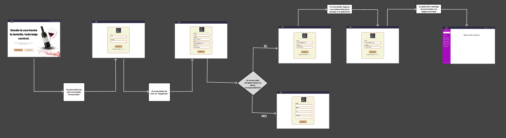

# [Capítulo IV: Product Design.](#capítulo-iv-product-design)
## [4.1. Style Guidelines.](#style-guidelines)
### [4.1.1. General Style Guidelines.](#general-style-guidelines)
Un "style guideline" es un conjunto de reglas y directrices que definen cómo se debe redactar, diseñar o presentar documentos, contenido web, software u otros tipos de trabajos creativos. A continuación, se detallan los parámetros utilizados en la estructura del proyecto:

**Branding:**

_Brand Overview:_

La startup, presentada con el nombre de "VillaSystem" está diseñada para optimizar el flujo de trabajo en la industria vinícola, además a la producción de vino que es un proceso complejo que requiere la coordinación eficiente de múltiples etapas y actores. GrapeFlow busca simplificar esta coordinación mediante una solución tecnológica que permite a los productores de vino gestionar de manera integral y efectiva cada paso de la cadena de producción.

* **Misión:** Transformar la gestión de la producción vinícola mediante una plataforma que integre y optimice todos los aspectos del flujo de trabajo, desde la cosecha hasta la distribución, proporcionando herramientas que mejoren la eficiencia y la calidad.
  <br><br>
* **Visión:** Convertirnos en la plataforma líder en la digitalización y optimización de la industria vinícola, promoviendo prácticas más eficientes, sostenibles y colaborativas a nivel global.

**Logotipo de la startup**


**Logotipo del Servicio**


**Colores:**

En GrapeFlow, hemos seleccionado una paleta basada en la psicología del color. El morado, como tono predominante, representa creatividad y sofisticación, valores que deseamos transmitir. El naranja añade energía y dinamismo, mientras que el azul oscuro evoca confianza y profesionalismo. Como colores secundarios, utilizamos gris y blanco para aportar equilibrio, claridad y una apariencia moderna.


**Tipografía:**

La tipografía establece jerarquía entre los diversos grupos de contenido de la página. Asimismo, cumple un rol importante al momento de guiar al usuario a través de la interfaz.

* Heading 1: Tiene un tamaño de 136 px.
* Heading 2: Tiene un tamaño de 50 px.
* Heading 3: Tiene un tamaño de 40 px.
* Heading 4: Tiene un tamaño de 30 px.

* 
### [4.1.2. Web Style Guidelines.](#web-style-guidelines)
El enfoque de GrapeFlow para su plataforma web se centra en la claridad y la facilidad de uso, facilitando la gestión de las diferentes etapas del proceso de producción vinícola. Las funcionalidades clave y formularios se presentan en secciones bien definidas que ocupan un espacio destacado en la pantalla.

**Tarjetas:**

Se utiliza el componente "mat-card" de Angular Material para mostrar avisos y notificaciones relevantes. Estas tarjetas contienen información crucial para el usuario, como actualizaciones en el flujo de trabajo o recordatorios, acompañadas de texto representativo e imágenes relacionadas con las tareas o eventos importantes.

**Imágenes:**

El diseño web incluye imágenes descriptivas con un propósito específico, como las fotos de perfil de los usuarios o imágenes de los productos en las diferentes etapas de producción. Las imágenes de perfil de los usuarios están siempre visibles en la parte superior izquierda, mientras que otras imágenes clave se utilizan para guiar visualmente al usuario a través del flujo funcional de la plataforma.

**Botones:**

Los botones desempeñan un papel esencial en la experiencia de usuario de GrapeFlow, permitiendo acciones como iniciar una nueva etapa en el proceso de producción, confirmar operaciones o acceder a informes. Estos botones están diseñados para ser intuitivos y accesibles, asegurando que los usuarios puedan interactuar con la plataforma de manera eficiente y sin complicaciones.
## [4.2. Information Architecture.](#information-architecture)
### [4.2.1. Organization Systems.](#organization-systems)
La organización jerárquica en GrapeFlow se utiliza para resaltar la importancia de los elementos clave en pantalla, como los paneles de control de producción, inventarios y reportes. Esta estructura es evidente en las pantallas de inicio de sesión, gestión de procesos y monitoreo de etapas productivas, proporcionando una clara jerarquía de acciones y opciones.

Además, GrapeFlow emplea una organización secuencial para guiar a los usuarios a través de procesos complejos, como la creación de lotes de vino o la gestión de inventarios, asegurando que los usuarios sigan un flujo paso a paso sin perderse en la interfaz.
### [4.2.2. Labeling Systems.](#labeling-systems)
Los encabezados en GrapeFlow se utilizan en pantallas informativas y de configuración, resumiendo claramente el contenido y ayudando al usuario a orientarse dentro de la plataforma. Las etiquetas textuales acompañan a los iconos y botones en el panel de control, facilitando la navegación y el acceso a funciones específicas. Todas las tarjetas y secciones importantes están etiquetadas con títulos claros que explican su contenido y propósito.

En la barra de navegación, se emplean etiquetas textuales para las vistas principales, como el panel de control, gestión de lotes y análisis de calidad, permitiendo a los usuarios acceder fácilmente a las funcionalidades principales de la plataforma.
### [4.2.3. SEO Tags and Meta Tags.](#seo-tags-and-meta-tags)

Las etiquetas meta en GrapeFlow son fundamentales para mejorar la visibilidad y el posicionamiento de la plataforma en los motores de búsqueda. Aunque no son visibles para los usuarios, estas etiquetas ayudan a los navegadores y rastreadores web a entender el contenido y propósito del sitio, lo que es crucial para atraer tráfico relevante. Las etiquetas meta que utilizaremos incluyen:

**Titulo:**

```
<Title>Optimize your wine production with GrapeFlow</Title>
```

**Codificación de carácteres:**

```
<meta charset="utf-8">
```

**Descripción:**

```
<meta name="description" content="GrapeFlow is a comprehensive web application designed to streamline and optimize the wine production process, ensuring quality and efficiency at every stage."/>
```

**Palabras Claves:**

```
<meta name="keywords" content="wine production, vineyard management, quality control, efficiency, process optimization"/>
```

**Autor y Derechos de Autor:**

```
<meta name="author" content="GrapeFlow Team"/>
<meta name="copyright" content="Copyright GrapeFlow team"/>
```

### [4.2.4. Searching Systems.](#searching-systems)
En GrapeFlow, es crucial que los administradores puedan filtrar y gestionar eficientemente la información almacenada, como registros de producción y control de calidad. Los usuarios tendrán herramientas de búsqueda avanzadas para encontrar rápidamente lotes, etapas de producción o insumos específicos. Además, los usuarios podrán rastrear y acceder a informes históricos, optimizando así la gestión de la producción vinícola.

### [4.2.5. Navigation Systems.](#navigation-systems)
Los sistemas de navegación principales en GrapeFlow incluyen menús ubicados en la parte superior e inferior de la pantalla. Estos menús dirigen a los usuarios a secciones clave como el panel de control, la gestión de inventarios y la configuración de procesos. Si los usuarios no utilizan estos menús, pueden navegar por la página mediante un desplazamiento descendente que les permite explorar el contenido de manera fluida. En la aplicación, los usuarios podrán crear y gestionar procesos productivos, asignar recursos y monitorear el progreso a través de una interfaz intuitiva y accesible.

## [4.3. Landing Page UI Design](#landing-page-ui-design)
### [4.3.1. Landing Page Wireframe.](#landing-page-wireframe)

#### Landing page wireframe for desktop:

**En esta primera seccion presentamos el titulo, las opciones de inicio de sesion y el servicios que ofrecemos**


**En esta segunda seccion se muestra el listado de servicios.**


**Se muestra los planes disponibles y los integrantes del equipo**


**En esta seccion se muestra el formulario de contacto**


#### Landing page wireframe for mobil:


**En esta primera seccion presentamos el titulo, las opciones de inicio de sesion y el servicios que ofrecemos**


**En esta segunda seccion se muestra el listado de servicios.**


**Se muestra los planes disponibles**


**En esta seccion se muestra el listado de servicios.**


**En esta seccion se muestra el formulario de contacto**


### [4.3.2. Landing Page Mock-up.](#landing-page-mock-up)

#### Landing Page Mock-up for Desktop

**En esta primera seccion presentamos el titulo, las opciones de inicio de sesion y el servicios que ofrecemos**


**En esta segunda seccion se muestra el listado de servicios.**


**Se muestra los planes disponibles y los integrantes del equipo**


**En esta seccion se muestra el formulario de contacto**


#### Landing Page Mock-up for Mobil


**En esta primera seccion presentamos el titulo, las opciones de inicio de sesion y el servicios que ofrecemos**


**En esta segunda seccion se muestra el listado de servicios.**


**Se muestra los planes disponibles**


**En esta seccion semuestra los integrantes del equipo**


**En esta seccion se muestra el formulario de contacto**


## [4.4. Web Applications UX/UI Design.](#web-applications-uxui-design)

El objetivo de esta sección Web Applications UX/UI Design es detallar el enfoque y las estrategias utilizadas en el diseño de la experiencia y la interfaz de usuario para la aplicación web. Se busca explicar cómo las decisiones tomadas en términos de diseño visual y funcionalidad contribuyen a mejorar la usabilidad, accesibilidad y satisfacción del usuario final. Además, se pretende mostrar cómo estos elementos de diseño ayudan a cumplir los objetivos comerciales del proyecto, asegurando una interacción fluida y eficiente para los usuarios en diferentes dispositivos.

### [4.4.1. Web Applications Wireframes.](#web-applications-wireframes)

En esta sección se muestran los wireframes realizados para nuestro Web Application.

**Login - GrapeFlow**

En este apartado se deberá mostrar opciones de inicio de sesión, las dos formas de inicio de sesión son como consumidor y como productor.

<p align = "center"> </img> </p>

**Login - Consumidor - GrapeFlow**

En el caso del login de consumidor, se deberá mostrar un formulario de inicio de sesión con los campos negocio al que se encuentra asociado y código de usuario.

<p align = "center"> </img> </p>

**Inicio de sesión - Productor GrapeFlow**

En el caso del login de productor de vinos y piscos artesanales, se deberá mostrar un formulario de inicio de sesión con los campos email y contraseña.

<p align = "center"> </img> </p>

**Registrar - Productor  - GrapeFlow**

En esta sección se deberá mostrar un formulario para registrar nuevos productores de vinos y piscos artesanales, con campos para ingresar información personal, de contacto y de la empresa.

<p align = "center"> </img> </p>

**Historial Pedido - GrapeFlow**

Este apartado deberá mostrar el historial de pedidos realizados por los consumidores asociados, con la opción de ver detalles de cada pedido, actualizar el estado del mismo y eliminar pedidos.

<p align = "center"> </img> </p>

**Realizar pedidos - GrapeFlow**

En esta sección se deberá mostrar un formulario para realizar pedidos de productos, con la opción de seleccionar el producto, cantidad y fecha de entrega, forma de transporte, medio de pago, etc.

<p align = "center"> </img> </p>


**Inventario - GrapeFlow**

En este apartado el productor podrá visualizar el inventario de productos disponibles, con la opción de agregar, editar o eliminar productos, así como ver detalles de cada producto.

<p align = "center"> </img> </p>

**Mis Clientes - GrapeFlow**

En esta sección se deberá mostrar una lista de clientes asociados al productor, con la opción de ver detalles de cada cliente, editar la información y eliminar clientes.

<p align = "center"> </img> </p>

**Agregar - Editar - Clientes - GrapeFlow**

En esta sección se deberá mostrar un formulario para agregar o editar clientes, con campos para ingresar información personal, de contacto y de la empresa.

<p align = "center"> </img> </p>

**Detalle Clientes - GrapeFlow**

En este apartado se deberá mostrar los detalles de un cliente específico, con la opción de editar la información, ver historial de pedidos y eliminar el cliente.

<p align = "center"> </img> </p>

**Detalle del Pedido - GrapeFlow**

En esta sección se deberá mostrar los detalles de un pedido específico, con la opción de actualizar el estado del pedido, ver información del cliente y productos solicitados.

<p align = "center"> </img> </p>

### Wireframe Version Mobile

En esta sección se muestran los wireframe realizados para nuestro Web Application version Mobile.


**Login - GrapeFlow**

En este apartado se deberá mostrar opciones de inicio de sesión, las dos formas de inicio de sesión son como consumidor y como productor.

<p align = "center"> </img> </p>

**Login - Consumidor - GrapeFlow**

En el caso del login de consumidor, se deberá mostrar un formulario de inicio de sesión con los campos negocio al que se encuentra asociado y código de usuario.

<p align = "center"> </img> </p>

**Inicio de sesión - Productor GrapeFlow**

En el caso del login de productor de vinos y piscos artesanales, se deberá mostrar un formulario de inicio de sesión con los campos email y contraseña.

<p align = "center"> </img> </p>

**Registrar - Productor  - GrapeFlow**

En esta sección se deberá mostrar un formulario para registrar nuevos productores de vinos y piscos artesanales, con campos para ingresar información personal, de contacto y de la empresa.

<p align = "center"> </img> </p>

**Menu - GrapeFlow**

En esta sección se deberá mostrar una barra a al derecha que emerge para poder ver las opciones que se presenta.

<p align = "center"> </img> </p>

**Historial Pedido - GrapeFlow**

Este apartado deberá mostrar el historial de pedidos realizados por los consumidores asociados, con la opción de ver detalles de cada pedido, actualizar el estado del mismo y eliminar pedidos.

<p align = "center"> </img> </p>

**Realizar pedidos - GrapeFlow**

En esta sección se deberá mostrar un formulario para realizar pedidos de productos, con la opción de seleccionar el producto, cantidad y fecha de entrega, forma de transporte, medio de pago, etc.

<p align = "center"> </img> </p>


**Inventario - GrapeFlow**

En este apartado el productor podrá visualizar el inventario de productos disponibles, con la opción de agregar, editar o eliminar productos, así como ver detalles de cada producto.

<p align = "center"> </img> </p>

**Mis Clientes - GrapeFlow**

En esta sección se deberá mostrar una lista de clientes asociados al productor, con la opción de ver detalles de cada cliente, editar la información y eliminar clientes.

<p align = "center"> </img> </p>

**Agregar - Editar - Clientes - GrapeFlow**

En esta sección se deberá mostrar un formulario para agregar o editar clientes, con campos para ingresar información personal, de contacto y de la empresa.

<p align = "center"> </img> </p>

**Detalle Clientes - GrapeFlow**

En este apartado se deberá mostrar los detalles de un cliente específico, con la opción de editar la información, ver historial de pedidos y eliminar el cliente.

<p align = "center"> </img> </p>

**Detalle del Pedido - GrapeFlow**

En esta sección se deberá mostrar los detalles de un pedido específico, con la opción de actualizar el estado del pedido, ver información del cliente y productos solicitados.

<p align = "center"> </img> </p>


### [4.4.2. Web Applications Wireflow Diagrams.](#web-applications-wireflow-diagrams)
Los Wireflows se utilizan principalmente en el diseño UX o por sus siglas, experiencia de usuario y especialmente para aplicaciones que involucran flujos de trabajo e interacciones complejas.
<p align = "center"> </img> </p>

### [4.4.3. Web Applications Mock-ups.](#web-applications-mock-ups)


En esta sección se muestran los mock-ups realizados para nuestro Web Application.

**Login - GrapeFlow**

En esta sección se muestra el diseño del login de la aplicación web, con opciones para iniciar sesión como consumidor o productor de vinos y piscos artesanales.

<p align = "center"> </img> </p>

**Login - Consumidor - GrapeFlow**

En el caso del login de consumidor, se muestra un formulario de inicio de sesión con los campos negocio al que se encuentra asociado y código de usuario.

<p align = "center"> </img> </p>

**Historial Pedido - GrapeFlow**

En esta sección se muestra el historial de pedidos realizados por los consumidores asociados, con la opción de ver detalles de cada pedido, actualizar el estado del mismo y eliminar pedidos.

<p align = "center"> </img> </p>

**Realizar pedidos - GrapeFlow**

Aquí se muestra el formulario para realizar pedidos de productos, con la opción de seleccionar el producto, cantidad y fecha de entrega, forma de transporte, medio de pago, etc.

<p align = "center"> </img> </p>

**Inicio de sesión- Productor GrapeFlow**

En el caso del login de productor de vinos y piscos artesanales, se muestra un formulario de inicio de sesión con los campos email y contraseña.

<p align = "center"> </img> </p>

**Registrar - Productor  - GrapeFlow**

En esta sección se muestra un formulario para registrar nuevos productores de vinos y piscos artesanales, con campos para ingresar información personal, de contacto y de la empresa.

<p align = "center"> </img> </p>

**Inventario - GrapeFlow**

Aquí el productor puede visualizar el inventario de insumos disponibles para el proceso productivo, con la opción de agregar, editar o eliminar productos, así como ver detalles de cada producto.

<p align = "center"> </img> </p>

**Mis Clientes - GrapeFlow**

En esta sección se muestra una lista de clientes asociados al productor, con la opción de ver detalles de cada cliente, editar la información y eliminar clientes.

<p align = "center"> </img> </p>

**Agregar - Editar - Clientes -  GrapeFlow**

En esta sección se muestra un formulario para agregar o editar clientes, con campos para ingresar información personal, de contacto y de la empresa.

<p align = "center"> </img> </p>

Detalle Clientes - GrapeFlow

En este apartado se muestra los detalles de un cliente específico, con la opción de editar la información, ver historial de pedidos y eliminar el cliente.

<p align = "center"> </img> </p>

Mis Pedidos - GrapeFlow
En esta sección se muestra el historial de pedidos realizados por los consumidores asociados, con la opción de ver detalles de cada pedido, actualizar el estado del mismo y eliminar pedidos.

<p align = "center"> </img> </p>

Detalle del Pedido - GrapeFlow

En esta sección se muestra los detalles de un pedido específico, con la opción de actualizar el estado del pedido, ver información del cliente y productos solicitados.

<p align = "center"> </img> </p>

### Mock-ups Version Mobile
En esta sección se muestran los mock-ups realizados para nuestro Web Application version Mobile.

<p align = "center"> </img> </p>

<p align = "center"> </img> </p>

<p align = "center"> </img> </p>

<p align = "center"> </img> </p>

<p align = "center"> </img> </p>

<p align = "center"> </img> </p>

<p align = "center"> </img> </p>

<p align = "center"> </img> </p>

<p align = "center"> </img> </p>

<p align = "center"> </img> </p>

<p align = "center"> </img> </p>

### [4.4.4. Web Applications User Flow Diagrams.](#web-applications-user-flow-diagrams)


US20: Visualizar Información Detallada del Vino


US19: Buscar Productos


US18: Consultar Historial de Pedidos


US16: Crear Cuenta de Consumidor





US07: Registrar Inventario de Productos


US03: Eliminar Producto


US01: Registrar Datos del Lote


US23: Crear Cuenta de productor


## [4.5. Web Applications Prototyping.](#web-applications-prototyping)

Para el desarrollo del prototipado y diseño en general se utilizo figma, ademas para el prototipado se cuido que la aplicacion cumple una serie de criterios para que la experiencia del usuario pueda ser la mas optima.

Prototipado Web:

Prototipado Mobile:

## [4.6. Domain-Driven Software Architecture.](#domain-driven-software-architecture)
### [4.6.1. Software Architecture Context Diagram.](#software-architecture-context-diagram)

### [4.6.2. Software Architecture Container Diagrams.](#software-architecture-container-diagram)

### [4.6.3. Software Architecture Components Diagrams.](#software-architecture-components-diagram)

## [4.7. Software Object-Oriented Design.](#software-object-oriented-design)

Implementar un diseño basado en objetos será fundamental para nuestro proyecto. Este enfoque nos ayudará a construir un sistema modular y escalable, aprovechando conceptos como encapsulación, herencia y polimorfismo para desarrollar componentes que sean reutilizables y fáciles de mantener.

### [4.7.1. Class Diagrams.](#class-diagram)

### [4.7.2. Class Dictionary.](#class-dictionary)

#### Platform

##### Methods:

landingPageView()
userInterface()
notificationSystem()
analyticsTools()
inventoryIntegration()

### Consumer

##### Methods:

browseProducts()
addReview()
viewRecommendations()

### User

#### Attributes:

String name
String email
String password

#### Methods:

updateProfile()
viewProductDetails()
placeOrder()
trackOrder()
viewOrderHistory()
contactSupport()

### Plan

#### Attributes:

String planName
String duration
Float price

#### Methods:

selectPlan()
viewPlanDetails()

### Consumidor

#### Methods:

manageInventory()
generateSalesReport()
viewSupplierInfo()
reorderStock()

### Order

#### Attributes:

String orderID
Date orderDate
Float totalAmount
String Status

#### Methods:

createOrder()
cancelOrder()
updateOrderStatus()

### Review

#### Attributes:

String reviewText
Int rating

#### Methods:

submitReviwe()
editReview()
deletReview()

### Inventory

#### Attributes:

String productID
Int stockQuantity

#### Methods:

addStock()
removeStock()
checkStockLevel()

### Product

#### Attributes:

String name
String type
Float price
String origin
Float pH
Float temperature

#### Methods:

getProductDetails()
updateStock()

## [4.8. Database Design.](#database-design)
### [4.8.1. Database Diagram.](#database-diagram)


