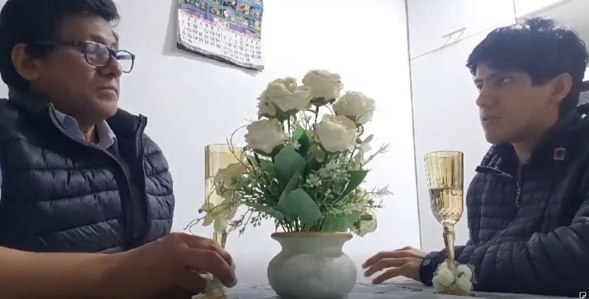

 

    <h1> Universidad Peruana de Ciencias Aplicadas </h1>

  

    Ingeniería de Software - 202402
     
    SV54 - Desarrollo de Aplicaciones Open Source
     
    Hugo Allan Mori Paiva
     
    Informe de Trabajo Final
     
    Startup: VillaSystem
     
    Proyecto: GrapeFlow
  

   <table border="1">
        <tr> 
            <th>Alumno</th>
            <th>Codigo</th>
        </tr>
        <tr> 
            <td>Armas Sánchez, Oscar Javier</td>
            <td>U20211G192</td>
        </tr>
        <tr> 
            <td>Curi Marcelo, Angelo Marcio</td>
            <td>U202022387</td>
        </tr>
        <tr> 
            <td>Huanca Navarro, Gustavo Esau</td>
            <td>U202215285</td>
        </tr>
        <tr> 
            <td>Huincho Lapa, Diego Arturo</td>
            <td>U201923466</td>
        </tr>
        <tr> 
            <td>Salhuana Lopez, Fernando Jose</td>
            <td>U201622757</td>
        </tr>
    </table>

  

    Agosto-2024
  

# Registro de Versiones del Informe
| Versión | Fecha      | Autor           | Descripción de modificación   |
|---------|------------|-----------------|-------------------------------|
| V0.1    | 21/08/2024 | Diego           | Creación del repositorio      |
| V0.2    | 00/00/2024 | Todos           | Capitulo 1 y Capitulo 2       |
| V0.2.1  | 00/00/2024 | Gustavo Y Oscar | Capitulo 3 y Capitulo 4       |
| V0.3    | 00/00/2024 | Diego y Angelo  | Capitulo 4                    |
| V0.4    | 00/00/2024 | Gustavo         | Capitulo 5 y ultimos ajuste   |
| V1.0    | 00/00/2024 | Gustavo         | Revision final y entrega TB1. |

# Project Report Collaboration Insights
URL del repositorio para el reporte del proyecto: https://github.com/VillaSystem/grupo2-project-report

**TB1**
Para elaborar el informe correspondiente a la entrega TB1, se distribuyó la responsabilidad de redactar las distintas secciones de la siguiente manera entre cada miembro del equipo:

| Integrante        | Tareas Asignadas                                                                                                                                                                                                                                                                         |
|-------------------|------------------------------------------------------------------------------------------------------------------------------------------------------------------------------------------------------------------------------------------------------------------------------------------|
| Oscar Armas       | Problemáticas, Lean UX Problem Statements, Ubiquitous Language, Empathy Mapping, As-is Scenario Mapping                                                                                                                                                                                                                                                                                          |
| Angelo Curi       |     Lean UX canvas, Segmentos objetivos, User personas, User Task Matrix, User Journey Mapping, Class Diagrams                                                                                                                                                                                                                                                                                     |
| Gustavo Huanca    | User Stories, Impact Mapping, Product Backlog, competidores, entrevistas, user stories, impact mapping, product backlog,Startup Profile, capitulo 5                                                                                                                                      |
| Diego Huincho     | Landing Page Wireframe.Landing Page Mock-up. Web Applications UX/UI Design. Web Applications Wireframes. Web Applications Wireflow Diagrams. Web Applications Mock-ups. Web Applications User Flow Diagrams. Web Applications Prototyping. Landing Page Sprint 1 |
| Fernando Salhuana | Lean UX Assumptions, Businnes Assumptions, User Assumptions, Feature Assumptions, Lean UX Hypothesis Statements,                                                                                                                                                                         |

La colaboración en la creación del informe se llevó a cabo a través de una serie de contribuciones constantes al repositorio de la organización VillaSystem.

## GitHub Insights
GitHub nos permite exponer una linea de tiempo de nuestras ramas principales y el proceso al que se han sometido. Tdodas las ramas creadas fue en base al diseño de GitFlow para una buena organización y control de versiones.

Los integrantes del equipo son:
* Angelo Curi (AngelC999)
* Gustavo Huanca (petitavo)
* Diego Huincho (DiegoHLZ)
* Óscar Armas (Racso24k)
* Fernando Salhuana (zxyfernando)

**Student Outcomes**

| Criterio específico                                                    | Acciones realizadas                                                                                                                                                                                                                                                                                                                                                                                                                                                                                                                                                                                                                                                                                                                                                                                                                                                                                     | Conclusiones                                                                                                                                                                                                                                                                                    |
|------------------------------------------------------------------------|---------------------------------------------------------------------------------------------------------------------------------------------------------------------------------------------------------------------------------------------------------------------------------------------------------------------------------------------------------------------------------------------------------------------------------------------------------------------------------------------------------------------------------------------------------------------------------------------------------------------------------------------------------------------------------------------------------------------------------------------------------------------------------------------------------------------------------------------------------------------------------------------------------|-------------------------------------------------------------------------------------------------------------------------------------------------------------------------------------------------------------------------------------------------------------------------------------------------|
| Comunica oralmente con efectividad a diferentes rangos de audiencia.   | **Angelo Curi** TB1: He participado activamente en el desarrollo del trabajo, aportando ideas y colaborando en la solución de problemas clave. Gracias a las reuniones constantes, se logró un avance continuo en el proyecto, permitiendo mantener una visión clara de los objetivos y asegurar que todos los miembros del equipo estuvieran alineados. **Gustavo Huanca** TB1: Participé activamente en presentaciones y reuniones, donde expuse claramente los conceptos y objetivos del proyecto. La comunicación dentro del equipo fue clave para facilitar el intercambio de ideas y garantizar una comprensión compartida de los objetivos del proyecto. Este enfoque colaborativo ayudó a mantener el progreso y la alineación en el trabajo. **Diego Huincho** TB1: Durante el proceso de desarrollo de prototipos para nuestros clientes, he reconocido la importancia fundamental de comprender sus necesidades y deseos. Esta comprensión se ha fortalecido a través de conversaciones significativas con mis compañeros, donde intercambiamos ideas y perspectivas para generar soluciones innovadoras y centradas en el cliente. **Oscar Armas** TB1: Participé en discusiones clave dentro del equipo, aportando ideas sobre las problemáticas del proyecto, incluyendo la definición de los Lean UX Problem Statements y el uso del Lenguaje Ubicuo. Estas conversaciones ayudaron a asegurar que todos los integrantes estuvieran alineados y comprendieran los objetivos del proyecto. **Fernando Salhuana** TB1: Cumplí con lo coordinado para realizar la asignación encomendada y no perjudicar a mis compañeros siendo muy enfático y minucioso con las investigaciones para redactar los enunciados. | La comunicación oral ha sido efectiva dentro del equipo, permitiendo un intercambio fluido de ideas y una comprensión compartida de los objetivos del proyecto. Se continuará fomentando esta comunicación para mantener la colaboración y el progreso del trabajo.                             |
| Comunica por escrito con efectividad a diferentes rangos de audiencia. | **Angelo Curi** TB1: Realicé la parte asignada del proyecto de manera satisfactoria, cumpliendo con los plazos y estándares esperados. Participé activamente en las etapas clave, aportando ideas y soluciones que ayudaron a superar desafíos **Gustavo Huanca** TB1: Redacté informes técnicos y documentación del proyecto, asegurando que la información fuera clara y comprensible para distintas audiencias. Mantener una comunicación escrita precisa y profesional con el equipo y otros colaboradores facilitó la coordinación y el avance del proyecto, contribuyendo al éxito de nuestras actividades. **Diego Huincho** TB1: Se realizó la separacion de trabajos de acuerdo a las competencias de cada integrante, se diseño la entrevista para nuestro publico objetivo, tambien la redaccion de los capitulos relacionados a la implementacion, valdacion. Se participo activamente del diseño de producto. **Oscar Armas** TB1: Redacté documentos clave del proyecto relacionados con las problemáticas identificadas, Lean UX Problem Statements y el uso del Lenguaje Ubicuo. Esto permitió estructurar y organizar de manera clara y precisa la información necesaria para guiar el desarrollo del proyecto. **Fernando Salhuana** TB1: Se tuvo una clara organización para cada integrante con anticipación para así aclarecer las partes y mejorar la redacción como mi trabajo en los capítulos I y II.                                                                                                            | La comunicación escrita ha sido crucial para documentar el progreso del proyecto y asegurar la comprensión de los entregables entre los miembros del equipo. Se seguirá manteniendo un enfoque claro y conciso en la comunicación escrita para garantizar la eficacia y la calidad del trabajo. |

- [Contenido](#contenido)

- [**Capítulo I: Introducción.**](#capítulo-i-introducción)
  - [**1.1  Startup Profile.**](#11--startup-profile)
    - [**1.1.1. Descripción del startup.**](#111-descripción-del-startup)
    - [**1.1.2.  Perfiles de los integrantes del equipo.**](#112--perfiles-de-los-integrantes-del-equipo)
  - [**1.2. Solution Profile.**](#12-solution-profile)
    - [**1.2.1. Antecedentes y Problemática.**](#121-antecedentes-y-problemática)
    - [**1.2.2. Lean UX Process.**](#122-lean-ux-process)
      - [**1.2.2.1. Lean UX Problem Statements.**](#1221-lean-ux-problem-statements)
      - [**1.2.2.2. Lean UX Assumptions.**](#1222-lean-ux-assumptions)
      - [**1.2.2.3. Lean UX Hypothesis Statements.**](#1223-lean-ux-hypothesis-statements)
      - [**1.2.2.4. Lean UX Canvas.**](#1224-lean-ux-canvas)
  - [**1.3. Segmentos objetivo.**](#13-segmentos-objetivo)
- [**Capítulo II: Requirements Elicitation \& Analysis**](#capítulo-ii-requirements-elicitation--analysis)
  - [**2.1. Competidores.**](#21-competidores)
    - [**2.1.1. Análisis competitivo.**](#211-análisis-competitivo)
    - [**2.1.2. Estrategias y tácticas frente a competidores.**](#212-estrategias-y-tácticas-frente-a-competidores)
  - [**2.2. Entrevistas.**](#22-entrevistas)
    - [**2.2.1. Diseño de entrevistas.**](#221-diseño-de-entrevistas)
    - [**2.2.2. Registro de entrevistas.**](#222-registro-de-entrevistas)
    - [**2.2.3. Análisis de entrevistas.**](#223-análisis-de-entrevistas)
  - [**2.3. Needfinding.**](#23-needfinding)
    - [**2.3.1. User Personas.**](#231-user-personas)
    - [**2.3.2. User Task Matrix.**](#232-user-task-matrix)
    - [**2.3.3. User Journey Mapping**](#233-user-journey-mapping)
    - [**2.3.4. Empathy Mapping**](#234-empathy-mapping)
    - [**2.3.5. As-is Scenario Mapping**](#235-as-is-scenario-mapping)
  - [**2.4. Ubiquitous Language**](#24-ubiquitous-language)
- [**Capítulo III: Requirements Specification.**](#capítulo-iii-requirements-specification)
  - [**3.1. To-Be Scenario Mapping.**](#31-to-be-scenario-mapping)
  - [**3.2.User Stories.**](#32user-stories)
  - [**3.3. Impact Mapping.**](#33-impact-mapping)
  - [**3.4. Product Backlog.**](#34-product-backlog)
- [**Capítulo IV: Product Design.**](#capítulo-iv-product-design)
  - [**4.1. Style Guidelines.**](#41-style-guidelines)
    - [**4.1.1. General Style Guidelines.**](#411-general-style-guidelines)
    - [**4.1.2. Web Style Guidelines.**](#412-web-style-guidelines)
  - [**4.2. Information Architecture.**](#42-information-architecture)
    - [**4.2.1. Organization Systems.**](#421-organization-systems)
    - [**4.2.2. Labeling Systems.**](#422-labeling-systems)
    - [**4.2.3. SEO Tags and Meta Tags.**](#423-seo-tags-and-meta-tags)
    - [**4.2.4. Searching Systems.**](#424-searching-systems)
    - [**4.2.5. Navigation Systems.**](#425-navigation-systems)
  - [**4.3. Landing Page UI Design**](#43-landing-page-ui-design)
    - [**4.3.1. Landing Page Wireframe.**](#431-landing-page-wireframe)
    - [**4.3.2. Landing Page Mock-up.**](#432-landing-page-mock-up)
  - [**4.4. Web Applications UX/UI Design.**](#44-web-applications-uxui-design)
    - [**4.4.1. Web Applications Wireframes.**](#441-web-applications-wireframes)
    - [**4.4.2. Web Applications Wireflow Diagrams.**](#442-web-applications-wireflow-diagrams)
    - [**4.4.3. Web Applications Mock-ups.**](#443-web-applications-mock-ups)
    - [**4.4.4. Web Applications User Flow Diagrams.**](#444-web-applications-user-flow-diagrams)
  - [**4.5. Web Applications Prototyping.**](#45-web-applications-prototyping)
  - [**4.6. Domain-Driven Software Architecture**](#46-domain-driven-software-architecture)
    - [**4.6.1. Software Architecture Context Diagram.**](#461-software-architecture-context-diagram)
    - [**4.6.2. Software Architecture Container Diagrams.**](#462-software-architecture-container-diagrams)
    - [**4.6.3. Software Architecture Components Diagrams.**](#463-software-architecture-components-diagrams)
  - [**4.7. Software Object-Oriented Design.**](#47-software-object-oriented-design)
    - [**4.7.1. Class Diagrams.**](#471-class-diagrams)
    - [**4.7.2. Class Dictionary.**](#472-class-dictionary)
  - [**4.8. Database Design.**](#48-database-design)
    - [**4.8.1. Database Diagram.**](#481-database-diagram)
- [**Capítulo V: Product Implementation, Validation \& Deployment.**](#capítulo-v-product-implementation-validation--deployment)
  - [**5.1. Software Configuration Management.**](#51-software-configuration-management)
    - [**5.1.1. Software Development Environment Configuration.**](#511-software-development-environment-configuration)
    - [**5.1.2. Source Code Management.**](#512-source-code-management)
    - [**5.1.3. Source Code Style Guide \& Conventions.**](#513-source-code-style-guide--conventions)
    - [**5.1.4. Software Deployment Configuration.**](#514-software-deployment-configuration)
  - [**5.2. Landing Page, Services \& Applications Implementation.**](#52-landing-page-services--applications-implementation)
    - [**5.2.1. Sprint 1.**](#521-sprint-1)
      - [**5.2.1.1. Sprint Planning 1.**](#5211-sprint-planning-1)
      - [**5.2.1.2. Sprint Backlog 1.**](#5212-sprint-backlog-1)
      - [**5.2.1.3. Development Evidence for Sprint Review.**](#5213-development-evidence-for-sprint-review)
      - [**5.2.1.4. Testing Suite Evidence for Sprint Review.**](#5214-testing-suite-evidence-for-sprint-review)
      - [**5.2.1.5. Execution Evidence for Sprint Review.**](#5215-execution-evidence-for-sprint-review)
      - [**5.2.1.6. Services Documentation Evidence for Sprint Review.**](#5216-services-documentation-evidence-for-sprint-review)
      - [**5.2.1.7. Software Deployment Evidence for Sprint Review.**](#5217-software-deployment-evidence-for-sprint-review)
      - [**5.2.1.8. Team Collaboration Insights during Sprint.**](#5218-team-collaboration-insights-during-sprint)
      - [**5.2.2. Sprint 2.**](#522-Sprint-2)
      -

- [**Capítulo VI: Conclusion.**](#capítulo-vi-conclusion)
- [**Capítulo VII: Bibliografia.**](#capítulo-vii-bibliografia)
- [8. **Anexos.**](#anexos)

# [Capítulo I: Introducción.](#capítulo-i-introducción)
## [1.1 Startup Profile](#startup-profile)
En esta sección se presenta la descripción del startup y los perfiles de los miembros del equipo.

### [1.1.1 Descripción de la Startup](#descripción-de-la-startup)
Nuestro startup busca apoyar a los fabricantes de licores al proporcionarles componentes especializados que les permiten recopilar datos esenciales, como el pH, la temperatura y el tiempo de añejamiento de sus productos; además deberán introducir información adicional, como el tipo de uva utilizada en la cosecha y la procedencia de los ingredientes.
Estos datos recopilados se convierten en una valiosa fuente de información que posteriormente será utilizada en una aplicación que desarrollaremos para también ayudar a los fabricantes a vender sus productos y a los consumidores a comprar con información detallada sobre cada licor, lo que les permita tomar decisiones informadas y disfrutar de una experiencia de compra enriquecida.

**Misión**: Proporcionar a los productores y consumidores de vinos y piscos una plataforma integral y eficiente que optimice todos los aspectos del proceso productivo, desde la gestión de inventarios hasta la entrega final, impulsando así la calidad, la eficiencia y el crecimiento sostenible en la industria.

**Visión**: Ser la solución líder y de referencia en la industria vitivinícola y de piscos, reconocida por nuestra innovación, confiabilidad y capacidad para transformar la gestión operativa de nuestros clientes en un proceso más eficiente, rentable y alineado con los más altos estándares de calidad.

**Logo de la Startup**:

**Logo del servicio**:

### [1.1.2 Perfiles de los integrantes del equipo](#perfiles-de-los-integrantes-del-equipo)
| Foto del Participante         | Nombres y Apellidos           | Código de Estudiante | Descripción de Carrera | Resumen de Conocimientos y Habilidades                                                                                                                                                                                                                                                                                                                                                                                                                                                                                             |
|-------------------------------|-------------------------------|----------------------|------------------------|------------------------------------------------------------------------------------------------------------------------------------------------------------------------------------------------------------------------------------------------------------------------------------------------------------------------------------------------------------------------------------------------------------------------------------------------------------------------------------------------------------------------------------|
|       | Huanca Navarro, Gustavo Esau  | U202215285           | Ingenieria de Software | Soy Gustavo Huanca, estudiante de Ingeniería de Software. Me considero puntual, responsable y disfruto resolviendo problemas tecnológicos. Tengo conocimientos en desarrollo de software, varios lenguajes de programación, estructuras de datos y algoritmos. Además. Mi objetivo es contribuir eficazmente al éxito del equipo con mis habilidades                                                                                                                                                                               |
|                         | Armas Sánchez Oscar Javier    | U20211G192           | Ingenieria de Software | Soy estudiante de Ingeniería de Software, con habilidades de comunicación que me permiten transmitir ideas de manera clara y efectiva. Me considero persistente, puntual y comprometido en cada proyecto en el que participo. Además, tengo experiencia en C++, Java, SQL, y conocimientos en programación web, lo que me permite enfrentar y resolver problemas técnicos con eficiencia y creatividad.                                                                                                                                                                                                                                                                                                                                                                                                                |
|      | Salhuana Lopez, Fernando Jose | U201622757           | Ingenieria de Software | Soy estudiante de la carrera de Ingeniería de Software, tengo habilidades blandas para que mis compañeros puedan confiar en mí. Soy participativo, resuelvo problemas complicados con facilidad y creativo en todo aspecto. En formación poseo experiencia en C++, Java, SQL y ciertos conocimientos en programación web.                                                                                                                                                                                                          |                                                                                                                                                                       
|  | Huincho Lapa, Diego Arturo    | U201923466           | Ingenieria de Software | Mi nombre es Diego Arturo Huincho Lapa. Tengo 22 años y estoy estudiando la carrera de Ingeniería de Software. Considero que soy una persona que es capaz de trabajar bajo presión, además de ser detallista y responsable. En cuanto a cualidades para la realización del trabajo considero que soy bueno haciendo los mockups de la app y la parte del frontend, puesto que ya tengo experiencia haciendo trabajos con los frameworks vuejs y react. En mi ratos libres me gusta jugar videojuegos o mirar una serie o pelicula. |
|        | Curi Marcelo, Angelo Marcio   | U202022387           | Ingenieria de Software | Soy estudiante de la carrera de Ingeniería de Software en la Universidad Peruana de Ciencias Aplicadas (UPC). Me considero una persona responsable y comprometida con mis tareas. Siempre me esfuerzo por cumplir con los plazos y entregar trabajos de calidad. Además, me considero una persona creativa, tengo conocimientos tanto en programación y edición de videos. Considero que soy una persona que puede aportar de manera significativa a este equipo.                                                                  |

## [1.2 Solution Profile](#solution-profile)
### [1.2.1 Antecedentes y Problemática](#antecedentes-y-problemática)

### Antecedentes

El estado actual de **la gestión del proceso productivo en la industria vitivinícola y de pisco** se ha centrado principalmente en **soluciones fragmentadas y sistemas manuales que no ofrecen una integración completa entre la vinificación, el control de inventarios y la administración de pedidos**.

Lo que los productos/servicios existentes no logran abordar es **una plataforma integral que centralice todas estas funciones en un único sistema, permitiendo una coordinación efectiva y una visibilidad en tiempo real de todos los aspectos del proceso productivo y de distribución**.

Nuestro producto/servicio abordará esta brecha mediante **el desarrollo e implementación de GRAPEFLOW, un software integral que unifica la gestión del proceso productivo, el control de inventarios y el seguimiento de pedidos en una sola plataforma. La solución estará diseñada para adaptarse a diferentes tamaños de operación y necesidades específicas de los usuarios, ofreciendo herramientas avanzadas y una interfaz intuitiva**.

Nuestro enfoque inicial será **el mercado de productores y consumidores de vinos y pisco en América Latina, donde la necesidad de una solución centralizada y eficiente es particularmente evidente**.

Sabremos que tenemos éxito cuando veamos **una mejora significativa en la eficiencia operativa de nuestros clientes, una reducción en el desperdicio de recursos, y un aumento en la satisfacción del cliente, evidenciado por la adopción generalizada de la plataforma y el cumplimiento de nuestras metas de suscripción y retención de clientes en el primer año de lanzamiento**.

### Problemáticas

#### Técnica de las 5 ‘W’s y 2 ‘H’s

#### What?

- **¿Cuál es el problema?**

El problema central radica en la gestión fragmentada e ineficiente de los procesos productivos y logísticos en la industria vitivinícola y de pisco. Los métodos tradicionales, que a menudo son manuales y poco integrados, generan múltiples desafíos, como inconsistencias en la calidad del producto, desajustes en los inventarios, dificultades en la administración de la cartera de clientes, y falta de visibilidad en tiempo real sobre las operaciones. Estos problemas no solo afectan la productividad y la eficiencia operativa, sino que también impactan negativamente en la capacidad de respuesta ante la demanda del mercado, limitando el potencial de crecimiento y la competitividad de los productores y consumidores.

- **¿Cuál es la relación con la persona en cuestión?**

Este problema afecta directamente a los productores, quienes necesitan optimizar sus procesos productivos para garantizar la calidad y consistencia de sus vinos y piscos, así como a los consumidores, que dependen de una logística eficiente para gestionar inventarios, cumplir con los pedidos a tiempo, y mantener una comunicación fluida con los productores. En última instancia, los clientes finales también se ven perjudicados, ya que la falta de eficiencia en la cadena de producción y distribución puede llevar a una menor disponibilidad de productos de calidad en el mercado.

#### When?

- **¿Cuándo sucede el problema?**

El problema se manifiesta en diferentes etapas del ciclo de producción y distribución. Desde la fermentación y embotellado en la fase de producción, hasta la gestión de inventarios y la entrega final en la fase de distribución, cada etapa es susceptible a errores y retrasos si no se cuenta con un sistema eficiente y centralizado. Estos problemas pueden surgir en cualquier momento, especialmente en periodos de alta demanda o durante la transición entre distintas etapas del proceso.

- **¿Cuándo utiliza el cliente el producto?**

Los clientes, tanto productores como consumidores, utilizan el producto en distintos momentos críticos de sus operaciones diarias. Durante la producción, el software se emplea para gestionar y monitorear el proceso de vinificación, control de calidad y almacenamiento. En la fase de distribución, se utiliza para coordinar la logística, gestionar inventarios, y realizar el seguimiento de pedidos en tiempo real.

#### Where?

- **¿Dónde está el cliente cuando usa el producto?**

Los clientes utilizan el producto en diversos entornos relacionados con la producción y distribución de vino y pisco. Los productores lo emplean en sus bodegas, viñedos y almacenes para gestionar y monitorear cada fase del proceso productivo. Los consumidores, por su parte, lo utilizan en sus centros de distribución y oficinas administrativas para coordinar la logística, gestionar inventarios y mantener la comunicación con los productores.

- **¿A dónde se dirige?**

El cliente se dirige hacia la optimización de sus operaciones, buscando mejorar la eficiencia, reducir el desperdicio y maximizar la rentabilidad. Con GRAPEFLOW, los productores y consumidores buscan centralizar la gestión de sus procesos, logrando una mayor visibilidad y control sobre cada aspecto de su negocio.

- **¿Dónde surge el problema?**

El problema surge en varios puntos clave de la cadena de valor. En la fase de producción, los desafíos incluyen la coordinación entre los diferentes procesos (fermentación, embotellado, almacenamiento) y el control de calidad. En la distribución, los problemas se centran en la gestión de inventarios, la logística de entregas, y la comunicación con los clientes y productores. La falta de integración entre estos procesos exacerba los problemas, creando ineficiencias y errores que impactan en toda la operación.

#### Who?

- **¿Quiénes están involucrados?**

Los principales involucrados son los productores de vino y pisco, que necesitan gestionar sus procesos productivos de manera eficiente; los consumidores, que se encargan de llevar los productos al mercado; y los clientes finales, quienes dependen de la calidad y disponibilidad del producto. También se incluyen otros actores como proveedores de insumos, transportistas y minoristas, quienes interactúan con los productores y consumidores y cuyas operaciones también pueden verse afectadas por la ineficiencia en la gestión de la cadena de suministro.

#### Why?

- **¿Cuál es la causa del problema?**

La causa principal del problema es la falta de un sistema centralizado y eficiente para coordinar y gestionar los diversos aspectos del proceso productivo y de distribución. La dependencia de sistemas manuales o soluciones tecnológicas desintegradas provoca errores humanos, falta de coordinación entre diferentes etapas del proceso, y una baja visibilidad en tiempo real de la operación. Además, la comunicación ineficiente entre productores y consumidores contribuye a la desorganización en la administración de la cartera de clientes y a problemas en la satisfacción de la demanda.

#### How?

- **¿En qué condiciones los clientes usan nuestros productos?**

Los clientes usan el producto en condiciones donde se requiere un alto grado de coordinación y eficiencia. En la producción, el producto se utiliza en entornos que demandan un control riguroso sobre la calidad y el tiempo, como bodegas y viñedos. En la distribución, se utiliza en contextos donde la precisión en la gestión de inventarios y la rapidez en el cumplimiento de pedidos son críticos, como almacenes y centros de distribución.

- **¿Cómo prefieren los clientes acceder a nuestro producto?**

Los clientes prefieren acceder a un sistema intuitivo, accesible desde múltiples dispositivos, que ofrezca una solución centralizada para todas sus necesidades operativas. Valoran la capacidad de integrar el software con sus sistemas existentes, la facilidad de uso, y la disponibilidad de soporte técnico para asegurar una transición sin problemas y un uso eficiente del producto.

- **¿Qué llevó al cliente a llegar a esta situación?**

La situación actual de los clientes se debe a la falta de soluciones tecnológicas que respondan a la complejidad y las necesidades específicas de la industria del vino y pisco. La evolución de la industria ha llevado a un aumento en la demanda de productos de calidad, lo que a su vez ha puesto presión sobre los productores y consumidores para mejorar sus operaciones. Sin embargo, muchos de ellos aún dependen de métodos tradicionales que no están equipados para manejar la escala y la complejidad del mercado actual, lo que crea una necesidad urgente de modernización.

#### How much?

- **¿Cuántos problemas se dan en un día? ¿En una semana? ¿En un mes? ¿Cuánto dinero están implicando?**

La frecuencia y el impacto de los problemas pueden variar según la escala de las operaciones y la época del año. Sin embargo, se estima que los problemas relacionados con la gestión ineficiente pueden ocurrir a diario, generando pérdidas significativas en calidad del producto, exceso o escasez de inventario, y oportunidades de venta perdidas. En términos financieros, estos problemas pueden resultar en pérdidas de miles de dólares mensuales para los productores y consumidores, afectando gravemente su rentabilidad y capacidad para competir en el mercado.
### [1.2.2 Lean UX Process](#lean-ux-process)

En esta sección, iniciamos el proceso de Lean UX, que nos permitirá definir y refinar la visión del modelo de negocio que será soportado por nuestro producto de software. La metodología Lean UX nos ayuda a enfocar el diseño de nuestra solución en torno a la resolución de problemas y la creación de valor real para nuestros usuarios.

#### [1.2.2.1 Lean UX Problem Statements](#lean-ux-problem-statements)

A continuación, utilizamos la plantilla de Business Opportunity Statements (Gothelf, 2022) para enfocar nuestro equipo en la creación de una solución que responda eficazmente a las necesidades de los clientes, sin limitaciones que puedan afectar la creatividad y agilidad del desarrollo.

- La plantilla de Business Opportunity Statement:

El estado actual de **[domain]** se ha centrado principalmente en **[segments, pain points, etc.]**

Lo que los productos/servicios existentes no logran abordar es **[this gap]**.

Nuestro producto/servicio abordará esta brecha mediante **[vision / strategy]**.

Nuestro enfoque inicial será **[this segment]**.

Sabremos que tenemos éxito cuando veamos **[these behaviors in our target audience]**.

- ReStyle Lean UX Problem Statements:

El estado actual de **la gestión del proceso productivo en la industria vitivinícola y de pisco** se ha centrado principalmente en **soluciones fragmentadas y sistemas manuales que no ofrecen una integración completa entre la vinificación, el control de inventarios y la administración de pedidos**.

Lo que los productos/servicios existentes no logran abordar es **una plataforma integral que centralice todas estas funciones en un único sistema, permitiendo una coordinación efectiva y una visibilidad en tiempo real de todos los aspectos del proceso productivo y de distribución**.

Nuestro producto/servicio abordará esta brecha mediante **el desarrollo e implementación de GRAPEFLOW, un software integral que unifica la gestión del proceso productivo, el control de inventarios y el seguimiento de pedidos en una sola plataforma. La solución estará diseñada para adaptarse a diferentes tamaños de operación y necesidades específicas de los usuarios, ofreciendo herramientas avanzadas y una interfaz intuitiva**.

Nuestro enfoque inicial será **el mercado de productores y consumidores de vinos y pisco en América Latina, donde la necesidad de una solución centralizada y eficiente es particularmente evidente**.

Sabremos que tenemos éxito cuando veamos **una mejora significativa en la eficiencia operativa de nuestros clientes, una reducción en el desperdicio de recursos, y un aumento en la satisfacción del cliente, evidenciado por la adopción generalizada de la plataforma y el cumplimiento de nuestras metas de suscripción y retención de clientes en el primer año de lanzamiento**.

#### [1.2.2.2 Lean UX Assumptions](#lean-ux-assumptions)

**Businnes Assumptions**

**User Assumptions**

_¿Quién es el usuario?_

* Fabricantes de licores, especialmente productores de vinos y piscos, que buscan mejorar la calidad y eficiencia de sus procesos productivos.

* Consumidores interesados en conocer detalles específicos sobre los licores que compran para hacer elecciones más informadas.

_¿Qué problemas enfrenta nuestro producto? ¿Cómo los resolveremos?_

* _**Problema para Fabricantes:**_ Falta de herramientas para la recopilación y análisis de datos en tiempo real durante la producción.
* _**Solución:**_ Proporcionar componentes especializados que recopilen datos como pH, temperatura, y tiempo de añejamiento, así como permitir la introducción de información adicional.

* _**Problema para Consumidores:**_ Falta de acceso a información detallada sobre los licores, lo que dificulta tomar decisiones de compra informadas.
* _**Solución:**_ Crear una aplicación que muestre información detallada y verificada sobre cada licor, mejorando la experiencia de compra.

_¿Qué características son importantes?_

* Componentes que recopilen y analicen datos en tiempo real sobre el proceso de producción de licores.
* Una plataforma que integre los datos de producción con la gestión de inventarios y distribución.
* Una aplicación móvil que proporcione a los consumidores información detallada y fácilmente accesible sobre los licores.

_¿Dónde encaja nuestro producto en su trabajo o vida?_

* _**Fabricantes:**_ En el proceso productivo diario, ayudando a optimizar y controlar la calidad de los licores en tiempo real.
* _**Consumidores:**_ En el proceso de compra, proporcionando una experiencia más informada y satisfactoria.

_¿Cuándo y cómo se usa nuestro producto?_

* _**Fabricantes:**_ Durante todo el ciclo de producción, desde la cosecha hasta el añejamiento y embotellado, utilizando los componentes para monitorear y ajustar variables críticas.
* _**Consumidores:**_ En el punto de compra, utilizando la aplicación móvil para obtener detalles sobre el origen, características y calidad de los licores.

_¿Cómo debe ser y comportarse nuestro producto?_

* Debe ser intuitivo y fácil de integrar en los procesos existentes de producción y distribución.
* Debe proporcionar datos precisos y en tiempo real, con una interfaz de usuario clara y accesible.
* La aplicación móvil debe ser atractiva, fácil de usar y proporcionar información detallada de manera rápida y sencilla.

**Feature Assumptions:**

_**Creemos**_ que los fabricantes valorarán la capacidad de monitorear y ajustar variables críticas del proceso productivo en tiempo real a través de nuestros componentes especializados.
  
_**Creemos**_ que la integración de datos de producción con la gestión de inventarios y distribución ayudará a mejorar la eficiencia operativa y a reducir errores.
  
_**Creemos**_ que los consumidores apreciarán tener acceso a información detallada sobre los licores que compran, lo que mejorará su experiencia de compra y aumentará la lealtad a la marca.

#### [1.2.2.3 Lean UX Hypothesis Statements](#lean-ux-hypothesis-statements)

- **Hypothesis Statement 01:**
    
  _**Creemos**_ que los fabricantes de licores mejorarán la calidad y eficiencia de su producción si tienen acceso a componentes especializados que les permitan monitorear variables críticas como pH, temperatura, y tiempo de añejamiento en tiempo real.
  _**Sabremos**_ que esta hipótesis es cierta _**cuando**_ observemos una reducción en los errores de producción, un incremento en la calidad del producto final, y un aumento en la satisfacción de los fabricantes con nuestra plataforma.
    
- **Hypothesis Statement 02:**
    
  _**Creemos**_ que los consumidores estarán más dispuestos a comprar licores si tienen acceso a una aplicación que les proporcione información detallada y confiable sobre cada producto, como el tipo de uva, el origen de los ingredientes, y las condiciones de añejamiento.
  _**Sabremos**_ que esta hipótesis es _**cierta**_ cuando veamos un aumento en el uso de la aplicación, un incremento en las ventas de los productos destacados, y una mayor satisfacción de los usuarios en sus decisiones de compra.
    

#### [1.2.2.4 Lean UX Canvas](#lean-ux-canvas)

URL del LeanUXCanvas: https://app.mural.co/t/teacsykawsai8308/m/teacsykawsai8308/1724358505056/ad90964d2d1b9220ae312f1ad046c17350430f32?sender=uc4019db9bc166bf541b07012

## [1.3. Segmentos objetivo](#segmentos-objetivo)
### **1. Consumidores de Licores:**

Este segmento incluye a personas interesadas en explorar y comprar vinos, piscos y otros licores, tanto para ocasiones especiales como para su disfrute personal. Estos consumidores están cada vez más atentos a la calidad y las características de los productos que adquieren.

- **Información Detallada del Producto:** Los consumidores necesitan acceder a información completa y precisa sobre cada licor, como el pH, la temperatura, el tiempo de añejamiento, el tipo de uva utilizada y la procedencia de los ingredientes. Esta información les permite tomar decisiones más informadas al momento de la compra.

- **Experiencia de Compra Enriquecida:** Una experiencia de compra que sea fácil de navegar y rica en contenido es esencial. Los consumidores buscan plataformas que no solo les ofrezcan productos, sino que también les proporcionen conocimientos y detalles que mejoren su apreciación de los licores que eligen.

- **Planes de Servicio:** Aunque los consumidores no requieren planes de servicio específicos, la plataforma debe ser intuitiva, atractiva y ofrecer un proceso de compra fluido para mantener su interés y fomentar la lealtad.

### **2. Consumidorres de Licores:**

Este segmento se enfoca en las empresas que gestionan la distribución de licores, asegurando que los productos lleguen a los puntos de venta o directamente a los consumidores finales. Los consumidores desempeñan un rol fundamental en la cadena de suministro y requieren herramientas que optimicen sus operaciones.

- **Seguimiento de Pedidos:** Es crucial que los consumidores cuenten con un sistema eficiente que les permita gestionar y monitorizar los pedidos en tiempo real. Esto garantiza una entrega puntual y sin errores, mejorando la satisfacción del cliente y reduciendo los costos operativos.

- **Administración de la Cartera de Clientes:** La gestión efectiva de las relaciones con los clientes es esencial para maximizar las ventas y fidelizar a los compradores. Los consumidores necesitan soluciones que les permitan segmentar, analizar y mejorar las interacciones con sus clientes, fortaleciendo así sus vínculos comerciales.

- **Planes de Servicio:** Los consumidores pueden beneficiarse de un plan avanzado que ofrezca herramientas completas para la gestión de pedidos, el seguimiento en tiempo real y la administración de la cartera de clientes. Estas funcionalidades son clave para mejorar la eficiencia y competitividad en el mercado.

# [**Capítulo II: Requirements Elicitation \& Analysis**](#capítulo-ii-requirements-elicitation--analysis)
# [2.1 Competidores](#competidores)
### [2.1.1 Análisis competitivo](#análisis-competitivo)

<table border="1" cellpadding="10" cellspacing="0" style="margin-left: auto; margin-right: auto;">
  <tr>
    <th colspan="6">Competitive Analysis Landscape</th>
  </tr>
  <tr>
    <td colspan="2" rowspan="2">¿Por qué llevar a cabo este análisis?</td>
    <td colspan="4">Escriba en el recuadro la pregunta que busca responder o el objetivo de este análisis.</td>
  </tr>
  <tr>
    <td colspan="4">Texto</td>
  </tr>
  <tr>
   <td colspan="2">(En la cabecera colocar por cada competidor nombre y logo)</td>
    <td>GrapeFlow   </td>
    <td>ViWine  </td>
    <td>CellWine </td>
    <td>Cellar Tracker  </td> 
  </tr>
  <tr>
    <td rowspan="2">Perfil</td>
    <td>Overview</td>
    <td>GrapeFlow busca apoyar a los fabricantes de licores al proporcionarles componentes especializados que les permiten recopilar datos esenciales, como el pH, la temperatura y el tiempo de añejamiento de sus productos.</td>
    <td>Viwine ofrece a los consumidores información detallada sobre vinos, permitiéndoles conocer todos los datos relevantes antes de realizar una compra..</td>
    <td>Celwine proporciona a los fabricantes de vino herramientas para una gestión eficiente de sus bodegas, mejorando la organización y el control en la producción.</td>
    <td>CellarTracker permite a los consumidores consultar reseñas y opiniones de expertos sobre vinos, ayudándoles a tomar decisiones informadas basadas en comentarios especializados.</td>
  </tr>
  <tr>
    <td>Ventaja competitiva ¿Qué valor ofrece a los clientes?</td>
    <td>La ventaja competitiva de GrapeFlow es que los clientes tienen acceso la visualización de la elaboración en tiempo real y sus características del producto. .</td>
    <td>Ayuda a tener una información completa de los vinos .</td>
    <td>Ayuda a los 
fabricantes a 
tener una mejor 
gestión de sus 
bodegas.</td>
    <td>Brinda a los 
usuarios reseñas 
hechas por 
personas 
conocedoras de 
vino.</td>
  </tr>
  <tr>
    <td rowspan="2">Perfil de Marketing</td>
    <td>Mercado objetivo</td>
    <td>Personas 
aficionadas o 
amantes del vino..</td>
    <td>Consumidores que 
desean saber todos 
los datos de un 
vino.</td>
    <td>Fabricantes de 
vinos.</td>
    <td>Consumidores que 
deseen saber que 
comentarios 
tienen los vinos 
que van a 
consumir.</td>
  </tr>
  <tr>
    <td>Estrategias de marketing</td>
    <td>Publicidad por 
medios digitales.</td>
    <td>Publicidad 
genérica .</td>
    <td>Publicidad 
genérica .</td>
    <td>Publicidad 
genérica .</td>
  </tr>
  <tr>
    <td rowspan="3">Perfil de Producto</td>
    <td>Productos & Servicios</td>
    <td>Ofrece 
información sobre 
la composición 
del vino a los 
fabricantes y a los 
clientes les 
muestra 
información en 
tiempo real sobre 
la elaboración del
vino.</td>
    <td>Ofrece información 
del vino buscado 
como el país de 
origen, categoría 
(tinto, blanco, etc.), 
tipo de vino (seco, 
dulce), su sabor, su 
color, su aroma 
etc..</td>
    <td>Ofrece 
herramientas de 
gestión de 
bodegas y una 
sociedad del 
vino con 
calificación 
profesional y 
conocimiento 
del vino.</td>
    <td>Ofrece una 
colección de 
reseñas de vinos, 
notas de cata.</td>
  </tr>
  <tr>
    <td>Precios & Costos</td>
    <td>Gratuita para los 
consumidores y 
para los 
fabricadores un 
pago para la 
instalación del 
Arduino, 
posteriormente 
una comisión por 
cada vino 
vendido. </td>
    <td>Gratuito mediante 
la plataforma de 
descargas de cada 
smartphone .</td>
    <td>Gratuito 
mediante la 
plataforma de 
descargas de 
cada 
smartphone.</td>
    <td>Gratuito mediante 
la plataforma de 
descargas de cada 
smartphone.</td>
  </tr>
  <tr>
    <td>Canales de distribución (Web y/o Móvil)</td>
    <td>Mediante el 
programa y/o 
Arduino para el 
usuario de 
producción, y 
mediante la 
aplicación al 
usuario final</td>
    <td>Gratuito mediante 
la plataforma de 
descargas de cada 
smartphone.</td>
    <td>Gratuito 
mediante la 
plataforma de 
descargas de 
cada 
smartphone.</td>
    <td>Gratuito mediante 
la plataforma de 
descargas de cada 
smartphone .</td>
  </tr>
  <tr>
    <td rowspan="5">Analisis SWOT</td>
    <td colspan="5">Realice esto para su startup y sus competidores. Sus fortalezas deberían apoyar sus
    oportunidades y contribuir a lo que ustedes definen como su posible ventaja
    competitiva. </td>
  </tr>
 <tr>
    <td>Fortalezas</td>
    <td>Ofrecer 
información 
fidedigna y 
precisa.</td>
    <td>Por ser una APK de 
plataforma abierta.</td>
    <td>Por ser una APK de 
plataforma abierta.</td>
    <td>Por ser una APK de 
plataforma abierta.</td>
  </tr>
  <tr>
    <td>Debilidades</td>
    <td>Falta de 
inversión.</td>
    <td>No precisan los 
niveles de 
información dados.</td>
    <td>No precisa los 
tiempos de 
producción.</td>
    <td>No brinda 
información sobre 
la procedencia de 
los vinos .</td>
  </tr>
  <tr>
    <td>Oportunidades</td>
    <td>No tenemos un 
mercado 
competitivo.</td>
    <td>Presenta un 
pequeño campo 
competitivo.</td>
    <td>Está sometido a 
cambios .</td>
    <td>No presenta 
mercado 
competitivo.</td>
  </tr>
  <tr>
    <td>Amenazas</td>
    <td>Falta de 
colaboración con 
los productores.</td>
    <td>Crecer a gran 
escala, 
implementación de 
nuevas 
plataformas .</td>
    <td>Manejo de 
nuevas 
tecnologías en 
este campo .</td>
    <td>Mayor publicidad 
a campos de 
observación del 
publico.</td>
  </tr>
</table>

### [2.1.2 Estrategias y tácticas frente a competidores](#estrategias-y-tácticas-frente-a-competidores)

* **Fortalezas y Oportunidades**:

La capacidad de ofrecer información en tiempo real sobre la producción y las características del licor es un valor clave. Esta fortaleza se debe aprovechar para diferenciarse de competidores como ViWine y CellarTracker, que no brindan esta funcionalidad específica. Se puede enfatizar esta ventaja en la publicidad y en las demostraciones de producto. Oportunidades: El mercado presenta una baja competencia, lo que permite a GrapeFlow posicionarse rápidamente. Esta oportunidad puede ser maximizada mediante una estrategia de crecimiento rápido, captando a los principales productores y consumidores de vinos y piscos antes que los competidores reaccionen.

* **Aprovechamiento de Debilidades y Amenazas de los Competidores**:

ViWine y CellarTracker no proporcionan información sobre el proceso de producción ni sobre la procedencia de los ingredientes. GrapeFlow puede aprovechar esta debilidad promoviendo su capacidad de recopilar y mostrar estos datos, atrayendo a un público más informado y exigente. Amenazas del Entorno Competitivo: La mayor amenaza identificada es la falta de colaboración con los productores. Para mitigar esto, GrapeFlow debe implementar una estrategia de alianzas estratégicas con los principales productores, asegurando que estos vean un valor claro en la integración de sus procesos con GrapeFlow.
* **Estrategias de Marketing**:

Utilizar una estrategia de publicidad digital dirigida específicamente a productores y consumidores, destacando las características únicas de GrapeFlow en comparación con otras aplicaciones en el mercado. La estrategia debe incluir testimonios de usuarios satisfechos y estudios de caso para construir credibilidad. Mejorar continuamente la plataforma basada en retroalimentación directa de los usuarios, asegurando que GrapeFlow no solo iguale, sino que supere las expectativas del mercado. También, ofrecer una interfaz intuitiva que permita a los usuarios interactuar fácilmente con la información compleja que recopila la plataforma.
* **Costos y Precios**:
  Asegurar que los precios para la instalación del sistema y las comisiones sean competitivos y accesibles, incentivando a más productores a adoptar la plataforma. A la vez, la estrategia de monetización debe incluir planes escalables para que los productores puedan crecer junto con GrapeFlow. Para los consumidores, ofrecer una estructura de precios clara para el acceso a características premium, con opciones que se adapten a diferentes necesidades y presupuestos, asegurando una experiencia de usuario de alto valor a un costo razonable.

## [2.2 Entrevistas](#entrevistas)
### [2.2.1 Diseño de entrevistas](#diseño-de-entrevistas)

#### Segmento Objetivo: Productores de Licores
**Preguntas Personales:**

- ¿Cuál es su edad?
- ¿Dónde reside actualmente ?
- ¿Cuál es tu estado civil?
- ¿Cuál es su rol en la empresa ?
- ¿Cuál es su experiencia en la industria de licores?

**Preguntas Complementarias:**

- ¿Cuál es el principal desafío que enfrenta en su rol actual?
- ¿Qué tipo de tecnología o software utiliza en su trabajo diario?
- ¿Cómo maneja la gestión de información y datos de productos?
- ¿Qué tipo de información le gustaría obtener de un sistema que registre y analice datos de productos?
- ¿Qué dispositivos utilizas principalmente para realizar tu trabajo (ordenador, tablet, móvil)?
- ¿Qué navegador web usas?

**Preguntas Específicas:**

- ¿Cómo asegura la calidad y trazabilidad de sus productos?
- ¿Qué características considera más importantes para un sistema de registro de datos de productos?
- ¿Cómo afecta la visibilidad y la información detallada en la toma de decisiones sobre productos?
- ¿Qué mejoras le gustaría ver en la manera en que se recopilan y presentan los datos de sus productos?

#### Segmento Objetivo Consumidores de Licores:
**Preguntas Personales:**

- ¿Cuál es su edad?
- ¿Dónde reside actualmente ?
- ¿Cuál es tu nivel educativo y experiencia profesional?

**Preguntas Complementarias:**

- ¿Qué factores considera al elegir una marca de licor?
- ¿Cuál es su forma preferida de adquirir licores (tienda física, en línea, etc.)?
- ¿Qué redes sociales o canales digitales utiliza más frecuentemente?
- ¿Qué tipo de información le resulta más útil al momento de elegir un producto?
  **Preguntas Específicas:**

- ¿Cómo prefiere recibir información sobre nuevos productos y ofertas?
- ¿Qué características valora en las etiquetas de los productos?
- ¿Qué tipo de detalles le gustaría ver en la información de un producto antes de comprarlo?
- ¿Cómo influye la transparencia de la información en su decisión de compra?

### [2.2.2 Registro de entrevistas](#registro-de-entrevistas)

##### Segmento 1: Productores
*Inicio de las entrevistas :* 00:00

*Duración de las entrevistas :* 10:46

[Link de las entrevistas: https://upcedupe-my.sharepoint.com/:v:/g/personal/u202215285_upc_edu_pe/EZgaRdxilTFItaOvcLJ9H04BQfd9yFvxIKFR280blGHy4Q?nav=eyJyZWZlcnJhbEluZm8iOnsicmVmZXJyYWxBcHAiOiJTdHJlYW1XZWJBcHAiLCJyZWZlcnJhbFZpZXciOiJTaGFyZURpYWxvZy1MaW5rIiwicmVmZXJyYWxBcHBQbGF0Zm9ybSI6IldlYiIsInJlZmVycmFsTW9kZSI6InZpZXcifX0%3D&e=CuTCG8](https://upcedupe-my.sharepoint.com/:v:/g/personal/u202215285_upc_edu_pe/EZgaRdxilTFItaOvcLJ9H04BQfd9yFvxIKFR280blGHy4Q?nav=eyJyZWZlcnJhbEluZm8iOnsicmVmZXJyYWxBcHAiOiJTdHJlYW1XZWJBcHAiLCJyZWZlcnJhbFZpZXciOiJTaGFyZURpYWxvZy1MaW5rIiwicmVmZXJyYWxBcHBQbGF0Zm9ybSI6IldlYiIsInJlZmVycmFsTW9kZSI6InZpZXcifX0%3D&e=CuTCG8)

### *Entrevista 01*

*Nombres:* Esau Juan

*Apellidos:* Huanca Cabrera

*Edad:* 45

*Distrito:* Arequipa

*Segmento objetivo:* Productores

*Minuto de inicio de la entrevista:* 2:48

*Minuto de fin de la entrevista:* 6:47

*Duración de la entrevista:* 03:59

[Link de la entrevista: https://upcedupe-my.sharepoint.com/:v:/g/personal/u202215285_upc_edu_pe/EZgaRdxilTFItaOvcLJ9H04BQfd9yFvxIKFR280blGHy4Q?nav=eyJyZWZlcnJhbEluZm8iOnsicmVmZXJyYWxBcHAiOiJTdHJlYW1XZWJBcHAiLCJyZWZlcnJhbFZpZXciOiJTaGFyZURpYWxvZy1MaW5rIiwicmVmZXJyYWxBcHBQbGF0Zm9ybSI6IldlYiIsInJlZmVycmFsTW9kZSI6InZpZXcifX0%3D&e=CuTCG8](https://upcedupe-my.sharepoint.com/:v:/g/personal/u202215285_upc_edu_pe/EZgaRdxilTFItaOvcLJ9H04BQfd9yFvxIKFR280blGHy4Q?nav=eyJyZWZlcnJhbEluZm8iOnsicmVmZXJyYWxBcHAiOiJTdHJlYW1XZWJBcHAiLCJyZWZlcnJhbFZpZXciOiJTaGFyZURpYWxvZy1MaW5rIiwicmVmZXJyYWxBcHBQbGF0Zm9ybSI6IldlYiIsInJlZmVycmFsTW9kZSI6InZpZXcifX0%3D&e=CuTCG8)

#### Resumen de la entrevista:
Esau Huanca, dueño de una destilería artesanal en Arequipa, compartió que su principal desafío es mantener la calidad constante de sus productos mientras crece la demanda. Con más de 20 años en la industria, produce principalmente pisco y otros licores artesanales. Actualmente utiliza hojas de cálculo y un software básico de contabilidad para gestionar sus registros, pero reconoce que este proceso es lento y propenso a errores. Le gustaría implementar un sistema que automatice la recopilación de datos desde las etapas de producción y que le permita obtener informes detallados sobre la trazabilidad, la calidad de los lotes y las tendencias de ventas. Juan Carlos considera crucial que el sistema sea fácil de usar y que integre información de múltiples etapas del proceso de producción. Prefiere utilizar su ordenador de escritorio para trabajar, y accede a la web principalmente a través de Google Chrome. La entrevista duró 4 minutos y 33 segundos, y reveló su interés en digitalizar su gestión para mejorar la eficiencia y asegurar la calidad de sus productos.

### *Entrevista 02*

*Nombres:* Santos

*Apellidos:* Aquino Lopez

*Edad:* 32

*Distrito:* Lunahuaná

*Segmento objetivo:* Productores

*Minuto de inicio de la entrevista:* 0:01

*Minuto de fin de la entrevista:* 4:51

*Duración de la entrevista:* 4:51

[Link de la entrevista: https://upcedupe-my.sharepoint.com/:v:/g/personal/u201622757_upc_edu_pe/Ef5ukSmGd8dEp-tjRD-Z7PEBBKpyX0CNvqCPRQ0KcYireg?e=TZ8T9z&nav=eyJyZWZlcnJhbEluZm8iOnsicmVmZXJyYWxBcHAiOiJTdHJlYW1XZWJBcHAiLCJyZWZlcnJhbFZpZXciOiJTaGFyZURpYWxvZy1MaW5rIiwicmVmZXJyYWxBcHBQbGF0Zm9ybSI6IldlYiIsInJlZmVycmFsTW9kZSI6InZpZXcifX0%3D](https://upcedupe-my.sharepoint.com/:v:/g/personal/u201622757_upc_edu_pe/Ef5ukSmGd8dEp-tjRD-Z7PEBBKpyX0CNvqCPRQ0KcYireg?e=TZ8T9z&nav=eyJyZWZlcnJhbEluZm8iOnsicmVmZXJyYWxBcHAiOiJTdHJlYW1XZWJBcHAiLCJyZWZlcnJhbFZpZXciOiJTaGFyZURpYWxvZy1MaW5rIiwicmVmZXJyYWxBcHBQbGF0Zm9ybSI6IldlYiIsInJlZmVycmFsTW9kZSI6InZpZXcifX0%3D)

#### Resumen de la entrevista:
En la entrevista, Santos Aquino, un almacenero y acatador de vinos de 32 años residente en Lunahuaná, Cañete, comparte su experiencia en la industria de vinos y licores. Él trabaja en una empresa de producción de vino y derivados con el objetivo de ser el mejor viñedo y exportador de la región. Utiliza tecnología como un sistema de control de stock, Excel y bases de datos para gestionar el inventario, asegurando precisión en la cantidad, calidad y ubicación de los productos. Santos destaca la importancia de un sistema eficiente que le permita visualizar la información de inventario en tiempo real, solicitando funciones avanzadas como reportes detallados de ventas y productos más vendidos. Aunque la empresa utiliza dispositivos como laptops, celulares y tablets, enfrenta limitaciones en la obtención de datos, lo que hace que se dependa de ordenadores para imprimir documentos para su comparación. En cuanto a mejoras, Santos sugiere que sería útil un software que muestre gráficos y comparativas de ventas con la competencia para analizar el rendimiento en el mercado. También menciona la importancia de asegurar la calidad de los vinos mediante pruebas constantes durante el proceso de fermentación y el uso de una base de datos en la nube que facilita el acceso a la información desde cualquier dispositivo.

#### Segmento 2: Comsumidores

**Inicio de las entrevistas :** 00:00

**Duración de las entrevistas :** 9:06

**Link de las entrevistas:**

### *Entrevista 02*

**Nombres:** Joaquín Enrique

**Apellidos:** Carranza Tesén

**Edad:** 24  años

**Distrito:**  Chorrillos

*Segmento objetivo:* Productores

*Minuto de inicio de la entrevista:* 00:05

*Minuto de fin de la entrevista:* 5:30

*Duración de la entrevista:* 5:33

[Link de la entrevista: https://1drv.ms/v/c/cab22ef84dc9095b/EQp2TBCX79VDga6Km9K3UAYBBW1aJqQYN0D_hkD2fA9U1g?e=u5XONF](https://1drv.ms/v/c/cab22ef84dc9095b/EQp2TBCX79VDga6Km9K3UAYBBW1aJqQYN0D_hkD2fA9U1g?e=u5XONF)

#### Resumen de la entrevista:
El entrevistado, asistente en una bodega vitivinícola en Lunahuaná, explicó que su principal responsabilidad es la gestión del inventario. Actualmente, utiliza Excel para registrar los datos de su almacén, complementándolo con un cuaderno físico para notas que considera menos relevantes. Durante la entrevista, nos expresó su interés en una solución que le permita gestionar sus registros de manera más eficiente, con un control automatizado del inventario y mejor acceso a la información almacenada. Aunque su actual sistema manual le ha funcionado hasta ahora, reconoce que es propenso a errores y consume tiempo. Le gustaría implementar un programa que no solo facilite el almacenamiento de sus datos, sino que también le ofrezca reportes detallados y una visión más clara del estado de su inventario. La entrevista duró aproximadamente 5 minutos y reflejó su disposición a adoptar nuevas tecnologías para optimizar su trabajo.

##### Segmento 2: Consumidores

### *Entrevista 01*

**Nombres:** Maria

**Apellidos:** Fernandez

**Edad:** 30 años

**Distrito:** Chorrillos

**Segmento objetivo:** Consumidores

**Minuto de inicio de la entrevista:** 6:47

**Minuto de fin de la entrevista:** 10:46

**Duración de la entrevista:** 3:59

[Link de la entrevista:https://upcedupe-my.sharepoint.com/:v:/g/personal/u202215285_upc_edu_pe/EZgaRdxilTFItaOvcLJ9H04BQfd9yFvxIKFR280blGHy4Q?nav=eyJyZWZlcnJhbEluZm8iOnsicmVmZXJyYWxBcHAiOiJTdHJlYW1XZWJBcHAiLCJyZWZlcnJhbFZpZXciOiJTaGFyZURpYWxvZy1MaW5rIiwicmVmZXJyYWxBcHBQbGF0Zm9ybSI6IldlYiIsInJlZmVycmFsTW9kZSI6InZpZXcifX0%3D&e=CNjd5h](https://upcedupe-my.sharepoint.com/:v:/g/personal/u202215285_upc_edu_pe/EZgaRdxilTFItaOvcLJ9H04BQfd9yFvxIKFR280blGHy4Q?nav=eyJyZWZlcnJhbEluZm8iOnsicmVmZXJyYWxBcHAiOiJTdHJlYW1XZWJBcHAiLCJyZWZlcnJhbFZpZXciOiJTaGFyZURpYWxvZy1MaW5rIiwicmVmZXJyYWxBcHBQbGF0Zm9ybSI6IldlYiIsInJlZmVycmFsTW9kZSI6InZpZXcifX0%3D&e=CNjd5h)

### *Entrevista 02*

**Nombres:** Eder

**Apellidos:** Rosales

**Edad:** 22 años

**Distrito:** Jesús María

*Segmento objetivo:* Consumidores

*Minuto de inicio de la entrevista:* 00:00

*Minuto de fin de la entrevista:* 2:46

*Duración de la entrevista:* 2:46

[Link de la entrevista:https://upcedupe-my.sharepoint.com/:v:/g/personal/u202215285_upc_edu_pe/EZgaRdxilTFItaOvcLJ9H04BQfd9yFvxIKFR280blGHy4Q?nav=eyJyZWZlcnJhbEluZm8iOnsicmVmZXJyYWxBcHAiOiJTdHJlYW1XZWJBcHAiLCJyZWZlcnJhbFZpZXciOiJTaGFyZURpYWxvZy1MaW5rIiwicmVmZXJyYWxBcHBQbGF0Zm9ybSI6IldlYiIsInJlZmVycmFsTW9kZSI6InZpZXcifX0%3D&e=CNjd5h](https://upcedupe-my.sharepoint.com/:v:/g/personal/u202215285_upc_edu_pe/EZgaRdxilTFItaOvcLJ9H04BQfd9yFvxIKFR280blGHy4Q?nav=eyJyZWZlcnJhbEluZm8iOnsicmVmZXJyYWxBcHAiOiJTdHJlYW1XZWJBcHAiLCJyZWZlcnJhbFZpZXciOiJTaGFyZURpYWxvZy1MaW5rIiwicmVmZXJyYWxBcHBQbGF0Zm9ybSI6IldlYiIsInJlZmVycmFsTW9kZSI6InZpZXcifX0%3D&e=CNjd5h)

#### Resumen de la entrevista:
Rosales, de 22 años y residente de Jesús María, Lima, es estudiante de arquitectura sin experiencia profesional en la industria de licores. Al elegir una marca de licor, menciona que valora mucho el reconocimiento de la marca, las recomendaciones de amigos y la información disponible en internet. Aunque prefiere adquirir licores en tiendas físicas, utiliza con frecuencia Instagram y TikTok para informarse sobre productos y tendencias.

Respecto a la información que considera útil al momento de elegir un licor, destaca las recomendaciones de personas cercanas y el reconocimiento de la marca. Además, prefiere recibir información sobre nuevos productos y ofertas a través de redes sociales, ya que no utiliza mucho el correo electrónico.

En cuanto a las etiquetas de los productos, Rosales valora el diseño y que sean específicas sobre el tipo de licor y sus características. Antes de comprar un producto, le gustaría conocer detalles como el porcentaje de alcohol, el tipo de alcohol, los ingredientes, y el origen del producto. Finalmente, enfatiza que la transparencia en la información es un factor clave en su decisión de compra, ya que le genera confianza saber que el producto se corresponde con lo que se describe en la etiqueta.

### *Entrevista 03*

**Nombres:** Jazzy Adolfo

**Apellidos:** Benites Morales

**Edad:** 26 años

**Distrito:**  San Juan de Miraflores

*Segmento objetivo:* Consumidores

*Minuto de inicio de la entrevista:* 00:05

*Minuto de fin de la entrevista:* 3:50

*Duración de la entrevista:* 3:58

[Link de la entrevista:https://1drv.ms/v/c/cab22ef84dc9095b/EQp2TBCX79VDga6Km9K3UAYBBW1aJqQYN0D_hkD2fA9U1g?e=Mbbugo](https://1drv.ms/v/c/cab22ef84dc9095b/EQp2TBCX79VDga6Km9K3UAYBBW1aJqQYN0D_hkD2fA9U1g?e=Mbbugo)
#### Resumen de la entrevista:
En la entrevista, el entrevistado nos comentó que se desempeña como Consumidor de vinos y piscos. Su labor principal consiste en gestionar la distribución de estos productos a diferentes puntos de venta y clientes. Para ello, utiliza herramientas como programas para llevar un control de los pedidos y la distribución de su inventario. Sin embargo, mencionó que le gustaría contar con un sistema más automatizado que le permitiera gestionar de manera más eficiente sus productos, realizar un seguimiento de las entregas, y mejorar la planificación de sus rutas de distribución.

### [2.2.3 Análisis de entrevistas](#análisis-de-entrevistas)

**Productores:** Los productores entrevistados enfrentan desafíos comunes relacionados con la calidad, eficiencia y la necesidad de modernizar sus herramientas de gestión. Esau Huanca, un destilador artesanal de Arequipa, y Santos Aquino, un almacenero en Cañete, destacan la importancia de implementar tecnologías que les permitan automatizar el control de inventarios y mejorar la trazabilidad de sus productos. Ambos utilizan sistemas básicos como Excel y bases de datos, pero reconocen la necesidad de herramientas más avanzadas que les proporcionen informes detallados en tiempo real y gráficos comparativos de ventas. También coinciden en la necesidad de mejorar la eficiencia de sus procesos para poder mantenerse competitivos, optimizar la toma de decisiones y asegurar la calidad de sus productos. En términos de tecnología, prefieren utilizar dispositivos como ordenadores, laptops y tablets, y recurren a navegadores como Google Chrome para acceder a la información.

**Consumidores:** Los consumidores entrevistados expresaron un fuerte interés en la eficiencia y transparencia de la información sobre los productos. El asistente de bodega y Jazzi Benites, quienes trabajan en la gestión de inventarios y distribución, señalaron la necesidad de sistemas automatizados que faciliten el seguimiento y la planificación de las operaciones. Aunque actualmente utilizan Excel y programas manuales para el control de sus productos, buscan soluciones que optimicen su flujo de trabajo. Por otro lado, los consumidores finales, como Rosales, valoran la accesibilidad de información sobre los productos a través de redes sociales y la transparencia en las etiquetas, lo que influye directamente en sus decisiones de compra. Consideran esenciales detalles como el origen del producto, el porcentaje de alcohol y los ingredientes.

**Análisis General:** Tanto los productores como los consumidores coinciden en la necesidad de modernizar los sistemas de gestión y acceso a la información en la industria de licores. Los productores buscan automatizar procesos que aseguren la calidad y la trazabilidad de sus productos, mientras que los consumidores valoran la transparencia, accesibilidad y eficiencia en la presentación de información. Hay una clara demanda por herramientas tecnológicas avanzadas que faciliten tanto la gestión interna en la producción y distribución, como el acceso a información detallada para los clientes, lo que podría generar una mejor toma de decisiones en ambos extremos de la cadena. La implementación de sistemas automatizados y accesibles en la nube que ofrezcan reportes en tiempo real y gráficos de ventas, además de mayor precisión y rapidez en los inventarios, es un paso clave para mejorar la competitividad y la confianza en el mercado de licores.

## [2.3 Needfinding](#needfinding)

### [2.3.1 User Personas](#user-personas)

### [2.3.2 User Task Matrix](#user-task-matrix)

El enfoque de la matriz de tareas del usuario es examinar las tareas que ambos segmentos llevan a cabo antes de recibir el producto, para identificar si alguna de estas tareas podría ser asistida por nuestro producto.

| **Task**                                            | **Productor**          | **consumidor**         |
|-----------------------------------------------------|------------------------|------------------------|
|                                                     | Frecuencia/Importancia | Frecuencia/Importancia |
| Registrar entradas y salidas de inventario          | N/A                    | Alta / Alta            |
| Monitorear niveles de inventario                    | N/A                    | Alta / Alta            |
| Generar informes de inventario                      | N/A                    | Alta / Alta            |
| Generación de reportes de seguimiento               | N/A                    | Alta / Alta            |
| Realizar ajustes de inventario                      | N/A                    | Alta / Alta            |
| Prever y planificar reabastecimientos               | N/A                    | Alta / Alta            |
| Actualizar y mantener la base de datos de productos | N/A                    | Alta / Alta            |
| Consultar detalles del Vino                         | Alta/Alta              | N/A                    |
| Consultar inventario disponible                     | Alta/Alta              | Media / Media          |

### [2.3.3 User Journey Mapping](#user-journey-mapping)

### 2.3.4. Empathy Mapping.

**Joaquín Perez**

**Laura García**

### 2.3.5. As-is Scenario Mapping.

**Joaquín Perez**

**Laura García**

## [2.4 Ubiquitous Language](#ubiquitous-language)

El **Ubiquitous Language** es esencial en el desarrollo de software para garantizar una comunicación clara entre todos los miembros del equipo y los stakeholders. Este glosario de términos específicos del dominio asegura que todos estén alineados y evita malentendidos, facilitando una colaboración efectiva y el cumplimiento de las necesidades del negocio.

Glosario:

- **Inventory Management (Gestión de Inventario):** Supervisión y control de niveles de inventario para asegurar disponibilidad oportuna de productos y materiales, incluyendo recepción, almacenamiento y despacho.

- **Wine Quality Control (Control de Calidad del Vino):** Procedimientos y estándares para asegurar que el vino cumpla con los requisitos de calidad, garantizando consistencia y excelencia en cada lote.

- **Customer Satisfaction (Satisfacción del Cliente):** Medida en la que se cumplen las expectativas del cliente con los productos y servicios ofrecidos, implicando evaluación y mejora continua de la experiencia del cliente.

- **Distribution Efficiency (Eficiencia de Distribución):** Optimización del proceso de distribución para reducir tiempos de entrega y costos, mejorando la satisfacción del cliente con entregas puntuales y efectivas.

- **Market Expansion (Expansión de Mercado):** Estrategia para aumentar la base de clientes mediante la entrada en nuevos mercados o la diversificación de productos.

- **Cost Analysis (Análisis de Costos):** Evaluación detallada de costos asociados con la producción y distribución para identificar oportunidades de reducción y mejorar la rentabilidad.

- **Customer Portfolio Management (Gestión de la Cartera de Clientes):** Optimización de las relaciones con clientes actuales para maximizar su valor y fortalecer las relaciones comerciales.

- **Order Tracking (Seguimiento de Pedidos):** Sistema para monitorear y gestionar el estado de los pedidos desde la creación hasta la entrega final, garantizando transparencia y comunicación continua.

- **Technology Implementation (Implementación de Nuevas Tecnologías):** Integración de nuevas herramientas tecnológicas en las operaciones diarias para mejorar eficiencia, calidad y competitividad.

- **Production Planning (Planificación de Producción):** Organización y programación de actividades de producción para asegurar fabricación en las cantidades correctas, a tiempo y con los recursos disponibles.

# [Capítulo III: Requirements Specification.](#capítulo-iii-requirements-specification)
## [3.1. To-Be Scenario Mapping.](#to-be-scenario-mapping)

**Joaquín Perez**

**Laura García**

## [3.2. User Stories.](#user-stories)
| EPIC ID | Título                                                | Descripción                                                                                                                                                                                                                                       |

| ID   | Título                            | Descripción                                                                                                                                                                                                                                       |
|------|-----------------------------------|---------------------------------------------------------------------------------------------------------------------------------------------------------------------------------------------------------------------------------------------------|
| EP01 | Gestión de Productos              | Como productor, quiero ingresar y gestionar los datos esenciales de mis productos en el sistema para un seguimiento detallado y organizado.                                                                                                       |
| EP02 | Acceso a Información de Productos | Como consumidor, quiero acceder a la información detallada de los productos en el sistema para tomar decisiones informadas sobre mi compra.                                                                                                       |
| EP03 | Control de Inventarios            | Como productor o consumidor, quiero gestionar el inventario de productos en el sistema para asegurar una administración eficiente del stock.                                                                                                      |
| EP04 | Monitoreo de Calidad              | Como productor, quiero monitorear parámetros clave como pH y temperatura en el sistema para asegurar que el proceso de producción se mantenga dentro de los estándares de calidad.                                                                |
| EP05 | Automatización de Producción      | Como productor, quiero automatizar ciertos procesos de producción en el sistema para mejorar la eficiencia y reducir errores manuales.                                                                                                            |
| EP06 | Configuración de Alertas          | Como productor, quiero configurar alertas en el sistema para ser notificado sobre eventos importantes durante el proceso de producción.                                                                                                           |
| EP07 | Gestión de Equipamiento           | Como productor, quiero ingresar y gestionar la información del equipamiento utilizado en la producción en el sistema para llevar un control adecuado.                                                                                             |
| EP08 | Reportes de Producción            | Como productor, quiero generar reportes personalizados en el sistema sobre la producción y distribución para analizar el desempeño y tomar decisiones basadas en datos.                                                                           |
| EP09 | Gestión de Usuarios               | Como administrador, quiero gestionar los perfiles de los usuarios en el sistema para asegurar que cada uno tenga acceso a las funcionalidades adecuadas.                                                                                          |
| EP10 | Alertas por Vencimiento           | Como productor, quiero configurar alertas en el sistema para recibir notificaciones sobre productos que están próximos a vencer para gestionar el inventario a tiempo.                                                                            |
| EP11 | Gestión de Recursos               | Como productor, quiero registrar y gestionar los ambientes y recursos asociados a la producción en el sistema para un control efectivo de los recursos.                                                                                           |
| EP12 | Optimización de Recursos          | Como productor, quiero optimizar el uso de recursos en el sistema durante el proceso productivo para reducir costos y mejorar la eficiencia.                                                                                                      |
| EP13 | Presentación de GrapeFlow         | Como visitante de la Landing Page, quiero ver una presentación clara de GrapeFlow, incluyendo el título principal, una descripción detallada del servicio y los iconos de funcionalidades clave para entender rápidamente qué ofrece la solución. |
| EP14 | Navegación en la Landing Page     | Como visitante de la Landing Page, quiero que el menú de navegación sea fácil de encontrar y que los planes disponibles estén claramente visibles, para que pueda seleccionar el plan que mejor se ajuste a mis necesidades.                      |
| EP15 | Soporte al Cliente                | Como visitante de la Landing Page, quiero poder contactar a GrapeFlow fácilmente a través de un formulario de contacto y acceder a la información de contacto y enlaces adicionales para resolver dudas o interactuar con la empresa.             |
### User Stories

| ID   | Título                                                | Descripción                                                                                                                                                                                                        | Criterios de Aceptación                                                                                                                                                                                                                                                                                                                                                                                                                                                       | Epic ID |
|------|-------------------------------------------------------|--------------------------------------------------------------------------------------------------------------------------------------------------------------------------------------------------------------------|-------------------------------------------------------------------------------------------------------------------------------------------------------------------------------------------------------------------------------------------------------------------------------------------------------------------------------------------------------------------------------------------------------------------------------------------------------------------------------|---------|
| US01 | Registrar Datos del Lote                              | Como productor, quiero registrar los datos esenciales de mi lote para un seguimiento detallado.                                                                                                                    | Dado que el productor está en la página de registro de lotes, cuando completa el formulario con los datos del lote y hace clic en "Guardar", entonces el sistema almacena los datos.                                                                                                                                                                                                                                                                                          | EP01    |
| US02 | Editar Datos del Producto                             | Como productor, quiero editar los datos del producto registrado para mantener la información actualizada.                                                                                                          | Dado que el productor está en la página de edición de productos, cuando modifica los datos y hace clic en "Actualizar", entonces el sistema guarda los cambios.                                                                                                                                                                                                                                                                                                               | EP01    |
| US03 | Eliminar Producto                                     | Como productor, quiero eliminar  un producto para gestionar el inventario correctamente.                                                                                                                           | Dado que el productor está en la página de gestión de productos, cuando selecciona un producto y hace clic en "Eliminar", entonces el sistema el producto.                                                                                                                                                                                                                                                                                                                    | EP01    |
| US04 | Visualizar Información del Producto                   | Como consumidor, quiero visualizar la información detallada de un producto para tomar decisiones informadas.                                                                                                       | Dado que el consumidor está en la página del producto, cuando hace clic en un producto, entonces el sistema muestra la información detallada del producto.                                                                                                                                                                                                                                                                                                                    | EP02    |
| US05 | Buscar Producto por Filtros                           | Como consumidor, quiero buscar productos utilizando filtros para encontrar opciones específicas.                                                                                                                   | Dado que el consumidor está en la página de búsqueda, cuando aplica filtros específicos y hace clic en "Buscar", entonces el sistema muestra los productos que coinciden con los filtros.                                                                                                                                                                                                                                                                                     | EP02    |
| US06 | Comparar Información de Productos                     | Como consumidor, quiero comparar la información de varios productos para elegir el mejor.                                                                                                                          | Dado que el consumidor está en la página de comparación, cuando selecciona varios productos y hace clic en "Comparar", entonces el sistema muestra la comparación detallada.                                                                                                                                                                                                                                                                                                  | EP02    |
| US07 | Registrar Inventario de Productos                     | Como productor, quiero registrar el inventario de mis productos para un control eficiente.                                                                                                                         | Dado que el productor está en la página de inventario, cuando ingresa los detalles de los productos y hace clic en "Guardar", entonces el sistema almacena el inventario.                                                                                                                                                                                                                                                                                                     | EP03    |
| US08 | Actualizar Inventario de Productos                    | Como productor, quiero actualizar el inventario para mantener la información correcta.                                                                                                                             | Dado que el productor está en la página de inventario, cuando modifica los detalles y hace clic en "Actualizar", entonces el sistema guarda los cambios.                                                                                                                                                                                                                                                                                                                      | EP03    |
| US09 | Consultar Inventario                                  | Como productor, quiero consultar el inventario de mis productos para tomar decisiones de producción.                                                                                                               | Dado que el productor está en la página de inventario, cuando selecciona una categoría y hace clic en "Consultar", entonces el sistema muestra el inventario actualizado.                                                                                                                                                                                                                                                                                                     | EP03    |
| US10 | Monitorear Parámetros de Producción                   | Como productor, quiero monitorear parámetros críticos para asegurar la calidad del producto.                                                                                                                       | Dado que el productor está en la página de monitoreo, cuando selecciona un producto y hace clic en "Monitorear", entonces el sistema muestra los parámetros en tiempo real.                                                                                                                                                                                                                                                                                                   | EP04    |
| US11 | Configurar Alertas de Parámetros Críticos             | Como productor, quiero configurar alertas para los parámetros críticos durante la producción.                                                                                                                      | Dado que el productor está en la página de alertas, cuando ingresa los parámetros y hace clic en "Configurar", entonces el sistema guarda y activa las alertas.                                                                                                                                                                                                                                                                                                               | EP04    |
| US12 | Recibir Alertas de Parámetros Anormales               | Como productor, quiero recibir alertas cuando los parámetros críticos exceden los límites establecidos.                                                                                                            | Dado que el productor está monitoreando la producción, cuando un parámetro excede el límite, entonces el sistema envía una alerta inmediata al productor.                                                                                                                                                                                                                                                                                                                     | EP04    |
| US13 | Automatizar Control de Producción                     | Como productor, quiero automatizar el control de ciertos procesos de producción para mejorar la eficiencia.                                                                                                        | Dado que el productor está en la página de automatización, cuando selecciona los procesos y hace clic en "Automatizar", entonces el sistema automatiza los procesos seleccionados.                                                                                                                                                                                                                                                                                            | EP05    |
| US14 | Verificar Automatización de Producción                | Como productor, quiero verificar el estado de la automatización para asegurarme de que los procesos funcionen correctamente.                                                                                       | Dado que el productor está en la página de control de automatización, cuando revisa los estados, entonces el sistema muestra el estado actualizado de la automatización.                                                                                                                                                                                                                                                                                                      | EP05    |
| US15 | Ajustar Configuraciones de Automatización             | Como productor, quiero ajustar las configuraciones de automatización para optimizar los procesos.                                                                                                                  | Dado que el productor está en la página de configuración de automatización, cuando modifica las configuraciones y hace clic en "Actualizar", entonces el sistema guarda los ajustes.                                                                                                                                                                                                                                                                                          | EP05    |
| US16 | Crear Cuenta de Consumidor                            | Como consumidor, quiero crear una cuenta para poder realizar pedidos y recibir actualizaciones sobre productos.                                                                                                    | Dado que el consumidor está en la página de registro, cuando ingrese sus datos (nombre, correo electrónico, contraseña), entonces el sistema debe permitirle crear una cuenta exitosamente.   Dado que el consumidor ha creado una cuenta, cuando confirme su correo electrónico, entonces el sistema debe activar la cuenta y permitirle iniciar sesión.                                                                                                                  | EP06    |
| US17 | Editar Perfil de Usuario                              | Como consumidor, quiero editar mi perfil para mantener mi información de contacto y preferencias actualizadas.                                                                                                     | Dado que el consumidor está autenticado, cuando navegue a la sección de "Perfil", entonces podrá ver su información actual y editar su nombre, correo y contraseña.   Dado que el consumidor ha hecho cambios en su perfil, cuando haga clic en "Guardar Cambios", entonces el sistema debe actualizar su información y mostrar una confirmación.                                                                                                                          | EP06    |
| US18 | Consultar Historial de Pedidos                        | Como consumidor, quiero consultar mi historial de pedidos para revisar mis compras pasadas.                                                                                                                        | Dado que el consumidor está autenticado, cuando acceda a la sección de "Historial de Pedidos", entonces el sistema debe mostrar una lista de todos los pedidos realizados con fechas y detalles.   Dado que el consumidor desea ver más detalles de un pedido, cuando haga clic en un pedido específico, entonces el sistema debe mostrar la información detallada del mismo, incluyendo productos y cantidades.                                                           | EP06    |
| US19 | Buscar Productos                                      | Como consumidor, quiero buscar productos en la plataforma para encontrar rápidamente los vinos que me interesan.                                                                                                   | Dado que el consumidor está en la página de productos, cuando ingrese un término de búsqueda (nombre del vino, marca, etc.), entonces el sistema debe mostrar una lista de productos relevantes que coincidan con el término ingresado.   Dado que el consumidor ha realizado una búsqueda, cuando no se encuentren coincidencias, entonces el sistema debe mostrar un mensaje indicando que no se encontraron resultados.                                                 | EP07    |
| US20 | Visualizar Información Detallada del Vino             | Como consumidor, quiero ver la información detallada de cada vino para tomar decisiones informadas sobre mis compras.                                                                                              | Dado que el consumidor está en la página de listado de productos, cuando haga clic en un vino, entonces el sistema debe mostrar una página con los detalles del producto, incluyendo descripción, origen, añada, tipo de uva, y precio.   Dado que el consumidor está viendo la información detallada de un vino, cuando la página cargue completamente, entonces el sistema debe mostrar también las valoraciones de otros usuarios y recomendaciones de vinos similares. | EP07    |
| US21 | Comparar Vinos                                        | Como consumidor, quiero comparar varios vinos para elegir el que mejor se ajuste a mis gustos y presupuesto.                                                                                                       | Dado que el consumidor está viendo la lista de productos, cuando seleccione varios vinos y haga clic en "Comparar", entonces el sistema debe mostrar una tabla comparativa con las características (precio, añada, tipo de uva, origen) de los vinos seleccionados.   Dado que el consumidor está en la página de comparación, cuando decida eliminar un vino de la comparación, entonces el sistema debe actualizar la tabla y eliminar ese vino sin recargar la página.  | EP07    |
| US22 | Ver Detalle del Pedido                                | Como consumidor, quiero ver el detalle de mi pedido para asegurarme de que toda la información es correcta antes de confirmar la compra.                                                                           | Dado que el consumidor está en el proceso de compra, cuando haga clic en "Ver Detalles del Pedido", entonces el sistema debe mostrar un resumen del pedido, incluyendo productos seleccionados, cantidades, precios unitarios y precio total.   Dado que el consumidor está viendo el detalle del pedido, cuando decida modificar cantidades o eliminar productos, entonces el sistema debe permitirle hacer estos cambios y recalcular automáticamente el precio total.   | EP07    |                                                                                                                                                                  
| US23 | Crear Cuenta de productor                             | Como productor, quiero crear una cuenta para poder tener acceso a las funcionalidades de la plataforma                                                                                                             | Dado que el productor está en la página de registro, cuando ingrese sus datos (nombre, correo electrónico, contraseña), entonces el sistema debe permitirle crear una cuenta exitosamente.   Dado que el producto ha creado una cuenta, cuando confirme su correo electrónico, entonces el sistema debe activar la cuenta y permitirle iniciar sesión.                                                                                                                     | EP07    |
| US24 | Programar la Generación Automática de Reportes        | Como productor, quiero programar la generación automática de reportes para recibir informes periódicos.                                                                                                            | Dado que el productor está en la página de programación de reportes, cuando ingresa la frecuencia y hace clic en "Programar", entonces el sistema configura la generación automática.                                                                                                                                                                                                                                                                                         | EP08    |
| US25 | Crear Perfiles de Usuario                             | Como administrador, quiero crear perfiles de usuario para que cada productor pueda acceder al sistema con su cuenta.                                                                                               | Dado que el administrador está en la página de gestión de usuarios, cuando ingresa los detalles del nuevo usuario y hace clic en "Crear", entonces el sistema guarda el perfil de usuario.                                                                                                                                                                                                                                                                                    | EP09    |
| US26 | Modificar Perfiles de Usuario                         | Como administrador, quiero modificar los perfiles de usuario para actualizar la información de los productores.                                                                                                    | Dado que el administrador está en la página de gestión de usuarios, cuando selecciona un perfil y hace clic en "Modificar", entonces el sistema guarda los cambios realizados.                                                                                                                                                                                                                                                                                                | EP09    |
| US27 | Eliminar Perfiles de Usuario                          | Como administrador, quiero eliminar perfiles de usuario para mantener el sistema actualizado.                                                                                                                      | Dado que el administrador está en la página de gestión de usuarios, cuando selecciona un perfil y hace clic en "Eliminar", entonces el sistema elimina el perfil seleccionado.                                                                                                                                                                                                                                                                                                | EP09    |
| US28 | Configurar Alertas de Vencimiento de Productos        | Como productor, quiero configurar alertas para productos próximos a vencer para gestionar mejor el inventario.                                                                                                     | Dado que el productor está en la página de alertas de vencimiento, cuando ingresa los detalles y hace clic en "Configurar", entonces el sistema activa las alertas configuradas.                                                                                                                                                                                                                                                                                              | EP10    |
| US29 | Recibir Notificaciones de Vencimiento                 | Como productor, quiero recibir notificaciones cuando un producto está próximo a vencer para tomar medidas.                                                                                                         | Dado que el productor está en la página de producción, cuando un producto se acerca a la fecha de vencimiento, entonces el sistema envía una notificación al productor.                                                                                                                                                                                                                                                                                                       | EP10    |
| US30 | Modificar Alertas de Vencimiento de Productos         | Como productor, quiero modificar las alertas de vencimiento para ajustar las notificaciones según sea necesario.                                                                                                   | Dado que el productor está en la página de alertas de vencimiento, cuando modifica los detalles y hace clic en "Actualizar", entonces el sistema guarda los cambios.                                                                                                                                                                                                                                                                                                          | EP10    |
| US31 | Registrar Ambientes de Producción                     | Como productor, quiero registrar los ambientes utilizados en la producción para un mejor control de recursos.                                                                                                      | Dado que el productor está en la página de registro de ambientes, cuando ingresa los detalles y hace clic en "Guardar", entonces el sistema almacena la información del ambiente.                                                                                                                                                                                                                                                                                             | EP11    |
| US32 | Gestionar Recursos de Producción                      | Como productor, quiero gestionar los recursos asociados a cada ambiente de producción para optimizar su uso.                                                                                                       | Dado que el productor está en la página de gestión de recursos, cuando selecciona un ambiente y hace clic en "Gestionar", entonces el sistema muestra y permite modificar los recursos.                                                                                                                                                                                                                                                                                       | EP11    |
| US33 | Consultar Información de Ambientes                    | Como productor, quiero consultar la información registrada sobre los ambientes de producción para optimizar el uso de recursos.                                                                                    | Dado que el productor está en la página de consulta de ambientes, cuando selecciona un ambiente y hace clic en "Consultar", entonces el sistema muestra la información registrada.                                                                                                                                                                                                                                                                                            | EP11    |
| US34 | Optimizar Uso de Recursos de Producción               | Como productor, quiero optimizar el uso de recursos en el proceso productivo para reducir costos.                                                                                                                  | Dado que el productor está en la página de optimización de recursos, cuando selecciona un ambiente y hace clic en "Optimizar", entonces el sistema ajusta los recursos para su mejor uso.                                                                                                                                                                                                                                                                                     | EP12    |
| US35 | Monitorizar Uso de Recursos                           | Como productor, quiero monitorizar el uso de recursos en tiempo real para hacer ajustes sobre la marcha.                                                                                                           | Dado que el productor está en la página de monitorización de recursos, cuando selecciona un ambiente y hace clic en "Monitorizar", entonces el sistema muestra los datos en tiempo real.                                                                                                                                                                                                                                                                                      | EP12    |
| US36 | Ajustar Configuraciones de Recursos                   | Como productor, quiero ajustar las configuraciones de recursos para optimizar su uso.                                                                                                                              | Dado que el productor está en la página de ajustes de recursos, cuando modifica las configuraciones y hace clic en "Guardar", entonces el sistema almacena los ajustes realizados.                                                                                                                                                                                                                                                                                            | EP12    |
| US37 | Visualización del Título Principal                    | Como visitante de la Landing Page, quiero ver claramente el nombre y subtítulo de la plataforma en la parte superior de la página, para comprender rápidamente la propuesta de valor de GrapeFlow.                 | Dado que el visitante se encuentra en la Landing Page, Cuando visualiza la sección superior, Entonces el sistema muestra el título "GRAPEFLOW" con el subtítulo "La solución integral para optimizar la producción, administración y distribución de tus vinos y piscos".                                                                                                                                                                                                     | EP13    |
| US38 | Descripción de GrapeFlow Service                      | Como visitante de la Landing Page, quiero leer una explicación detallada de cómo GrapeFlow ayuda a optimizar la producción y distribución de vinos y piscos, para evaluar si es adecuado para mis necesidades.     | Dado que el visitante se encuentra en la Landing Page, Cuando desplaza hacia la sección "GrapeFlow Service", Entonces el sistema muestra la descripción completa de cómo GrapeFlow optimiza la producción y distribución de vinos y piscos.                                                                                                                                                                                                                                   | EP13    |
| US39 | Iconos Representativos de Funcionalidades Clave       | Como visitante de la Landing Page, quiero ver iconos que representen las funcionalidades clave del servicio, para tener una visión rápida de lo que ofrece GrapeFlow.                                              | Dado que el visitante se encuentra en la Landing Page, Cuando observa la sección de "GrapeFlow Service", Entonces el sistema muestra los iconos correspondientes a las funcionalidades clave como "Gestión de Inventarios", "Optimización del Proceso de Vinificación", y "Gestión de Calidad".                                                                                                                                                                               | EP13    |
| US40 | Menú de Navegación Visible                            | Como visitante de la Landing Page, quiero tener acceso a un menú de navegación en la parte superior de la página, para poder explorar fácilmente otras secciones como "Log in", "Sign up", "Planes", y "Contacto". | Dado que el visitante se encuentra en la Landing Page, Cuando visualiza la parte superior de la página, Entonces el sistema muestra un menú de navegación que incluye "Log in", "Sign up", "Planes", "Nosotros", y "Contacto".                                                                                                                                                                                                                                                | EP14    |
| US41 | Visualización de Planes Disponibles                   | Como visitante de la Landing Page, quiero ver los diferentes planes de servicio con sus precios y características, para poder elegir el que mejor se adapte a mis necesidades.                                     | Dado que el visitante se encuentra en la Landing Page, Cuando desplaza hacia la sección de "Nuestros Planes", Entonces el sistema muestra los planes "Basic", "Pro" y "Premium" con sus respectivos precios y características.                                                                                                                                                                                                                                                | EP14    |
| US42 | Selección de Plan desde la Landing Page               | Como visitante de la Landing Page, quiero poder seleccionar y confirmar un plan desde la misma página, para simplificar el proceso de suscripción o registro.                                                      | Dado que el visitante se encuentra en la Landing Page, Cuando hace clic en "Elegir Plan" en la sección de planes, Entonces el sistema redirige al proceso de registro o login según sea necesario, y muestra una confirmación de selección de plan.                                                                                                                                                                                                                           | EP14    |
| US43 | Formulario de Contacto                                | Como visitante de la Landing Page, quiero acceder a un formulario de contacto donde pueda enviar mis consultas, para comunicarme fácilmente con el equipo de GrapeFlow.                                            | Dado que el visitante se encuentra en la Landing Page, Cuando desplaza hacia la sección "Contacto", Entonces el sistema muestra un formulario para ingresar "Nombre", "Correo Electrónico", y "Mensaje", y un botón "Enviar".                                                                                                                                                                                                                                                 | EP15    |
| US44 | Información de Contacto Visible                       | Como visitante de la Landing Page, quiero ver la información de contacto de GrapeFlow, como dirección, teléfono y correo electrónico, para poder comunicarme directamente si es necesario.                         | Dado que el visitante se encuentra en la Landing Page, Cuando desplaza hacia la sección "Información de Contacto", Entonces el sistema muestra la dirección, teléfono, y correo electrónico de GrapeFlow.                                                                                                                                                                                                                                                                     | EP15    |
| US45 | Visualización de Redes Sociales y Enlaces Adicionales | Como visitante de la Landing Page, quiero ver los enlaces a las redes sociales y políticas de la empresa en el pie de página, para seguirlos en sus plataformas y entender mejor sus términos.                     | Dado que el visitante se encuentra en la Landing Page, Cuando llega al pie de página, Entonces el sistema muestra enlaces adicionales como "Políticas de Privacidad", "Términos de Servicio", y enlaces a las redes sociales de GrapeFlow.                                                                                                                                                                                                                                    | EP15    |

## [3.3. Impact Mapping.](#impact-mapping)

## [3.4. Product Backlog.](#product-backlog)
### Product Backlog

| Orden | User Story Id | Título                                                | Descripción                                                                                                                                                                                                        | Story Points |
|-------|---------------|-------------------------------------------------------|--------------------------------------------------------------------------------------------------------------------------------------------------------------------------------------------------------------------|--------------|
| 1     | US01          | Registrar Datos del Lote                              | Como productor, quiero registrar los datos esenciales de mi lote para un seguimiento detallado.                                                                                                                    | 3            |
| 2     | US02          | Editar Datos del Producto                             | Como productor, quiero editar los datos del producto registrado para mantener la información actualizada.                                                                                                          | 3            |
| 3     | US03          | Eliminar Producto                                     | Como productor, quiero eliminar un producto para gestionar el inventario correctamente.                                                                                                                            | 3            |
| 4     | US04          | Visualizar Información del Producto                   | Como consumidor, quiero visualizar la información detallada de un producto para tomar decisiones informadas.                                                                                                       | 5            |
| 5     | US05          | Buscar Producto por Filtros                           | Como consumidor, quiero buscar productos utilizando filtros para encontrar opciones específicas.                                                                                                                   | 5            |
| 6     | US06          | Comparar Información de Productos                     | Como consumidor, quiero comparar la información de varios productos para elegir el mejor.                                                                                                                          | 5            |
| 7     | US07          | Registrar Inventario de Productos                     | Como productor, quiero registrar el inventario de mis productos para un control eficiente.                                                                                                                         | 5            |
| 8     | US08          | Actualizar Inventario de Productos                    | Como productor, quiero actualizar el inventario para mantener la información correcta.                                                                                                                             | 3            |
| 9     | US09          | Consultar Inventario                                  | Como productor, quiero consultar el inventario de mis productos para tomar decisiones de producción.                                                                                                               | 3            |
| 10    | US10          | Monitorear Parámetros de Producción                   | Como productor, quiero monitorear parámetros críticos para asegurar la calidad del producto.                                                                                                                       | 5            |
| 11    | US11          | Configurar Alertas de Parámetros Críticos             | Como productor, quiero configurar alertas para los parámetros críticos durante la producción.                                                                                                                      | 5            |
| 12    | US12          | Recibir Alertas de Parámetros Anormales               | Como productor, quiero recibir alertas cuando los parámetros críticos exceden los límites establecidos.                                                                                                            | 5            |
| 13    | US13          | Automatizar Control de Producción                     | Como productor, quiero automatizar el control de ciertos procesos de producción para mejorar la eficiencia.                                                                                                        | 8            |
| 14    | US14          | Verificar Automatización de Producción                | Como productor, quiero verificar el estado de la automatización para asegurarme de que los procesos funcionen correctamente.                                                                                       | 5            |
| 15    | US15          | Ajustar Configuraciones de Automatización             | Como productor, quiero ajustar las configuraciones de automatización para optimizar los procesos.                                                                                                                  | 5            |
| 16    | US16          | Crear Cuenta de Consumidor                            | Como consumidor, quiero crear una cuenta para poder realizar pedidos y recibir actualizaciones sobre productos.                                                                                                    | 3            |
| 17    | US17          | Editar Perfil de Usuario                              | Como consumidor, quiero editar mi perfil para mantener mi información de contacto y preferencias actualizadas.                                                                                                     | 3            |
| 18    | US18          | Consultar Historial de Pedidos                        | Como consumidor, quiero consultar mi historial de pedidos para revisar mis compras pasadas.                                                                                                                        | 3            |
| 19    | US19          | Buscar Productos                                      | Como consumidor, quiero buscar productos en la plataforma para encontrar rápidamente los vinos que me interesan.                                                                                                   | 5            |
| 20    | US20          | Visualizar Información Detallada del Vino             | Como consumidor, quiero ver la información detallada de cada vino para tomar decisiones informadas sobre mis compras.                                                                                              | 5            |
| 21    | US21          | Comparar Vinos                                        | Como consumidor, quiero comparar varios vinos para elegir el que mejor se ajuste a mis gustos y presupuesto.                                                                                                       | 5            |
| 22    | US22          | Ver Detalle del Pedido                                | Como consumidor, quiero ver el detalle de mi pedido para asegurarme de que toda la información es correcta antes de confirmar la compra.                                                                           | 3            |
| 23    | US23          | Crear Cuenta de Productor                             | Como productor, quiero crear una cuenta para poder tener acceso a las funcionalidades de la plataforma.                                                                                                            | 3            |
| 24    | US24          | Monitorizar Calidad en Tiempo Real                    | Como productor, deseo monitorizar la calidad del producto en tiempo real para tomar decisiones rápidas sobre la producción.                                                                                        | 8            |
| 25    | US25          | Gestionar Recursos Humanos                            | Como productor, deseo gestionar la información de los empleados relacionados con la producción para optimizar el uso de recursos humanos.                                                                          | 5            |
| 26    | US26          | Revisar Registro de Producción                        | Como productor, deseo revisar el registro de producción para identificar problemas o áreas que necesitan atención.                                                                                                 | 5            |
| 27    | US27          | Alertas de Seguridad                                  | Como productor, deseo configurar alertas de seguridad para prevenir accidentes y mantener la integridad del proceso productivo.                                                                                    | 5            |
| 28    | US28          | Generar Reportes de Inventarios                       | Como productor, deseo generar reportes sobre el estado del inventario para tomar decisiones informadas sobre reposición.                                                                                           | 5            |
| 29    | US29          | Integrar Datos de Producción                          | Como productor, deseo integrar los datos de producción con otros sistemas para obtener una visión más completa del proceso.                                                                                        | 8            |
| 30    | US30          | Ver Reportes de Inventarios                           | Como productor, deseo ver reportes sobre los inventarios para gestionar el stock de manera más eficiente.                                                                                                          | 3            |
| 31    | US31          | Configurar Notificaciones de Producción               | Como productor, deseo configurar notificaciones para recibir alertas sobre eventos importantes en el proceso de producción.                                                                                        | 5            |
| 32    | US32          | Acceder a Reportes en Móviles                         | Como productor, deseo acceder a los reportes desde dispositivos móviles para estar al tanto de la producción en cualquier lugar.                                                                                   | 8            |
| 33    | US33          | Revisar Información de Equipamiento                   | Como productor, deseo revisar la información sobre el equipamiento de producción para asegurar que esté en buen estado.                                                                                            | 3            |
| 34    | US34          | Registrar Información de Distribución                 | Como productor, deseo registrar la información de distribución de los productos para rastrear el flujo desde la producción hasta el cliente.                                                                       | 5            |
| 35    | US35          | Monitorear Datos de Envío                             | Como productor, deseo monitorear los datos de envío para asegurarme de que los productos lleguen a tiempo y en buen estado.                                                                                        | 5            |
| 36    | US36          | Revisar Datos de Cosecha                              | Como productor, deseo revisar los datos de cosecha para evaluar la calidad y el impacto en la producción.                                                                                                          | 5            |
| 37    | US37          | Visualización del Título Principal                    | Como visitante de la Landing Page, deseo ver claramente el nombre y subtítulo de la plataforma en la parte superior de la página, para comprender la propuesta de valor de GrapeFlow.                              | 3            |
| 38    | US38          | Descripción de GrapeFlow Service                      | Como visitante de la Landing Page, deseo leer una explicación detallada de cómo GrapeFlow optimiza la producción y distribución de vinos y piscos, para evaluar si la plataforma es adecuada para mis necesidades. | 5            |
| 39    | US39          | Iconos Representativos de Funcionalidades Clave       | Como visitante de la Landing Page, deseo ver iconos que representen las funcionalidades clave del servicio, para obtener una visión rápida de lo que ofrece GrapeFlow.                                             | 3            |
| 40    | US40          | Menú de Navegación Visible                            | Como visitante de la Landing Page, deseo acceder a un menú de navegación en la parte superior de la página, para explorar fácilmente otras secciones como "Log in", "Sign up", "Planes", y "Contacto".             | 5            |
| 41    | US41          | Visualización de Planes Disponibles                   | Como visitante de la Landing Page, deseo ver los diferentes planes de servicio con sus precios y características, para elegir el que mejor se adapte a mis necesidades.                                            | 8            |
| 42    | US42          | Selección de Plan desde la Landing Page               | Como visitante de la Landing Page, deseo poder seleccionar y confirmar un plan desde la misma página, para simplificar el proceso de suscripción o registro.                                                       | 8            |
| 43    | US43          | Formulario de Contacto                                | Como visitante de la Landing Page, deseo acceder a un formulario de contacto donde pueda enviar mis consultas, para comunicarme fácilmente con el equipo de GrapeFlow.                                             | 5            |
| 44    | US44          | Información de Contacto Visible                       | Como visitante de la Landing Page, deseo ver la información de contacto de GrapeFlow, como dirección, teléfono y correo electrónico, para comunicarme directamente si es necesario.                                | 3            |
| 45    | US45          | Visualización de Redes Sociales y Enlaces Adicionales | Como visitante de la Landing Page, deseo ver los enlaces a las redes sociales y políticas de la empresa en el pie de página, para seguirlos y entender mejor sus términos.                                         | 3            |

**Captura del Product Backlog:**

**Enlace público al Product Backlog:** (https://www.pivotaltracker.com/n/projects/2716470)
